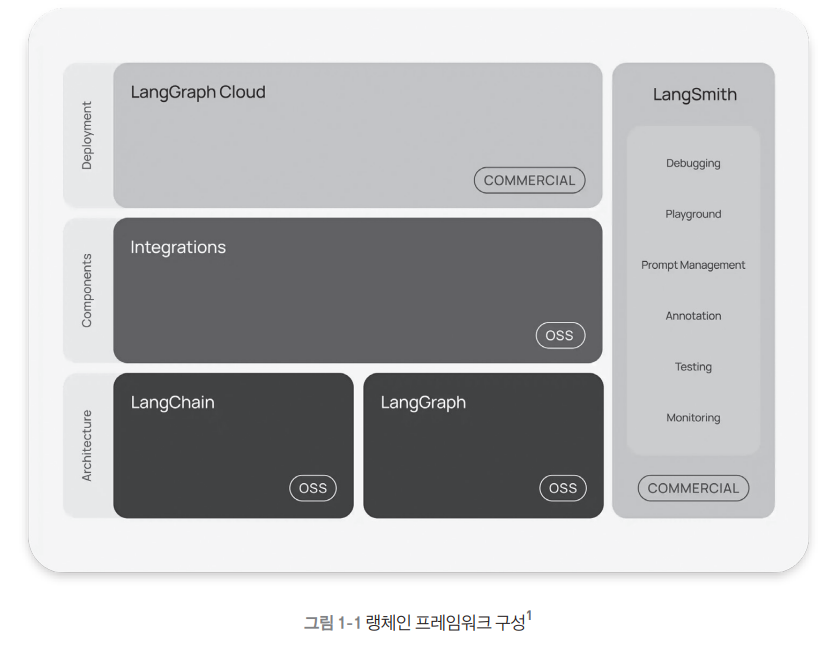
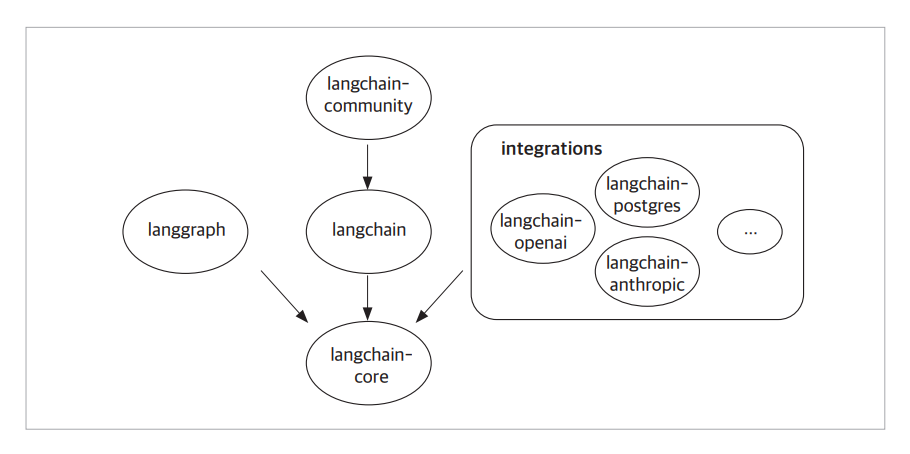
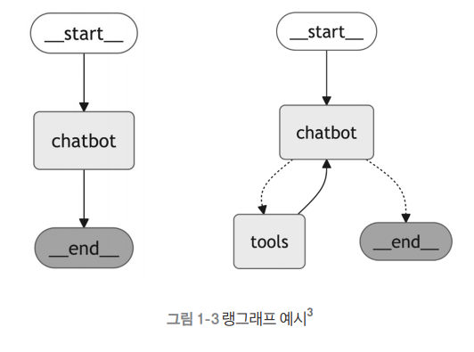
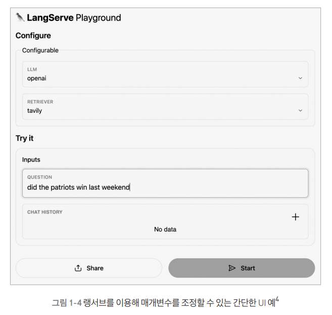
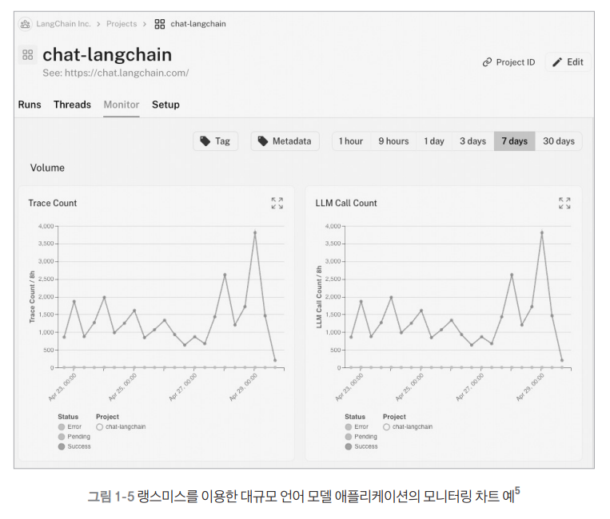
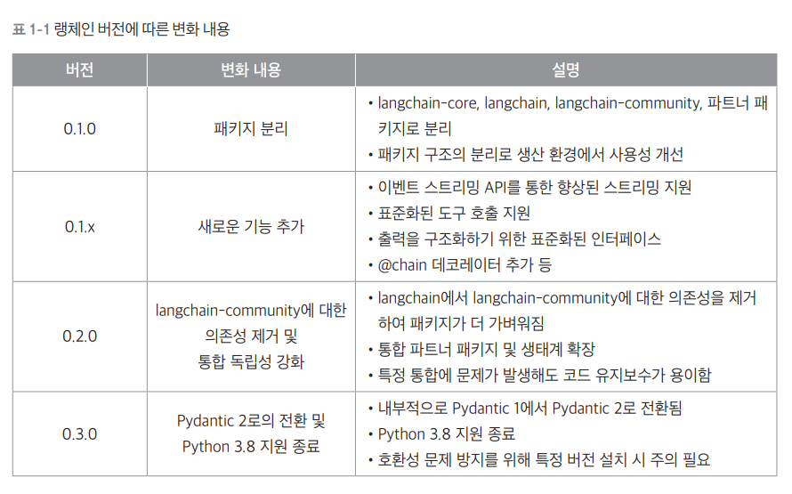

# **랭체인 살펴보기**  
챗 GPT와 같은 대규모 언어 모델(LLM)은 방대한 텍스트 데이터를 학습해 자연어를 이해하고 생성할 수 있는 인공지능 기술이다.  
그러나 LLM은 학습된 데이터에 기반해 답변을 생성하기 때문에 최신 정보 반영이나 특정 도메인 지식 제공에 한계가 있다. 이를 보완하기 위해 등장한 
기술이 바로 검색 증강 생성(Retrieval-Augmented Generation, RAG)이다.  
  
검색 증강 생성은 LLM의 언어 생성 능력에 검색 기능을 결합하여 모델이 실시간으로 외부 정보를 검색하고 이를 반영해 보다 정확하고 신뢰성 높은 답변을 
생성하는 방식이다. 예를 들어 기업 내부 데이터나 최신 논문 자료를 기반으로 AI 챗봇을 구축할 때 RAG를 활용하면 모델이 최신 데이터를 검색하고 이를 
답변에 반영할 수 있다. 이로 인해 RAG는 AI 애플리케이션의 신뢰성과 활용도를 높이는 핵심 기술로 주목받고 있다.  
  
랭체인은 대규모 언어 모델을 활용한 애플리케이션 개발을 위한 오픈소스 프레임워크다. 챗GPT나 Claude와 같은 LLM을 쉽게 연결하고 활용할 수 있도록 다양한 
구성요소(components)와 타사 통합(integrations)기능을 제공한다. 이러한 구성요소들은 LLM과의 상호작용, 메모리 관리, 체인 실행, 데이터 처리 등 
핵심적인 기능들을 담당하며 개발자는 이를 활용해 복잡한 AI 애플리케이션을 효율적으로 구축할 수 있다.  
  
  
  
LLM 애플리케이션의 개발 생태계가 성장하면서 랭체인과 함께 사용할 수 있는 특화된 도구들도 등장했다. 위 그림은 이러한 랭체인 프레임워크의 전체 구조를 
나타낸다. 여기에는 랭체인을 중심으로 복잡한 작업을 시각화하고 API로 전환해주는 랭그래프(LangGraph), 체인의 성능을 모니터링하고 최적화하는 
랭스미스(LangSmith), 그리고 다양한 구성요소와 타사 통합 기능이 포함되어 있다.  
  
랭체인의 가장 큰 특징은 체인이라는 이름이 의미하듯이 각 기능을 유연하게 연결할 수 있다는 점이다. 예를 들어 개발자는 문서 검색, 데이터 처리, 요약, 
번역과 같은 여러 작업을 마치 레고 블록처럼 조립하여 원하는 기능을 구현할 수 있다. 이렇게 특정 작업을 수행할 떄 원하는 기능을 손쉽게 갈아끼우듯이 사용할 
수 있어 프로젝트의 복잡성을 줄이고 개발 효율을 극대화할 수 있다. 이러한 모듈식 설계 덕분에 복잡한 LLM 애플리케이션을 단순하고 관리하기 쉽게 
만들 수 있다.  
  
# **랭체인 개요**  
랭체인은 다양한 오픈소스 패키지와 함께 제공되어 대규모 언어 모델을 활용한 애플리케이션 개발을 용이하게 한다. 이 프레임워크는 개발자가 애플리케이션을 
신속하게 구축하고 외부 통합을 효율적으로 관리할 수 있도록 돕는다.  
  
공식 웹사이트  
https://www.langchain.com/  
  
# **랭체인 주요 패키지**  
랭체인 생태계는 여러 패키지로 구성되어 있으며 각 패키지는 특정한 역할을 수행한다. 개발자는 이러한 패키지들을 조합하여 애플리케이션을 쉽게 개발하고 
배포할 수 있다.  
  
## **렝체인 패키지 설치**  
각 패키지는 pip install <패키지명> 명령으로 쉽게 설치할 수 있다. 주요 랭체인 패키지를 설치하려면 pip install langchain을 실행한다.  
  
## **패키지 관계도**  
패키지 간의 관계는 방향 화살표로 표한할 수 있다.  
  
  
  
위 그림과 같이 화살표는 소스 패키지가 대상 패키지에 종속됨을 나타낸다. 패키지 간 의존성의 몇 가지 예를 살펴보면 다음과 같다.  
  
langchain-core는 랭체인 생태계의 기본이 되는 패키지로 다른 많은 패키지들이 이에 의존한다. langchain을 설치하면 langchain-core가 자동으로 함께 
설치된다. 이는 langchain이 langchain-core에 직접 의존성을 가지고 있기 때문이다.  
  
langgraph는 langchain-core를 선택적으로 사용할 수 있다. 이는 langgraph가 langchain-core를 피어 의존성(peer dependency)으로 취급한다는 
의미다.  
  
패키지를 설치할 때 langchain-core와 같은 필수 종속 패키지를 따로 설치할 필요는 없다. 하지만 특정 버전에서만 지원되는 기능을 사용하려면 필요한 
추가 패키지를 직접 설치해야 할 때가 있다. 이때 설치한 프로그램이 다른 패키지들과 잘 호환되는지 확인해야 한다.  
  
## **랭체인 패키지**  
1. langchain-core  
랭체인의 중심 역할을 하는 패키지로 다양한 기본 기능들이 포함되어 있다. 이 패키지에는 대규모 언어 모델, 데이터 벡터 저장소(Vector Store), 검색기(Retriever)와 
같은 중요한 기능들을 정의하는 기본 구조가 포함되어 있다. 여기서 벡터 저장소한 데이터를 숫자 형태(벡터)로 저장하는 방식이며 데이터 검색기는 필요한 
정보를 찾아주는 시스템이다.  
  
이러한 여러 기능을 체인으로 연결할 수 있도록 langchain-core에서 랭체인 표현 언어(LangChain Expression Language, LCEL)를 제공한다. 핵심 
기능들만 담겨 있어 가볍고 효율적으로 사용할 수 있다.  
  
import langchain_core  
  
2. langchain  
랭체인 패키지는 애플리케이션의 구조를 만드는 체인, 대규모 언어 모델을 사용해 작업을 처리하는 지능형 시스템인 에이전트, 그리고 정보를 검색하는 검색기 전략 
등을 포함한다. 랭체인 패키지는 특정 서비스에 국한되지 않고 다양한 환경에서 재사용할 수 있도록 설계되었다. 이를 통해 복잡한 애플리케이션을 쉽게 만들고 
다양한 작업을 자동화할 수 있다. langchain을 설치하면 langchain-core 패키지가 자동으로 설치된다.  
  
import langchain  
  
3. langchain-community  
langchain-community 패키지는 랭체인 커뮤니티에서 유지 관리하는 다양한 타사 서비스 통합을 포함하고 있다. 이 패키지에는 대규모 언어 모델, 벡터 저장소, 
검색기 등의 통합이 포함되어 있으며 이를 선택적으로 사용할 수 있다. 이 패키지는 가능한 한 가볍게 설계되어 필요한 기능만 추가할 수 있다.  
  
import langchain_community  
  
4. 파트너 패키지  
인기 있는 타사 서비스 통합 지원 패키지로 관계도 그림에서 타사 서비스 통합 부분에 해당한다. 랭체인은 다양한 외부 서비스와 통합할 수 있는데 이 중에서 
자주 사용하는 통합은 별도의 패키지로 분리되었고 각 패키지는 langchain-[partner]로 불러올 수 있다. 예를 들어 오픈AI나 엔트로픽과 같은 통합 지원 
패키지는 각각 langchain-openai, langchain-anthropic 패키지로 제고된다. 각 파트너 패키지는 특정 서비스나 플랫폼과의 통합을 전문적으로 다루며 
이를 통해 더 안정적이고 효율적으로 지원받을 수 있다.  
  
import langchain_openai langchain_anthropic  
  
5. 랭그래프  
  
  
랭그래프(LangGraph)는 그래프 기반 모델링을 도와주는 패키지로 여러 작업을 동시에 처리하거나 특정 조건에 따라 작업을 분기하는 복잡한 애플리케이션을 
설계할 수 있다. 마치 지도를 그리듯이 작업의 흐름을 그래프로 표현해 더 복잡한 기능을 구현할 수 있다. 랭그래프는 고수준의 인터페이스를 제공하여 일반적인 
에이전트를 쉽게 생성할 수 있다.  
  
6. 랭서브  
  
  
랭서브(LangServe)는 REST API 배포를 도와주는 패키지로 이를 활용하면 랭체인의 체인을 REST API로 간편하게 배포할 수 있다. 이를 통해 개발자는 애플리케이션을 
프로덕션 환경에 배포하고 다른 시스템이나 사용자에게 쉽게 제공할 수 있다. 랭서브를 사용하면 프로덕션에 적합한 API를 간단하게 설정하고 운영할 수 있다.  
  
7. 랭스미스  
  
  
랭스미스(LangSmith)는 대규모 언어 모델 애플리케이션을 디버깅, 테스트, 평가, 모니터링할 수 있는 개발자 플랫폼이다. 이를 통해 애플리케이션의 품질을 
높이고 잠재적인 문제를 빠르게 발견하여 수정할 수 있다. 랭스미스는 개발자가 만든 애플리케이션이 안정적이고 신뢰성 있게 작동하는지 확인할 수 있는 
중요한 도구다.  
  
위 그림은 하나의 대규모 언어 모델 애플리케이션에서 사용량과 성능을 모니터링하는 그림이다. 왼쪽 그래프는 애플리케이션의 실행 흐름을 나타내는 추적 횟수
(Trace Count)에 대한 꺽은선 그래프고 오른쪽은 대규모 언어 모델 호출 횟수(LLM Call Count)로 실제로 대규모 언어 모델에 요청을 보낸 횟수를 나타낸다. 
두 지표의 관계를 통해 애플리케이션에서 대규모 언어 모델의 사용 효율성을 파악할 수 있다. 예를 들어 추적 횟수가 대규모 언어 모델 호출 횟수보다 훨씬 높다면 
많은 처리가 대규모 언어 모델 없이 이루어지고 있음을 의미한다.  
  
랭체인은 이와 같이 다양한 패키지를 제공하여 개발자가 원하는 AI 작업을 효율적으로 수행할 수 있도록 지원한다.  
  
# **랭체인 버전별 기능 업데이트**  
  
  
## **랭체인의 향후 발전 계획**  
- 랭그래프 기능 확장: 에이전트 아키텍처를 위한 주요 프레임워크로 발전시키기 위해 랭그래프에 더 많은 기능을 추가할 예정  
- 벡터 스토어 업그레이드: 벡터 저장소의 추상화 기능을 개선하여 사용성과 신뢰성을 높이는 업그레이드를 개발 중  
- 문서화 개선: 더 나은 문서화와 버전 관리된 문서를 제공할 계획  
  
# **왜 랭체인을 사용해야 하는가?**  
OpenAI API로도 AI 애플리케이션을 충분히 개발할 수 있지만 랭체인을 사용하면 더 편리한 점이 많다. 랭체인은 모든 기능을 모듈 단위로 나눠 제공하기 
때문에 개발자가 원하는 기능을 필요할 때 쉽게 추가하거나 교체할 수 있다. 예를 들어 데이터베이스 연결, 외부 API 호출, 데이터 처리 등의 기능을 각각 
독립적인 모듈로 만들어 두고 이를 조합해서 사용할 수 있다. 따라서 나중에 특정 기능만 수정하거나 확장하기가 쉽다.  
  
또한 랭체인은 다양한 외부 시스템과 연동할 수 있는 표준 인터페이스를 제공한다. 챗GPT에서 다른 AI 모델로 바꾸거나 새로운 데이터베이스를 연결하거나 
다른 회사의 API를 사용해야 할 때도 기존 코드를 크게 수정할 필요 없이 간단히 설정만 변경하면 된다.  
  
## **랭체인의 주요 장점**  
- 모듈성(Modularity): 랭체인은 모든 기능을 독립적인 모듈로 제공한다. 각 모듈은 단독으로도 사용할 수 있고 다른 모듈과 조합할 수도 있어서 애플리케이션 
구조를 효율적으로 설계할 수 있다.  
- 통합의 용이성(Ease of Integration): 다양한 외부 시스템과 쉽게 연동할 수 있다. OpenAI API를 MistralAI나 Gemini로 교체하거나 새로운 데이터베이스나 
API를 연결할 때도 설정만 변경하면 된다.  
- 확장된 기능(Enhanced Capabilities): 랭체인은 최신 버전에서 강력한 기능을 제공한다. 예를 들어 랭체인 표현 언어와 실행 가능한 인터페이스(Runnable Interface)를 
사용하면 복잡한 워크플로우를 손쉽게 작성하고 효율적으로 실행할 수 있다.  
- 커뮤니티와 지원(Community and Support): 활성화된 커뮤니티에서 다양한 예제와 문서를 제공하며 지속적인 업데이트로 새로운 기능이 추가되고 있다.  
  
# **랭체인의 주요 활용 사례**  
랭체인은 대규모 언어 모델을 활용한 응용 프로그램 개발 프레임워크다. 데이터 검색, 분석, 처리 작업에서 특히 유용하며 다양한 수준의 개발자들이 실무에 바로 
적용할 수 있다. 랭체인의 주요 활용 사례는 다음과 같다.  
  
1. 검색 증강 생성과 질의응답 시스템  
검색 증강 생성은 외부 데이터베이스나 문서에서 정보를 검색하여 응답을 생성하는 방식이다. 랭체인으로 이러한 시스템을 구축하면 방대한 문서에서 필요한 
정보를 찾아 정확한 답변을 제공할 수 있다.  
  
2. 구조화된 출력 추출  
데이터를 단순히 텍스트로 받는 것보다 구조화된 형식(JSON, XML)으로 추출하면 더 효율적이다. 랭체인으 구조화된 데이터를 효율적으로 추출하고 다양한 
형식으로 변환하는 기능을 제공한다. 이를 활용하면 데이터를 자도으로 정리할 수 있어 대규모 데이터 처리와 분석 작업에 유용하다.  
  
3. 챗봇 구축  
랭체인으로 쉽게 구축할 수 있는 대표적인 응용 프로그램으로 챗봇이 있다. 챗봇은 사용자와 상호작용할 수 있는 대화형 AI로 고객 지원과 정보 제공, 
간단한 업무 자동화 등 다양한 용도로 활용할 수 있다. 랭체인을 사용하면 챗봇 개발의 복잡한 부분을 단순화하여 쉽고 빠르게 개발할 수 있다.  
  
4. 도구 사용 및 에이전트  
랭체인을 사용하면 외부 도구와 API를 연동하여 기능을 확장할 수 있다. 특히 대규모 언어 모델이 스스로 판단하여 데이터를 처리하고 도구를 사용하는 개념인 
에이전트를 랭체인으로 구현할 수 있다. 예를 들어 날씨 API를 호출해 실시간 데이터를 가져오거나 데이터베이스에서 정보를 조회하는 등의 작업을 자동화할 
수 있다. 에이전트를 통해 복잡한 작업을 효율적으로 관리하고 자동화된 워크플로우를 구축할 수 있다.  
  
# **대규모 언어 모델**  
대규모 언어 모델은 랭체인에서 매우 중요한 역할을 하는 구성요소다. 랭체인은 자체적으로 대규모 언어 모델을 제공하지는 않지만 오픈AI나 코히어(Cohere), 
허깅페이스(Hugging Face)와 같은 여러 대규모 언어 모델 제공자들과 쉽게 상호작용할 수 있는 표준화된 인터페이스를 제공한다.  
  
# **랭체인 VS 오픈AI API**  
대규모 언어 모델을 활용하는 방법은 크게 두 가지가 있다. 모델 제공자의 API를 직접 사용하는 방법과 랭체인을 통해 사용하는 방법이다.  
  
랭체인을 활용하면 프롬프트 템플릿, 메모리 관리, 도구 호출 등 다양한 기능을 이용하여 복잡한 애플리케이션을 효율적으로 구축할 수 있다. 특히 모델 간 
전환이 용이하여 코드 수정 없이 다양한 모델을 활용할 수 있다는 장점이 있다.  
  
반면 오픈AI API는 대규모 언어 모델의 기능을 직접 사용할 수 있는 간단한 인터페이스를 제공한다. 그러나 랭체인에 비해 모듈화나 유연성이 부족하여 각 API에 
맞는 코드를 별로도 작성해야 한다. 게다가 여러 모델을 사용할 때는 각 모델의 특성에 맞게 따로 코드를 작성해야 하는 불편함이 있다.  
  
결론적으로 랭체인은 복잡한 애플리케이션 개발과 다양한 모델 통합에 적합하며 오픈AI API는 간단한 모델 활용에 적합한 도구다.  
  
## **랭체인 vs 오픈AI API 코드 비교**  
랭체인과 오픈AI API를 실습을 통해 비교해 본다. 다음은 사용자가 묻는 특정 주제에 대해 모델이 간단한 설명을 제공하는 예제다.  
  
1. 오픈AI API  
먼저 오픈 AI의 API를 직접 활용하여 응답 생성 파이프라인을 구축한다. 프롬프트 템플릿을 사용해 사용자로부터 주제를 입력받고 이를 오픈 AI API를 통해 
대화 형식으로 응답을 생성하는 구조로 작성한다.  
  
LLM.ipynb  
  
오픈 AI를 사용하는데 필요한 라이브러리를 불러온다. List 모듈은 타입 힌트를 제공하는 기능을 하며 파이썬 코드에서 변수나 함수의 입력값과 반환값에 
대해 자료형을 명확하게 지정할 수 있게 한다.  
  
이어서 openai 라이브러리를 사용해 오픈AI 클라이언트를 초기화한다. client 객체는 오픈AI API에 요청을 보내고 응답받는 기능을 제공한다. 이 클라이언트는 
GPT 모델과 상호작용하여 대화형 응답을 생성하는 데 사용된다.  
  
오픈 API에 gpt-4o-mini 모델을 사용하여 "안녕하세요!"라는 메시지를 보내고 그에 대한 모델의 응답을 받는다. client.chat.completions.create()는 
오픈 AI의 챗 API를 사용하여 대화를 생성한다. 입력값은 다음과 같다.  
  
- model: gpt-4o-mini 모델을 지정한다.  
- message: 역할(role)과 메시지 내용(content)으로 구성된 메시지 리스트다. 여기서 사용자가 보낸 메시지는 역할이 user로, 내용은 안녕하세요!로 설정된다.  
  
응답은 response 객체로 저장되며 첫 번쨰 응답의 메시지 내용은 response.choices[0].message.content로 접근할 수 있다.  
  
이제 사용자가 설정한 주제, 예를 들어 더블딥에 대해 설명을 요청하는 프롬프트를 작성한다.  
  
prompt_template은 주어진 주제에 대해 설명을 요청할 때 사용할 문자열 템플릿이다. {topic}은 사용자가 지정한 주제를 동적으로 입력받을 자리다. 
이 템플릿을 사용하여 특정 주제에 대해 GPT 모델에게 설명을 요청할 수 있다. 이어서 메시지를 보내고 모델 응답을 받는 함수를 정의한다.  
  
이 함수는 주어진 messages 리스트를 gpt-4o-mini 모델에 전달하고 응답을 반환하는 역할을 한다. messages는 사용자가 전달할 메시지를 담은 리스트로 
역할(role)과 메시지 내용(content)이 포함된다. 이 함수는 GPT 모델과의 대화 결과를 response.choices[0].message.content에서 추출해 반환한다. 
마지막으로 주제에 따라 설명을 요청하는 함수를 작성한다.  
  
invoke_chain() 함수는 사용자가 제공한 주제에 대해 설명을 요청하는 기능을 한다. topic은 주제를 나타내는 문자열이다. 이 값은 prompt_template에서 
{topic} 자리에 삽입된다.  
  
prompt_value는 prompt_template.format(topic=topic)을 통해 사용자에게 보여줄 완성된 프롬프트다. messages는 완성된 프롬프트를 담은 리스트이며 
GPT 모델에게 전달될 데이터다.  
  
마지막으로 이 함수는 call_chat_model()을 호출하여 해당 메시지에 대한 모델의 응답을 반환한다.  
  
앞선 코드에서는 오픈 AI 클라이언트를 생성한 후 사용자가 입력한 주제를 기반으로 프롬프트를 구성하여 모델에 전달한다. 이어서 모델로부터 생성된 설명을 
반환받는 흐름으로 구성되어 있다. 이 방식은 API를 직접 호출하는 단순한 구조로 코드가 직관적이고 사용이 간편하다는 장점이 있다.  
  
그러나 특정 모델인 GPT 모델에 종속적이라는 한계가 있으며 다른 모델로 전환하거나 새로운 기능을 추가하려면 코드의 여러 부분을 수정해야 하는 불편함이 
있다. 따라서 이 방식은 간단한 작업이나 특정 모델을 활용한 간단한 애플리케이션에 적합하다.  
  

