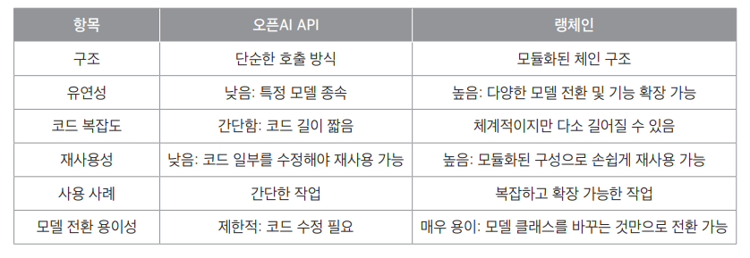
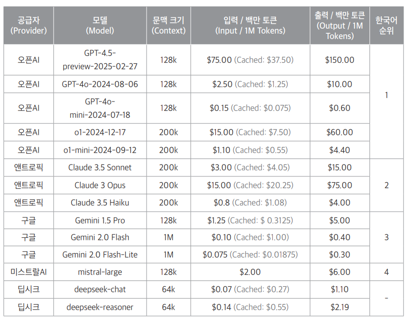
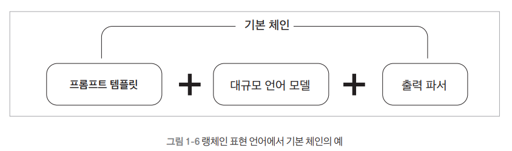
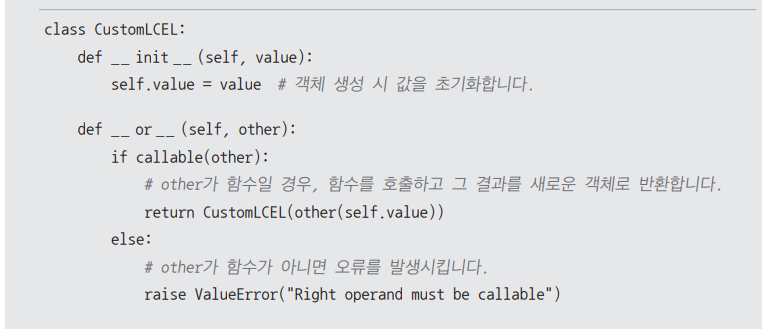
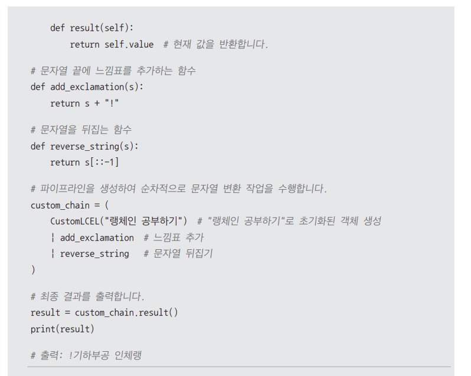
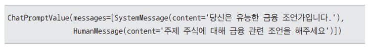
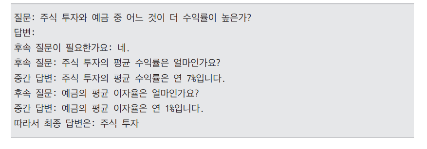
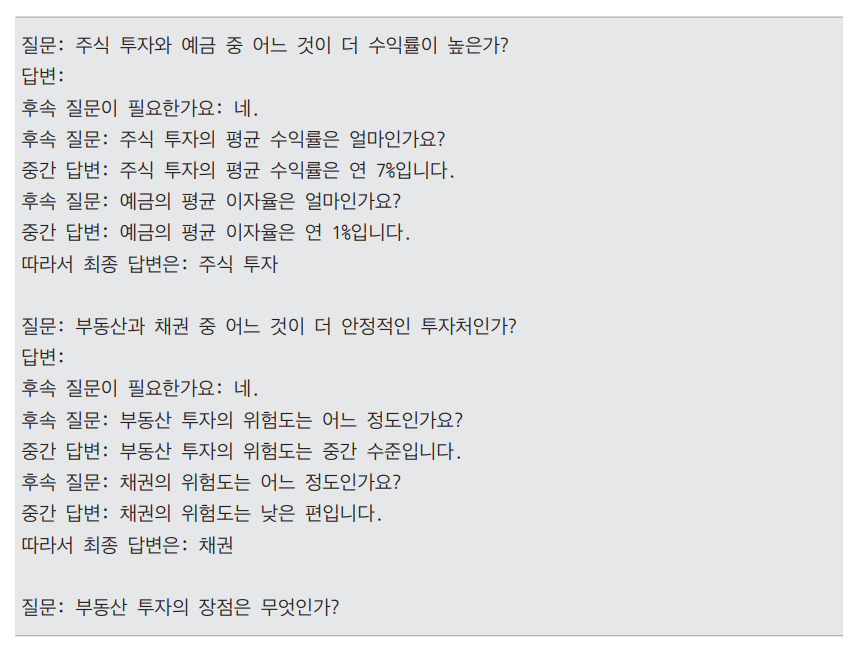
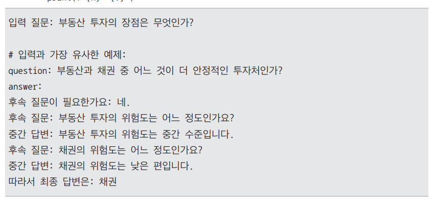
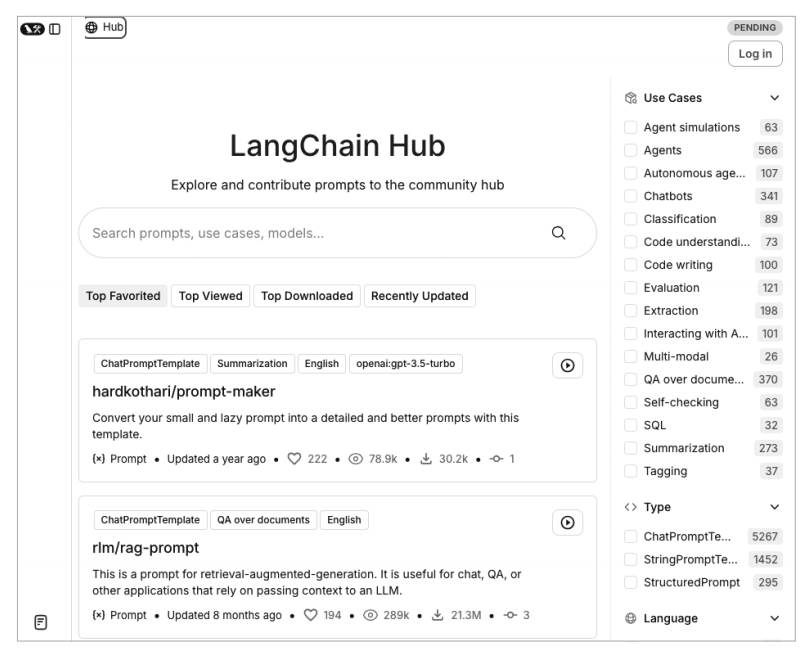

# **랭체인 살펴보기**  
챗 GPT와 같은 대규모 언어 모델(LLM)은 방대한 텍스트 데이터를 학습해 자연어를 이해하고 생성할 수 있는 인공지능 기술이다.  
그러나 LLM은 학습된 데이터에 기반해 답변을 생성하기 때문에 최신 정보 반영이나 특정 도메인 지식 제공에 한계가 있다. 이를 보완하기 위해 등장한 
기술이 바로 검색 증강 생성(Retrieval-Augmented Generation, RAG)이다.  
  
검색 증강 생성은 LLM의 언어 생성 능력에 검색 기능을 결합하여 모델이 실시간으로 외부 정보를 검색하고 이를 반영해 보다 정확하고 신뢰성 높은 답변을 
생성하는 방식이다. 예를 들어 기업 내부 데이터나 최신 논문 자료를 기반으로 AI 챗봇을 구축할 때 RAG를 활용하면 모델이 최신 데이터를 검색하고 이를 
답변에 반영할 수 있다. 이로 인해 RAG는 AI 애플리케이션의 신뢰성과 활용도를 높이는 핵심 기술로 주목받고 있다.  
  
랭체인은 대규모 언어 모델을 활용한 애플리케이션 개발을 위한 오픈소스 프레임워크다. 챗GPT나 Claude와 같은 LLM을 쉽게 연결하고 활용할 수 있도록 다양한 
구성요소(components)와 타사 통합(integrations)기능을 제공한다. 이러한 구성요소들은 LLM과의 상호작용, 메모리 관리, 체인 실행, 데이터 처리 등 
핵심적인 기능들을 담당하며 개발자는 이를 활용해 복잡한 AI 애플리케이션을 효율적으로 구축할 수 있다.  
  
  
  
LLM 애플리케이션의 개발 생태계가 성장하면서 랭체인과 함께 사용할 수 있는 특화된 도구들도 등장했다. 위 그림은 이러한 랭체인 프레임워크의 전체 구조를 
나타낸다. 여기에는 랭체인을 중심으로 복잡한 작업을 시각화하고 API로 전환해주는 랭그래프(LangGraph), 체인의 성능을 모니터링하고 최적화하는 
랭스미스(LangSmith), 그리고 다양한 구성요소와 타사 통합 기능이 포함되어 있다.  
  
랭체인의 가장 큰 특징은 체인이라는 이름이 의미하듯이 각 기능을 유연하게 연결할 수 있다는 점이다. 예를 들어 개발자는 문서 검색, 데이터 처리, 요약, 
번역과 같은 여러 작업을 마치 레고 블록처럼 조립하여 원하는 기능을 구현할 수 있다. 이렇게 특정 작업을 수행할 떄 원하는 기능을 손쉽게 갈아끼우듯이 사용할 
수 있어 프로젝트의 복잡성을 줄이고 개발 효율을 극대화할 수 있다. 이러한 모듈식 설계 덕분에 복잡한 LLM 애플리케이션을 단순하고 관리하기 쉽게 
만들 수 있다.  
  
# **랭체인 개요**  
랭체인은 다양한 오픈소스 패키지와 함께 제공되어 대규모 언어 모델을 활용한 애플리케이션 개발을 용이하게 한다. 이 프레임워크는 개발자가 애플리케이션을 
신속하게 구축하고 외부 통합을 효율적으로 관리할 수 있도록 돕는다.  
  
공식 웹사이트  
https://www.langchain.com/  
  
# **랭체인 주요 패키지**  
랭체인 생태계는 여러 패키지로 구성되어 있으며 각 패키지는 특정한 역할을 수행한다. 개발자는 이러한 패키지들을 조합하여 애플리케이션을 쉽게 개발하고 
배포할 수 있다.  
  
## **렝체인 패키지 설치**  
각 패키지는 pip install <패키지명> 명령으로 쉽게 설치할 수 있다. 주요 랭체인 패키지를 설치하려면 pip install langchain을 실행한다.  
  
## **패키지 관계도**  
패키지 간의 관계는 방향 화살표로 표한할 수 있다.  
  
  
  
위 그림과 같이 화살표는 소스 패키지가 대상 패키지에 종속됨을 나타낸다. 패키지 간 의존성의 몇 가지 예를 살펴보면 다음과 같다.  
  
langchain-core는 랭체인 생태계의 기본이 되는 패키지로 다른 많은 패키지들이 이에 의존한다. langchain을 설치하면 langchain-core가 자동으로 함께 
설치된다. 이는 langchain이 langchain-core에 직접 의존성을 가지고 있기 때문이다.  
  
langgraph는 langchain-core를 선택적으로 사용할 수 있다. 이는 langgraph가 langchain-core를 피어 의존성(peer dependency)으로 취급한다는 
의미다.  
  
패키지를 설치할 때 langchain-core와 같은 필수 종속 패키지를 따로 설치할 필요는 없다. 하지만 특정 버전에서만 지원되는 기능을 사용하려면 필요한 
추가 패키지를 직접 설치해야 할 때가 있다. 이때 설치한 프로그램이 다른 패키지들과 잘 호환되는지 확인해야 한다.  
  
## **랭체인 패키지**  
1. langchain-core  
랭체인의 중심 역할을 하는 패키지로 다양한 기본 기능들이 포함되어 있다. 이 패키지에는 대규모 언어 모델, 데이터 벡터 저장소(Vector Store), 검색기(Retriever)와 
같은 중요한 기능들을 정의하는 기본 구조가 포함되어 있다. 여기서 벡터 저장소한 데이터를 숫자 형태(벡터)로 저장하는 방식이며 데이터 검색기는 필요한 
정보를 찾아주는 시스템이다.  
  
이러한 여러 기능을 체인으로 연결할 수 있도록 langchain-core에서 랭체인 표현 언어(LangChain Expression Language, LCEL)를 제공한다. 핵심 
기능들만 담겨 있어 가볍고 효율적으로 사용할 수 있다.  
  
import langchain_core  
  
2. langchain  
랭체인 패키지는 애플리케이션의 구조를 만드는 체인, 대규모 언어 모델을 사용해 작업을 처리하는 지능형 시스템인 에이전트, 그리고 정보를 검색하는 검색기 전략 
등을 포함한다. 랭체인 패키지는 특정 서비스에 국한되지 않고 다양한 환경에서 재사용할 수 있도록 설계되었다. 이를 통해 복잡한 애플리케이션을 쉽게 만들고 
다양한 작업을 자동화할 수 있다. langchain을 설치하면 langchain-core 패키지가 자동으로 설치된다.  
  
import langchain  
  
3. langchain-community  
langchain-community 패키지는 랭체인 커뮤니티에서 유지 관리하는 다양한 타사 서비스 통합을 포함하고 있다. 이 패키지에는 대규모 언어 모델, 벡터 저장소, 
검색기 등의 통합이 포함되어 있으며 이를 선택적으로 사용할 수 있다. 이 패키지는 가능한 한 가볍게 설계되어 필요한 기능만 추가할 수 있다.  
  
import langchain_community  
  
4. 파트너 패키지  
인기 있는 타사 서비스 통합 지원 패키지로 관계도 그림에서 타사 서비스 통합 부분에 해당한다. 랭체인은 다양한 외부 서비스와 통합할 수 있는데 이 중에서 
자주 사용하는 통합은 별도의 패키지로 분리되었고 각 패키지는 langchain-[partner]로 불러올 수 있다. 예를 들어 오픈AI나 엔트로픽과 같은 통합 지원 
패키지는 각각 langchain-openai, langchain-anthropic 패키지로 제고된다. 각 파트너 패키지는 특정 서비스나 플랫폼과의 통합을 전문적으로 다루며 
이를 통해 더 안정적이고 효율적으로 지원받을 수 있다.  
  
import langchain_openai langchain_anthropic  
  
5. 랭그래프  
  
  
랭그래프(LangGraph)는 그래프 기반 모델링을 도와주는 패키지로 여러 작업을 동시에 처리하거나 특정 조건에 따라 작업을 분기하는 복잡한 애플리케이션을 
설계할 수 있다. 마치 지도를 그리듯이 작업의 흐름을 그래프로 표현해 더 복잡한 기능을 구현할 수 있다. 랭그래프는 고수준의 인터페이스를 제공하여 일반적인 
에이전트를 쉽게 생성할 수 있다.  
  
6. 랭서브  
  
  
랭서브(LangServe)는 REST API 배포를 도와주는 패키지로 이를 활용하면 랭체인의 체인을 REST API로 간편하게 배포할 수 있다. 이를 통해 개발자는 애플리케이션을 
프로덕션 환경에 배포하고 다른 시스템이나 사용자에게 쉽게 제공할 수 있다. 랭서브를 사용하면 프로덕션에 적합한 API를 간단하게 설정하고 운영할 수 있다.  
  
7. 랭스미스  
  
  
랭스미스(LangSmith)는 대규모 언어 모델 애플리케이션을 디버깅, 테스트, 평가, 모니터링할 수 있는 개발자 플랫폼이다. 이를 통해 애플리케이션의 품질을 
높이고 잠재적인 문제를 빠르게 발견하여 수정할 수 있다. 랭스미스는 개발자가 만든 애플리케이션이 안정적이고 신뢰성 있게 작동하는지 확인할 수 있는 
중요한 도구다.  
  
위 그림은 하나의 대규모 언어 모델 애플리케이션에서 사용량과 성능을 모니터링하는 그림이다. 왼쪽 그래프는 애플리케이션의 실행 흐름을 나타내는 추적 횟수
(Trace Count)에 대한 꺽은선 그래프고 오른쪽은 대규모 언어 모델 호출 횟수(LLM Call Count)로 실제로 대규모 언어 모델에 요청을 보낸 횟수를 나타낸다. 
두 지표의 관계를 통해 애플리케이션에서 대규모 언어 모델의 사용 효율성을 파악할 수 있다. 예를 들어 추적 횟수가 대규모 언어 모델 호출 횟수보다 훨씬 높다면 
많은 처리가 대규모 언어 모델 없이 이루어지고 있음을 의미한다.  
  
랭체인은 이와 같이 다양한 패키지를 제공하여 개발자가 원하는 AI 작업을 효율적으로 수행할 수 있도록 지원한다.  
  
# **랭체인 버전별 기능 업데이트**  
  
  
## **랭체인의 향후 발전 계획**  
- 랭그래프 기능 확장: 에이전트 아키텍처를 위한 주요 프레임워크로 발전시키기 위해 랭그래프에 더 많은 기능을 추가할 예정  
- 벡터 스토어 업그레이드: 벡터 저장소의 추상화 기능을 개선하여 사용성과 신뢰성을 높이는 업그레이드를 개발 중  
- 문서화 개선: 더 나은 문서화와 버전 관리된 문서를 제공할 계획  
  
# **왜 랭체인을 사용해야 하는가?**  
OpenAI API로도 AI 애플리케이션을 충분히 개발할 수 있지만 랭체인을 사용하면 더 편리한 점이 많다. 랭체인은 모든 기능을 모듈 단위로 나눠 제공하기 
때문에 개발자가 원하는 기능을 필요할 때 쉽게 추가하거나 교체할 수 있다. 예를 들어 데이터베이스 연결, 외부 API 호출, 데이터 처리 등의 기능을 각각 
독립적인 모듈로 만들어 두고 이를 조합해서 사용할 수 있다. 따라서 나중에 특정 기능만 수정하거나 확장하기가 쉽다.  
  
또한 랭체인은 다양한 외부 시스템과 연동할 수 있는 표준 인터페이스를 제공한다. 챗GPT에서 다른 AI 모델로 바꾸거나 새로운 데이터베이스를 연결하거나 
다른 회사의 API를 사용해야 할 때도 기존 코드를 크게 수정할 필요 없이 간단히 설정만 변경하면 된다.  
  
## **랭체인의 주요 장점**  
- 모듈성(Modularity): 랭체인은 모든 기능을 독립적인 모듈로 제공한다. 각 모듈은 단독으로도 사용할 수 있고 다른 모듈과 조합할 수도 있어서 애플리케이션 
구조를 효율적으로 설계할 수 있다.  
- 통합의 용이성(Ease of Integration): 다양한 외부 시스템과 쉽게 연동할 수 있다. OpenAI API를 MistralAI나 Gemini로 교체하거나 새로운 데이터베이스나 
API를 연결할 때도 설정만 변경하면 된다.  
- 확장된 기능(Enhanced Capabilities): 랭체인은 최신 버전에서 강력한 기능을 제공한다. 예를 들어 랭체인 표현 언어와 실행 가능한 인터페이스(Runnable Interface)를 
사용하면 복잡한 워크플로우를 손쉽게 작성하고 효율적으로 실행할 수 있다.  
- 커뮤니티와 지원(Community and Support): 활성화된 커뮤니티에서 다양한 예제와 문서를 제공하며 지속적인 업데이트로 새로운 기능이 추가되고 있다.  
  
# **랭체인의 주요 활용 사례**  
랭체인은 대규모 언어 모델을 활용한 응용 프로그램 개발 프레임워크다. 데이터 검색, 분석, 처리 작업에서 특히 유용하며 다양한 수준의 개발자들이 실무에 바로 
적용할 수 있다. 랭체인의 주요 활용 사례는 다음과 같다.  
  
1. 검색 증강 생성과 질의응답 시스템  
검색 증강 생성은 외부 데이터베이스나 문서에서 정보를 검색하여 응답을 생성하는 방식이다. 랭체인으로 이러한 시스템을 구축하면 방대한 문서에서 필요한 
정보를 찾아 정확한 답변을 제공할 수 있다.  
  
2. 구조화된 출력 추출  
데이터를 단순히 텍스트로 받는 것보다 구조화된 형식(JSON, XML)으로 추출하면 더 효율적이다. 랭체인으 구조화된 데이터를 효율적으로 추출하고 다양한 
형식으로 변환하는 기능을 제공한다. 이를 활용하면 데이터를 자도으로 정리할 수 있어 대규모 데이터 처리와 분석 작업에 유용하다.  
  
3. 챗봇 구축  
랭체인으로 쉽게 구축할 수 있는 대표적인 응용 프로그램으로 챗봇이 있다. 챗봇은 사용자와 상호작용할 수 있는 대화형 AI로 고객 지원과 정보 제공, 
간단한 업무 자동화 등 다양한 용도로 활용할 수 있다. 랭체인을 사용하면 챗봇 개발의 복잡한 부분을 단순화하여 쉽고 빠르게 개발할 수 있다.  
  
4. 도구 사용 및 에이전트  
랭체인을 사용하면 외부 도구와 API를 연동하여 기능을 확장할 수 있다. 특히 대규모 언어 모델이 스스로 판단하여 데이터를 처리하고 도구를 사용하는 개념인 
에이전트를 랭체인으로 구현할 수 있다. 예를 들어 날씨 API를 호출해 실시간 데이터를 가져오거나 데이터베이스에서 정보를 조회하는 등의 작업을 자동화할 
수 있다. 에이전트를 통해 복잡한 작업을 효율적으로 관리하고 자동화된 워크플로우를 구축할 수 있다.  
  
# **대규모 언어 모델**  
대규모 언어 모델은 랭체인에서 매우 중요한 역할을 하는 구성요소다. 랭체인은 자체적으로 대규모 언어 모델을 제공하지는 않지만 오픈AI나 코히어(Cohere), 
허깅페이스(Hugging Face)와 같은 여러 대규모 언어 모델 제공자들과 쉽게 상호작용할 수 있는 표준화된 인터페이스를 제공한다.  
  
# **랭체인 VS 오픈AI API**  
대규모 언어 모델을 활용하는 방법은 크게 두 가지가 있다. 모델 제공자의 API를 직접 사용하는 방법과 랭체인을 통해 사용하는 방법이다.  
  
랭체인을 활용하면 프롬프트 템플릿, 메모리 관리, 도구 호출 등 다양한 기능을 이용하여 복잡한 애플리케이션을 효율적으로 구축할 수 있다. 특히 모델 간 
전환이 용이하여 코드 수정 없이 다양한 모델을 활용할 수 있다는 장점이 있다.  
  
반면 오픈AI API는 대규모 언어 모델의 기능을 직접 사용할 수 있는 간단한 인터페이스를 제공한다. 그러나 랭체인에 비해 모듈화나 유연성이 부족하여 각 API에 
맞는 코드를 별로도 작성해야 한다. 게다가 여러 모델을 사용할 때는 각 모델의 특성에 맞게 따로 코드를 작성해야 하는 불편함이 있다.  
  
결론적으로 랭체인은 복잡한 애플리케이션 개발과 다양한 모델 통합에 적합하며 오픈AI API는 간단한 모델 활용에 적합한 도구다.  
  
## **랭체인 vs 오픈AI API 코드 비교**  
랭체인과 오픈AI API를 실습을 통해 비교해 본다. 다음은 사용자가 묻는 특정 주제에 대해 모델이 간단한 설명을 제공하는 예제다.  
  
1. 오픈AI API  
먼저 오픈 AI의 API를 직접 활용하여 응답 생성 파이프라인을 구축한다. 프롬프트 템플릿을 사용해 사용자로부터 주제를 입력받고 이를 오픈 AI API를 통해 
대화 형식으로 응답을 생성하는 구조로 작성한다.  
  
LLM.ipynb  
  
오픈 AI를 사용하는데 필요한 라이브러리를 불러온다. List 모듈은 타입 힌트를 제공하는 기능을 하며 파이썬 코드에서 변수나 함수의 입력값과 반환값에 
대해 자료형을 명확하게 지정할 수 있게 한다.  
  
이어서 openai 라이브러리를 사용해 오픈AI 클라이언트를 초기화한다. client 객체는 오픈AI API에 요청을 보내고 응답받는 기능을 제공한다. 이 클라이언트는 
GPT 모델과 상호작용하여 대화형 응답을 생성하는 데 사용된다.  
  
오픈 API에 gpt-4o-mini 모델을 사용하여 "안녕하세요!"라는 메시지를 보내고 그에 대한 모델의 응답을 받는다. client.chat.completions.create()는 
오픈 AI의 챗 API를 사용하여 대화를 생성한다. 입력값은 다음과 같다.  
  
- model: gpt-4o-mini 모델을 지정한다.  
- message: 역할(role)과 메시지 내용(content)으로 구성된 메시지 리스트다. 여기서 사용자가 보낸 메시지는 역할이 user로, 내용은 안녕하세요!로 설정된다.  
  
응답은 response 객체로 저장되며 첫 번쨰 응답의 메시지 내용은 response.choices[0].message.content로 접근할 수 있다.  
  
이제 사용자가 설정한 주제, 예를 들어 더블딥에 대해 설명을 요청하는 프롬프트를 작성한다.  
  
prompt_template은 주어진 주제에 대해 설명을 요청할 때 사용할 문자열 템플릿이다. {topic}은 사용자가 지정한 주제를 동적으로 입력받을 자리다. 
이 템플릿을 사용하여 특정 주제에 대해 GPT 모델에게 설명을 요청할 수 있다. 이어서 메시지를 보내고 모델 응답을 받는 함수를 정의한다.  
  
이 함수는 주어진 messages 리스트를 gpt-4o-mini 모델에 전달하고 응답을 반환하는 역할을 한다. messages는 사용자가 전달할 메시지를 담은 리스트로 
역할(role)과 메시지 내용(content)이 포함된다. 이 함수는 GPT 모델과의 대화 결과를 response.choices[0].message.content에서 추출해 반환한다. 
마지막으로 주제에 따라 설명을 요청하는 함수를 작성한다.  
  
invoke_chain() 함수는 사용자가 제공한 주제에 대해 설명을 요청하는 기능을 한다. topic은 주제를 나타내는 문자열이다. 이 값은 prompt_template에서 
{topic} 자리에 삽입된다.  
  
prompt_value는 prompt_template.format(topic=topic)을 통해 사용자에게 보여줄 완성된 프롬프트다. messages는 완성된 프롬프트를 담은 리스트이며 
GPT 모델에게 전달될 데이터다.  
  
마지막으로 이 함수는 call_chat_model()을 호출하여 해당 메시지에 대한 모델의 응답을 반환한다.  
  
앞선 코드에서는 오픈 AI 클라이언트를 생성한 후 사용자가 입력한 주제를 기반으로 프롬프트를 구성하여 모델에 전달한다. 이어서 모델로부터 생성된 설명을 
반환받는 흐름으로 구성되어 있다. 이 방식은 API를 직접 호출하는 단순한 구조로 코드가 직관적이고 사용이 간편하다는 장점이 있다.  
  
그러나 특정 모델인 GPT 모델에 종속적이라는 한계가 있으며 다른 모델로 전환하거나 새로운 기능을 추가하려면 코드의 여러 부분을 수정해야 하는 불편함이 
있다. 따라서 이 방식은 간단한 작업이나 특정 모델을 활용한 간단한 애플리케이션에 적합하다.  
  
2. 랭체인  
이번에는 랭체인 프레임워크를 활용하여 GPT-4o 모델로 응답을 생성하는 방법을 알아본다. 랭체인은 대규모 언어 모델 기반 애플리케이션 개발에 모듈화된 
접근 방식을 제공하여 다양한 구성요소를 손쉽게 조합할 수 있다.  
  
LLM.ipynb  
  
필요한 여러 가지 라이브러리를 불러온다. ChatOpenAI는 랭체인에서 오픈AI의 GPT 모델을 사용하는 클래스이고 ChatPromptTemplate은 프롬프트 템플릿을 
만들어주는 클래스다. StrOutputParser는 GPT 모델이 반환한 응답을 문자열로 변환하는 역할을 하고 RunnablePassthrough는 입력 데이터를 그대로 
통과시키는 역할을 한다. dotenv는 .env 파일에서 환경 변수를 불러오는 데 사용한다.  
  
이렇게 불러온 라이브러리들은 랭체인을 구성하고 API와 상호작용하는 데 중요한 역할을 한다. 마지막 부분 ChatMistralAI는 미스트랄 모델을 사용할 경우에 
주석을 해제하면 된다.  
  
ChatPromptTemplate.from_template()을 사용하여 주어진 주제에 대한 설명을 요청하는 프롬프트 템플릿을 정의한다. {topic} 부분은 나중에 사용자가 
입력한 주제로 대체하여 프롬프트를 완성한다. 이런 식으로 템플릿을 사용하면 코드의 유연성을 높여 다양한 주제에 대해 동일한 방식으로 모델에게 요청할 
수 있다.  
  
StrOutputParser()를 사용하여 모델이 반환하는 응답을 문자열로 처리할 수 있도록 설정한다. 일반적으로 모델의 응답은 다양한 형태로 반환될 수 있는데 
이 파서는 그중에서 문자열 응답만 추출하여 반환한다. 이렇게 하면 결과를 간결하게 처리하여 나중에 사용자가 쉽게 사용할 수 있다.  
  
ChatOpenAI(model="gpt-4o")를 통해 대화형 응답 생성에 특화된 GPT-4o 모델을불러온다. 이 코드는 오픈AI의 GPT 모델을 활용하여 주어진 프롬프트에 
따라 응답을 생성하도록 설정한다. 만약 다른 모델(미스트랄)을 사용한다면 주석 처리된 코드를 활성화하여 사용할 수 있다. 이렇게 모델을 쉽게 전환할 수 있는 
점이 랭체인의 큰 장점이다.  
  
파이프라인은 여러 단계로 구성된다. 첫 번째 단계에서는 사용자가 입력한 주제를 그대로 통과시키고 두 번쨰 단계에서는 주제를 프롬프트 템플릿에 적용한다. 
이후 GPT 모델을 사용하여 응답을 생성한 뒤 마지막으로 응답을 문자열로 파싱한다. 이렇게 단계별로 구성된 파이프라인은 입력을 받아 최종 결과까지 효율적으로 
처리하는 구조로 되어 있다.  
  
마지막으로 chain.invoke("더블딥")을 통해 더블딥이라는 주제로 설명을 요청한다. 이때 사용자가 입력한 주제가 파이프라인을 통해 처리되며 최종적으로 
GPT 모델이 생성한 응답을 반환한다.  
  
예제 코드에서는 프롬프트 템플릿, 모델 설정, 출력 파서 등을 체인 형태로 연결하여 복잡한 작업을 간단하게 처리할 수 있는 파이프라인을 구성한다. 이러한 
모듈화된 구조 덕분에 다른 모델로 손쉽게 전환할 수 있으며 프롬프트 템플릿을 변경하거나 새로운 기능을 추가하는 과정도 간편한다. 랭체인은 코드의 유연성과 
확장성을 극대화할 수 있도록 설계되어 있어 복잡한 애플리케이션을 개발하는 데 유용하다.  
  
  
  
# **대규모 언어 모델 파라미터 설정**  
대규모 언어 모델에는 조정할 수 있는 기본 하이퍼파라미터가 있다. 대규모 언어 모델의 하이퍼파라미터는 모델이 생성하는 텍스트의 스타일, 길이, 정확도 
등에 영향을 주며 이를 통해 출력을 조정하고 최적화할 수 있다. 사용하는 모델이나 플랫폼에 따라 세부 사항은 다를 수 있지만 일반적으로 적용되는 주요 
하이퍼파라미터는 다음과 같다.  
  
- 온도(Temperature): 생성하는 텍스트의 다양성을 조정한다. 온도 설정값은 0 ~ 1 사이의 값으로 값이 작을수록 예측 가능하고 일관된 출력을 생성하며 값이 
클수록 다양하고 창의적인 출력을 생성한다.  
- 최대 토큰 수(Max Tokens): 생성할 최대 토큰수를 지정하여 생성할 텍스트의 길이를 제한한다.  
- 최상위 P(Top P): 생성 과정에서 특정 확률 분포 내에서 상위 P%의 토큰만을 고려하는 방식이다. 출력의 다양성을 조정하는 데 도움이 된다.  
- 빈도 패널티(Frequency Penalty): 0 ~ 1 사이의 값으로 값이 클수록 이미 등장한 단어나 구절이 다시 등장할 확률을 감소시킨다. 이를 통해 반복을 줄이고 
텍스트의 다양성을 증가시킬 수 있다.  
- 존재 패널티(Presence Penalty): 텍스트 내에서 단어의 존재 유무에 따라 해당 단어의 선택 확률을 조정한다. 0 ~ 1 사이의 값으로 값이 클수록 아직 
텍스트에 등장하지 않은 새로운 단어 사용이 장려된다.  
- 정지 시퀀스(Stop Sequences): 특정 단어나 구절이 등장할 경우 생성을 멈추도록 설정한다. 출력을 특정 포인트에서 종료하고자 할 때 사용한다.  
  
이중에서 temperature와 max_tokens 파라미터를 설정한 대규모 언어 모델 코드는 다음과 같다.  
  
# **랭체인에서 사용할 수 있는 주요 대규모 언어 모델**  
  
  
위 표는 랭체인에서 사용할 수 있는 주요 대규모 언어 모델을 공급자별로 정리한 것이다. 표에는 각 모델의 문맥 크기와 백만 토큰당 입력 비용, 출력 비용, 
한국어 성능 순위가 포함되어 있다. 이러한 정보를 통해 각 모델의 비용 대비 성능을 비교하고 자신에게 적합한 모델을 선택할 수 있다.  
  
한국어 성능 순위는 한국어로 작성된 텍스트를 처리할 때 모델의 성능을 기준으로 평가한 대략적인 순위로 한국어 대규모 언어 모델에 특화된 대시보드에서 제공하는 
데이터를 기반으로 한다. 대시보드는 LogicKor(https://lk.instruct.kr/)에서 확인할 수 있으며 여러 모델의 한국어 처리 능력을 종합적으로 평가해 순위를 
매긴다. 특히 딥시크 모델은 중국에서 개발된 모델로 모델 크기에 비해 비용이 저렴해 테스트 용도로 사용하기에 괜찮다.  
  
# **랭체인 표현 언어**  
랭체인 표현 언어(LangChain Expression Language, LCEL)는 랭체인의 여러 구성요소를 체인 형태로 연결할 수 있게 하는 선언적 방식의 언어다. 선언적 
방식이란 어떻게가 아닌 무엇을 할지를 명확하게 기술하는 방식으로 복잡한 과정을 간단하게 표현할 수 있다.  
  
랭체인 표현 언어는 프로토타입에서 실제 운영 단계까지 코드의 수정 없이 일관되게 사용할 수 있도록 설계되었다. 덕분에 간단한 프롬프트 + 대규모 언어 모델 
체인부터 수백 단계로 이루어진 복잡한 작업 흐름까지 모두 안정적으로 실행할 수 있다.  
  
랭체인의 구성요소는 러너블(runnable)이라는 개념으로 추상화되며 러너블은 체인의 각 단계에서 실행 가능한 작업을 수행하는 핵심 요소다. 각 단계에서는 
러너블을 통해 구체적인 작업을 실행하게 된다.  
  
  
  
러너블은 랭체인에서 작업을 실행할 수 있는 단위로 이들을 서로 연결하여 연속적인 작업을 처리할 수 있다. 예를 들어 어떤 주제에 대한 설명을 생성하는 작업을 
체인으로 연결한다고 가정한다면 먼저 주제를 입력받아 모델이 처리할 수 있는 형태의 텍스트로 프롬프트를 구성한다. 이어서 프롬프트를 모델에 전달하여 
응답을 결과로 받는다. 마지막으로 출력 파서를 통해 필요한 정보를 추출한다. 이러한 과정을 러너블과 체인 연결을 통해 하나의 흐름으로 처리할 수 있다. 
작업의 연결은 파이프 연산자(|)나 .pipe() 메서드를 사용하여 쉽게 구현할 수 있다.  
  
랭체인 표현 언어에는 여러 유용한 기능이 있다. 예를 들어 대규모 언어 모델의 출력을 실시간으로 스트리밍하여 바로 처리할 수 있다. 또한 동기식과 비동기식 
API를 모두 지원하여 동일한 코드를 사용해 프로토타입과 실제 운영 환경에서 일관된 성능을 유지할 수 있다. 여러 작업을 병렬로 처리할 수 있어 작업 
속도가 빠르고 실패한 작업은 자동으로 재시도하거나 대체 경로를 선택할 수 있다.  
  
또한 중간 단계에서 발생하는 결과를 실시간으로 확인할 수 있기 떄문에 복잡한 작업 흐름을 추적하거나 문제를 디버깅하는 데 유용하다. 모든 입력과 출력은 
Pydantic과 JSONSchema를 사용해 자동으로 스키마가 생성되어 데이터를 안전하게 검사할 수 있다.  
  
그리고 랭스미스와 통합을 통해 모든 작업 단계가 자동으로 기록되므로 체인의 동작을 쉽게 모니터링하고 분석할 수 있다.  
  
# **러너블 표준 인터페이스**  
러너블은 여러 공통 메서드를 제공하는 표준 인터페이스를 사용한다. 덕분에 모든 러너블을 동일한 방식으로 호출하고 결과를 처리할 수 있다. 예를 들어 
대규모 언어 모델, 출력 파서, 프롬프트 템플릿과 같은 서로 다른 기능을 가진 컴포넌트들을 동일한 방식으로 사용할 수 있다. 러너블에서 사용할 수 있는 
공통 메서드는 다음과 같다.  
  
- invoke(): 단일 입력을 처리하여 결과를 반환하는 동기 메서드  
- batch(): 여러 입력을 동시에 처리하는 동기 메서드  
- stream(): 결과를 스트리밍 방식으로 반환하는 동기 메서드  
- ainvoke(): invoke()의 비동기 버전  
- abatch(): batch()의 비동기 버전  
- astream(): stream()의 비동기 버전  
- astream_log(): 중간 단계와 최종 결과를 비동기적으로 스트리밍  
- astream_events(): 체인에서 방생하는 이벤트를 비동기적으로 스트리밍  
  
공통 메서드들을 통해 다양한 작업을 효율적으로 처리할 수 있으며 동기식과 비동기식으로 작업을 선택적으로 실행할 수 있어 유연하게 시스템을 구성할 수 있다. 
다음 예제는 주어진 주제에 대해 GPT 모델을 사용하여 짧은 설명을 요청하는 간단한 호출 과정이다.  
  
LCEL.ipynb  
  
프롬프트 템플릿을 정의하여 주어진 주제에 대한 설명을 요청하고 출력 파서를 정의한다. chain 부분에서는 프롬프트, 모델, 출력 파서를 하나의 연속적인 작업 
흐름(체인)으로 연결한다. 이를 통해 주제를 입력하면 모델이 응답을 생성하고 결과를 파싱하여 사용자에게 반환할 수 있다.  
  
invoke() 메서드를 사용하여 더블딥이라는 주제를 모델에 전달하고 해당 주제에 대한 설명을 생성하도록 요청한다. 이 메서드는 하나의 주제에 대해 동기식으로 
모델의 응답을 처리한다.  
  
batch() 메서드를 사용하여 더블딥과 인플레이션이라는 두 개의 주제를 한 번에 처리한다. 배치 작업은 다수의 입력을 한꺼번에 처리하는 방식으로 성능을 
최적화하거나 여러 개의 작업을 동시에 처리해야 할 때 유용하다. 각 주제에 대한 설명이 모델을 통해 동시에 생성되고 결과가 반환된다.  
  
stream() 메서드는 모델의 응답을 토큰 단위로 스트리밍하여 반환한다. 즉 모델이 응답을 완전히 생성하기 전에 생성된 각 토큰을 실시간으로 받아볼 수 있다. 
flush=True는 출력 버퍼를 즉시 플러시하여 결과를 지연 없이 실시간으로 화면에 보여준다. 이 방법은 대기 시간이 중요한 작업이나 실시간 피드백이 필요한 
응용 프로그램에서 유용하게 사용할 수 있다.  
  
# **러너블을 체인으로 연결하는 방법**  
## **파이프 연산자**  
랭체인에서는 프롬프트와 모델이 모두 러너블로 작동하며 프롬프트 호출의 출력 타입은 채팅 모델의 입력 타입과 동일하다. 이러한 특성 덕분에 두 요소를 
체인으로 연결할 수 있다. 예를 들어 앞선 예에서처럼 chain = prompt | model | StrOutputParser() 형식으로 프롬프트, 모델, 출력 파서를 체인으로 
연결할 수 있다.  
  
더 나아가 체인을 복잡하게 구성해 다른 러너블과 결합할 수도 있다. 예를 들어 생성된 설명을 영어로 번역하는 체인을 추가로 연결할 수 있다. 이때 체인 간 
데이터 형식에 유의해야 한다. 다음 예제에서는 체인에서 생성된 dict가 자동으로 파싱되어 병렬로 실행되며 최종 결과는 dict 형식으로 반환된다.  

LCEL.ipynb  
  
라이브러리를 불러오고 새로운 프롬프트 템플릿을 정의한다. 이 프롬프트 템플릿은 생성된 응답을 영어로 번역하는 작업을 수행하도록 구성되어 있다. 
{answer}는 이전에 생성된 응답이 들어갈 자리다. 즉 "이 대답을 영어로 번역해 주세요: {이전에 생성된 응답}"이라는 질문이 만들어진다.  
  
LCEL.ipynb  

이 부분은 이전에 생성된 체인과 새로운 프롬프트 템플릿, 모델, 출력 파서를 하나로 결합하는 작업을 수행한다. 먼저 answer라는 키에 앞서 정의된 체인에서 
생성된 응답이 들어가고 이 응답을 영어로 번역하는 프롬프트로 전달한다. 그 후 오픈AI 모델을 실행하여 번역된 응답을 생성하고 이어서 결과를 StrOutputParser를 
통해 문자열로 변환한다. 이렇게 결합된 체인은 연속적인 작업을 자동으로 처리한다.  
  
마지막으로 더블딥이라는 주제를 입력받아 체인을 실행한다. 이 과정에서 주제에 대한 설명이 먼저 생성되고 해당 설명을 영어로 번역한 최종 결과가 반환된다. 
각 단계는 자동으로 연결되어 순차적으로 실행되며 결과가 최종적으로 문자열 형식으로 출력된다. 이렇게 생성된 체인은 영어로 답변을 반환한다.  
  
또한 랭체인에서는 함수도 러너블로 강제 변환할(coerce)수 있어 체인에 사용자 정의 로직을 추가할 수 있다. 예를 들어 다음과 같이 람다 함수를 사용하여 
입력 데이터를 다른 형식으로 변환한 후 체인에 연결할 수 있다.  
  
LCEL.ipynb(람다 함수를 사용한 체인을 통해 구성하기)  
  
예제에서 체인을 구성하는 각 단계를 살펴보면 다음과 같다.  
  
1. 기존 체인인 chain을 사용해 주제를 입력받아 설명을 생성  
2. 람다 함수를 통해 생성된 설명을 {"answer": ["더블딥에 대한 설명"]} 형태로 반환  
3. analysis_prompt는 생성된 설명을 입력받아 "이 대답을 영어로 번역해 주세요: [더블딥에 대한 설명]" 형태의 프롬프트를 생성  
4. 모델 model을 사용해 프롬프트에 대한 응답(번역된 대답)을 생성  
5. 출력 파서 StrOutputParser()는 결과를 문자열로 변환하여 최종 출력을 제공  
  
마지막으로 invoke() 메서드로 전체 체인을 실행하고 결과를 출력한다.  
다만 이렇게 람다 함수를 사용하여 입력을 변환하는 방식은 스트리밍 작업과 호환되지 않을 수 있으므로 주의해야 한다.  
  
### **파이썬에서 파이프 연산자를 오버로딩하는 방법**  
랭체인에서는 파이프 연산자(|)를 사용하여 여러 작업을 연결하는 체인을 구성할 수 있다. 파이썬에서는 기본적으로 랭체인과 같은 기능의 파이프 연산자를 
제공하지 않지만 특별한 메서드(__or__)를 사용하여 오버로딩할 수 있다.  
  
예를 들어 파이썬에서도 직접 | 연산자를 오버로딩하여 여러 작업을 순차적으로 처리하는 체인을 만들 수 있다. 이렇게 하면 각 작업의 결과를 다음 작업의 
입력으로 자동으로 전달할 수 있다. 이는 복잡한 작업을 더 쉽게 관리할 수 있게 해주며 특히 여러 단계를 거쳐야 하는 작업에서 유용하다. 다음은 문자열에 
느낌표를 추가한 후 문자열을 뒤집는 과정을 보여주는 간단한 예제다.  
  
  
  
  
## **파이프 메서드**  
파이프 연산자 | 외에도 .pipe() 메서드로 각 작업(러너블 객체)을 순차적으로 연결하여 복잡한 워크플로우를 간결한 체인으로 구성할 수 있다. 다음은 
앞선 파이프 연산자 예제를 .pipe() 메서드로 구성한 예이다.  
  
LCEL.ipynb(.pipe()를 통해 체인 구성하기)  
  
또한 .pipe() 메서드를 사용하여 여러 모듈을 한 번에 연결할 수도 있다. 예를 들어 analysis_prompt, model, StrOutputParser()를 .pipe()에 
한꺼번에 넣어 체인을 간단하게 구성할 수 있다.  
  
## **RunnableParallel을 이용한 체인 구성**  
RunnableParellel은 여러 개의 체인을 병렬로 실행하여 효율성을 높이는 데 유용하다. 다음 예제에서는 동일한 주제에 대해 한국어와 영어로 설명을 
생성하는 두 개의 체인을 병렬로 실행한다.  
  
LCEL.ipynb(RunnableParallel을 이용한 체인 구성)  
  
먼저 오픈AI의 챗 모델을 초기화하고 ChatPromptTemplate을 활용해 한국어와 영어 설명을 생성할 두 개의 체인을 각각 정의한다. 한국어 체인은 주제에 대해 짧은 
설명을 해주세요.라는 프롬프트를, 영어 체인은 주제에 대해 짧게 영어로 설명을 해주세요. 라는 프롬프트를 사용해 구성한다.  
  
두 체인은 RunnableParallel 클래스를 통해 병렬로 실행되도록 설정한다. 마지막으로 invoke() 메서드를 사용해 더블딥이라는 주제를 입력으로 전달하여 한국어와 
영어 설명을 동시에 생성한다. 결과는 각각 kor과 eng 키에 저장되며 이를 출력홰 확인할 수 있다.  
  
랭체인 표현 언어(LCEL)를 사용하여 다양한 구성요소를 체인으로 연결하고 러너블을 활용해 체인을 구성하면 복잡한 작업을 간단하고 효율적으로 처리할 수 있다. 
또한 람다 함수나 .pipe() 메서드를 활용하면 체인을 더 유연하게 구성할 수 있다.  
  
# **프롬프트**  
프롬프트 템플릿은 사용자의 입력과 매개변수를 언어 모델에 대한 지침으로 변환하는 역할을 한다. 이를 통해 모델이 상황을 효과적으로 파악하고 관련성 높은 
일관된 텍스트 출력을 생성할 수 있도록 유도할 수 있다.  
  
프롬프트 템플릿에서 입력은 딕셔너리 형태로 받는다. 딕셔너리에서 각 키는 프롬프트 내의 변수를 나타내며 이들 변수는 나중에 실제 값으로 채워진다. 
랭체인 내 프롬프트 템플릿에는 다음과 같은 몇 가지 유형이 있다.  
  
1. 문자열 프롬프트 템플릿  
문자열 프롬프트 템플릿(String PromptTemplates)은 단일 문자열 형태의 프롬프트를 생성하는 데 사용하여 일반적으로 간단한 입력에 사용한다. 예를 들어 
PromptTemplate을 생성하고 사용하는 일반적인 방법은 다음과 같다.  
  
PROMPTS.ipynb(문자열 프롬프트 템플릿)  
  
이 예제에서는 문자열 프롬프트 템플릿을 활용하여 특정 주제에 대해 금융 조언을 요청한다. 코드에서 PromptTemplate 클래스를 사용하여 동적으로 주제를 
입력받을 수 있는 템플릿을 정의한다. from_template() 메서드를 통해 템플릿을 생성하고 {topic}이라는 변수를 포함시켜 주제를 동적으로 설정할 수 있도록 
했다.  
  
이후 invoke() 메서드를 호출하여 실제 주제인 투자를 전달하면 템플릿이 이에 맞춰 주제 투자에 대해 금융 관련 짧은 조언을 해주세요라는 결과를 생성한다. 
이 예제를 통해 간단한 문자열 기반 템플릿 생성과 활용 방법을 알 수 있다.  
  
# **챗 프롬프트 템플릿**  
ChatPromptTemplate은 대화형 AI 모델과 상호작용하는 데 필요한 메시지 시퀀스를 생성하는 구조다. 메시지 시퀀스란 대화의 흐름을 구성하는 메시지들의 
연속된 집합이다. 각 메시지는 시스템 또는 사용자, AI의 역할로 구성할 수 있다.  
  
다음 예제에서 ChatPromptTempate은 두 개의 메시지를 생성한다. 첫 번째는 변수를 포함하지 않는 시스템 메시지이며 두 번째는 사용자가 제공한 {topic} 
변수를 사용한 형식화된 메시지다.  
  
PROMPTS.ipynb(챗 프롬프트 템플릿)  
  
예제 코드에서 생성된 메시지 시퀀스는 다음과 같은 두 개의 주요 구성요소로 이루어져 있다.  
  
- 시스템 메시지(system): AI의 역할을 정의하며 AI가 어떤 종류의 응답을 제공해야 하는지를 명확히 한다.  
- 사용자 메시지(user): 사용자가 요청하는 내용을 포함하여 AI에게 특정 정보를 요청한다.  
  
먼저 시스템 메시지에는 당신은 유능한 금융 조언가입니다. 라는 고정된 문장이 포함된다. 다음으로 사용자 메시지는 주제를 기반으로 주제 {topic}에 
대해 금융 관련 조언을 해주세요 라는 형식의 메시지를 생성한다. 예를 들어 주제에 주식을 전달하여 invoke()를 호출하면 시스템 메시지와 함께 주제를 
반영한 사용자 메시지가 반환된다.  
  
  
  
# **메시지 자리 표시자**  
메시지 자리 표시자는 템플릿 내에서 동적으로 메시지를 삽입하는 역할을 한다. 앞의 ChatPromptTemplate 예제에서는 두 개의 메시지를 형식화했지만 
만약 사용자가 전달한 메시지 목록을 특정 위치에 삽입하고자 한다면 MessagesPlaceholder를 사용할 수 있다.  
  
PROMPTS.ipynb(메시지 자리 표시자 템플릿)  
  
예제에서는 메시지 자리 표시자를 활용하여 프롬프트 템플릿을 구성한다. 방법 1에서는 MessagesPlaceholder 클래스를 사용하여 챗 프롬프트 템플릿을 
정의한다. ChatPromptTemplate.from_messages() 메서드를 이용해 시스템 메시지와 자리 표시자를 포함한 메시지 템플릿을 정의하고 있다.  
  
시스템 메시지로 당신은 유능한 금융 조언가입니다. 라는 고정된 텍스트가 설정되며 이어서 MessagesPlaceholder("msgs")를 사용해 동적으로 추가될 메시지 자리를 
미리 예약한다. 이 자리 표시자는 템플릿을 호출할 때 실제 메시지 리스트로 대체된다. 예제 코드에서는 마지막 부분에서 msgs에 해당하는 HumanMessage(content="안녕하세요!")가 
전달되어 자리 표시자에 삽입된다. 이 방법은 자리 표시자를 명시적으로 사용해 템플릿에서 동적으로 처리할 메시지를 지정하는 방식이다.  
  
방법2 에서는 MessagePlaceholder 클래스를 명시적으로 사용하지 않고 단순하게 placeholder라는 문자열과 {msgs}라는 변수를 사용하여 자리 표시자를 
구현한다. 여기서도 첫 번째 메시지로는 당신은 유능한 금융 조언가입니다. 라는 시스템 메시지가 고정되어 있으며 두 번째 자리에는 {msgs}라는 변수를 이용해 
나중에 동적으로 메시지를 삽입할 자리를 설정한다. 이 방식은 코드가 더 간결하고 직관적이지만 기본적으로 MessagesPlaceholder와 동일한 역할을 수행한다.  
  
이후 invoke() 메서드를 통해 "msgs"에 해당하는 메시지 리스트가 전달되면 해당 리스트가 자리 표시자에 삽입되어 템플릿이 완성된다. 이처럼 메시지 자리 
표시자는 동적으로 추가될 메시지를 삽입할 공간을 설정하는 도구로 나중에 여러 메시지를 삽입할 수 있도록 유연성을 제공한다.  
  
# **퓨샷 프롬프트**  
퓨샷 프롬프트(few-shot prompt)는 대규모 언어 모델이 더 나은 성능을 발휘하도록 몇 가지 예제 입력과 출력을 제공하는 방식이다. 퓨샷 기술은 모델에 
몇 가지 예제를 제시하여 모델이 더욱 정확하고 일관된 결과를 생성하도록 유도한다. 예제가 전혀 없으면 제로샷(Zero-shot), 한 개 있으면 원샷(One-shot),
n개 있으면 n샷(N-shot 또는 Few-shot)이라고 한다. 이때 PromptTemplate 같은 기본 객체를 사용하여 프롬프트를 생성할 수 있으며 필요에 따라 다른 프롬프트 
템플릿을 활용할 수도 있다.  
  
# **퓨샷 예제 프롬프트 생성**  
퓨샷 예제를 문자열로 포맷하기 위해 PromptTemplate 객체를 사용한다. 이 프롬프트는 모델에게 제공할 예제를 정의하는 데 사용한다.  
  
PROMPTS.ipynb(PromptTemplate를 이용한 퓨샷 프롬프트)  
  
질문과 답변 같은 데이터를 포맷하여 대화형 프롬프트를 만드는 데 PromptTemplate 클래스를 사용할 수 있다. PromptTemplate.from_template() 메서드를 
사용하여 프롬프트 템플릿을 정의한다. 템플릿에는 {question}과 {answer}라는 변수가 있는데 이들 변수는 나중에 우리가 입력한 예제 목록의 질문과 
답변으로 채워진다.  
  
퓨샷 예제의 목록 예는 다음과 같다. 각 예제는 질문과 답변의 딕셔너리 형식이며 답변은 단계별로 구성되어 후속 질문과 답변까지 포함된다.  
  
PROMPTS.ipynb(PromptTemplate를 이용한 퓨샷 프롬프트)  
  
앞의 코드에서는 모델이 참고할 수 있는 두 가지 예제를 만들었다. 이 예제 중 하나를 사용하여 프롬프트 형식을 확인해본다.  
  
정의한 example_prompt를 호출하여 첫 번째 예제 examples[0]을 입력으로 전달한다. invoke() 메서드는 입력된 예제 데이터를 기반으로 포맷된 텍스트를 
반환한다.  
  
  
  
결과를 보면 첫 밴째 예제가 프롬프트에 맞게 텍스트 형태로 변환되어 출력된다. 이 방식으로 모델이 참고할 예제를 제공할 수 있다.  
  
# **FewShotPromptTemplate을 이용한 프롬프트 생성**  
이번에는 FewShotPromptTemplate 객체를 사용해 여러 예제를 한꺼번에 프롬프트에 넣는다. 이를 통해 새로운 질문을 던졌을 때 예제를 참고하게 만들 수 
있다.  
  
PROMPTS.ipynb(FewShotPromptTemplate 를 이용한 퓨샷 프롬프트)  
  
이 코드는 우리가 만든 예제들을 템플릿에 넣고 {input}이라는 변수를 사용해 새로운 질문을 받을 준비를 한다. 이 변수 자리에 나중에 새로운 질문이 들어가게 
된다.  
  
따라서 이 코드는 부동산 투자의 장점은 무엇인가? 라는 질문을 입력하면 이전에 제공한 예제와 함께 새로운 프롬프트를 생성하는 과정을 보여준다.  
  
  
  
# **예제 선택기 사용**  
모든 예제를 한꺼번에 사용하지 않고 입력된 질문과 가장 유사한 예제만 선택할 수도 있다. 이때 예제 선택기를 사용한다. 예제 선택기 중에 SemanticSimilarityExampleSelector는 
입력된 질문과 예제 사이의 유사도를 계산하여 가장 비슷한 예제를 찾아준다.  
  
이 외에도 BaseExampleSelector, LengthBasedExampleSelector 등 다양한 예제 선택기가 있다. 다른 예제 선택기와 관련된 내용은 다음 링크를 참고하자.  
  
URL - https://python.langchain.com/docs/how_to/example_selectors/  
  
PROMPTS.ipynb(예제 선택기를 이용한 퓨샷 프롬프트)  
  
langchain_chroma는 랭체인 프레임워크로 크로마 벡터 저장소를 연결하는 통합 패키지다. Chroma 클래스를 통해 벡터 저장소를 생성하고 관리할 수 있다.  
  
from_examples는 예제 선택기를 설정하는 부분이다. examples라는 예제 목록과 함께 사용할 임베딩 모델, 벡터 저장소, 그리고 몇 개의 예제를 선택할 
것인지를 설정한다. k=1은 입력된 질문과 가장 유사한 하나의 예제만 선택하곘다는 의미다. k 값은 선택할 예제 개수를 지정하며 예를 들어 k=3이면 유사한 
예제 3개를 선택하게 된다.  
  
여기서는 부동산 투자의 장점은 무엇인가? 라는 질문을 입력했을 때 가장 유사한 예제를 선택한다.  
  
  
  
앞의 코드는 입력된 질문과 가장 유사한 예제를 선택하고 출력한다. 이를 통해 모델이 새로운 질문에 대한 답변을 생성할 때 가장 적합한 예제를 참고하여 
응답의 품질을 향상시킬 수 있다.  
  
퓨샷 프롬프트는 대규모 언어 모델이 더 나은 답변을 할 수 있도록 예제를 제공하는 방식이다. 다양한 질문과 답변 예제를 만들어둔 후 새로운 질문을 던지면 
모델이 예제를 참고해 답변한다. 다음은 퓨샷 프롬프팅을 실제 AI 모델과 함께 사용하는 코드 예다.  
  
PROMPTS.ipynb(퓨샷 프롬프트 AI 모델 적용)  
  
우선 필요한 라이브러리들을 불러온다. 그리고 질문과 답변 예제를 정의하는 프롬프트 템플릿을 만든다.  
  
- input_variables=["question", "answer"]: 이 템플릿은 두 개의 입력 변수를 사용한다. 하나는 question이고 다른 하나는 answer다.  
- template="질문: {question}\n답변: {answer}": 실제로 질문과 답변을 표시하는 형식이다. 질문과 답변이 질문: ~, 답변: ~ 형식으로 나타나게 된다.  
  
이 템플릿을 통해 예제로 제공할 질문과 답변 형식을 통일할 수 있다.  
  
퓨샷 프롬프트 템플릿 설정 항목에서 퓨샷 프롬프팅을 사용하기 위한 프롬프트 템플릿을 설정한다.  
  
- example_selector=example_selector: 입력된 질문과 가장 관련 있는 예제를 선택하는 예제 선택기를 지정한다.  
- example_prompt=example_prompt: 앞서 정의한 질문과 답변 형식의 프롬프트 템플릿을 사용하여 예제를 제공할 수 있도록 한다.  
- prefix="다음은 금융 관련 질문과 답변의 예입니다:": 프롬프트의 앞부분에 붙는 텍스트로 AI에게 금융 관련 예제가 있음을 알린다.  
- suffix="질문: {input}\n답변:": 질문 후 AI가 답변을 생성해야 할 부분을 나타낸다.  
- input_variables=["input"]: 실제로 사용자가 입력한 질문이 들어갈 자리다.  
  
이 설정을 통해 AI는 금융 관련 예제를 바탕으로 새로운 질문에 대해 답변할 수 있다.  

이게 예상 답변인데 책은 다르게 나옴  
후속 질문이 필요한가요: 네.  
후속 질문: 부동산 투자의 주요 장점은 무엇인가요?  
중간 답변: 장기적으로 자산 가치가 상승할 가능성이 높습니다.  
후속 질문: 또 다른 장점은 무엇인가요?  
중간 답변: 임대 소득을 통해 꾸준한 현금 흐름을 창출할 수 있습니다.  
따라서 최종 답변은: 부동산 투자는 장기적인 가치 상승과 임대 소득을 통한 꾸준한 현금 흐름 창출이라는 장점을 가지고 있습니다.  
  
이 방식은 AI 모델이 특정 도메인이나 스타일의 답변을 생성하는 데 도움을 준다.  
  
# **프롬프트 허브**  
  
  
프롬프트 허브(Prompt Hub)또는 랭체인 허브(LangChain Hub)는 랭체인 생태계에서 프롬프트를 쉽게 공유하고 재사용할 수 있도록 지원하는 중앙 저장소이다. 
이를 통해 사용자들은 자신이 만든 프롬프트를 다른 개발자와 공유하거나 커뮤니티에서 제공하는 다양한 프롬프트를 검색하여 자신의 프로젝트에 쉽게 적용할 
수 있다.  
  
또한 프롬프트 허브는 프롬프트의 여러 버전을 관리하는 기능도 제공하여 특정 버전의 프롬프트를 선택하여 사용할 수 있다. 이 기능을 활용하면 프롬프트의 
최신 버전을 사용하는 것뿐만 아니라 필요에 따라 과거의 특정 버전을 선택하여 활용할 수 있다.  
  
PROMPTS.ipynb(랭체인 허브의 특정 프롬프트 불러오기)  
  
코드에서 hub.pull("hardkothari/prompt-maker")는 허브 모듈을 통해 프롬프트 허브에서 "hardkothari/prompt-maker"라는 고유 식별자의 프롬프트를 
가져온다. hardkothari는 프롬프트 작성자의 사용자 이름이고 prompt-maker는 프롬프트의 이름이다. 해당 프롬프트는 허브 사이트에서 검색을 통해 
프롬프트의 주소를 확인할 수 있다.  
  
이렇게 가져온 프롬프트는 prompt 변수에 저장하여 이후 애플리케이션에서 해당 프롬프트를 활용할 수 있다. 또한 특정 버전의 프롬프트를 가져오고 싶을 
때는 c5db8eee와 같이 버전을 명시할 수 있다. 버전 정보는 해당 허브 사이트 내 커밋 페이지를 보면 알 수 있다.  
  
프롬프트 허브를 활용하면 LLM 애플리케이션 개발자들이 프롬프트를 효율적으로 관리하고 다른 개발자들과 협력할 수 있다.  
  
프롬프트는 모델에게 상황을 이해시키고 일관된 출력을 생성하도록 돕는 중요한 도구다.  
  
