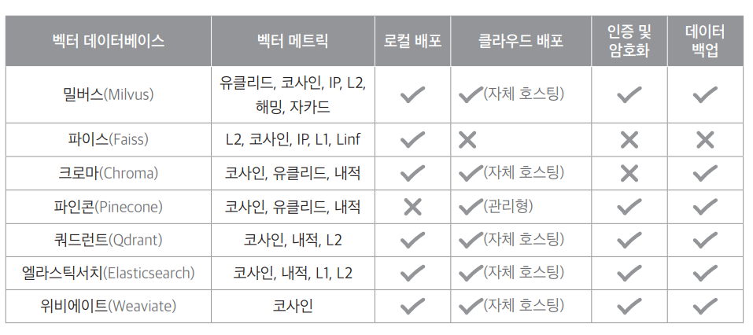

# **검색 증강 생성 - 기초와 실습**  
랭체인은 다양한 인공지능 애플리케이션 개발에 사용되지만 그중에서도 가장 널리 활용되는 사용처 중 하나는 검색 증강 생성(RAG)다. 검색 증강 생성은 
사용자가 질문을 입력하면 연관된 문서를 검색한 후 검색 결과를 바탕으로 응답을 생성하는 방식이다.  
  
대형 데이터셋으로 학습된 언어 모델들은 고정된 정보만을 다루기 때문에 최신 정보나 특정 개인 데이터를 반영하는 데 한계가 있다. 검색 증강 생성은 데이터 
내 검식기(retriever)를 활용하여 최신 정보나 특정 문서를 모델에 제공함으로써 더욱 정확하고 유용한 답변을 생성하도록 지원한다.  
  
  
  
위 그림에서 볼 수 있듯이 검색 증강 생성은 크게 인덱싱 과정과 쿼리 과정으로 나뉜다. 인덱싱 과정은 문서를 불러온 후 텍스트를 적절히 분할하고 임베딩하여 
벡터 DB에 저장하는 단계다. 그리고 쿼리 과정에서 사용자의 질문이 입력되면 검색기를 통해 관련 정보를 찾아 이를 바탕으로 응답을 생성한다. 다른 문헌에서는 
쿼리 과정을 검색과 생성으로 표현하기도 한다. 이 두 가지 단계를 통해 보다 풍부하고 맥락에 맞는 응답을 제공할 수 있다.  
  
일반적으로 대규모 언어 모델을 특정 도메인에 맞춰 미세 조정하는(fine-tuning) 방법도 있지만 이 과정은 비용이 많이 들고 정보의 신뢰성을 보장하기 어려운 
한계가 있다. 반면 검색 증강 생성은 검색된 정보를 실시간으로 모델에 제공하여 모델이 이를 바탕으로 최종 응답을 생성하게 한다. 덕분에 정보의 정확성과 
관련성이 높아져 더욱 신뢰할 수 있는 결과를 얻을 수 있다.  
  
# **검색 증강 생성 개요**  
랭체인은 인공지능 애플리케이션 개발에 다양하게 활용되며 그 중에서도 검색 증강 생성 기술이 특히 주목받고 있다.  
  
# **텍스트 임베딩**  
인공지능 모델은 수많은 숫자로 이루어진 벡터를 사용하여 데이터를 처리하고 학습한다. 예를 들어 백터 [1. 0.3, 0.5, 2]와 같이 4개의 숫자를 지닌 벡터는 정보를 
수치로 표현한 형태이다. 사람들이 텍스트를 읽고 내용을 이해하는 방식과는 다르게 인공지능 모델은 텍스트를 직접 처리하지 않는다. 대신 텍스트를 수치화된 
벡터로 변환하여 이를 분석한다. 이러한 변환 과정을 임베딩이라고 부른다.  
  
임베딩에는 여러 형태가 있다. 단어를 벡터로 변환하는 워드 임베딩(word embedding)과 문장이나 문서를 벡터로 변환하는 문장 임베딩(sentence embedding) 
또는 문서 임베딩(document embedding)이 대표적이다. 예를 들어 특정 단어나 문장, 문서는 [1, 0.3, 0.5]와 같은 실수 벡터로 인코딩된다. 모델은 이렇게 
변환된 벡터를 통해 텍스트의 의미를 분석하고 활용한다.  
  
텍스트를 벡터로 변환하면 챗봇과 같은 시스템은 사용자의 질문에 대해 관련성 높은 답변을 빠르고 정확하게 검색하고 제공할 수 있다. 이러한 기술은 AI 
시스템의 효율성과 정확성을 크게 향상시킨다.  
  
텍스트를 벡터로 변환하는 과정은 다양한 인공지능 모델을 활용하여 수행할 수 있다. 랭체인에서 제공하는 임베딩 API로 텍스트를 숫자 벡터로 변환하면 
데이터를 수치화하여 처리할 수 있으며 벡터간 유사도 계산을 통해 텍스트의 의미적 연관성을 파악할 수 있다.  
  
# **코사인 유사도**  
코사인 유사도(cosine similarity)는 두 벡터 간의 각도를 통해 유사성을 측정하는 방법이다. 코사인 유사도는 벡터의 크기가 아니라 방향성에 초점을 맞추며 
-1에서 1사이의 값을 가진다.  
  
- 1: 두 벡터가 동일한 방향을 향함  
- 0: 두 벡터가 서로 직각을 이룸  
- -1: 두 벡터가 정반대 방향을 향함  
  
두 벡터 A와 B의 코사인 유사도는 다음 공식으로 계산한다.  
  
  
  
여기서 A B 는 두 벡터의 내적을 나타내고 || A || 와 || B ||는 각각 벡터 A와 B의 크기(놈, norm)이다. 코사인 유사도에서 두 벡터의 방향성을 기반으로 
유사성을 평가하므로 데이터 크기와 무관하게 텍스트나 문서의 의미적 유사성을 측정할 수 있다. 따라서 텍스트 분석, 문서 비교, 추천 시스템 등 다양한 
분야에서 활용된다.  
  
코사인 유사도를 계산할 때 복잡한 수학 공식으로 직접 계산할 필요는 없다. 이미 개발된 코드나 라이브러리를 사용하면 간편하게 구할 수 있다.  
  
VECTOR_SIMILARITY.ipynb(벡터들 간 코사인 유사도 계산)  
  
Numpy 라이브러리를 사용하여 벡터 간의 코사인 유사도를 계산하는 cos_sim 함수를 정의하고 이를 사용하여 세 벡터 간의 유사도를 평가한다. 이 함수는 
벡터 간의 각도를 이용하여 유사도를 수치화한다.  
  
이런 유사도 계산은 텍스트 임베딩과 벡터화를 통해 얻은 데이터를 기반으로 챗봇 개발에서 사용자 질문에 가장 관련성 높은 문서를 식별하는 검색 메커니즘에 
핵심적으로 활용된다. 즉, 벡터 간 유사도를 통해 사용자의 질문과 가장 일치하는 정보를 바르고 정확하게 찾는 데 결정적인 역할을 한다.  
  
# **랭체인 임베딩 API 활용**  
랭체인에서 사용 가능한 임베딩 API는 크게 두 가지 유형으로 나눌 수 있다.  
  
첫 번째 유형은 LLM 제공사의 임베딩 모델로 오픈 AI의 임베딩 제품군에는 text-embedding-ada-002, text-embedding-3-small, text-embedding-3-large 등이 
포함되어 다양한 언어 처리 작업에 효과적으로 사용할 수 있다. 오픈 AI 외에도 코히어, 미스트랄 AI등 여러 LLM 제공사에서 임베딩 모델을 제공하고 있다.  
  
두 번째 유형은 허깅페이스에서 제공하는 임베딩 모델이다. BAAI/bge-m3 모델은 BGE(BAAI General Embedding)임베딩 모델 중 하나로 중국어를 주로 다루지만 
한국어에도 좋은 성능을 보인다. 또한 nlpai-lab/KoE5 모델은 한국어 텍스트 검색에 최적화되어 있으며 다국어 모델인 Multilingual-e5-large를 기반으로 
조정된 모델이다.  
  
개발자들은 이러한 임베딩 모델 중에서 자신의 프로젝트에 적합한 솔루션을 선택하여 챗봇 개발에 효과적으로 활용할 수 있다.  
  
# **LLM 제공사의 임베딩 모델**  
LLM 제공사의 임베딩 모델은 오픈 AI를 포함한 다양한 업체에서 제공한다. 오픈 AI의 임베딩 모델 외에 다른 LLM 제공사의 임베딩 모델에 관심이 있다면 
다음 링크를 참고하여 필요한 모델을 적용할 수 있다.  
  
https://python.langchain.com/docs/integrations/text_embedding/  
  
LANGCHAIN_EMBEDDING.ipynb(오픈AI 임베딩을 활용한 벡터들 간 코사인 유사도 계산)  
  
먼저 텍스트를 벡터로 변환하는 데 필요한 라이브러리를 불러온다. 그리고 dotenv 라이브러리를 사용하여 환경 설정을 불러와 오픈AI API 키를 로드한다.  
  
OpenAIEmbeddings 클래스는 오픈AI의 임베딩 API를 활용하여 주어진 텍스트를 벡터로 변환하는 기능을 제공한다. 이번 실습에는 text-embedding-ada-002 
모델을 사용하여 "저는 배가 고파요"라는 문장을 벡터로 변환한다. OpenAIEmbeddings()로 임베딩 모델 객체인 embeddings를 선언하고 이후 embed_query()를 
사용하여 입력된 문장을 벡터로 변환할 수 있다. 이렇게 텍스트를 수치화된 벡터로 변환하면 이를 다양한 자연어 처리 작업에 활용할 수 있다.  
  
실행 결과를 보면 저는 배가 고파요 라는 문장이 text-embedding-ada-002 모델을 사용하여 1536개의 실수로 구성된 벡터로 성공적으로 변환되었음을 알 
수 있다. 이렇게 문장의 의미적 특성을 수치로 변환한 벡터들을 사용하면 코사인 유사도 계산을 통해 다른 텍스트와 유사성을 평가할 수 있다. 이러한 과정은 검색 
시스템이나 추천 시스템 개발에 필수다.  
  
이번 실습에서는 유사도 평가를 위해 임의의 문장 데이터를 포함하는 데이터프레임을 생성한다. 판다스(pandas) 라이브러리를 활용하여 여섯 개의 문장을 하나의 
열에 할당하여 6행 1열 구조의 데이터프레임 df를 생성한다. 데이터프레임은 엑셀과 유사한 구조여서 데이터를 쉽게 조작하고 분석할 수 있다.  
  
생성한 데이터프레임을 활용해 각 텍스트 데이터를 벡터로 변환하여 문장 간 유사도를 계산하고 결과를 분석하여 인사이트를 도출할 수 있다.  
  
LANGCHAIN_EMBEDDING.ipynb(오픈AI 임베딩을 활용한 문장들 간 코사인 유사도 계산)  
  
  
  
먼저 파이썬의 판다스 라이브러리를 사용하여 여러 종류의 시장 및 금융 관련 텍스트 데이터를 포함하는 데이터프레임을 생성한다. 이 데이터프레임은 
text라는 이름의 열 하나를 포함하며 각 행에는 시장 동향, 부동산 시장의 복잡성, 음악의 비트, 그리고 암호화폐 변동 등 다양한 주제에 관한 문장이 
담겨 있다. 이 데이터를 이용하여 다음 단계에서 텍스트를 벡터 형태로 변환하는 임베딩 과정을 수행한다.  
  
  
  
데이터프레임 df의 text열에 있는 각 텍스트 데이터를 get_embedding() 함수를 이용해 벡터로 변환한다. 변환된 벡터들은 데이터프레임의 새로운 
embedding 열에 저장된다.  
  
return_answer_cnadidate() 함수는 사용자의 검색어를 입력받아 이를 get_embedding() 함수를 통해 벡터로 변환하고 query_embedding 변수에 저장한다. 
이 벡터와 데이터프레임 df의 embedding 열에 저장된 벡터들 간의 코사인 유사도를 계산하여 의미적 유사성이 가장 높은 상위 세 개의 텍스트를 추출한다. 
이 과정은 벡터 간의 각도를 활용해 유사도를 측정하는 것으로 값이 높을수록 두 텍스트의 의미적 유사성이 크다는 것을 나타낸다.  
  
예를 들어 과일 값이 비싸다 라는 검색어에 대해 이 함수를 실행하면 관련성이 높은 문장, 예컨대 시장이나 오르다와 관련된 문장이 포함된 데이터가 반환될 수 
있다. 이는 임베딩과 유사도 계산만으로도 의미적 연결성이 높은 결과를 효과적으로 찾아낼 수 있음을 보여준다.  
  
예제에서는 판다스 라이브러리를 사용하여 텍스트 데이터를 테이블 형태로 관리했지만 실제 환경에서는 판다스 외에도 벡터 데이터를 효율적으로 관리할 수 있는 
벡터 데이터베이스, 예를 들어 Faiss나 Chroma 같은 도구를 사용한다.  
  
# **허깅페이스에서 제공하는 임베딩 모델**  
허깅페이스에서는 다양한 임베딩 모델을 제공한다. 이 중 bge-m3 모델을 사용하여 앞서 오픈 AI 임베딩을 활용한 예제와 유사한 방식으로 문장 간 유사도를 
계산하는 코드를 작성한다. bge-m3 모델은 특히 다양한 언어를 지원하며 한국어 처리에도 우수한 성능을 보인다.  
  
앞의 코드에서는 각 텍스트 데이터를 bge-m3 모델을 이용하여 벡터로 변환하고 이를 데이터프레임에 저장한다. 이를 통해 각 텍스트의 의미적 내용을 벡터화하여 
분석할 수 있다.  
  
이 함수는 입력된 쿼리 과일 값이 비싸다와 데이터셋 내 문장들 간의 의미적 유사도를 계산하여 가장 유사항 상위 세 문장을 추출한다. 이 과정을 통해 쿼리와 
의미적으로 가장 근접한 문장들을 식별할 수 있다.  
  
  
  
분석 결과 bge-m3 모델은 급등과 가격과 같은 키워드에 높은 유사도를 보였으나 시장 물가처럼 너 넓은 맥락에서 연관성이 있는 표현에는 상대적으로 낮은 
유사도를 나타냈다. 이러한 결과는 bge-m3 모델이 키워드 기반의 유사성 탐지에는 강점을 보이지만 복잡한 맥락을 포함한 의미 유사성을 파악하는 데는 
한계가 있어 개선의 여지가 있음을 시사한다.  
  
따라서 이 모델을 사용할 때는 이러한 특성을 고려하여 필요에 따라 추가적인 처리나 다른 모델과의 조합을 고려해볼 수 있다. 다만 비용적인 측면에서는 오픈 
모델이기에 무료라는 장점이 있다.  
  
# **문서 로더**  
랭체인의 문서 로더(Document Loader)는 다양한 데이터 소스와 형식을 랭체인 프레임워크에서 사용할 수 있도록 표준화된 문서 형식으로 변환하는 도구다. 80개 
이상의 다양한 유형을 지원하여 텍스트, PDF와 웹 페이지, CSV 등 다양한 형식의 데이터를 처리할 수 있다. 모든 로더는 데이터를 content와 metadata를 
포함하는 표준 문서 객체로 변환하여 랭체인의 다른 컴포넌트와 쉽게 통합할 수 있다. 주요 문서 로더는 다음과 같다.  
  
- WebBaseLoader: 웹페이지의 내용을 로드하는 기능을 제공한다.  
- PyPDFLoader: PDF 파일을 로드하고 필요에 따라 페이지 단위로 분할하는 기능을 제공한다.  
- CSVLoader: CSV 파일을 로드하는 기능을 제공한다.  
- DirectoryLoader: 지정된 디렉터리 내의 모든 파일을 로드하는 기능을 제공한다.  
- UnstructuredLoader: 다양한 형식의 파일을 로드하는 기능을 제공한다.  
  
이 외에도 다양한 문서 로드가 존재하며 자세한 내용은 다음 랭체인 문서 로더 페이지에서 확인할 수 있다.  
  
https://python.langchain.com/docs/integrations/document_loaders/  
  
# **웹 페이지 로더**  
랭체인은 웹 페이지의 HTML 콘텐츠를 로드하고 파싱하여 문서 형식으로 변환하는 다양한 도구를 제공한다.  
  
# **WebBaseLoader**  
WebBaseLoader는 단일 또는 여러 웹 페이지에서 텍스트를 로드할 수 있으며 BeautifulSoup을 활용해 HTML을 세부적으로 파싱할 수 있다. 또한 비동기 로딩
(여러 페이지리를 동시에 빠르게 처리)과 지연 로딩(Lazy Loading, 필요한 페이지만 순차적으로 처리)으로 성능을 높일 수 있다. 다음은 WebBaseLoader를 
사용해 여러 웹 페이지에서 텍스트를 로드하는 예제다.  
  
DOCUMENT_LOADER.ipynb(WebBaseLoader)  
  
우선 라이브러리를 설치하고 불러온 다음 사용자 에이전트를 설정한다. USER_AGENT 환경 변수를 설정하는 이유는 서버가 클라이언트 요청을 더 쉽게 
식별하고 추적하기 위함이다. 설정하지 않으면 경고 메시지를 표시한다.  
  
환경 변수 설정 후 객체를 인스턴스화하여 웹 페이지를 로드할 수 있다. 단일 웹 페이지를 불러올 떄는 String 타입으로 불러올 수 있고 다중 웹 페이지는 
리스트 형식으로 전달하여 처리할 수 있다. 데이터를 로드한 결과는 리스트로 변환되며 각 웹 페이지의 메타데이터와 내용을 확인할 수 있다. 앞의 코드에서 단일 
웹 페이지는 랭스미스를 불러오고 다중 웹 페이지로는 랭체인과 랭그래프 웹 페이지를 불러온다.  
  
결과를 보면 page_content를 통해 페이지의 텍스트 데이터를 확인할 수 있다. 이처럼 WebBaseLoader는 페이지에 있는 글과 정보를 추출해 활용할 수 있는 
형태로 제공한다.  
  
# **PDF 로더**  
랭체인은 PDF 파일을 읽고 처리하는 데 사용할 수 있는 다양한 PDF 로더를 제공한다.  
  
# **PyPDFLoader**  
PyPDFLoader는 PDF 문서를 페이지 단위로 로드하는 데 자주 사용하는 도구다. 예를 들어 30페이지로 구성된 PDF는 원칙적으로 30개의 청크로 나누어 
로드된다. 하지만 모든 페이지가 청크로 변환되는 것은 아니다. 일부 페이지가 텍스트 없이 이미지만 포함되어 있거나 완전히 빈 페이지인 경우 해당 
페이지는 로드 과정에서 제외될 수 있다. 따라서 실제 로드된 청크 수는 PDF 페이지 수보다 적을 수 있다.  
  
DOCUMENT_LOADER.ipynb(PyPDFLoader)  
  
먼저 PDF를 처리하기 위해 다양한 PDF 로더 라이브러리를 불러온다. 각 라이브러리의 특징은 다음과 같다.  
  
- PyPDFLoader: 간단하고 사용하기 쉬우나 복잡한 레이아웃의 PDF에서는 정확도가 떨어질 수 있다.  
- PyMuPDFLoader: PyPDFLoader보다 빠르고 정확한 텍스트 추출이 가능하며 이미지나 표, 레이아웃 정보 등도 추출할 수 있다.  
- PDFPlumberLoader: 표와 같은 구조화된 데이터 추출에 특화되어 있다.  
  
이 중에서 사용 목적과 PDF 파일의 특성에 따라 적절한 로더를 선택하면 된다. 여기서는 pdf 파일을 PyPDFLoader()를 사용해 불러온다. 그리고 여러 
PDF 로더의 속도를 비교해 본다. 실행 속도는 주피터 노트북에서 %%time 명령을 사용해 측정할 수 있다.  
  
예제에서는 PyPDFLoader()로 loader 객체를 생성하고 이 객체의 load_and_split()을 실행하여 PDF 파일을 여러 텍스트 청크로 나뉜 리스트 형태로 
반환한다. load_and_split() 메서드는 먼저 각 행을 Document로 로드한 후 저장된 텍스트 분할기(기본값은 RecursiveCharacterTextSplitter)를 
사용하여 각 Document를 더 작은 청크로 나눈다.  
  
출력 결과를 보면 이 PDF는 83개의 청크로 분할되었다. 원래 PDF의 페이지 수는 84페이지지만 텍스트가 없거나 그림만 있는 페이지, 빈 페이지는 제외되어 
실제 청크 수는 83개가 되었다.  
  
결과에는 실행 속도를 측정한 CPU 시간과 Wall 시간 정보도 포함되어 있다. CPU 시간은 사용자(user) 시간과 시스템(sys) 시간으로 나뉘며 각각 CPU가 
사용자 작업과 시스템 작업에 소요한 시간을 의미한다.  
  
- 사용자 시간(User Time): 컴퓨터가 사용자의 코드 실행에 집중한 시간으로 총 17.7초가 걸렸다. 이는 코드가 실제로 계산이나 작업을 수행하는 데 
사용한 시간이다.  
- 시스템 시간(System Time): 시스템 작업에 소요된 시간으로 여기서는 86.6밀리초(ms)가 걸렸다. 이는 파일 열기나 네트워크 작업 등 코드 외적인 처리에 
사용한 시간이다.  
- 벽시계 시간(Wall Time): 프로그램의 시작부터 끝까지 실제 걸린 시간으로 여기서는 23.9초다. 이 시간은 사용자가 체감한 전체 실행 시간으로 대부분의 
시간이 코드 실행에 사용되었음을 알 수 있다.  
  
이제 분할이 제대로 이루어졌는지 확인하기 위해 10번 페이지를 임의로 출력한다.  
  
  
  
PyPDFLoader를 사용하면 page_content에 분할된 텍스트 본문이 저장되고 metadata의 source에는 해당 본문의 원본 파일명이 저장된다. 기본적으로 
load_and_split()을 실행하면 다음과 같은 형식의 결과가 반환된다.  
  
  
  
본문 내용에만 접근하려면 각 청크에서 .page_content를 호출하면 된다. 참고로 PyPDFLoader의 load_and_split() 메서드는 기본적으로 RecursiveCharacterTextSplitter를 
사용하여 PDF를 청크로 분할한다. 청크 크기(chunk_size), 중복 범위(chunk_overlap), 분할 우선순위 문자(separators)를 조정하면 더 세밀한 분할이 
가능하다.  
  
# **PyMuPDFLoader**  
PyMuPDFLoader는 빠른 속도와 다양한 메타데이터 추출 기능을 제공하여 다수의 PDF 파일이나 대용량 PDF를 처리할 때 효율적이다. PyPDFLoader에 비해 
더 다양한 메타데이터를 추출할 수 있는 특징이 있다. 또한 청크 분할 방식이 다른 PDF로더와 다를 수 있으므로 결과를 비교한 후 적합한 로더를 선택하는 것이 
좋다.  
  
랭체인에서 PyMuPDFLoader를 사용해 PDF 파일을 로드한다. PyMuPDFLoader()로 객체를 생성한 후 load_and_split()을 실행하면 PDF를 여러 개의 
문서 청크로 분할한 문자열 리스트를 반환한다.  
  
DOCUMENT_LOADER.ipynb(PyMuPDFLoader)  
  
결과를 보면 청크의 수는 93개로 나타났고 실행 시간은 벽시계 시간 기준 2.58초가 소요되었다. 이는 동일한 문서를 벽시계 기준 23.9초에 처리했던 
PyPDFLoader보다 훨씬 빠른 속도다. 분리가 정확하게 이루어졌는지 확인하기 위해 임의로 10번 청크를 출력한다.  
  
PyPDFLoader로 수행했을 때와 비교해 보면 page_content 값이 거의 유사하지만 줄바꿈 등에서 일부 차이가 있다. 또한 metadata에 파일 경로, 키워드, 
제목, 문서 포맷 등 더 다양한 정보가 포함되어 있다.  
  
# **PDFPlumberLoader**  
PDFPlumberLoader는 PyMuPDFLoader와 마찬가지로 더 다양하고 상세한 메타데이터를 제공하여 PDF 문서의 구조와 내용을 깊이 이해하는 데 유리하다. 
다만 상세한 분석을 수행하기 때문에 PyMuPDFLoader에 비해 처리 속도가 다소 느린 편이다.  
  
앞서와 같은 방법으로 랭체인에서 PDFPlumberLoader()를 사용해 PDF 파일을 로드한다.  
  
DOCUMENT_LOADER.ipynb(PDFPlumberLoader)  
  
실행 결과를 보면 청크의 수는 83개로 PyPDFLoader와 동일하게 나타난다. 하지만 실행 시간은 벽시계 시간 기준으로 39.1초가 소요되어 지금까지 사용한 
로더 중 가장 오랜 시간이 걸렸다. 각 청크가 정확하게 분리되었는지 확인하기 위해 임의로 10번 청크를 출력한다.  
  
PDFPlumberLoader는 PyPDFLoader와 마찬가지로 텍스트 추출 시 줄바꿈 등에서 약간의 차이를 보이며 메타데이터 부분에서 훨씬 더 다양한 정보를 
포함한다는 점에서 큰 차이가 있다. 또한 PDFPlumberLoader는 텍스트뿐만 아니라 PDF 내 이미지도 추출할 수 있는 기능을 제공하여 이미지 정보가 
필요한 경우에도 유용하게 사용할 수 있다.  
  
# **CSV 로더**  
CSV 파일은 데이터를 행과 열로 구성하여 저장하는 텍스트 파일 형식으로 다양한 데이터 분석과 처리 작업에서 널리 사용된다. 랭체인은 이러한 CSV 파일을 
효율적으로 로드하고 처리할 수 있는 다양한 로더를 제공한다. 랭체인에서 제공하는 주요 CSV 로더에는 기본적인 CSVLoader와 CSV 파일을 좀 더 유연하게 처리할 
수 있는 UnstructuredCSVLoader가 있다.  
  
# **CSVLoader**  
CSVLoader는 CSV 파일을 행 단위로 로드하여 각 행을 로드하여 각 행을 독립적인 문서로 변환한다. 이때 CSV 파일에 빈 행이 포함되어 있더라도 해당 빈 행은 
하나의 청크로 처리된다. 예를 들어 1000개의 행으로 구성된 CSV 파일에 빈 행이 포함되어 있다면 빈 행을 포함한 총 1000개의 청크로 나뉘게 된다.  
  
이번 예제에서는 열린데이터광장에서 제공하는 서울시 부동산 실거래가 정보 데이터를 사용한다. 데이터가 방대하므로 실거래가 접수 연도가 2024년인 항목으로 
데이터를 필터링하고 약 2000개 정도만 추출하여 사용한다. 또한 테스트 목적으로 중간에 빈 값을 추가하여 진행한다.  
  
먼저 CSV 파일을 처리하기 위해 CSV 로더 라이브러리를 불러온다. 이어러 서울시_부동산_실거래가_정보.csv 파일을 CSVLoader()를 사용해 불러온다. 
여기서도 CSV 로더의 속도를 비교하기 위해 %%time 명령을 사용하여 코드 실행 속도를 측정한다.  
  
예제에서는 CSVLoader()로 loader 객체를 생성하고 이 객체의 load()를 실행하여 CSV 파일을 각 행으로 나뉜 리스트 형태로 반환한다.  
  
출력 결과를 보면 벽시계 기준으로 151ms가 소요되었으며 이 CSV 파일은 빈 값을 포함해 총 2001개의 청크로 분할되었다. 이제 분할이 제대로 이루어졌는지 
확인하기 위해 임의로 5번 행을 출력한다.  
  
CSVLoader를 사용하면 page_content에 각 행의 데이터가 저장되고 metadata의 source에는 원본 파일명 row에는 해당 행 번호가 저장된다. 기본적으로 
load()를 실행하면 다음과 같은 형식의 결과가 반환된다.  
  
  
  
본문 내용에만 접근하려면 각 청크에서 .page_content를 호출하면 된다. 더 작은 단위로 데이터를 분할해야 한다면 RecursiveCharacterTextSplitter의 
파라미터를 조정하여 세밀하게 나눌 수 있다.  
  
# **UnstructuredCSVLoader**  
UnstructuredCSVLoader는 CSV 파일을 유연하게 처리할 수 있는 도구로 single모드와 elements 모드를 통해 다양한 방식으로 CSV 데이터를 로드할 수 있다. 
UnstructuredCSVLoader는 CSVLoader와 달리 unstructured 라이브러리를 사용하여 CSV 파일 전체를 하나의 문서로 로드하거나 요소별로 분리할 수 있는 
유연한 기능을 제공한다. CSV 파일의 구조가 일정하지 않거나 특수한 처리가 필요한 경우 특히 유용하다.  
  
UnstructuredCSVLoader를 사용하여 CSV 파일을 로드하는 과정은 간단하다. 로더 객체를 초기화할 떄 mode 매개변수를 single 또는 elements 모드로 
선택할 수 있다. single 모드는 파일 전체를 하나의 문서로 취급하는 반면 elements 모드는 각 CSV 행을 독립적인 요소로 분리하여 처리한다. elements 
모드를 사용할 경우 테이블의 HTML 표현이 text_as_html 키에 저장되어 HTML 데이터를 활용할 수도 있다.  
  
이제 UnstructuredCSVLoader를 사용하여 서울시 부동산 실거래가 데이터를 로드한다. elements 모드로 UnstructuredCSVLoader()를 실행하여 객체를 
생성한 후 load()를 실행하면 CSV의 각 행이 독립적인 문서 청크로 반환된다.  
  
결과를 보면 청크의 수는 1개로 나타나 전체 CSV 파일이 단일 문서로 처리되었음을 알 수 있다. 실행 시간은 벽시계 시간 기준 1.44초가 소요되었다.  
이는 동일한 파일을 벽시계 기준 151ms에 처리했던 CSVLoader보다는 느린 속도다.  
  
여기서 모드는 elements를 사용하고 있다. elements 모드는 CSV 파일을 단일의 비구조화된 텍스트 문서로 로드한다. 동시에 CSV 파일 내용을 HTML 
형식으로 구조화한 테이블 표현도 문서 메타데이터의 text_as_html 키에 포함되어 있어 파일의 원래 구조를 유지하면서 시각화하기에 유용하다.  
  
청크 개수가 1개로 데이터가 너무 크다 보니 문자열 형태로 변환한 뒤 처음 500자를 출력한다.  
  
CSVLoader로 수행했을 떄와 비교하여 metadata에 파일 경로, 마지막 수정 날짜, text_as_html 등 더 다양한 정보가 포함되어 있다. 그중 text_as_html에는 
CSV 데이터를 HTML 테이블 형식으로 구조화한 내용이 포함되어 있다. 각 열이 <td> 태그로 둘러싸여 있으며 전체 데이터가 <table> 태그 내에 포함되어 
있다. 이번에는 .page_content 부분을 확인한다.  
  
청크가 1개여서 데이터가 크기 떄문에 문자열 타입으로 변환한 뒤 처음 500자를 출력했다. 이처럼 .page_content에는 실제 문서의 내용이 저장되어 있다.  
  
# **텍스트 분할**  
언어 모델은 입력 길이에 제한이 있기 때문이 긴 문서를 적절한 크기로 분할하는 것이 중요하다. 이러한 목적으로 행체인에서는 다양한 텍스트 분할 도구를 
제공한다. 텍스트 분할기(Text Splitter)를 사용하면 모델의 입력 제한을 준수할 수 있으며 긴 문서로 인해 발생할 수 있는 처리 효율 저하를 방지할 수 
있다.  
  
랭체인에서 제공하는 분할기 중 가장 널리 사용되는 것은 재귀적 문자 텍스트 분할기인 RecursiveCharacterTextSpliiter로 문자 수나 특정 구분자를 
기준으로 텍스트를 체계적으로 분할한다. 반면 텍스트의 의미적 유사성을 고려하여 분할하는 SemanticChunker도 있으며 이외에도 다양한 텍스트 분할기가 
있다. 다양한 텍스트 분할 도구에 대한 정보는 다음 링크에서 확인할 수 있다.  
  
https://python.langchain.com/docs/concepts/text_splitters/  
  
# **길이와 구분자로 분할하는 재귀적 문제 텍스트 분할**  
RecursiveCharacterTextSplitter는 긴 텍스트를 사용자가 지정한 최대 길이를 초과하지 않는 짧은 청크로 반복적으로 분할하는 도구다. 예를 들어 
길이가 10000자인 텍스트에 대해 각 청크의 최대 길이를 500자로 설정하면 텍스트가 길이 500자를 넘지 않는 여러 청크로 나누어진다.  
  
분할 작업은 내부적으로 지정된 구분자를 사용하여 이루어지며 기본 구분자는 ["\n\n", "\n", " ", ""] 순서로 적용된다. 먼저 가장 큰 구분자 "\n\n"으로 
텍스트를 나누고 분할된 청크가 여전히 길다면 다음 구분자인 "\n"을 적용하여 점진적으로 더 작은 청크로 나누어 나간다. 이 과정을 반복하여 최종적으로 
원하는 크기의 청크가 되거나 마지막 구분자 ""에 도달할 때까지 분할을 이어간다. 이때 구분자 목록은 사용자가 지정할 수도 있다.  
  
TEXT_SPLITTER.ipynb  
  
먼저 텍스트 분할기 라이브러리를 불러오고 실습에 사용할 매우 긴 텍스트를 불러온다. 여기서는 이전에 불러왔던 pdf 파일을 다시 불러오기 위해 PyPDFLoader도 
함께 불러온다.  
  
PDF 파일을 로드하고 PDF 파일의 텍스트를 추출하여 총 글자 수를 계산했다. 그 결과 텍스트 길이는 총 90699자로 이는 일반적인 챗GPT와 같은 언어 
모델이 한 번에 처리하기에는 너무 긴 길이다. 따라서 이 텍스트를 챗GPT가 처리할 수 있는 적절한 길이로 분할한다.  
  
RecursiveCharacterTextSplitter()를 사용하여 텍스트를 분할하는 text_splitter 객체를 만든다. 파라미터로는 chunk_size와 chunk_overlap이 
있다.  
  
- chunk_size: 각 분할 문서의 최대 문자 수를 지정한다.  
- chunk_overlap: 연속된 분할 문서 간에 중복되는 문자 수를 지정한다. 0으로 설정한다면 분할 문서 간 중복이 없다.  
  
따라서 chunk_size를 500으로 지정하면 text_splitter로 텍스트를 분할할 때 각 청크의 길이가 500자를 넘지 않게 된다. 이때 문맥의 연속성을 유지하려면 
일반적으로 약간의 overlap(예: 50-100자)을 두는 것이 좋다. 여기서는 chunk_overlap을 50으로 지정했다.  
  
이렇게 선언된 text_splitter로 PDF를 분할할 때는 split_documents() 메서드를 사용할 수 있다. 이 메서드는 Document 객체의 리스트를 입력받아 
각 문서의 내용을 설정된 청크 크기로 분할한다. 이때 파일 종류에 따라 적합한 메서드를 선택할 수 있다. 텍스트 파일의 경우 단순히 긴 문자열을 분할할 
떄는 .split_text()를 사용할 수 있다.  
  
분할된 문서의 청크 수는 총 242개다. 1번 청크를 출력하여 결과를 확인한다.  
  
출력 결과는 다음과 같은 구조로 되어 있다. 랭체인을 사용해 텍스트를 여러 청크로 분할할 떄 자주 볼 수 있는 구조이므로 기억해두면 좋다.  
  
  
  
본문에 접근하려면 각 청크에 .page_content를 붙여 출력하면 된다.  
  
이번에는 2번 청크를 출력해본다.  
  
chunk_overlap 값이 50으로 설정되어 있어 일부 텍스트 내용이 겹쳐 1번 청크의 마지막 부분이 2번 청크의 시작 부분과 연결된다. 이제 1번 청크와 2번 
청크의 길이를 각각 출력한다.  
  
chunk_size 값이 500으로 설정되어 있어 각 청크의 길이가 500자를 넘지 않는다. 또한 chunk_overlap 값을 0으로 설정하면 청크 사이에 겹치는 내용이 
없게 된다.  
  
RecursiveCharacterTextSplitter()로 분할한 청크들을 보면 텍스트의 문맥을 고려하지 않고 단순히 길이에 맞춰 잘라내기 때문에 내용이 중간에 끊어지는 
느낌을 받을 수 있다. 이런 방식은 빠르게 결과를 얻을 수 있다는 장점이 있지만 문맥이 이어지지 않는 불완전한 청크가 생겨 RAG 챗봇을 개발할 떄 성능 저하의 
원인이 될 수 있다. 문맥이 끊긴 청크들이 챗봇에 입력되면 챗봇이 내용을 완전히 이해하지 못해 답변의 정확도가 떨어질 수 있기 떄문이다.  
  
이 문제를 해결하기 위해 많은 AI 기업들은 청크 분할 시 의미를 고려해 문맥에 맞게 나누려는 노력을 하고 있으며 행체인에서도 이러한 기능을 지원한다.  
  
# **의미 기반으로 분할하는 시맨틱 청킹**  
SemanticChunker는 텍스트를 단순히 길이에 따라 나누는 것이 아닌 의미적으로 유사한 내용을 가진 청크로 분할하는 도구다. 텍스트를 문장 단위로 분할한 
후 서로 유사한 의미를 가진 문장들을 그룹화하여 하나의 청크로 구성한다. 이를 통해 청크 내에서 문맥이 잘 연결된 상태로 분할되어 텍스트의 의미를 
보존하면서도 적절한 크기의 청크를 생성할 수 있다. 의미 분할 방식은 단순한 길이 분할과 달리 청크가 문맥적으로 일관성을 갖도록 하여 이후의 자연어 처리나 
정보 검색에서 더욱 정확한 결과를 얻을 수 있다. 특히 RAG와 같은 작업에서 문맥이 잘 연결된 청크들이 입력되면 모델의 응답 정확도가 크게 향상될 수 있다.  
실습을 통해 SemanticChunker를 사용해 본다.  
  
TEXT_SPLITTER.ipynb(SemanticChunker)  
  
내부적으로 오픈AI Embedding API를 사용하므로 OpenAIEmbeddings와 SemanticChunker를 불러온다. 이제 SementicChunker를 사용하여 텍스트를 
분할한다. 객체 생성과 분할 방법은 RecursiveCharacterTextSplitter와 비슷하지만 SementicChunker는 텍스트의 의미를 고려하여 분할한다.  
  
SementicChunker 객체를 생성할 때 OpenAIEmbeddings()를 전달하여 오픈AI의 Embedding API를 사용하도록 설정한다. SemanticChunker의 기본 파라미터는 
breakpoint_threshold_type='percentile'과 breakpoint_threshold_amount=95로 설정되어 있다. 이는 의미적 차이의 분포에서 95번째 백분위수를 초과하는 
지점, 즉 상위 5%에 해당하는 큰 차이가 발생하는 지점을 분할 기준으로 선택한다. 이를 통해 의미적으로 큰 전환이 일어나는 곳에서 자연스럽게 텍스트를 나눌 
수 있다.  
  
먼저 PyPDFLoader를 사용하여 지정된 경로의 PDF 파일을 로드한 후 load() 메서드를 총해 각 페이지를 Document 객체로 변환하여 리스트 형태로 반환한다. 
그런 다음 SemanticChunker 객체를 생성하고 OpenAIEmbeddings를 임베딩 모델로 지정하여 의미 기반 분할을 수행하도록 설정한다.  
  
이제 split_documents() 메서드를 사용하여 로드된 페이지들을 의미 단위로 분하한다. 이 메서드는 Document 객체의 리스트를 입력으로 받아 의미적으로 
연관된 청크들로 나눈다.  
  
결과를 보면 분할된 청크는 총 165개다. 임의로 3,4,5번 청크를 차례로 출력하여 문맥이 바뀌는 구간을 정확히 포착하여 분할이 이루어졌는지 확인해본다.  
  
출력 결과를 보면 3번 청크에서는 주택 매매시장과 전세시장에 대한 전망을 다룬다. 4번 청크에서는 매매가격 하락 요인으로 높은 금리에 따른 이자 부담을 
언급하며 투자 유망 부동산과 고자산가들의 투자 성향에 대해 설명하고 있다.  
  
그 후 5번 청크에서는 수도권 주택 시장의 침체 상황을 다룬다. 이처럼 각 Document가 서로 다른 내용을 담고 있는 지점에서 분리되었음을 알 수 있다. 
SemanticChunker가 텍스트의 주제와 문맥이 바뀌는 지점에서 청크를 나누어 각 청크가 고유의 주제에 집중하도록 적절히 분할된 것으로 보인다.  
  
SemanticChunker에서는 문서를 의미 단위로 분할하는 세 가지 주요 방식을 제공한다.  
  
- 백분위수 방식(기본값)  
- 표준편차 방식  
- 사분위수 방식  
  
이 방식들은 모두 코사인 거리를 사용하여 문장 간 의미적 차이를 측정한다. 코사인 거리는 두 문장이 얼마나 다른지를 나타내며 0에 가까울수록 매우 유사하고 
1에 가까울수록 매우 다르다.  
  
코사인 거리와 코사인 유사도는 모두 벡터 간의 각도를 기반으로 유사성을 측정하는 방법이다. 코사인 유사도는 두 벡터 사이의 코사인 값을 계산하여 
유사성을 측정한다. 코사인 유사도는 수학적으로 -1~1 범위지만 문장 임베딩 모델은 양수 값만 생성하기 떄문에 0에서 1사이의 값만 생성된다.  
  
코사인 거리는 코사인 유사도를 거리 개념으로 변환한 것으로 작을수록 가깝다고 볼 수 있다. 코사인 거리는 보통 다음과 같이 계산한다.  
  
코사인 거리 = 1- 코사인 유사도  
  
# **의미 단위로 분할 과정**  
SemanticChunker가 문서를 의미 단위로 분할하는 과정은 다음과 같다.  
  
1. 문장을 임베딩 벡터로 변환하여 각 문장의 의미를 숫자로 표현한다.  
2. 인접한 문장 쌍 사이의 코사인 거리를 계산하여 문장 간의 의미적 차이가 어느 정도인지 파악한다. 코사인 거리는 두 문장이 얼마나 비슷하거나 다른지를 
수치로 나타내는데 0에 가까울수록 문장들이 비슷하고 1에 가까울수록 서로 다르다는 뜻이다.  
3. 다음 중 선택한 방식에 따라 분할 지점을 결정한다.  
- 백분위수 방식: 코사인 거리 값이 설정한 배분위수를 초과하는 지점을 분할 지점으로 선택한다.  
- 표준편차 방식: 코사인 거리가 평균보다 특정 표준편차 이상 크게 떨어진 지점을 분할 지점으로 선택한다.  
- 사분위수 방식: 코사인 거리의 사분위 범위에 따라 분할 지점을 결정한다.  
  
이러한 방식을 통해 SemanticChunker는 단순히 텍스트 길이에 따라 나누지 않고 문장 간 의미적 변화가 크게 나타나는 지점에서 텍스트를 분할한다.  
  
각 방식의 주요 차이점에 대해 짧게 설명하자면 다음과 같다. 백분위수 방식은 의미의 극단적인 변화에 초점을 맞추고 표준편차 방식은 전체 데이터의 
분포를 고려한다. 반면 사분위수 방식은 중간 50% 데이터의 분포를 중심으로 분할 지점을 판단한다. 이 중에서 원하는 분할 정도와 텍스트의 특성에 따라 
적합한 방식을 선택할 수 있다.  
  
# **백분위수 방식**  
백분위수(percentile) 방식은 SemanticChunker가 기본으로 사용하는 분할 방식이다. 앞선 실습에서는 이 방식을 통해 텍스트를 청크로 나눴다.  
  
백분위수 방식의 기본 설정인 breakpoint_threshold_amount=95에서 이 값이 95로 설정되어 있다는 것은 문장 간 의미적 차이가 가장 큰 상위 5% 
지점에서 텍스트를 분할한다는 의미다. 즉 텍스트 내에서 문맥이 크게 달라지는 지점만 선택하여 청크를 나누게 된다.  
  
예를 들어 특정 부분에서 새로운 주제나 큰 의미 변화가 시작된다면 그 지점에서 분할이 이루어진다. 이렇게 하면 각 청크가 서로 다른 중요한 주제를 
담고 있어 문맥을 잘 유지하면서도 의미가 통일된 덩어리로 나눌 수 있다.  
  
만약 breakpoint_threshold_amount 값을 80으로 낮추면 문장 간 의미 차이가 있는 지점을 더 많이 찾아내므로 짧은 청크들이 많이 생성된다. 반대로 
값을 99로 높이면 문맥 변화가 극단적으로 큰 지점에서만 나뉘어 긴 청크들이 만들어진다.  
  
이 방식은 단순히 길이로 텍스트를 나누는 것이 아니라 의미 변화가 큰 지점을 기준으로 나눔으로써 각 청크가 논리적으로 완결된 정보를 담을 수 있게 
한다.  
  
TEXT_SPLITTER.ipynb(백분위수 방식의 SemanticChunker)  
  
breakpoint_threshold_type을 percentile로, breakpoint_threshold_amount를 95로 설정한다. 이는 기본값으로 앞서 진행한 실습과 마찬가지로 
청크의 수가 165개로 분할된 것을 확인할 수 있다.  
  
백분위수 방식의 장점은 의미적 차이가 극단적으로 큰 지점에서만 텍스트를 분할하므로 주요 주제가 바뀌는 부분을 효과적으로 찾아낼 수 있다는 점이다.  
  
# **표준편차 방식**  
표준편차(standard deviation) 방식은 SemanticChunker가 제공하는 분할 방식 중 하나로 텍스트 내에서 문장 간의 의미적 차이가 표준편차 범위를 
초과하는 지점을 기준으로 텍스트를 나눈다. 백분위수 방식과 달리 표준편차 방식은 문장 간의 의미 변화가 평균에서 얼마나 벗어나는지에 따라 분할 지점을 
설정한다.  
  
표준편차 방식을 사용할 때는 breakpoint_threshold_type을 standard_deviation으로 설정하고 breakpoint_threshold_amount 값을 지정한다. 
예를 들어 breakpoint_threshold_amount=3으로 설정하면 기준값은 평균 코사인 거리 + (3 * 표준편차)가 된다. 이 기준값을 초과하는 코사인 거리를 
가진 지점에서 텍스트가 분할된다.  
  
이 방식은 평균 코사인 거리에서 기준값만큼 차이가 나는 지점에서 의미적 변화가 일어났다고 간주하여 텍스트를 독립적이고 논리적인 단위로 나눌 수 있다.  
  
breakpoint_threshold_amount 값을 낮추면 분할 지점이 많아져 더 짧은 청크들이 생성되고 값을 높이면 분할 지점이 줄어들어 더 큰 청크들이 만들어진다.  
  
TEXT_SPLITTER.ipynb(표준편차 방식의 SemanticChunker)  
  
백분위수 방식을 사용한 결과 청크 수가 84개로 줄어든다. 이 방식을 사용하면 텍스트 전체의 의미적 흐름을 파악하면서 문장 간 차이가 평균보다 훨씬 큰 
지점에서 분할이 이루어진다. 이를 통해 새로운 주제가 시작되거나 논점이 바뀌거나 이야기의 주요 전환점이 나타나는 부분을 효과적으로 감지할 수 있게 
된다.  
  
# **사분위수 방식**  
사분위수(interquartile) 방식은 SemanticChunker에서 사용하는 또 다른 분할 방식으로 텍스트 내에서 중간 정도의 의미적 변화를 감지하여 분할 지점을 
설정한다. 이 방식은 중간 50%의 데이터 분포를 분석하고 이 범위에서 벗어나는 지점을 기준으로 텍스트를 분할한다.  
  
사분위수 방식을 사용하기 위해 breakpoint_threshold_type을 interquartile로 설정하고 breakpoint_threshold_amount 값을 지정한다. 예를 들어 
breakpoint_threshold_amount=1.5로 설정하면 기준값은 Q3(3사분위) + 1.5 * IQR(사분위 범위)이 된다. 이 기준값을 초과하는 코사인 거리를 
가진 지점에서 텍스트를 분할하여 문장 간 의미적 차이가 중간 범위에서 크게 벗어나는 지점에서 청크를 나누게 된다.  
  
이 방식은 텍스트의 문맥 변화가 발생하는 지점을 세밀하게 반영하여 주요 주제가 전환되거나 새로운 주제가 시작되는 부분에서 분할이 이루어진다. 따라서 
각 청크가 논리적으로 완결된 정보를 담아 문맥이 자연스럽게 연결될 수 있다.  
  
역시 breakpoint_threshold_amount 값을 낮추면 의미 변화가 조금만 생겨도 분할이 이루어져 짧은 청크가 생성된다. 반대로 값을 높이면 문맥 변화가 
더욱 극단적인 지점에서만 분할이 이루어져 더 긴 청크가 만들어진다.  
  
TEXT_SPLITTER.ipynb(사분위수 방식의 SemanticChunker)  
  
사분위수 방식을 사용한 결과 청크의 수가 145개로 줄었다. 이 방식은 텍스트의 전체 구조를 고려하면서도 지나치게 예민하게 반응하지 않도록 분할 지점을 
찾는 데 유리하다. 특히 긴 문서에서 주요 섹션의 경계를 효과적으로 식별할 수 있으며 이상치(극단적으로 다른 부분)에 덜 민감하기 때문에 텍스트의 흐름을 
유지하면서도 중요한 주제 전환을 자연스럽게 포착할 수 있다.  
  
문서를 어떻게 분할하느냐는 RAG 챗봇의 성능에 중요한 영향을 미치는 요소다.  
  
# **백터 데이터베이스**  
랭체인 임베딩 API에서는 판다스와 넘파이를 사용하여 텍스트 임베딩을 저장하고 코사인 유사도를 계산한다. 하지만 실제 업무에서는 임베딩 데이터를 보다 
효율적으로 저장하고 빠르게 검색하기 위해 벡터 데이터베이스를 사용하는 경우가 많다.  
  
벡터 데이터베이스는 임베딩 저장과 검색을 목적으로 특별히 설계된 도구로 많은 양의 임베딩을 효과적으로 관리하고 검색 속도를 크게 향상시킬 수 있다. 
대표적인 벡터 데이터베이스로는 밀버스, 파이스, 크로마 등이 있다. 다음은 다양한 벡터 데이터베이스의 특징을 정리한 표다.  
  
  
  
다양한 벡터 데이터베이스에 대한 자세한 정보는 다음 링크에서 확인할 수 있다.  
  
https://python.langchain.com/docs/integrations/vectorstores/  
  
이번 실습에서다는 다음과 같은 도구를 사용한다.  
  
- PyPDFLoader: PDF 파일을 로드하는 데 사용한다.  
- RecursiveCharacterTextSplitter: 문서를 여러 청크로 분할한다.  
- OpenAIEmbeddings: 오픈 AI의 임베딩 API를 활용하여 청크를 임베딩 벡터로 변환한다.  
- 크로마와 파이스: 임베딩 벡터를 저장하고 검색하는 벡터 데이터베이스로 사용한다.  
  
# **크로마**  
크로마는 AI 애플리케이션을 위한 오픈소스 벡터 데이터베이스로 고차원 벡터 데이터를 빠르고 효율적으로 저장하고 검색하는 기능을 제공한다. 실시간 검색과 
낮은 지연 시간으로 유사도 검색을 지원하여 추천 시스템과 자연어 처리, 이미지 및 비디오 검색 등 다양한 AI 응용 프로그램에 적용할 수 있다.  
  
크로마는 간단하고 직관적인 인터페이스를 제공하므로 사용자들이 쉽게 설정하고 사용할 수 있어 빠른 프로토타이핑에 적합하다. 또한 다양한 데이터 타입을 
지원해 데이터 확장성이 뛰어나다. 하지만 주로 단일 노드 환경에서 사용하기 떄문에 대규모 데이터셋을 다룰 때는 성능에 한계가 있을 수 있다.  
  
VECTOR_DATABASE(크로마)  
  
먼저 실습에 필요한 라이브러리를 불러온다. PDF 파일 로드를 위해 PDF 로더, 텍스트 분할용 RecursiveCharacterTextSplitter, 임베딩 모델로 오픈AI, 
벡터 저장소로 크로마를 사용한다. 이어서 PDF 파일을 불러오고 청크의 수를 확인한다.  
  
언어 모델이 처리하기 적합한 길이로 텍스트를 분할하기 위해 RecursiveCharacterTextSplitter를 사용해 text_splitter 객체를 만든다. chunk_size=1000으로 
설정하면 각 청크는 최대 1000자로 분할되며 chunk_overlap=200으로 설정해 청크 간 200자씩 겹치도록 한다. 여기에서도 분할된 청크의 수를 확인한다.  
  
청크의 수가 84개에서 138개로 증가했다. 이제 138개의 청크 중 가장 긴 청크의 길이와 가장 짧은 청크의 길이, 청크들의 평균 길이를 계산하낟.  
  
결과를 보면 각 청크의 길이가 1000을 넘지 않음을 확인할 수 있다. 이제 138개의 청크를 오픈 AI의 임베딩 API로 임베딩하고 크로마 데이터베이스에 저장한다. 
각 청크를 임베딩하여 크로마 데이터베이스에 바로 저장할 떄는 다음과 같은 형식을 사용한다.  
  
  
  
이후 다룰 파이스 벡터 데이터베이스에서도 이와 유사한 코드 형식을 사용한다.  
  
persist_directory의 기본값은 'None'이며 이 경우 크로마는 데이터를 메모리에만 저장하므로 프로그램이 실행되는 동안에만 데이터가 유지된다. 
persist_directory에 경로를 설정하면 크로마가 해당 디렉터리에서 데이터를 읽거나 쓸 수 있으며 이를 통해 데이터베이스를 디스크에 저장하여 코드 실행이 
종료되어도 데이터를 유지할 수 있다. 이 설정이 없으면 데이터는 메모리에만 남아 세션 종료 시 삭제되므로 데이터를 장기적으로 보존하고 지속적으로 
사용하려면 persist_directory 경로를 설정해야 한다.  
  
persist_directory 경로를 설정하면 해당 경로에 chroma.sqlite3 파일이 생성되어 크로마 데이터베이스의 영구 저장소 역할을 한다.  
  
또한 크로마 데이터베이스에 적재된 문서 수는 _collection.count() 메서드를 통해 확인할 수 있다. 예를 들어 text_splitter로 분할된 청크가 138개라면 
크로마에도 동일하게 138개의 문서가 적재된 것을 확인할 수 있다. 이는 모든 청크가 정상적으로 임베딩되어 데이터베이스에 저장되었음을 의미한다. 하지만 
Chroma.from_documents() 메서드를 반복해서 호출할 경우 메모리가 중복으로 쌓일 수 있으므로 주의해야 한다.  
  
저장한 데이터베이스 파일을 로드해 사용하나. 로드할 때는 다음과 같은 형식을 사용한다.  
  
  
  
ChromaDB를 불러와 문서 수를 확인해 보면 이전과 동일한 문서 수가 유지되고 있음을 알 수 있다. 데이터베이스 객체를 생성한 후 사용자 입력과 유사한 
문서를 찾으려면 similarity_seasrch()를 사용한다. KB 부동산 보고서 PDF 파일에서 수도권 주택 매매 전망이라는 질의를 입력해 관련된 청크들을 
검색해 본다.  
  
VECTOR_DATABASE(similarity_search 메서드 사용)  
  
similarity_search()를 사용하면 기본값으로 유사한 청크 4개가 반환된다. 이는 내부적으로 유사도를 계산하여 상위 4개의 청크를 선택한 결과다. 여기서 
예제 코드와 같이 k=2 옵션을 설정하면 유사한 청크 중 상위 2개만 검색하여 출력하게 된다. 출력 결과를 확인해 보면 주택 매매 전망과 관련된 문서가 2개 
출력된 것을 확인할 수 있다.  
  
이번에는 상위 3개의 유사한 청크만을 찾아 유사도 점수와 함께 출력한다. 이때 similarity_search_with_relevance_scores()를 사용하며 k=3으로 설정해 
상위 3개의 청크만 검색하도록 지정한다. 이렇게 하면 유사도 점수가 높은 상위 3개의 청크와 점수를 함께 확인할 수 있다.  
  
VECTOR_DATABASE(similarity_search_with_relevance_scores 메서드 사용)  
  
유사도 점수가 높은 상위 3개의 청크와 함께 각 유사도 점수도 출력된 것을 확인할 수 있다.  
  
# **파이스**  
이번에는 또 다른 벡터 데이터베이스인 파이스(Facebook AI Similarity Search, FAISS)를 랭체인에서 사용한다. 파이스는 페이스북 AI 리서치 팀이 개발한 
고성능 벡터 검색 라이브러리로 특히 대규모 데이터셋에서 유사성 검색과 클러스터링 작업을 효율적으로 수행할 수 있도록 설계되었다. 파이스는 GPU 가속을 
통해 수백만 개 이상의 고차원 벡터를 처리하여 매우 빠른 검색 속도를 제공한다. 또한 다양한 인덱싱과 검색 알고리즘을 지원해 데이터 특성에 맞게 최적화할 
수 있다는 장점이 있다.  
  
이러한 기능 덕분에 이미지 검색, 추천 시스템, 문서 검색과 같은 대규모 데이터 처리 환경에서 널리 사용된다. 이처럼 파이스는 대규모 데이터셋에서 
고속 검색이 필요할 때 특히 유용하다. 단 고급 기능을 활용하려면 설정이 복잡하고 분산 시스템에서는 제약이 있을 수 있다는 단점이 있다.  
  
다음은 파이스를 활용해 PDF 문서를 불러와 텍스트 청크를 분할하고 임베딩한 뒤 유사한 문서를 검색하는 예제다. 먼저 필요한 라이브러리를 설치하고 불러온다. 
FAISS 라이브러리는 GPU 사용이 가능한 환경이라면 faiss-gpu를, 그렇지 않다면 faiss-cpu를 설치한다.  
  
VECTOR_DATABASE(파이스 DB)  
  
138개의 pdf 파일 청크를 오픈AI 임베딩 API를 사용하여 파이스 데이터베이스에 저장한다. 각 청크를 임베딩한 후 다음 형식으로 파이스 데이터베이스 
객체인 faiss_db를 생성한다.  
  
  
  
이 과정은 크로마 데이터베이스와 유사하지만 파이스에서는 몇 가지 다른 점에 주의해야 한다. 예를 들어 파이스에서 저장된 문서 수를 확인할 때는 faiss_db.index.ntotal을 
사용한다. 또한 데이터베이스를 저장하거나 로드할 때도 크로마와는 방법이 다르므로 각 함수의 사용법에 유의해야 한다.  
  
faiss_db.save_local('파일 경로 및 파일명')을 사용하면 파이스 벡터 데이터베이스를 파일로 저장할 수 있다. 이 코드를 실행하면 '파일명'이라는 
경로가 실제로 생성된다. 반대로 FAISS.load_local('파일 경로 및 파일명')을 사용하면 저장한 벡터 데이터베이스를 다시 로드할 수 있다. 이때 사용했던 
임베딩 모델을 알려줘야 하므로 OpenAIEmbeddings()를 함께 전달한다.  
  
allow_dangerous_deserialization=True 옵션은 파일을 읽을 때 보안 경고를 무시하고 객체를 복원하도록 설정하는 옵션이다. 파이썬에서는 파일을 
객체로 변환하는 과정에서 보안 위혐이 있을 경우 파일 읽기를 거부할 수 있다. 하지만 방금 저장한 파일이라면 신뢰할 수 있으므로 이 옵션을 True로 설정하여 
경고를 무시하고 파일을 로드하도록 한다. 이렇게 하면 파일을 읽어 new_db_faiss라는 벡터 데이터베이스 객체로 복원할 수 있다.  
  
크로마와 마찬가지로 파이스 벡터 데이터베이스에서도 수도권 주택 매매 전망으로 검색하여 연관된 문서를 확인한다.  
  
결과를 보면 크로마와 동일한 결과를 얻을 수 있다. 최종적으로 챗봇에서 벡터 DB를 사용할 때는 as_retriever() 메서드를 호출하여 검색기(Retriever)로 
활용할 수 있다. 이렇게 검색기를 생성하면 질문과 연관된 문서를 찾아낼 수 있다.  
  
# **RAG 챗봇 실습**  
RAG 챗봇은 외부 데이터베이스에서 관련 정보를 검색하고 이를 기반으로 답변을 생성하여 사용자에게 보다 정확하고 신뢰성 있는 응답을 제공한다. RAG 
프로세스는 인덱싱 과정과 쿼리 과정 두 가지로 나눌 수 있다.  
  
  
  
# **인덱싱 과정**  
인덱싱 과정(Index Process)에서는 문서를 수집하고 검색이 용이하도록 데이터베이스에 적재한다.  
  
1. 문서 준비 및 분할: 먼저 다양한 문서를 수집하고 이를 작은 조각(Chunks)으로 나눈다. 이 청크들은 의미 단위로 나누어지며 이때 적절한 크기로 
설정하는 것이 중요하다. 너무 작으면 정보가 부족하고 너무 크면 검색 시 정확도가 떨어질 수 있다.  
2. 임베딩 생성 및 저장: 청크로 나뉜 각 문서를 임베딩 모델을 사용해 벡터 형태로 변환한다. 임베딩은 청크의 의미를 숫자로 표현한 벡터로 벡터 데이터베이스에 
저장되어 나중에 관련 정보를 빠르게 찾는 데 사용된다.  
3. 데이터베이스 적재 및 관리: 변환된 임베딩 벡터는 벡터 데이터베이스에 저장되며 이를 통해 검색의 효율성을 높인다.  
  
문서 유형에 따라 분할과 처리 방법이 달라질 수 있다. 예를 들어 비디오 콘텐츠는 텍스트 전사 과정을 거쳐야 할 수 있다. 또한 임베딩 전략을 변경할 때는 
모든 청크를 다시 인덱싱해야 한다.  
  
# **쿼리 과정**  
쿼리 과정(Query Process)은 사용자가 질문을 입력하면 관련 정보를 실시간으로 검색하고 답변을 생성하는 단계다.  
  
1. 질문 입력 및 변환: 사용자가 질문을 입력하면 시스템은 해당 질문을 데이터베이스 검색에 사용할 수 있도록 벡터로 변환한다. 이 과정에서 질문은 이전 
대화 맥락을 반영해 재작성될 수 있다.  
2. 검색 및 재정렬: 변환된 질문 벡터는 데이터베이스에서 관련성 높은 문서 청크들을 검색하는 데 사용된다. 검색된 청크들은 유사도 점수에 따라 상위 
k개의 청크가 선택된다. 원한다면 대규모 언어 모델을 이용하여 재정렬 과정을 거쳐 가장 관련성이 높은 청크로 다시 추출할 수 있다.  
3. 프롬프트 템플릿 설정: 사용자 질문에 적절히 답변을 생성하도록 프롬프트 템플릿을 설정한다. 프롬프트 템플릿은 답변 생성 과정에서 입력된 질문과 
검색된 문서 청크를 결합해 대화형 응답을 만든다.  
4. 문서 구성: 검색된 청크들을 조합해 질문에 맞는 문맥을 형성한다. 이때 생성 모델이 가진 토큰 수 제한을 고려하여 필요한 부분만 포함하여 최적의 
답변을 생성하도록 조정한다.  
5. 답변 생성 및 응답 제공: 최종적으로 구성된 문맥과 질문을 함께 대규모 언어 모델에 입력해 답변을 생성한다. 생성된 답변은 필요한 형식과 스타일로 정제하여 
사용자에게 최종 응답으로 제공된다.  
  
이와 같은 구조적 프로세스를 통해 RAG 챗봇은 대규모 언어 모델의 언어 생성 능력과 외부 데이터의 정확성을 결합하여 사용자 질문에 대해 풍부하고 신뢰성 
있는 답변을 제공한다.  
  
# **RAG 챗봇 구현**  
2024 KB 부동산 보고서를 기반으로 답변하는 RAG 챗봇을 구현한다. 먼저 다양한 부동산 관련 문서를 각각 임베딩 벡터로 변환하여 저장하는 인덱싱 과정을 
수행한다. 이 단계는 각 문서의 임베딩 벡터를 데이터베이스에 미리 준비해 놓는 작업이며 챗봇 실행 전에 완료해야 한다.  
  
챗봇이 실행되고 사용자가 질의를 입력하면 질의를 임베딩하여 벡터로 변환한 후 미리 저장된 2024 KB 부동산 보고서의 임베딩 벡터들과 유사도를 계산한다. 
이 과정을 쿼리 과정이라고 한다. 예를 들어 '노후계획도시가 어디인지 궁금해'라는 질문이 들어온 경우 이 문장을 벡터로 변환하여 기존 2024 KB 부동산 보고서 
벡터들과 비교해 유사도를 계산한다.  
  
유사도가 높을수록 사용자 질문과 관련된 문서일 가능성이 크다는 의미다. 유사도 점수를 바탕으로 가장 관련성이 높은 상위 3개의 문서를 선택하여 응답을 
구성한다.  
  
이후 선택된 3개의 문서를 사용자의 질문과 함께 오픈 AI API의 프롬프트로 전달하여 최종 답변을 생성한다. 언어 모델은 이 문서들을 바탕으로 질문에 가장 
적합한 답변을 작성하여 사용자에게 제공한다.  
  
랭체인 도구들을 활용하여 RAG 챗봇 구현을 실습한다. 우선 필요한 라이브러리들을 모두 불러온다. 여기서는 크로마 벡터 데이터베이스를 이용한다.  
  
RAG_CHATBOT.ipynb(2024 부동산 보고서 RAG 챗봇)  
  
# **인덱싱 과정**  
인덱싱 과정에서는 문서를 수집하고 이를 검색할 수 있도록 벡터 데이터베이스에 저장한다.  
  
## **문서 준비 및 분할**  
문서를 청크로 분할하여 벡터 데이터베이스에 저장한다. 청크는 의미 단위로 나누되 크기가 너무 작거나 크지 않도록 적절히 설정해 검색 성능과 정보 보존을 
최적화해야 한다.  
  
RAG_CHATBOT.ipynb(PDF 문서 로드 및 텍스트 분할)  
  
앞의 코드에서는 PyPDFLoader로 PDF 텍스트를 추출하여 RecursiveCharacterTextSplitter로 1000자 크기의 청크로 분할하고 200자씩 겹치게 설정했다. 
이로써 효율적인 검색과 정보 연속성을 모두 고려한다.  
  
## **임베딩 생성과 데이터베이스 적재, 관리**  
청크로 분할된 문서를 임베딩 모델을 통해 벡터화하여 벡터 데이터베이스에 저장한다.  
  
RAG_CHATBOT.ipynb(임베딩 생성 및 Chroma 데이터베이스 저장)  
  
텍스트 청크를 OpenAIEmbeddings로 벡터화해 크로마 데이터베이스에 저장하며 persist_directory를 통해 데이터의 영구 저장과 재사용을 지원한다.  
  
# **쿼리 과정**  
쿼리 과정에서는 사용자의 질문을 입력받아 관련 정보를 검색하고 답변을 생성한다.  
  
## **검색 및 재정렬**  
사용자가 입력한 텍스트를 벡터로 변환한 후 데이터베이스 검색에 활용할 수 있도록 처리한다. 리트리버는 챗봇 실행 시 내부적으로 호출되어 동작하는 
검색 도구로 사용자의 텍스트 입력을 기반으로 검색 기능을 수행한다.  
  
RAG_CHATBOT.ipynb(검색 및 재정렬)  
  
as_retriever() 메서드는 벡터 저장소에서 문서를 검색하는 검색기(Retriever)를 생성하는 데 사용된다. 이렇게 생성한 retriever가 질문과 연관된 
문서를 찾아낸다. as_retriever() 메서드는 파이스에서도 동일하게 적용된다. 여기서는 search_kwargs 인자로 k=3을 지정하여 유사도 점수가 가장 높은 
상위 3개의 문서를 검색하도록 설정한다.  
  
## **프롬프트 템플릿 설정**  
검색된 청크들을 조합하여 질문에 적합한 프롬프트를 구성한다.  
  
이 코드에서는 사용자의 질문에 답변을 생성하기 위한 프롬프트 템플릿을 정의한다. template 변수에는 전문가로서 사용자 질문에 답변하는 형식의 메시지가 
작성되며 ChatPromptTemplate.from_messages를 사용하여 템플릿을 설정한다. 프롬프트는 system, placeholder, human 순으로 설정되어 모델이 기존 
대화 맥락과 현재 질문을 기반으로 답변을 생성할 수 있게 한다. system에는 모델의 전반적인 역할과 행동 지침을 설정하고 placeholder는 대화 기록용으로 
이전 대화 내용을 삽입할 수 있으며 human은 사용자의 질문이나 입력을 나타낸다.  
  
model에는 gpt-4o-mini가 설정되어 있으며 이를 통해 사용자 질문에 최적화된 답변을 생성하게 된다. 이렇게 생성된 템플릿 구조를 prompt.format을 
사용해 확인해 본다.  
  
  
  
## **문맥 구성 및 챗봇 체인 구성**  
검색한 문서 내용을 format_docs로 정리하여 프롬프트에 전달하고 모델이 이를 바탕으로 답변을 생성한다.  
  
RAG_CHATBOT.ipynb(문서 형식 변환 함수 정의)  
  
이 코드에서는 검색된 문서 청크를 하나의 텍스트로 조합하고 이를 프롬프트에 전달하여 답변을 생성한다. format_docs는 문서 청크를 연결하고 RunnablePassthrough는 
이를 프롬프트에 전달하며 StrOutputParser는 모델 출력을 문자열로 반환한다.  
  
# **메모리 설정 및 챗봇 실행**  
챗봇을 구현할 때 대화 기록을 유지하고 세션별로 관리하여 사용자와 연속적인 대화를 지원하도록 설정할 수 있다.  
  
## **대화 기록 및 메모리 설정**  
RAG_CHATBOT.ipynb(대화 기록을 유지하기 위한 메모리 설정)  
  
이 코드에서는 보다 일관성 있는 대화를 유지하기 위해 이전 대화 내용을 기억하는 메모리를 설정한다. ChatMessageHistory 객체는 세션별 대화 기록을 유지하고 
이를 통해 챗봇이 대화의 연속성을 갖출 수 있게 한다. RunnableWithMessageHistory는 대화 기록을 통해 이전 메시지를 history_messages_key로 
전달하여 사용자가 이전에 했던 질문의 맥락을 챗봇이 기억하도록 돕는다.  
  
