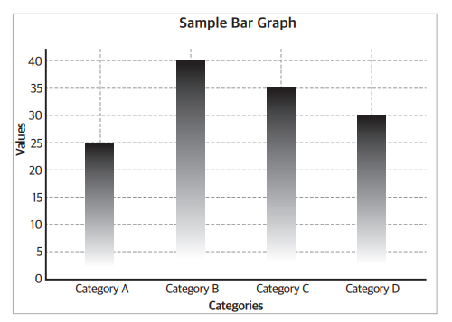
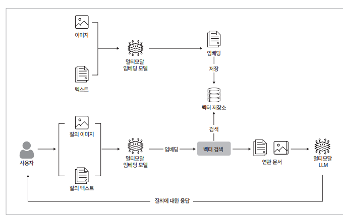
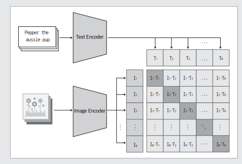
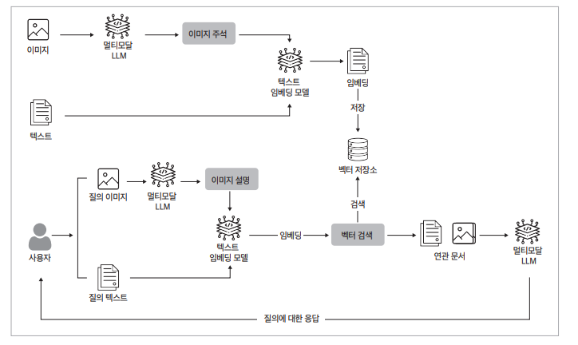
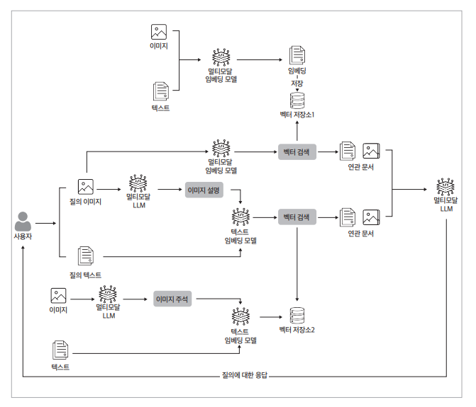
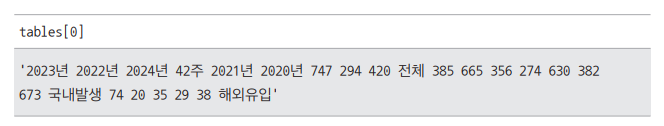
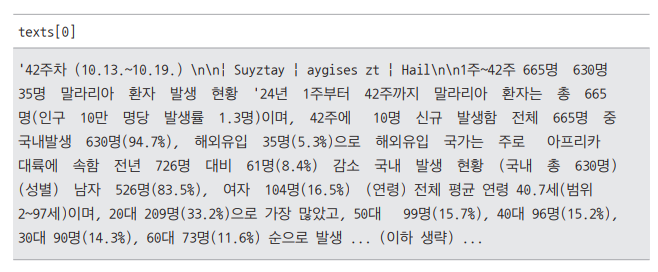
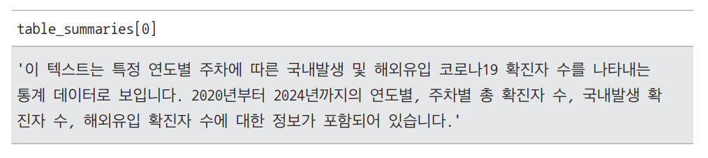
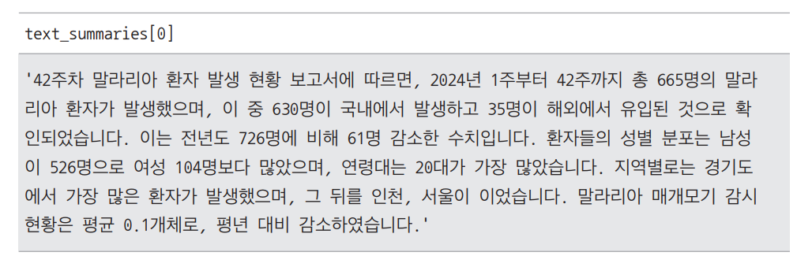
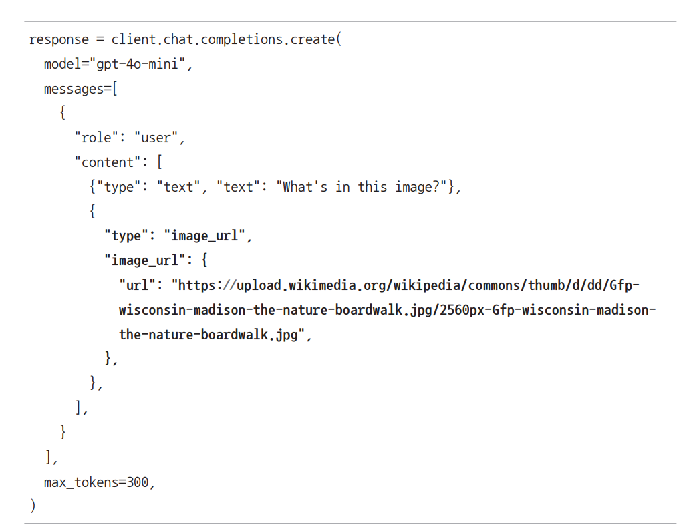

# **멀티모달 RAG를 활용한 복합 데이터 처리**  
# **멀티모달 RAG 개요**  
모달리티(modality)는 이미지, 텍스트, 음성 등 입력받거나 처리하는 데이터의 형태를 의미하며 멀티모달(multimodal)은 이러한 서로 다른 유형의 데이터를 
동시에 사용하는 방식을 뜻한다.  
  
# **멀티모달 RAG란?**  
멀티모달 RAG는 단순 텍스트 정보에 의존하는 것이 아니라 이미지나 차트, 테이블 등의 시각적, 구조적 데이터까지 포함하여 정보를 검색하고 생성하는 기법이다.  
  
LLM에 텍스트 데이터뿐 아니라 이미지, 차트, 테이블 등 풍부한 정보를 제공한다면 관련 문서를 검색할 때 더욱 정확한 맥락을 파악할 수 있다. 이를 통해 
보다 일치하는 데이터를 효과적으로 찾아낼 수 있을 뿐 아니라 사용자에게 답변을 생성할 떄도 단순 텍스트를 넘어 다차원적인 정보를 활용할 수 있다. 따라서 
사용자에게 더욱 정확하고 풍부한 답변을 제공할 수 있다.  
  
# **멀티모달 RAG가 어려운 이유**  
멀티모달 RAG는 텍스트 데이터만 활용하는 일반적인 RAG 방식보다 더 많은 난관이 존재한다. 일반적인 비즈니스 도메인에서 다루는 비정형 데이터는 고해상도 
이미지가 담긴 슬라이드 또는 텍스트, 표, 차트, 다이어그램 등이 섞인 형태로 존재하며 PDF 등 다양한 형식으로 분산되어 있는 경우가 많다.  
  
이렇게 서로 다른 여러 형식의 데이터를 다룰 때 각 형식마다 해결해야 할 문제가 다르며 형식 간의 정보를 효과적으로 관리하는 방법도 고민해야 한다. 따라서 
단순히 텍스트만 다루는 일반적인 RAG보다 멀티모달 RAG가 더 복잡한 요소를 고려해야 한다.  
  
## **유형별 상이한 요구사항**  
  
  
이미지를 예로 들면 위 그림과 같은 이미지에서는 세부적인 디테일보다는 전반적인 이미지에 중점을 두고 분석하게 된다. 따라서 연못, 바다, 나무, 모래와 같은 
주요 요소만 강조된다.  
  
  
  
반면 보고서나 문서에서는 위 그림과 같은 차트나 다이어그램처럼 정보가 밀집된 이미지가 포함될 수 있다. 이때는 각 수치가 의미하는 바를 해석하는 세부적인 
분석뿐만 아니라 해당 분석이 이루어진 환경과 같은 추가적인 맥락도 고려해야 한다. 따라서 파이프라인을 설계할 때 각 양식의 특성과 요구사항을 인식하고 이에 
맞춰 적절히 처리해야 정보를 효율적으로 담을 수 있다.  
  
## **데이터의 일관성**  
멀티모달 RAG에서 또 다른 중요한 과제는 서로 다른 형식의 데이터를 일관성 있게 관리하는 방법이다. 예를 들어 문서 내에서 차트를 설명하는 텍스트와 차트 
자체의 의미가 일치하는지 확인하는 것이 필수다.  
  
만약 LLM에게 전달되는 두 가지 유형의 정보(텍스트와 차트)가 서로 상반된다면 결국 사용자에게 전달되는 답변 역시 정확도가 떨어질 수 있다. 따라서 다양한 
데이터 형식 간에 일관성을 유지하고 이를 효과적으로 검증하는 과정이 필요하다.  
  
# **멀티모달 RAG 구현 방법**  
멀티모달 RAG 파이프라인을 구축하는 데는 서로 다른 모달리티를 어떻게 LLM에게 인지시킬지에 따라 다음과 같은 몇 가지 주요 접근 방식이 있다.  
  
- 모든 모달리티를 동일한 벡터 공간에 포함하기  
- 모든 모달리티를 하나의 기본 모달리티로 묶기  
- 서로 다른 모달리티를 별도의 저장소에서 다루기  
  
# **모든 모달리티를 동일한 벡터 공간에 포함하기**  
  
  
이미지와 텍스트를 모두 효과적으로 처리하기 위해 CLIP(Contrastive Language-Image Pretraining)과 같은 멀티모달 모델을 사용하면 두 모달리티를 
동일한 벡터 공간에 인코딩할 수 있다. 이를 통해 이미지와 텍스트 모두 동일한 방식으로 임베딩할 수 있으며 기존 텍스트 기반의 RAG 인프라를 그대로 유지하면서 
임베딩 모델만 교체하여 다양한 모달리티를 수용할 수 있다.  
  
이렇게 통합된 벡터 공간을 활용하면 유사도 검색을 통해 이미지와 텍스트를 모두 검색할 수 있고 생성 단계에서는 멀티모달 LLM(MLLM)을 사용하여 이미지와 텍스트 
모두를 활용해 답변을 생성할 수 있다. 이 방식은 이전에 구현했던 RAG 파이프라인에서 임베딩 모델을 교체하는 것 외에 별다른 변화를 요구하지 않으므로 
구현하기 쉽다는 장점이 있다. 하지만 이미지, 텍스트, 복잡한 표 등 다양한 콘텐츠를 정확하게 임베딩할 수 있는 모델을 확보하는 것이 필수다.  
  
# **CLIP**  
CLIP(Contrastive Language-Image Pretraining)모델은 오픈 AI에서 개발한 인공지능 모델로 텍스트와 이미지를 동시에 처리할 수 있는 멀티모달 모델이다. 
CLIP은 대규모 텍스트-이미지 데이터셋을 통해 학습되었으며 이를 통해 주어진 이미지에 맞는 텍스트를 예측하거나 텍스트에 맞는 이미지를 찾아낼 수 있다.  
  
CLIP의 구조는 크게 이미지와 텍스트를 처리하는 두 가지 인코더로 구성되며 이 두 인코더에서 생성된 벡터를 비교하는 방식으로 동작한다. 이를 통해 이미지와 
텍스트 간의 의미적 관계를 효과적으로 학습할 수 있다.  
  
  
  
- 이미지 인코더: 이미지를 입력으로 받아 해당 이미지를 벡터로 변환한다. 주로 ResNet이나 Vision Transformer(ViT) 같은 비전 모델이 이미지 인코더로 
사용된다.  
- 텍스트 인코더: 텍스트를 입력으로 받아 해당 텍스트를 벡터로 변환한다. 일반적으로 Transformer 기반의 언어 모델이 텍스트 인코더로 사용된다.  
- 대조 학습: 이미지와 텍스트를 각각 인코더를 통해 벡터로 변환한 후 이 벡터들을 비교하여 학습한다. 이미지-텍스트 쌍이 맞으면 유사하게, 그렇지 않으면 
다르게 나타나도록 조정한다.  
  
CLIP의 특징은 다음과 같다. CLIP은 이미지와 텍스트를 동시에 처리할 수 있도록 설계되어 다양한 작업과 환경에서 우수한 성능을 보인다.  
  
- 일반화 능력: CLIP은 특정 작업에 대해 훈련되지 않았음에도 불구하고 다양한 이미지-텍스트 관련 작업에서 강력한 성능을 발휘한다. 예를 들어 텍스트 설명에 
맞는 이미지를 찾는 작업이나 이미지를 보고 적절한 설명을 생성하는 작업에서 뛰어난 성능을 보인다.  
- Zero-shot 학습: CLIP은 특정 작업에 대해 별도의 추가 훈련 없이도 기존에 학습된 지식을 사용해 새로운 작업을 수행할 수 있다. 예를 들어 CLIP은 새로운 
카테고리의 이미지를 보고도 적절하게 텍스트로 설명할 수 있다.  
- 멀티모달 학습: CLIP은 이미지와 텍스트를 동시에 처리할 수 있는 모델이므로 다양한 응용 프로그램에서 활용할 수 있다. 예를 들어 이미지 검색, 이미지 설명, 
멀티모달 챗봇 등에 적용할 수 있다.  
  
# **모든 모달리티를 하나의 기본 모달리티로 표현하기**  
  
  
이 방식은 모든 데이터를 한 가지 유형의 데이터로 표현하는 방식이다.  
  
가령 이미지와 텍스트 데이터를 함께 처리할 때 멀티모달 LLM을 사용하면 이미지를 설명하는 텍스트 요약을 생성할 수 있다. 이렇게 생성된 텍스트를 임베딩하여 
검색할 수 있으며 이후 LLM에서 이미지를 포함한 검색 결과를 기반으로 답변을 생성할 수 있다. 요약하자면 주된 모달리티 하나를 기본으로 선택하고 다른 모든 
모달리티를 기본 모달리티로 표현하는 전략이다.  
  
이 방식의 장점은 이미지로부터 생성된 메타데이터가 명확하고 객관적인 질문에 효과적으로 대응할 수 있다는 점이다. 또한 이미지 임베딩을 위한 새로운 모델을 
따로 조정하거나 다양한 검색 결과의 순위를 조정하기 위한 추가 작업이 필요하지 않다는 이점이 있다. 그러나 전처리 과정에서 비용이 발생하고 이미지의 세부적인 
뉘앙스나 정보가 손실될 수 있다는 한계도 있다.  
  
# **서로 다른 모달리티를 별도의 저장소에서 다루기**  
서로 다른 모달리티를 별도의 저장소에 저장하는 방법은 앞선 모든 모달리티를 동일한 벡터 공간에 포함하는 방법과 모든 모달리티를 하나의 기본 모달리티로 
표현하는 방법을 결합한 형태라고 할 수 있다.  
  
이미지와 텍스트를 모두 다루는 멀티모달 임베딩 모델의 임베딩 결과는 벡터 저장소 1에, 이미지를 텍스트로 묘사하는 텍스트 임베딩 모델의 임베딩 결과는 벡터 
저장소 2에 저장한다.  
  
이후 사용자가 이미지와 텍스트로 구성된 질문을 입력하면 두 가지 임베딩 벡터를 각각 얻어야 한다. 첫 번째 임베딩 벡터는 벡터 저장소 1에 저장할 때 사용했던 
멀티모달 임베딩 모델로 변환한 결과로 이를 활용해 벡터 저장소 1에서 유사한 문서를 검색하는 데 활용한다. 두 번째 임베딩 벡터는 벡터 저장소 2에 저장할 때 사용했던 
텍스트 임베딩 모델로 변환한 결과로 이를 활용해 벡터 저장소 2에서 유사한 문서를 검색하는 데 활용한다.  
  
  
  
이렇게 얻어낸 검색 결과들을 모두 사용하거나 또는 이들 사이에서 리랭킹(ReRanking)을 거쳐 상위 n개의 가장 유사한 문서를 가려낸 뒤 최종적으로 LLM 
모델에게 답변을 생성할 맥락으로 제공한다.  
  
이 방식은 앞선 방식들보다 전처리에 시간이 많이 걸리고 인프라 비용도 배로 들지만 각 방식의 장점을 결합하여 가장 유사한 문서만 가려내어 사용하므로 사용자에게 가장 
질적으로 우수한 답변을 제공할 수 있다.  
  
# **멀티모달 RAG 실습**  
PDF 파일에서 데이터를 추출하고 저장한 뒤 이를 활용하여 PDF 본문에 대한 질문과 응답이 가능한 검색기를 구현한다. 이번 실습에서는 오픈 AI의 MLLM을 
이용하여 쉽게 구현할 수 있는 모든 모달리티를 하나의 기본 모달리티로 표현하는 방식을 사용한다.  
  
# **환경 설정**  
MULTI_MODAL_RAG.ipynb(라이브러리 설치)   
  
## **tesseract 설치**  
tesseract는 PDF 파일에서 문자열을 추출하는 데 필요한 광학 문자 인식(OCR) 라이브러리다. 컴퓨터 운영체제별로 설치 방법이 다르므로 각자 운영 체제에 맞는 
방식을 설치한다.  
  
- Window  
Tesseract 3.05, Tesseract 4, Tesseract 5의 Windows 설치 프로그램은 tesseract github에서 내려받을 수 있다. 여기에는 학습 도구가 포함되어 
있으며 32비트 및 64비트 설치 프로그램 모두 제공된다.  
  
- OSX(Mac)  
다음 명령어로 설치한다.  
brew install tesseract  
  
- Linux  
다음 명령어로 설치한다.  
sudo apt install tesseract-ocr  
sudo apt install libtesseract-dev  
  
## **poppler 설치**  
poppler는 PDF 렌더링과 처리에 필요한 라이브러리다. 컴퓨터 운영체제별로 각자에 맞는 방식으로 설치한다.  
  
- Window  
최신 poppler의 Windows 설치 프로그램은 poppler github에서 내려받을 수 있다. 내려받은 설치 파일을 원하는 폴더 경로에 압축을 푼다. 이어서 다음과 
같이 폴더경로\bin을 환경 변수에 추가한다.  
  
1. 시작 메뉴에서 환경 변수를 검색하고 시스템 환경 변수 편집을 선택한다.  
2. 환경 변수... 버튼을 클릭한다.  
3. 시스템 변수 섹션에서 Path를 찾아 편집을 클릭한다.  
4. 새로 만들기를 클릭하고 추가할 경로를 입력한 후 확인을 누른다.  
5. 프로그램 또는 컴퓨터를 다시 시작하여 변경 사항을 적용한다.  
  
윈도우 키 + R을 눌러 실행창을 열고 텍스트 상자에 powershell을 입력한 후 엔터 키를 눌러 파워셸을 실행한다. pdftoppm -h 명령어가 올바르게 동작한다면 
성공적으로 설치된 것이다.  
  
- OSX(Mac)  
다음 명령어로 설치한다.  
brew install poppler  
  
- Linux  
다음 명령어로 설치한다.  
sudo apt-get install poppler-utils  
  
## **unstructured 설치**  
tesseract와 poppler를 이용하여 PDF의 전체적인 처리를 수행하는 라이브러리인 unstructured를 설치한다. 해당 라이브러리는 tesseract와 poppler에 
의존성을 가지므로 반드시 이들 두 라이브러리를 설치한 이후에 설치해야 한다.  
  
MULTI_MODAL_RAG.ipynb(라이브러리 설치)  
  
## **오픈AI 키 설정**  
답변을 생성하는 데 LLM을 사용한다. 이번 실습에서는 ChatGPT API를 사용하므로 OPEN AI API KEY를 준비하여 .env 파일에 추가하고 로드한다.  
  
MULTI_MODAL_RAG.ipynb(라이브러리 설치)  
  
# **데이터 전처리**  
먼저 검색에 활용할 PDF 파일의 전처리를 진행하여 벡터 저장소에 저장하는 작업을 진행한다. PDF 내에는 텍스트와 이미지, 테이블 데이터 등 다양한 
유형의 데이터가 존재한다. 이를 모두 한번에 추출한 뒤 분류하여 저장하는 작업을 진행한다.  
  
이번 예제에서는 질병관리청에서 주마다 발간하는 말라리아 주간소식지 PDF 파일을 사용한다. 해당 PDF는 말라리아 발생 현황에 대한 텍스트와 이를 
보기 쉽게 도식화한 테이블 데이터, 발생 분포를 표현한 이미지 데이터를 포함하고 있다.  
  
먼저 파일 경로를 설정한다.  
  
MULTI_MODAL_RAG.ipynb(PDF 데이터 전처리)  
  
이제 PDF에서 각 요소들을 모두 추출한다. 이때 앞서 설치한 unstructured 라이브러리를 사용한다. unstructured 라이브러리에서는 텍스트 전처리 작업에 
nltk를 사용하므로 이에 필요한 데이터를 같이 다운로드한다.  
  
MULTI_MODAL_RAG.ipynb(PDF 데이터 전처리)  
  
이어서 partition_pdf 함수를 사용하여 요소 추출을 진행한다.  
  
partition_pdf 함수에 다음과 같은 인자들을 설정하면 원하는 만큼 텍스트 데이터를 조각낼 수 있고 이미지와 테이블 구조를 추출할 수 있다.  
  
- filename: 분석하고자 하는 PDF 파일 경로를 지정한다.  
- extract_images_in_pdf: PDF 안에 이미지가 있다면 이미지를 추출한다.  
- infer_table_structure: PDF 안에 테이블이 있다면 테이블을 추출한다.  
- chunking_strategy: 텍스트를 조각낼 전략을 선택한다. basic은 섹션 구분 없이 글자 수에 따라 조각내고 by_title은 페이지 또는 섹션 경계에 
따라 조각낸다.  
- extract_image_block_output_dir: 추출한 이미지를 저장할 경로를 설정한다.  
  
unstructured 라이브러리에서 추출된 데이터의 유형을 검사해 이미지와 테이블 구조를 추출한 수 있다.  
  
추출된 element의 type 문자열을 검사했을 때 unstructured.documents.elements.Table이 포함되어 있으면 테이블, unstructured.documents.elements.CompositeElement가 
포함되어 있으면 텍스트다.  
  
MULTI_MODAL_RAG.ipynb(PDF 데이터 전처리)  
  
추출한 테이블 데이터와 텍스트 데이터를 각각 확인해본다.  
  
  
  
  
# **멀티-벡터 검색기**  
이제 추출한 요소들을 벡터화하여 저장하고 이를 통해 멀티모달 데이터를 검색할 수 있는 멀티-벡터 검색기를 구성한다.  
  
## **텍스트 및 테이블 요약**  
추출한 요소들은 복잡한 테이블과 텍스트를 그대로 읽은 데이터이기 때문에 복잡하고 가시성이 떨어지는 모양을 띠고 있다. 따라서 이를 LLM에 제공하여 
텍스트와 테이블에 대한 요약문을 생성한다.  
  
MULTI_MODAL_RAG.ipynb(텍스트 및 테이블 요약)  
  
예제에서는 summarize_chain = {"element": lambda x: x} | prompt | model | StrOutputParser() 와 같이 요약 체인을 생성한다. 이는 
element라는 key에 저장된 리스트 형식의 데이터를 입력받아 모델에 넣어 문자열 형태의 출력을 반환받는 체인이다.  
  
앞에서 추출한 테이블과 텍스트를 summarize_chain.batch 함수를 호출하여 실행한다. chain의 batch 함수는 입력받은 다량의 데이터를 한번에 처리할 
수 있는 함수다.  
  
챗GPT는 프롬프트에 따라 각 텍스트와 테이블에 대한 요약문을 응답으로 제공하는데 이를 text_summaries, table_summaries에 따로 저장해 둔다.  
  
요약한 내용을 확인해본다.  
  
  
  
  
결과를 보면 요약을 통해 훨씬 압축적이고 명확한 텍스트 데이터가 생성된 것을 확인할 수 있다.  
  
## **이미지 요약**  
PDF에서 추출한 세 가지 모달리티 중 텍스트와 테이블에 대한 요약문을 생성했다. 이제 마지막 모달리티인 이미지에 대한 요약을 생성한다.  
오픈AI에서 지원하는 많은 모델 중 비전(vison), 즉 이미지를 다룰 수 있는 모델인 gpt-4o 모델을 사용한다.  
  
# **오픈AI의 MLLM(Multi-Modal LLM)**  
오픈 AI의 모든 LLM이 이미지 데이터를 처리할 수 있는 것은 아니다. 오픈AI의 모델 소개 페이지에서 비전을 지원한다고 소개된 모델만 이미지를 입력으로 
받아 이를 인식하고 출력할 수 있다.  
  
이미지는 텍스트보다 더 많은 정보를 포함한 복잡한 모달리티다. 이미지는 AI 모델이 인지할 수 있는 정형화된 모양으로 변환해서 전달해야 하는데 오픈 AI에서는 
다음과 같이 이미지를 전달하는 여러 옵션을 제공하고 있다. 이를 참고하여 적합한 방법을 선택해 활용하자.  
  
## **이미지 URL을 통해 모델에게 이미지 전달하기**  
  
  
챗GPT에게 전달하는 메시지에 image_url 타입의 콘텐츠를 추가하고 url 데이터를 전송하는 방식으로 이미지를 전달할 수 있다.  
  

  
