# **검색과 응답을 최적화하는 RAG 고도화 전략**  
RAG 고도화 전략 워크플로우  
  
  
RAG 고도화는 관련 문서를 가져오는 Retrieval 파트와 응답을 생성하는 Generation 파트 모두에서 달성할 수 있다. 각 파트에서 개선할 수 있는 주요 
구성요소와 고도화 방안을 정리하면 다음과 같다.  
  
  
  
# **청킹 전략**  
문서 전처리 단계는 RAG 시스템에서 실제 검색에 사용될 문서들을 가공하여 검색과 생성에 최적화된 형태로 변환하는 과정이다. 효과적인 전처리는 검색 정확도를 
높이고 관련성 있는 정보를 더 잘 추출할 수 있게 도우며 궁극적으로 생성 모델의 응답 품질을 향상시킨다.  
  
문서 전처리 과정은 여러 단계로 구성되는데 그중 핵심적인 단계가 청킹(chunking), 즉 문서 분할 단계다. 문서 분할은 긴 문서를 더 작고 관리하기 쉬운 
단위로 나누는 과정이다. 효과적인 분할 방식은 관련 정보의 검색 정확도를 높이고 문맥의 일관성을 유지하는 데 도움을 준다. 또한 생성 모델이 처리해야 할 
컨텍스트의 양을 적절히 조절하여 응답 생성의 품질을 향상시킬 수 있다.  
  
가장 기본적인 문서 분할 방식은 문자 수 기반 분할(character splitting)이다. 이는 문서를 단순히 일정 길이의 문자 단위로 나누는 방식으로 구현이 
간단하고 빠르다는 장점이 있다. 하지만 문장이나 단락의 의미적 구조를 고려하지 않기 때문에 중요한 정보가 분할되어 검색 시 누락되거나 문맥이 왜곡될 수 
있다는 단점이 있다. 또한 고정된 길이로 분할하기 때문에 문서의 내용과 구조에 따른 최적화가 어려울 수 있다.  
  
# **부모-자식 분할**  
재귀적 문자 텍스트 분할 방식은 문서의 구조를 고려하여 분할하지만 의미를 고려하지 않고 기계적인 규칙에 따라 텍스트를 분할하기 때문에 연관된 내용이 
분리되어 문맥이 끊길 수 있는 문제가 있다. 또한 의미 기반 분할은 텍스트의 의미적 연관성을 고려하여 일관된 청크를 생성하는 데 효과적이지만 긴 문서나 
복잡한 주제를 다룰 때 문서의 전체적인 구조와 계층적 관계를 완벽하게 포착하기에는 한계가 있다.  
  
이러한 한계를 보완하고 문서의 구조적 정보를 더 잘 활용하기 위한 방법으로 부모-자식 분할(parent-child chunking)이 있다. 이 방법은 문서의 계층 
구조를 유지하면서도 세부적인 내용까지 보존하는 접근 방식이다.  
  
부모-자식 분할은 다음과 같은 핵심 개념을 바탕으로 한다. 먼저 문서를 계층적으로 분할하여 원본 문서를 큰 단위의 부모 문서로 나누고 이를 다시 작은 단위의 
자식 문서로 세분화한다. 이렇게 원본 문서 -> 부모 문서 -> 자식 문서의 3단계 구조를 형성한다.  
  
부모-자식 분할 방식은 문서의 저장과 검색에서 이원화된 접근법을 채택한다. 문서의 계층구조를 유지하면서도 효율적인 검색을 위해 자식 문서는 벡터 
데이터베이스에 임베딩하여 저장하고 부모 문서는 별도의 저장소에 원본 형태로 보관한다. 실제 검색 시에는 자식 문서를 기반으로 유사성 검색을 수행하지만 
최종적으로 반환되는 문서는 해당 저장 문서가 속한 부모 문서다.  
  
이 방식에는 두 가지 주요 장점이 있다. 첫 번째는 정확한 정보 검색이다. 정보를 검색할 때는 자식 청크를 사용하기 때문에 질문과 관련성 높은 정보를 
정확히 찾아낼 수 있다. 자식 청크는 특정 주제에 집중된 정보를 담고 있어 질문과 정확한 매칭이 가능하다. 따라서 대량의 텍스트에서 특정 정보를 빠르고 정확하게 
식별하는 데 효과적이다.  
  
두 번째는 넓은 맥락을 제공한다는 점이다. 검색 결과로 부모 문서를 반환함으로써 특정 정보뿐만 아니라 그 정보가 포함된 전체적인 맥락까지 함께 파악할 
수 있다. 부모-자식 분할이 동작하는 자세한 과정은 다음과 같다.  
  
1. 문서 분할  
먼저 원본 문서를 비교적 큰 크기의 부모 문서로 나눈다. 이때 문서의 구조적 특성(예: 장, 절, 단락)을 고려할 수 있다. 이후 각 부모 문서를 더 작은 
자식 문서로 나눈다. 이 과정에서 의미 기반 분할같은 다른 기술을 활용할 수도 있다.  
2. 메타데이터 할당  
각 자식 문서에 해당 부모 문서의 식별자를 메타데이터로 할당한다. 이를 통해 자식 문서와 부모 문서 간의 관계를 추적할 수 있다.  
3. 임베딩 저장  
자식 문서는 벡터 데이터베이스에 저장된다. 이때 각 청크의 텍스트 내용은 임베딩되어 벡터 형태로 저장된다. 부모 문서는 별도의 문서 저장소에 저장된다.  
  
이후 부모-자식 청킹 처리된 문서의 검색 과정은 다음과 같다.  
  
1. 사용자 쿼리가 입력되면 먼저 벡터 데이터베이스에서 쿼리와 가장 유사한 자식 문서를 검색한다.  
2. 검색된 자식 문서의 메타데이터를 확인하여 해당하는 부모 문서의 식별자를 찾는다.  
3. 찾은 식별자를 이용해 문서 저장소에서 관련된 부모 문서를 반환한다.  
  
이러한 방식을 통해 부모-자식 분할은 문서의 구조적 정보를 유지하면서도 효율적인 검색과 정보 추출을 가능하게 한다. 중요한 점은 부모-자식 분할이 의미 
기반 분할을 대체하는 것이 아니라 두 기술을 상호 보완적으로 사용할 수 있다는 것이다. 예를 들어 부모 문서를 자식 문서로 나눌 때 의미 기반 분할을 적용하여 
의미적으로 더 일관된 청크를 만들 수도 있다.  
  
다음은 부모-자식 분할을 랭체인으로 구현한 코드다.  
  
PARENT_CHILD_CHUNKING.ipynb  
  
먼저 필요한 라이브러리를 설치하고 오픈AI API 키를 설정한다.  
  
이어서 분할에 사용할 문서를 로드한다. How_to_invest_money.txt 파일을 사용한다. 텍스트 파일을 사용하므로 랭체인의 TextLoader 클래스를 사용한다. 
TextLoader는 텍스트 파일을 읽어 랭체인의 Document 객체로 변환하는 클래스다.  
  
이제 부모-자식 분할에 필요한 설정을 진행한다. 재귀적 문자 텍스트 분할 방식을 활용하여 부모 문서와 자식 문서를 생성한다. 이때 부모 문서의 크기(chunk size)는 
1000으로 자식 문서의 크기는 200으로 설정함으로써 부모-자식 계층 구조를 만든다.  
  
자식 문서 저장소는 Chroma 벡터 데이터베이스를 사용한다. Chroma 인스턴스의 collection_name 파라미터를 "split_parents"로 지정하여 부모 문서와 
연관성을 유지한다.  
  
부모 문서 저장소는 InMemoryStore를 사용한다. 이는 RAM에 데이터를 저장하는 방식으로 빠른 읽기와 쓰기가 가능하지만 프로그램 종료 시 데이터가 
손실되는 특징이 있다. 이제 ParentDocumentRetriever 인스턴스를 생성한 후 실제 문서를 추가하여 문서가 성공적으로 분할되었는지 확인한다.  
  
먼저 자식 문서 저장소(vectorstore), 부모 문서 저장소(store), 자식 문서 텍스트 분할기(child_splitter), 부모 문서 텍스트 분할기(parent_splitter)를 
인자로 받는 ParentDocumentRetriever 인스턴스를 생성한다. 이를 통해 부모-자식 구조의 계층적 문서 검색을 수행할 수 있다.  
  
다음으로 retriever.add_documents(docs) 메서드를 사용하여 문서를 추가한다. 이 과정에서 문서들이 자동으로 부모와 자식 문서로 분할되어 각각의 저장소에 
저장된다. 이후 store.yield_keys()를 사용하여 저장된 모든 부모 문서의 키를 가져온 뒤 해당 키의 개수를 세어 총 부모 문서의 수를 확인하고 문서 분할과 
저장이 제대로 이루어졌는지 검증한다.  
  
코드 실행 결과로 총 219개의 부모 문서가 InMemoryStore에 저장되었다. 이는 원본 문서가 1000자 단위로 분할되어 219개의 부모 문서로 나뉘었다는 
뜻이다. 각 부모 문서는 다시 200자 단위의 자식 문서로 분할되어 Chroma 벡터 저장소에 저장되었다.  
  
이제 실제로 검색을 수행한다. "What are the types of investments?"라고 질의한다. 이 질문이 ParentDocumentRetriever를 거치면 관련된 부모 문서가 
검색된다. 첫 번쨰 연관 문서만 출력해서 확인해본다.  
  
  
  
이제 부모-자식 분할의 작동 방식을 이해하기 위해 벡터 저장소에서 직접 자식 문서를 검색해서 첫 번째 자식 문서를 출력해본다.  
  
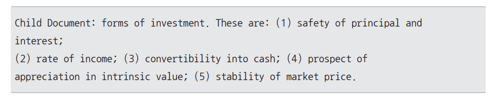  
  
결과를 보면 자식 문서와 부모 문서의 차이점과 각각의 역할을 명확히 확인할 수 있다. 자식 문서는 투자의 다섯 가지 주요 고려사항이라는 질문에 직접적으로 
관련된 핵심 정보를 간결하게 제공한다. 반면 부모 문서는 이 정보를 포함하면서도 해당 장에서 부동산 담보 대출에 대해 논의할 것이라는 추가적인 맥락을 
제공한다.  
  
자식 문서를 통해 질문과 가장 관련성 높은 정보를 정확히 찾아내고 부모 문서를 통해 해당 정보의 더 넓은 맥락을 제공한다. 이로써 사용자는 구체적인 정보와 
함께 정보가 속한 전체적인 맥락을 파악할 수 있게 된다.  
  
# **질의 변형**  
질의 변형(query reformation)은 사용자의 원래 질문을 보다 효과적인 검색 쿼리로 변환하는 과정을 말한다. 기본적인 RAG 검색 시스템에서는 사용자 질문을 
그대로 사용하여 관련 문서를 검색한다. 하지만 사용자의 질문이 모호하거나 검색에 최적화되지 않은 형태인 경우 연관 문서를 제대로 검색할 수 없어 RAG 
시스템의 정확도가 떨어지게 된다는 단점이 있다.  
  
질의 변형은 원래의 질문을 분석하고 재구성하여 이러한 문제를 해결한다. 이 과정에서 질문을 더 구체적이고 검색에 최적화된 형태로 재작성하거나 복잡한 질문을 
여러 개의 하위 질문으로 분해하는 등의 기법을 활용한다. 또한 질문의 의도를 파악하여 더 일반화된 쿼리로 확장하거나 가상의 문서를 생성하여 검색 성능을 
개선하는 방법도 포함된다.  
  
이러한 질의 변형 기법은 검색의 저확성과 포괄성을 크게 높여 결과적으로 RAG 시스템의 전반적인 성능 향상으로 이어진다.  
  
# **다중 질의 생성**  
다중 질의 생성(multiquery generation)은 질의 변형의 한 기법으로 사용자의 원래 질문을 바탕으로 여러 개의 다양한 쿼리를 생성하는 방법이다. 이 기법의 
동작 과정은 다음과 같다.  
  
1. 다중 질의 생성  
LLM을 사용하여 원래 질문을 다양한 관점으로 변형시킨 여러 개의 질문을 생성한다. 이 과정에서 동의어 사용, 질문 구조 변경, 특정 측면 강조 등 다양한 
기법을 적용할 수 있다.  
2. 병렬 검색  
생성된 각 쿼리를 사용하여 독립적으로 문서를 검색한다.  
3. 결과 통합  
각 쿼리로부터 얻은 검색 결과를 종합하여 중복을 제거하고 가장 관련성 높은 문서들을 선별한다.  
  
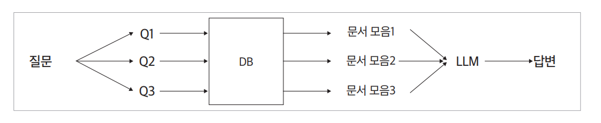  
  
예를 들어 사용자가 주식 투자를 처음 시작하려면 어떻게 해야 하나요? 라고 질문했다면 이를 다양한 관점으로 변화시킨 다음 쿼리들을 생성할 수 있다.  
  
- 초보 투자자를 위한 투자 기초 지식은 무엇인가?  
- 주식 시장 분석을 위한 기본적인 재무제표 읽는 법은?  
- 주식 투자 시작 전 필요한 자금 관리 전략은?  
  
이들 각각의 쿼리는 독립적인 문서 검색에 사용되어 보다 다양한 문서를 수집하게 한다. 즉 기존의 단순한 주식 투자 시작 방법에 대한 정보뿐만 아니라 투자 지식, 
재무 분석, 자금 관리 방법 등 초보 투자자에게 필요한 다양한 측면의 정보를 포괄적으로 검색할 수 있게 되는 것이다. 이는 사용자가 명시적으로 언급하지 
않았지만 주식 투자를 시작하는 데 중요한 관련 주제들까지 탐색할 수 있어 더 풍부하고 실용적인 정보를 제공할 수 있다.  
  
다중 질의 생성 기법에는 여러 가지 이점이 있다. 먼저 다양한 쿼리를 생성함으로써 검색 범위를 넓혀 더 많은 관련 정보를 찾아낼 수 있다. 이는 단일 
쿼리로는 놓칠 수 있는 중요한 정보를 포착하는 데 도움이 된다. 또한 모호한 질문을 다룰 때 특히 유용하다. 하나의 질문을 여러 가지 방식으로 해석하고 
쿼리를 생성함으로써 사용자의 의도를 더 정확히 파악하고 그에 맞는 결과를 제공할 수 있기 떄문이다. 즉 사용자가 정확히 무엇을 원하는지 명확하지 않은 
상황에서도 적절한 답변을 찾는 데 도움을 줄 수 있다.  
  
다중 질의 생성을 랭체인으로 구현한 코드는 다음과 같다. 다중 질의 생성에는 오픈 AI의 gpt-4o 모델을 사용했다.  
  
MULTIQUERY_GENERATION.ipynb  
  
먼저 필요한 라이브러리를 설치하고 오픈AI API 키를 설정한다. 이어서 다중 질의 생성 과정을 모니터링하기 위한 로깅을 설정한다. 이를 활용하면 생성된 
질의들을 콘솔에서 확인할 수 있다.  
  
이제 벡터 데이터베이스와 문서 로더를 설정한 뒤 문서를 불러온다. 먼저 TextLoader를 사용하여 How_to_invest_money.txt 파일을 로드한 뒤 문서 데이터를 
가져온다.  
  
loaders 리스트에 하나의 TextLoader 인스턴스를 추가하고 docs라는 빈 리스트를 생성한다. 다음으로 for 문에서 loaders 리스트에 있는 로더의 load() 
메서드를 호출하여 각 로더로부터 로드된 문서 데이터를 docs 리스트에 추가한다.  
  
이제 문서를 분할하기 위한 텍스트 분할기와 벡터 저장소의 인스턴스를 생성한다. 먼저 RecursiveCharacterTextSplitter(재귀적 문서 분할기)를 사용해 문서를 
1000자 단위로 나누고 200자의 중복을 유지한다.  
  
문서를 분할한 후에는 OpenAIEmbeddings로 문서 데이터를 임베딩하여 Chroma 벡터 저장소에 저장하고 문서 검색과 유사도 계산에 활용한다.  
  
이제 다중 질의 생성을 위한 리트리버를 설정한다. 이 과정에서는 랭체인의 MultiQueryRetriever를 활용하여 사용자가 입력한 질의를 다양한 방식으로 변형하고 
더 정교한 검색 결과를 얻을 수 있도록 한다.  
  
먼저 대규모 언어 모델을 설정한다. 여기서는 오픈 AI의 GPT-4o 모델을 사용하는 ChatOpenAI를 사용한다. 모델 설정 시 temperature값을 0.2로 지정하여 
모델이 비교적 일관되고 신뢰성 있는 응답을 생성하도록 조정한다.  
  
다음으로 MultiQueryRetriever를 생성한다. 이 리트리버는 앞서 생성한 Chroma 벡터 저장소의 검색기를 기본 검색기로 사용하고 질의 변형을 위한 언어 
모델로 앞서 정의한 대규모 언어 모델(GPT-4o)을 사용한다.  
  
이제 실제 "주식 투자를 처름 시작하려면 어떻게 해야 하나요?"라는 질문을 한다. 질문은 invoke() 메서드를 통해 retriever 객체에 전달되어 세 가지 
다른 질문으로 변형된 뒤 벡터 데이터베이스에 전달된다.  
  
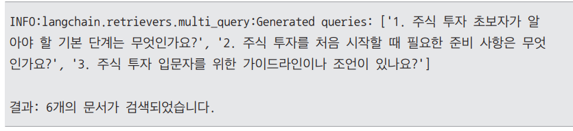  
  
코드 실행 결과 "주식 투자를 처음 시작하려면 어떻게 해야 하나요?"라는 기존 질문이 다음과 같은 세 가지 다른 관점의 질문들로 변환되어 검색에 활용됨을 
알 수 있다.  
  
- 주식 투자 초보자가 알아야 할 기본 단계는 무엇인가요?  
- 주식 투자를 처음 시작할 때 필요한 준비 사항은 무엇인가요?  
- 주식 투자 입문자를 위한 가이드라인이나 조언이 있나요?  
  
이러한 각기 다른 세 가지 관점의 질문은 원본 질문보다 주식 투자 시작에 대한 더 폭넓은 정보를 검색할 수 있도록 한다. 이를 통해 사용자에게 더욱 풍부하고 
다양한 관점의 답변을 제공할 수 있다.  
  
이제 검색된 문서들을 활용하여 최종 답변을 생성하는 RetrievalQA 체인을 설정한다. 이 체인은 앞서 생성한 다중 질의 리트리버를 사용하여 문서를 검색하고 
검색된 문서들의 내용을 바탕으로 사용자의 질문에 대한 종합적인 답변을 생성한다.  
  
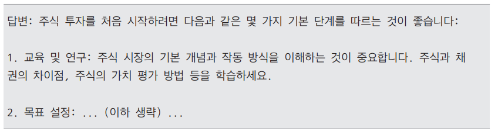  
  
최종적으로 생성된 답변은 주식 투자를 시작하는 사람들이 알아야 할 기본 단계, 그리고 투자 전략에 대한 종합적인 정보를 제공함으로써 사용자의 질문에 더 
충실하게 응답할 수 있게 된다. 이는 RAG 시스템에서 다중 질의 전략이 검색과 응답 품질을 크게 향상시킬 수 있음을 보여준다.  
  
# **가상 문서 임베딩**  
가상 문서 임베딩(Hypothetical Document Embeddings, Hyde)은 기존 쿼리에 대해 가상의 문서를 만들어서 이를 기존 쿼리 대신 활용하는 방법이다. 즉 
질문을 이용하는 것이 아닌 질문에 대한 답변을 기반으로 문서를 찾는 방식이다. 이는 검색 대상 문서가 질문보다 답변과 더 높은 의미적 연관성을 가지는 경우가 
많다는 점을 활용한 접근이다.  
  
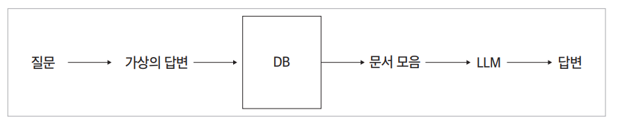  
  
실제 금융 서적을 대상으로 한 RAG 시스템을 예로 든다. 편의상 이 시스템의 유사도 검색은 키워드를 활용한 bm25 방식을 활용한다고 가정한다.  
  
먼저 "주식시장의 변동성이 높을 떄 투자 전략은 무엇인가요?"와 같은 질문을 그대로 검색에 활용한다고 가정할 때 사용할 수 있는 키워드는 다음과 같다.  
  
주식 시장, 변동성, 투자 전략  
  
이 키워드들은 일반적이고 광범위해서 관련성이 낮은 많은 문서들과도 매칭될 수 있다. 반면 이 질문에 대한 답변인 주식 시장의 변동성이 높을 때는 분산 투자, 
달러 코스트 애버리징, 안전 자산 비중 확대 등의 전력을 고려할 수 있습니다. 에는 다음과 같은 구체적이고 전문적인 키워드들이 포함되어 있다.  
  
분산 투자, 달러 코스트 애버리징, 안전 자산, 비중 확대  
  
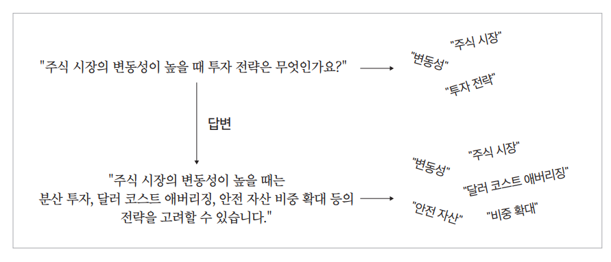  
  
이러한 키워드들은 실제 금융 서적이나 투자 가이드에서 자주 등장하는 전문 용어다. 질문을 활용할 때와는 달리 이제는 질문과 연관된 구체적인 기법들인 
달러 코스트 애버리징, 리스크 관리, 장기적 수익 등의 내용과 연관된 문서들을 참조할 확률이 높아진다.  
  
이러한 원리로 가상 답변을 활용하는 방식은 문서 검색 시 더 정확하고 관련성 높은 문서를 찾을 가능성을 크게 높인다. HyDE 방식이 처음 소개된 논문에 따르면 
이 접근법은 기존 방식에 비해 웹 검색, 질문 답변, 사실 검증 등 11개의 다양한 쿼리 세트에서 우수한 성능을 보였다고 한다. 또한 구현이 쉬워서 기존의 
RAG 시스템과 쉽게 통합할 수 있어 실용성이 높다는 장점도 있다.  
  
하지만 단점도 있다. 가상의 답변(hypothetical document)을 생성하기 위해 대귬 언어 모델을 사용하기 때문에 추가적인 계산 비용이 발생한다. 이는 특히 
실시간 검색 시스템에서 중요한 문제가 될 수 있다. 또한 대규모 언어 모델의 추론 시간으로 인해 검색 지연 시간(latency)이 증가할 수 있어 빠른 응답이 
요구되는 애플리케이션에서는 제약이 될 수 있다.  
  
이제 랭체인을 활용하여 HyDE 방식을 코드로 구현해 본다.  
  
HYDE.ipynb(초기 세팅)  
  
필요한 라이브러리를 설치하고 오픈 AI API 키를 설정한다. 이어서 벡터 데이터베이스와 문서 로더를 설정한 뒤 문서를 불러온다.  
  
이어서 문서를 분할하기 위한 텍스트 분할기와 벡터 저장소의 인스턴스를 생성한다.  
  
이제 HyDE 방식을 구현하는 코드를 살펴본다. 이 코드에는 랭체인의 체인 개념이 사용된다. 랭체인의 체인 방식은 각각의 기능을 수행하는 여러 체인을 만들어서 
이들을 순차적으로 또는 병렬로 연결하는 방식이다. 이렇게 하면 각 체인은 자신의 역할에 집중하면서도 전체 파이프라인에서는 유기적으로 결합되어 효율적으로 
작업을 처리할 수 있다. 따라서 HyDE 방식의 순서에 따라 다음과 같은 여러 체인을 만든 후 이들을 결합하는 방식을 사용한다.  
  
- 가상 문서 생성 체인  
- 문서 검색 체인  
- 최종 응답 생성 체인  
  
먼저 가상 문서 생성 체인을 만든다. 가상 문서 생성 체인은 프롬프트 생성부터 결과 파싱까지의 과정을 연결한다. 각 단계는 다음과 같이 구성된다.  
  
1. 프롬프트: 시스템 메시지(system 변수)와 사용자 메시지(user 변수)를 정의한 뒤 이들을 ChatPromptTemplate에 넣어 대규모 언어 모델에 전달할 
프롬프트를 생성한다. 여기서 시스템 메시지는 AI의 역할을 정의하는 부분이고 사용자 메시지는 실제 사용자의 요청을 정의한다.  
  
2. 대규모 언어 모델: ChatOpenAI를 통해 GPT-4o 모델을 호출하여 입력된 프롬프트에 기반해 가상의 문서를 생성한다. 이때 temperature=0.2로 
설정하여 모델의 응답이 일관되고 구체적으로 생성되도록 조정한다.  
  
3. 파서: 대규모 언어 모델의 출력을 문자열 형태로 변환하기 위해 랭체인의 StrOutputParser를 사용한다. StrOutputParser는 대규모 언어 모델의 
출력을 그대로 문자열로 반환하며 이를 통해 개발자는 후속 처리 단계에서 원본 텍스트를 직접 활용할 수 있다.  

HYDE.ipynb(가상 문서 생성 체인)  
  
다음으로 문서 검색 체인을 생성한다. 이 체인에서는 가상의 답변을 기반으로 벡터 DB에서 가장 유사한 문서를 찾아서 반환하는 역할을 수행한다. 
추가로 반환한 문서에서 메타데이터는 제외하고 순수한 문서 내용만 추출하는 유틸리티 함수도 정의한다.  
  
마지막으로 최종 응답을 생성하는 체인을 생성한다. 이 체인은 앞선 문서 검색 체인에서 반환한 유사 문서를 기반으로 원본 질문에 대한 답변을 생성하는 
역할을 한다. 답변 생성 모델 역시 gpt-4o를 사용한다.  
  
이제 앞서 정의한 3개의 체인과 1개의 유틸리티 함수를 묶어서 전체 파이프라인을 생성하는 함수를 만든다.  
  
먼저 RunnableLambda 클래스를 임포트한 뒤 로깅을 위한 유틸리티 함수를 생성한다. 이 함수는 각 단계에서 입력과 출력을 프린트하는 함수로 이를 
통해 코드의 동작을 이해할 수 있다.  
  
이제 HyDE 방식을 구현하는 전체 파이프라인을 생성하는 메인 함수를 만든다. 이 함수는 앞서 정의한 각 체인을 순서대로 연결하여 하나의 실행 흐름을 
구성한다. 또한 각 단계에서 입력과 출력을 로깅하여 파이프라인의 동작을 추적하고 디버깅을 쉽게 할 수 있도록 했다.  
  
이 함수는 다소 복잡하므로 전체 함수의 구조를 먼저 살펴본 후, 각 컴포넌트에 대해 자세히 알아본다.  
  
1. 가상 문서 생성 단계: virtual_doc_step 함수  
가상 문서 생성 단계에서는 사용자의 질문을 바탕으로 가상의 문서를 생성한다. 이 단계는 HyDE 방식 파이프라인의 첫 번째 과정으로 이후 검색과 응답 
생성의 토대가 된다. 입력값은 사용자의 질문을 포함하는 딕셔너리다. 예를 들어 {"question": "주식 시장의 변동성이 높을 떄 투자 전략은 무엇인가요?"}
와 같은 형태이다.  
  
처리 과정에서는 virtual_doc_chain.invoke() 메서드를 호출하여 가상 문서를 생성한다. 이때 query에는 사용자의 질문이, chunk_size에는 생성할 
문서의 길이를 지정하는 값이 전달된다. 가상 문서가 생성되면 기존 입력값과 병합하여 반환한다. 이렇게 반환된 결과는 다음 단계인 문서 검색 과정으로 
넘어가게 된다.  
  
2. 문서 검색 단계: retrieval_step 함수  
문서 검색 단계에서는 앞서 생성한 가상 문서를 기반으로 벡터 데이터베이스에서 관련 문서를 검색한다. 입력값은 이전 단계에서 생성된 가상 문서와 원본 
질문이 포함된 딕셔너리 x다.  
  
처리는 retrieval_chain.invoke(x)를 호출하여 수행된다. 이 과정에서는 내부적으로 retriever.get_relevant_documents(x['virtual_doc'])으로 
가상 문서를 활용한 관련 문서 검색이 이루어진다. 검색이 완료되면 생성되는 retrived_docs를 기존 입력값 x와 병합하여 다음 단계로 전달한다.  
  
3. 컨텍스트 포매팅 단계: context_formatting_step 함수  
이 단계에서는 검색된 문서들을 하나의 문자열로 포매팅하여 최종 답변 생성에 사용할 컨텍스트를 만든다. 입력값은 앞 단계에서 검색된 문서들이 
포함된 딕셔너리 x다.  
  
처리 과정은 format_docs(x["retrieved_docs"]) 함수를 호출하여 진행된다. 이 함수는 검색된 문서들을 하나의 문자열로 결합하여 컨텍스트를 생성한다. 
생성된 컨텍스트는 기존 입력값과 병합하여 반환되며 최종 응답 생성을 위한 다음 단계로 전달된다.  
  
4. 최종 응답 생성 단계: final_response_step 함수  
최종 응답 생성 단계에서는 앞서 생성된 컨텍스트와 원본 질문을 바탕으로 최종 답변을 생성한다. 입력값은 컨텍스트와 원본 질문을 포함한 딕셔너리 x다. 
처리 과정에서는 final_response_chain.invoke(x)가 호출되며 이때 대규모 언어 모델이 동작하여 입력된 컨텍스트와 질문을 기반으로 최종 답변 
result를 생성하여 반환한다.  
  
5. 전체 파이프라인 구성  
앞서 정의한 모든 단계를 순차적으로 연결하여 전체 파이프라인을 완성하는 단계다. 각 단계의 함수를 RunnableLambda로 감싸 실행 가능한 객체로 만들고 
virtual_doc_step -> retrieval_step -> context_formatting_step -> final_response_step 순으로 연결한다.  
  
이렇게 연결된 파이프라인은 pipeline 객체로 완성되며 이후 사용자의 질문에 대해 답변을 생성하는 데 사용한다.  
  
이제 앞에서 만든 체인을 기반으로 실제 예시 질문을 입력하여 결과를 확인한다. 앞서 생성한 파이프라인 객체의 invoke() 메서드를 호출하여 답변을 생성한다. 
예시로 사용할 질문은 "주식 시장의 변동성이 높을 때 투자 전략은 무엇인가요?"이다.  
  
이때 pipeline.invoke()에 전달하는 입력값은 반드시 {"question": question} 형태의 딕셔너리여야 한다. 이는 파이프라인의 첫 단계인 virtual_doc_step 함수가 
question 키를 기준으로 동작하기 떄문이다.  
  
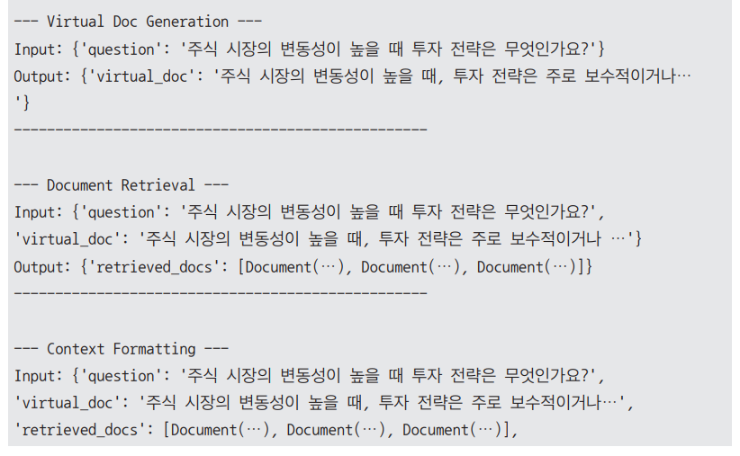  
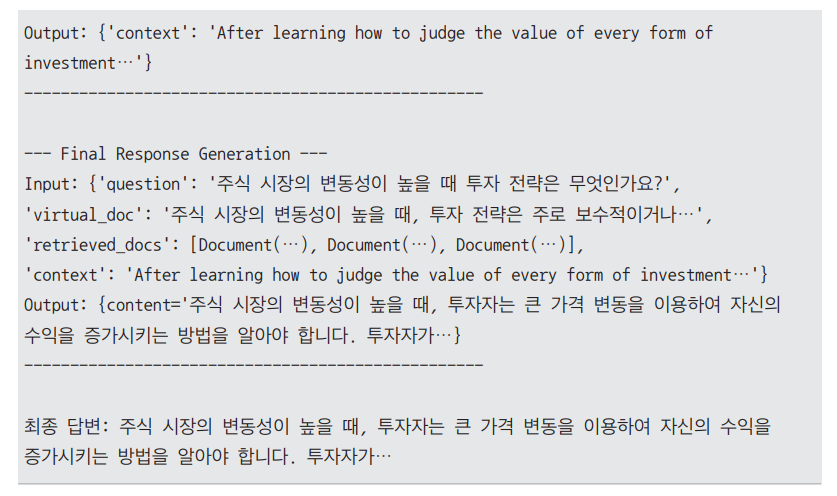  
  
코드 실행 결과를 보면 HyDE 시스템이 단계별로 어떻게 작동하는지 명확히 알 수 있다. "주식 시장의 변동성이 높을 때 투자 전략은 무엇인가요?" 라는 예시 
질문에 대해 먼저 가상 답변인 '주식 시장의 변동성이 높을 때 투자 전략은 주로 보수적이거나...'가 생성됨을 알 수 있다. 그리고 이를 기반으로 관련 
문서들이 검색되었다.  
  
이후 검색된 문서들이 포매팅되어 컨텍스트로 사용되며 마지막으로 이 모든 정보를 종합하여 최종 응답인 '주식 시장의 변동성이 높을 때 투자자는 큰 가격 변동을 
이용하여 자신의 수익을 증가시키는 방법을 알아야 합니다. 투자자가...' 부분이 생성됨을 알 수 있다.  
  
# **검색 알고리즘**  
검색 알고리즘(search algorithm)은 사용자가 작성한 쿼리(질문)와 참조 문서 간의 관련성을 평가하고 가장 적합한 문서를 선별하는 로직을 뜻한다. 최적화된 
검색 알고리즘은 RAG 시스템의 성능과 정확도를 크게 높일 수 있으며 최종적으로 생성되는 응답 품질에도 큰 영향을 미친다.  
  
검색 알고리즘은 크게 두 가지로 분류할 수 있다. 첫 번째는 희소 검색(sparse retrieval) 알고리즘이고 두 번째는 밀집 검색(dense retrival) 알고리즘이다.  
  
희소 검색은 전통적인 키워드 기반 방식으로 대표적인 예로 BM25 알고리즘이 있다. 이 방식은 문서와 쿼리 간에 일치하는 키워드를 중심으로 관련성을 평가한다. 이 방법은 
구현이 간단하고 계산 효율성이 높지만 의미적 유사성을 포착하는 데 한계가 있을 수 있다.  
  
반면 밀집 검색은 쿼리와 문서를 고차원의 벡터 공간에 임베딩하여 비교하는 방식이다. 이 과정은 텍스트 임베딩 방식과 밀접하게 관련되어 있다. 밀집 검색에서는 
단어의 의미와 문맥을 포착할 수 있는 신경망 기반 임베딩 모델을 사용하여 쿼리와 문서를 벡터화하고 이들 간의 유사도를 계산하여 관련성을 판단한다. 덕분에 
키워드가 정확히 일치하지 않더라도 의미적으로 연관된 문서를 효율적으로 포착할 수 있다. 다만 이러한 방식은 계산 비용이 크고 대규모 데이터셋을 학습하는 
과정이 필요하기 때문에 리소스 측면에서 부담이 될 수 있다.  
  
# **희소 검색**  
희소 검색(sparse retrieval)은 문서와 쿼리를 희소 벡터 형태로 표현하여 검색을 수행하는 방법이다. 희소 벡터는 전체 어휘 사전의 크기에 해당하는 차원을 
가진 벡터로 해당 문서나 쿼리에 등장하는 단어에 해당하는 위치만 1(또는 다른 가중치 값)이고 나머지는 모두 0인 형태를 갖는다.  
  
- 희소 벡터의 예  
금융 뉴스 검색 시스템의 어휘 사전이 500000개의 단어로 구성되어 있다고 가정한다. 이때 다음과 같은 주식 관련 뉴스 헤드라인이 있다고 해보자.  
"Tesla stock surges as electric vehicle demand rises"  
  
이 헤드라인의 희소 벡터 표현을 다음과 같이 표현할 수 있다.  
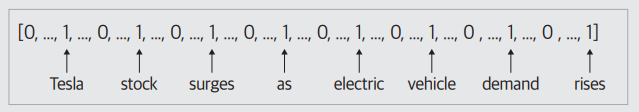  
  
이 벡터는 500000개의 요소를 가지며 그중 8개의 요소만 1이고 나머지는 499992개의 요소는 0이다. 이처럼 벡터의 대부분이 0으로 채워져 있어 듬성듬성하다는 
의미로 희소 벡터라고 부른다.  
  
이러한 희소 벡터를 기반으로 한 검색법은 본질적으로 키워드 기반 검색 방식이다. 문서나 쿼리에 특정 단어가 존재하는지 여부를 중심으로 관련성을 판단하며 
단어의 출현 빈도나 분포를 고려하여 문서의 관련성을 평가한다.  
  
구현이 비교적 간단하고 계산 효율성이 높아 대규모 문서 컬렉션에서도 빠른 검색이 가능하지만 단어의 의미적 관계나 문맥을 고려하지 못하는 한계도 존재한다. 
희소 검색의 단계별 동작 과정은 다음과 같다.  
  
1. 문서 변환: 각 단어의 출현 정보를 저장하는 방식으로 모든 문서를 희소 벡터 기반으로 변환한다. 한국어의 경우 이 과정에서 불용어 제거, 어간 추출 등의 
전처리가 수행될 수 있다.  
2. 질문 처리: 사용자의 질문을 동일한 방식으로 벡터화한다.  
3. 유사도 계산: 질문 벡터와 문서 벡터 간의 유사도를 계산한다. 흔히 사용하는 방법으로는 코사인 유사도가 있다.  
4. 랭킹: 계산된 유사도를 기반으로 문서들의 순위를 매긴다.  
5. 결과 반환: 가장 유사도가 높은 상위 N개의 문서를 결과로 반환한다.  
  
희소 검색의 대표적인 방식을 살펴보면 다음과 같다.  
  
## **TF-IDF(Term Frequency-Inverse Document Frequency)**  
TF-IDF는 단어의 중요도를 문서 내 빈도와 전체 문서에서 희소성을 고려하여 관련성을 계산하는 방식이다. 이 방법은 다음 두 요소를 곱하여 각 단어의 최종 TF-IDF 점수를 
계산한다.  
  
1. TF(Term Frequency)  
특정 단어가 한 문서에서 얼마나 자주 등장하는지를 나타낸다. 빈도가 높을수록 해당 문서의 주제와 관련이 깊다고 판단한다.  
  
계산 방법: TF(t, d) = (단어 t의 문서 d내 등장 횟수) / (문서 d의 총 단어 수)  
  
2. IDF(Inverse Document Frequency)  
특정 단어가 전체 문서 집합에서 얼마나 희귀한지를 나타낸다. 많은 문서에 공통적으로 나타나는 단어(예: 그리고, 그러나)는 덜 중요하다고 판단하여 가중치를 
낮춘다. 반면 소수의 문서에만 나타나는 희귀한 단어일수록 높은 가중치를 받는다.  
  
계산 방법: IDF(t, D) = log(전체 문서 수 / 단어 t가 등장하는 문서 수)  
  
3. TF-IDF 계산식  
  
  
여기서 t는 단어, d는 개별 문서, D는 전체 문서 집합을 의미한다.  
  
결론적으로 TF-IDF는 문서 내에서 자주 등장하면서도 전체 문서 집합에서는 비교적 드물게 나타나는 단어에 높은 점수를 부여한다. 이를 통해 개별 문서의 
특징을 잘 나타내는 핵심 단어를 식별할 수 있으며 불용어(stopwords)와 같이 빈번하지만 의미적으로 중요하지 않은 단어들의 영향을 줄일 수 있다는 장점이 
있다.  
  
하지만 TF-IDF에는 다음과 같은 몇 가지 한계가 있다.  
- 문서 길이 고려 부족: 긴 문서에서는 단어 빈도가 자연스럽게 높아질 수 있어 문서 길이에 따른 편향이 발생할 수 있는 문제점이 있다.  
- 단어 빈도의 선형적 증가: 단어 빈도가 증가함에 따라 TF 값이 계속 선형적으로 증가하여 과도하게 반복되는 단어에 지나치게 높은 가중치를 매기는 일이 발생한다.  
  
## **BM25(Best Matching 25)**  
이러한 TF-IDF의 한계점을 개선하기 위해 개발된 것이 BM25 알고리즘이다. BM25는 TF-IDF의 기본 아이디어를 유지하면서 문서 길이와 단어 빈도의 영향을 
보다 정교하게 조정하여 검색 정확도를 높였다.  
  
- 문서 길이 정규화: 문서의 길이를 고려하여 긴 문서에서 단어 빈도를 적절히 조정한다.  
- 단어 빈도의 포화 처리: 단어 빈도가 증가함에 따라 점수 증가율이 감소하도록 설계되어 과도한 반복이 결과에 미치는 영향을 제한한다.  
  
BM25의 유사도 계산식은 다음과 같다.  
  
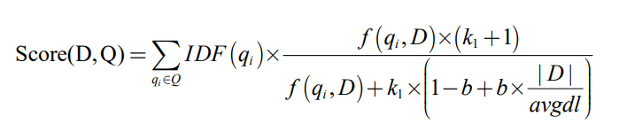  
  
- D: 문서  
- Q: 쿼리(여기서 쿼리는 사용자가 정보 검색 시스템에 전달하는 하나 이상의 키워드, 검색어 또는 문구를 말함)  
- f(q, D): 문서 D에서 쿼리 단어 q의 빈도 수  
- |D|: 문서의 길이  
- avgdl: 전체 문서 집합의 평균 문서 길이  
- k1, b: 알고리즘의 조정 매개변수(일반적으로 k1은 1.2-2.0, b는 0.75)  
  
TF-IDF와 마찬가지로 BM25에도 IDF가 계산식에 포함되어 있다. 하지만 이전과는 달리 계산식의 마지막 부분에 (1 - b + b * |D| / avgdl)을 추가하여 문서 
길이에 따른 편향을 줄이도록 만들었다. 또한 계산식의 (f(qi, D) * (k1 + 1)) / (f(qi, D) + k1 * (...)) 부분은 f(q1, D)가 증가함에 따라 점수 
증가율이 감소하는 형태가 되도록 한다. 이를 통해 단어 빈도가 높아졌을 때에도 점수가 지나치게 높아지지 않도록 조절한다.  
  
결과적으로 BM25는 TF-IDF의 기본 아이디어를 유지하면서도 문서 길이와 단어 빈도의 영향을 더 정교하게 조절하는 알고리즘이다. 이를 통해 더 균형 잡힌 
검색 결과를 제공하며 특히 다양한 길이의 문서가 포함된 컨텐츠에서 우수한 성능을 보인다. 이러한 특징 덕분에 BM25는 희소 벡터 기반 검색 시스템에서 기본 랭킹 
알고리즘으로 널리 사용되고 있다.  
  
## **형태소 전처리를 통한 BM25 성능 향상**  
한국어와 같은 교착어에서는 영어와 달리 동일한 의미의 단어도 매우 다양한 형태로 활용된다. 따라서 키워드 추출에 앞서 형태소 분석을 통해 전처리를 수행하는 
것이 검색 성능 향상에 큰 영향을 미친다. BM25 알고리즘의 성능을 향상시키는 형태소 전처리 기법은 다음과 같다.  
  
1. 기본적인 형태소 분석  
기본적인 형태소 분석은 문장을 최소 의미 단위인 형태소로 분리하고, 각 형태소에 품사 태그를 부여하는 과정이다. 예를 들어 다음과 같이 진행된다.  
  
- 입력: "먹었다"  
- 분석 결과: "먹/VV + 었/EP + 다/EF"  
  
이를 통해 동사 먹다(VV)의 기본형, 과거 시제 선어말어미 었(EP), 종결어미 다(EF)를 파악할 수 있다. 이렇게 문장의 구조와 각 요소의 문법적 기능을 
정확히 이해할 수 있으며 핵심 의미를 가진 형태소를 효과적으로 추출할 수 있다.  
  
2. 주요 품사 추출  
형태소 분석 후 명사(NNG, NNP), 동사(VV), 형용사(VA) 등 핵심 의미를 전달하는 품사만을 선택적으로 추출한다.  
  
- 입력: "아름다운 꽃이 피었습니다"  
- 추출 결과: "아름답/VA", "꽃/NNG", "피/VV"  
  
이를 통해 조사나 어미 등 검색에 큰 영향을 미치지 않는 요소를 제거하여 노이즈를 줄일 수 있다. 이렇게 핵심 키워드에 집중함으로써 검색 쿼리와 문서 간의 
매칭 정확도를 높일 수 있다.  
  
3. 복합 명사 처리  
한국어에서는 여러 명사가 결합하여 복합명사를 이루는 경우가 많다. 이러한 복합명사를 구성요소로 분리하여 처리하면 검색 성능을 향상시킬 수 있다.  
  
- 입력: "정보검색시스템"  
- 분리 결과: "정보/NNG + 검색/NNG + 시스템/NNG"  
  
복합명사를 분리함으로써 각 구성요소에 대한 개별 검색이 가능해지며 부분 일치 검색의 정확도를 높일 수 있다. 이렇게 하면 사용자 쿼리가 복합명사의 일부만 포함하더라도 
관련 문서를 효과적으로 찾아낼 수 있다.  
  
4. 어근 추출 및 표제어 처리  
동사와 형용사의 다양한 활용 형태를 기본형(표제형)으로 통일하여 처리한다.  
  
- "먹었습니다" -> "먹다"  
- "먹고 있다" -> "먹다"  
- "먹을 것이다" -> "먹다"  
  
이렇게 어근을 추출하면 단어의 일관성이 유지되어 검색 쿼리와 문서 내 단어의 매칭 확률이 높아진다. 이는 형태가 다른 동일한 의미의 단어들을 효과적으로 
연결해 준다.  
  
이러한 전처리 과정을 거치면 문서와 쿼리에서 실질적인 의미를 가진 키워드만을 추출할 수 있고 단어 형태가 달라도 동일한 의미로 처리할 수 있어 검색 
성능이 향상된다.  
  
특히 한국어와 같이 교착어 특성이 뚜렷한 언어에서는 이러한 전처리 과정을 거치는 것이 검색 정확도를 높이는 효과적인 방법이다. 그 결과 BM25 알고리즘에서도 
키워드 매칭의 품질이 크게 개선되어 사용자에게 더 관련도 높은 검색 결과를 제공할 수 있게 된다.  
  
이제 랭체인을 활용해 희소 검색을 구현한다. bm25를 활용하고 키워드 추출에 앞서 형태소 분석 단계를 추가함으로써 정확도를 높인다.  
  
BM25.ipynb(사전 준비)  
  
file_path 변수에 PDF 파일의 경로를 지정한 후 이를 이용해 PyPDFLoader 인스턴스인 loader를 생성해 지정된 PDF 파일을 읽어들일 준비를 한다. 다음으로 
RecursiveCharacterTextSplitter 인스턴스인 doc_splitter를 생성한다. 이때 chunk_size를 2000으로, chunk_overlap을 200으로 설정한다.  
  
마지막으로 loader의 load_and_split() 메서드를 호출하여 PDF를 읽어 doc_splitter를 이용해 텍스트를 나눈다.  
  
이어서 BM25 알고리즘을 이용한 문서 검색기를 설정한다.  
  
BM25.ipynb(문서 검색기)  
  
먼저 BM25 알고리즘을 구현한 BM25Retriever를 langchain_community.retrievers에서 임포트한다. 또한 한국어 처리를 위해 Kiwi라는 한국어 형태소 분석기를 
kiwipiepy 라이브러이에서 임포트한다.  
  
이어서 kiwi_tokenizer라는 이름으로 Kiwi 인스턴스를 생성하고 kiwi_tokenize라는 함수를 정의한다. 이 함수는 입력된 텍스트를 Kiwi를 이용해 토큰화하고 
각 토큰의 기본형(form)만을 리스트로 반환한다. 이 과정을 통해 텍스트를 형태소 단위로 분리할 수 있다.  
  
이제 BM25Retriever.from_document() 메서드를 사용하여 bm25_retriever 인스턴스를 생성한다. 이 메서드의 인자로는 이전에 생성한 docs(분할된 문서 리스트)와 
preprocess_func=kiwi_tokenize를 전달한다. 이는 각 문서를 인덱싱할 때 kiwi_tokenize 함수를 사용하여 전처리하라는 의미다.  
  
다음으로 retriever의 k 값을 2로 설정한다. 이는 검색 시 쿼리와 가장 관련성 높은 상위 2개의 문서만을 반환하도록 지정하는 옵션이다. 이렇게 설정한 
bm25_retriever는 이후 사용자의 질의가 들어오면 해당 질의와 가장 밀접한 관련이 있는 두 개의 문서 조각을 효율적으로 검색해 제공한다.  
  
이제 bm25 리트리버로 관련 문서를 얻은 뒤 이를 바탕으로 최종 답변을 생성하는 단계로 넘어간다. 이 과정에서 랭체인의 RetrievalQA 체인을 활용한다.  
  
먼저 필요한 컴포넌트들을 랭체인 라이브러리에서 임포트한다. RetrievalQA와 ConversationalRetrievalChain은 검색과 질문-답변 기능을 제공하는 체인 클래스이고 
ChatOpenAI는 오픈AI의 챗GPT 모델을 사용하기 위한 클래스다.  
  
qa_chain 변수에 RetrievalQA.from_chain_type() 메서드를 사용하여 체인을 생성한다. 이 메서드의 주요 파라미터는 다음과 같다.  
  
- llm: ChatOpenAI 인스턴스를 생성하여 사용한다. temperature를 0.2로 설정하여 비교적 일관된 출력을 얻도록 하고 모델은 gpt-4o를 사용한다.  
- chain_type: "stuff"로 설정한다. 이는 모든 관련 문서를 하나의 컨텍스트로 결합하여 LLM에 전달하는 방식이다.  
- retriever: 이전에 생성한 bm25_retriever를 사용하여 질문과 관련된 문서를 검색한다.  
- return_source_documents: True로 설정하여 답변에 사용된 원본 문서의 정보도 함께 반환하도록 한다.  
  
마지막으로 qa_chain.invoke() 메서드를 호출하여 실제로 질문을 처리한다. 이 회사가 발행한 주식의 총 발행량이 어느 정도야? 라는 질문을 입력으로 제공한다.  
  
코드의 실행 결과를 보면 정확한 답변을 제공함을 알 수 있다.  
  
# **밀집 검색**  
밀집 검색(dense retrieval)은 문서와 쿼리를 고차원 밀집 벡터 형태로 표현하여 검색을 수행하는 방법이다. 이 방식은 희소 검색과 달리 단어의 존재 여부나 빈도만이 
아닌 단어의 의미와 문맥을 고려하여 검색을 수행한다.  
  
이 방식의 핵심은 트랜스포머 기반의 임베딩 모델을 사용하여 텍스트를 의미 공간(semantic space)에 매핑하는 것이다. 즉 텍스트의 의미라는 정성적 지표를 
수치화한 벡터로 변환하여 정량적으로 표현하고 계산할 수 있게 만드는 것이다. 이를 통해 텍스트 간의 의미적 유사성을 수학적으로 측정할 수 있게 되어 더 
정확하고 맥락을 고려한 검색을 수행할 수 있다. 따라서 단순한 키워드 매칭을 넘어 더 복잡한 의미적 관계까지 포착할 수 있어 더욱 고도화된 자연어 처리 작업에 
활용할 수 있다.  
  
## **밀집 벡터의 예**  
금융 뉴스 검색 시스템에서 다음과 같은 주식 관련 뉴스 헤드라인이 있다고 가정해 보자.  
  
- 테슬라 주가, 전기차 수요 증가로 급등  
  
이 헤드라인의 밀집 벡터 표현은 다음과 같을 수 있다(300차원의 벡터를 가정)  
  
- [0.25, -0.10, 0.45, ..., 0.05]  
  
이 벡터는 헤드라인의 의미를 정량적으로 표현한 수치 데이터다. 각 차원은 개별적으로 특정 의미를 갖지 않지만 모든 차원이 함께 결합되어 텍스트의 전체적인 
의미를 고차원 공간에 나타낸다. 이를 통해 정성적이었던 텍스트의 의미를 정량적으로 활용할 수 있게 된다. 즉 다음과 같은 계산을 수행할 수 있다.  
  
1. 의미적 유사성 계산: 다른 뉴스 헤드라인과의 벡터 거리를 계산하여 얼마나 비슷한 내용을 담고 있는지 수치적으로 평가할 수 있다.  
2. 데이터 분석 및 시각화: 텍스트 데이터를 수치화함으로써 클러스터링이나 분류와 같은 기계학습 알고리즘에 적용할 수 있으며 이를 통해 패턴이나 트렌드를 발견할 수 있다.  
  
이처럼 밀집 벡터는 텍스트의 복잡한 의미를 수학적으로 수치화하여 정량적 분석과 처리를 가능하게 한다.  
  
밀집 벡터를 기반으로 한 검색법은 본질적으로 의미 기반의 검색 방식이므로 맥락을 고려하여 보다 정확한 검색을 가능하게 한다. 하지만 동시에 높은 계산 복잡도를 
요구한다는 단점이 있다. 또한 새로운 도메인에 적용할 때 임베딩 모델의 파인튜닝이 필요한 경우도 있다.  
  
밀집 검색의 작동 과정은 다음과 같다.  
  
1. 문서 변환: 모든 문서를 사전 학습된 트랜스포머 기반 임베딩 모델을 사용하여 고차원 밀집 벡터로 변환하고 저장한다.  
2. 질문 처리: 사용자의 질문 역시 동일한 임베딩 모델을 사용하여 밀집 벡터로 변환한ㄷ.  
3. 유사도 계산: 질문 벡터와 문서 벡터 간의 유사도를 계산한다. 주로 코사인 유사도가 사용된다.  
4. 랭킹: 계산된 유사도를 기반으로 문서들의 순위를 매긴다.  
5. 결과 반환: 가장 유사도가 높은 상위 N개의 문서를 결과로 반환한다.  
  
이러한 과정을 통해 밀집 검색은 단순한 키워드 매칭을 넘어 의미적으로 관련성 높은 문서를 효과적으로 검색할 수 있다.  
  
밀집 검색은 희소 검색에 비해 계산 복잡도가 높기 떄문에 실제 대규모 시스템에 적용할 때는 계산 시간이 중요한 문제가 된다. 예를 들어 수백만 개의 문서를 
다루는 검색 엔진을 생각해보자. 각 문서가 300차원의 벡터로 표현된다고 할 때 새로운 검색 쿼리가 들어올 때마다 이를 수백만 개의 벡터와 일일이 비교하면 막대한 
시간과 자원이 소모된다. 이러한 문제를 해결하기 위해 여러 유사도 검색 방식이 등장했다. 그중 가장 많이 쓰이는 방법이 FAISS(Facebook AI Similarity Search)다.  
  
## **FAISS: 밀집 검색의 효과적은 구현을 위한 라이브러리**  
FAISS는 대규모 데이터셋에서 고차원 벡터의 유사도 검색을 빠르게 수행할 수 있도록 설계된 라이브러리다. FAISS의 작동 방식을 이해하기 위해 도서관에서 책을 
찾는 과정을 생각해보자. 모든 책을 한 줄로 쭉 늘어놓고 처음부터 끝까지 일일이 확인하는 것은 비효율적일 것이다. 대신 도서관에서는 책을 주제별로 분류하고 
각 주제 안에서 다시 세부 카테고리로 나누어 체계적으로 관리한다.  
  
FAISS도 이와 유사한 방식으로 작동한다. 가장 기본적인 형태의 FAISS 인덱스(Flat 인덱스)는 모든 벡터를 있는 그대로 저장하고 전체 검색을 수행한다. 
이는 마치 모든 책을 한 줄로 늘어놓은 것과 같다. 작은 데이터셋에서는 이 방법이 정확하고 충분히 빠를 수 있지만 데이터가 많아지면 검색 속도가 급격히 느려진다.  
  
이를 개선하기 위해 FAISS에서는 더 발전된 인덱싱 방법을 제공한다. 그중 하나가 IVF(Inverted File)인덱스를 활용하는 방식이다. IVF 인덱스는 벡터 공간을 
여러 개의 클러스터로 나눈다. 이는 마치 도서관에서 책을 주제별로 분류하는 것과 비슷하다. 검색 시에는 질문 벡터와 가장 가까운 주제를 먼저 파악한 다음 
해당 주제의 책만을 살펴봄으로써 검색 속도를 크게 향상시킨다.  
  
예를 들어 100만 개의 문서 벡터가 있고 이를 1000개의 클러스터로 나눴다고 가정해보자. 새로운 검색 쿼리가 들어오면 FAISS는 먼저 이 쿼리와 가장 가까운 
클러스터를 찾는다. 그리고 그 클러스터 내의 벡터들(약 1000개)과만 유사도를 계산한다. 이렇게 하면 100만 개의 벡터 모두와 비교하는 것보다 훨씬 빠르게 
검색을 수행할 수 있다. 이러한 효율적인 인덱싱과 검색 기능 덕분에 FAISS 라이브러리는 대규모 밀집 검색 시스템에서 널리 사용되고 있다.  
  
랭체인을 이용해 밀집 검색을 구현한다. 앞선 희소 검색 구현 코드와 동일한 데이터셋과 문서 로딩 방식을 사용했으며 희소 검색 방식인 BM25Retriever를 
밀집 검색 방식의 FAISSRetriever로 변경하여 구현한다.  
  
DENSE_RETRIEVAL.ipynb(사전 준비)  
  
먼저 필요한 라이브러리를 설치하고 오픈AI API 키를 설정한다. FAISS는 GPU 환경이면 faiss-gpu를, 아니라면 faiss-cpu를 설치한다.  
  
다음으로 문서를 불러온 뒤 적절한 크기로 분할한다. 이 과정은 앞선 희소 검색 예제와 동일한 코드를 사용한다.  
  
이제 FAISS DB와 리트리버를 구축하는 단계로 넘어간다. 이 과정은 문서의 벡터화, 데이터베이스 생성 및 저장, 리트리버 생성의 세 부분으로 나눌 수 있다.  
  
우선 오픈 AI의 임베딩 모델을 사용하여 문서들을 벡터화한다. OpenAIEmbeddings 클래스의 인스턴스를 생성하고 model 매개변수로 text-embedding-3-large를 
지정한다.  

DENSE_RETRIEVAL.ipynb(리트리버 구축)  
  
다음으로 FAISS 데이터베이스를 생성하고 저장한다.  
  
이후 저장된 FAISS DB를 다시 로드한다. persist_directory 변수에 저장된 DB의 경로를 지정한 후, FAISS.load_local() 메서드를 사용하여 저장된 
데이터베이스를 불러온다.  
  
마지막으로 vectordb 객체의 as_retriever() 메서드를 호출하여 faiss_retriever를 생성한다. 이때 search_kwargs 매개변수를 통해 검색 시 반환할 
문서의 개수를 2개(k=2)로 지정한다.  
  
이제 FAISS 리트리버로 관련 문서를 얻은 뒤 이를 바탕으로 최종 답변을 생성하는 단계다. 앞선 희소 검색 예제와 동일한 코드를 사용하며 retriever 파라미터에 
이전의 bm25_retriever 대신 faiss_retriever를 사용한다는 점만 차이가 있다.  
  
DENSE_RETRIEVAL.ipynb(질의)  
  
마지막으로 invoke() 메서드를 사용하여 실제 질문을 실행해본다.  
  
# **앙상블 검색**  
앙상블 검색(ensemble retrieval)은 앞서 살펴본 희소 검색과 밀집 검색을 함께 쓰는 접근 방식이다. 희소 검색은 키워드 기반의 빠르고 직관적인 검색이 
가능하지만 문맥과 의미를 온전히 파악하는 데는 한계가 있다. 반면 밀집 검색은 텍스트의 의미를 깊이 있게 이해하고 관련성을 판단할 수 있지만 계산 비용이 
높고 새로운 키워드나 특정 표현을 정확히 포착하는 데 어려움을 겪을 수 있다.  
  
앙상블 검색은 이러한 두 방식을 결합함으로써 각 방식의 단점을 보완하고 더 균형 잡힌 검색 결과를 제공한다. 예를 들어 "주식 시장의 변동성 분석"이라는 
쿼리에 대해 희소 검색은 "주식", "시장", "변동성", "분석"과 같은 키워드가 정확히 포함된 문서를 빠르게 찾아낼 수 있다. 동시에 밀집 검색은 "증권 시장의 
불안정성 연구" 또는 "금융 시장의 리스크 평가"와 같이 직접적인 키워드 매칭은 없지만 의미적으로 관련 있는 문서들을 발견할 수 있다. 앙상블 검색은 
이 두 결과를 결합하여 포괄적인 검색 결과를 제공할 수 있게 한다.  
  
이때 중요한 점은 희소 검색과 밀집 검색의 비중을 상황에 따라 조절할 수 있다는 것이다. 예를 들어 기술 문서나 법률 문서와 같이 정확한 용어 매칭이 
중요한 도메인에서는 희소 검색에 더 높은 가중치를 부여할 수 있다. 반면 일반적인 질문-답변 시스템이나 의미 기반 추천 시스템에서는 밀집 검색에 더 높은 
비중을 둘 수 있다. 이러한 유연성을 통해 앙상블 검색은 다양한 검색 환경과 요구사항에 효과적으로 대응할 수 있다.  
  
랭체인을 이용해 앙상블 검색 코드를 구현한다.  
  
필요한 라이브러리를 설치하고 오픈AI API 키를 설정한다. 이어서 사용할 문서를 불러온 뒤 적절한 크기로 분할한다. 앞선 희소 검색 및 밀집 검색 예제와 
동일한 코드를 사용한다.  
  
ENSEMBLE_RETRIEVAL.ipynb(사전 준비)  
  
다음으로 희소 검색을 위한 bm25 리트리버를 정의한다.  

ENSEMBLE_RETRIEVAL.ipynb(bm25 리트리버)  
  
BM25Retriever.from_document() 메서드로 bm25_retriever 인스턴스를 만든다. 이 메서드에 이전에 생성한 docs와 preprocess_func=kiwi_tokenize를 
전달한다. 이때 bm25_retriever의 k값은 4로 지정하여 검색 시 가장 관련성 높은 상위 4개의 문서만을 반환한다.  
  
이어서 밀집 검색을 위한 FAISS DB와 리트리버를 구축한다.  

ENSEMBLE_RETRIEVAL.ipynb(FAISS 리트리버)  
  
다음으로 FAISS 데이터베이스를 생성하고 저장한다. 생성된 faiss_store는 save_local() 메서드로 "/content/DB"경로에 저장한다.  
  
저장된 FAISS DB를 다시 로드한다. persist_directory 변수에 저장된 DB의 경로를 지정한 후 FAISS.load_local() 메서드를 사용하여 저장된 데이터베이스를 
불러온다.  
  
최종적으로 vectordb 객체의 as_retriever() 메서드를 호출하여 faiss_retriever를 생성한다.  
  
이제 bm25 리트리버와 FAISS 리트리버를 묶어 앙상블 리트리버를 만든다. 이 예제에서는 희소 검색(bm25)과 밀집 검색(FAISS)의 비중을 1:1로 설정하였으나 
이 비중은 상황에 따라 조절할 수 있다. 예를 들어 키워드 검색이 중요한 경우에는 희소 검색의 비중을 높이고 의미적 유사성이 중요한 경우에는 밀집 검색의 
비중을 높일 수 있다.  
  
ENSEMBLE_RETRIEVAL.ipynb(앙상블 리트리버)  
  
앙상블 리트리버로 관련 문서를 얻은 뒤 최종 답변을 생성하는 단계다. 희소 검색 및 밀집 검색 예제와 동일한 코드를 사용하며 retriever 파라미터로 앞서 
생성한 ensemble_retriever를 사용한다는 점만 차이가 있다.  
  
qa_chain.invoke() 메서드를 호출하여 실제로 질문을 처리한다. "이 회사가 발행한 주식의 총 발행량이 어느 정도야?"라는 질문을 입력으로 제공하여 답변을 생성한다.  
  
# **문서 후처리**  
문서 후처리(post-processing documents)는 초기 검색 알고리즘으로 검색된 문서들을 대상으로 보다 정교한 방법을 사용하여 문서의 관련성을 재평가하고 
순위를 재조정하는 과정이다. 이 과정에서 핵심적인 역할을 하는 것이 리랭킹(reranking)이다. 리랭킹을 통해 초기 검색 알고리즘의 한계를 보완하고 검색 
결과의 정확도를 높일 수 있다.  
  
희소 검색, 밀집 검색 등의 초기 검색 알고리즘들은 대규모 문서 집합에서 빠르게 관련 문서를 찾아내는 데 효과적이다. 그러나 이 방식들은 문서의 관련성을 
완벽하게 평가하는 데 한계가 있다. 이는 주로 기계적인 방식에 의존하기 떄문이다. 예를 들어 희소 검색은 단순 키워드 매칭에 의존하고 밀집 검색은 고차원 벡터 
공간에서 근사적인 유사도 계산에 의존한다.  
  
반면 대규모 언어 모델은 더 높은 정확도를 제공할 수 있지만 대규모 문서 집합의 관련성을 모두 파악하기에는 계산 비용이 높고 시간이 오래 걸린다는 단점이 
있다.  
  
이 두 방식의 단점을 보완하고 장점을 극대화하기 위한 방안으로 초기 검색 방법과 리랭커를 순차적으로 적용하는 전략이 있다. 초기 검색으로 대상을 빠르게 
좁힌 뒤 리랭커가 이 문서들을 정밀하게 평가하는 방식이다. 이 과정을 도서관에서 특정 주레를 가진 책을 찾는 상황에 비유해보자.  
  
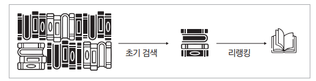  
  
먼저 희소 검색 혹은 밀집 검색과 같은 초기 검색 알고리즘을 사용한다. 이는 마치 도서관에서 책의 제목, 저자 이름 또는 주제와 관련된 키워드로 빠르게 
관련 서가를 찾아가는 것과 같다.  
  
예를 들어 '주식 시장 투자 전략'이라는 주제로 검색한다면 희소 검색은 '주식', '투자', '전략' 등의 키워드가 포함된 책들을 신속하게 찾아낸다. 만약 
밀집 검색을 사용한다면 '증권 분석 방법', '금융 시장 예측 기법' 등 직접적인 키워드 매칭은 아니지만 의미적으로 관련된 책들이 발견된다. 이 과정은 속도는 
빠르지만 관련성이 떨어지는 책들(예: '주식 시장의 역사' 또는 '금융 시장 예측 기법')도 함께 선별될 수 있다. 결과적으로 초기 검색 단계에서는 다음과 같은 
책들이 선별되어 다음 단계인 리랭킹 과정으로 전달된다.  
  
- 희소 검색 결과: '현대 주식 투자 전략', '주식 시장 역사'  
- 밀집 검색 결과: '증권 분석 방법', '금융 시장 예측 기법'  
  
선별된 책들에 대해 리랭커 모델을 적용한다. 트랜스포머 기반 리랭커는 단순한 키워드 매칭이나 의미적 유사성을 넘어 책의 전체적인 맥락과 잠재적 가치를 평가할 
수 있다. 따라서 리랭커의 작동 과정은 금융 전문가가 각 책의 내용을 직접 검토하고 주제와의 관련성을 더 깊이 평가하는 과정과 유사하다고 할 수 있다.  
  
리랭커는 각 책의 목차, 서문, 주요 내용을 바탕으로 '주식 시장 투자 전략'이라는 주제와의 관련성을 평가하며 내부적으로 관련성 점수를 산출한다. 여기서 산출된 
관련성 점수 값은 모델이 해당 문서가 주제와 관련 있을 가능성을 상대적으로 나타내는 척도다. 즉 관련성 점수 값이 높을수록 문서가 주제와 더 밀접한 관련이 
있다고 판단되며 값의 절대적 크기보다는 후보 문서들 간의 상대적 순위가 평가의 핵심이 된다. 예를 들어 다음과 같이 관련성 점수 값이 산출될 수 있다.  
  
- 현대 주식 투자 전략: 3.5  
- 주식 시장 역사: 1.2  
- 증권 분석 방법: 2.8  
- 금융 시장 예측 기법: 2.1  
  
이제 리랭커는 이 값들을 바탕으로 관련성 점수 값이 높은 순으로 책을 정렬하고 상위 2권을 선택하는 방식으로 최종 선별을 수행한다. 따라서 최종 결과는 다음과 
같이 두 권의 책만 남게 된다.  
  
- 현대 주식 투자 전략  
- 증권 분석 방법  
  
이러한 초기 검색과 리랭킹의 두 단계 접근 방식을 통해 방대한 양의 책 중에서 빠르게 관련있는 책들을 찾아내고 그중에서도 가장 적절한 책들을 정확하게 선별할 
수 있다. 이는 도서관 전체를 처음부터 꼼꼼히 살펴보는 것보다 훨씬 효율적이며 단순히 키워드 매칭에만 의존하는 것보다 정확한 결과를 제공한다.  
  
# **고성능 대규모 언어 모델 기반 리랭킹**  
고성능 대규모 언어 모델 기반 리랭킹은 Claude나 GPT와 같은 고성능 언어 모델을 활용하여 초기 검색 결과를 재평가하고 순위를 조정하는 방식이다. 구현 
방식은 다음과 같이 간단하다.  
  
1. 프롬프트 설계: 질의와 문서를 입력으로 받아 관련성을 평가하는 프롬프트를 작성한다.  
2. 대규모 언어 모델 호출: 각 문서에 대해 대규모 언어 모델을 호출하여 관련성 점수를 얻는다.  
3. 순위 재조정: 얻은 점수를 기반으로 문서들의 순위를 재조정한다.  
  
이 방식은 고성능의 대규모 언어 모델을 활용하기 떄문에 정확한 관련성 평가가 가능하다. 실제로 챗GPT-4를 리랭킹에 활용한 결과, TREC, BEIR과 같은 다양한 
평가 데이터셋에서 BM25, monoBERT, monoT5, Cohere Rerank 등의 기존 모델들을 크게 앞서는 성능을 내었다는 연구 결과도 있다. 또한 광범위하게 학습된 
대규모 언어모델 특성상 추가적은 학습 없이 다양한 도메인의 질의 유형에 쉽게 적용할 수 있다는 점도 이 방식의 장점으로 꼽을 수 있다.  
  
그리고 필요 시 관련성 평가 점수의 추론 근거를 제공할 수 있기 떄문에 설명 가능한 AI(Explainable AI) 측면에서 결과 해석이 용이하다는 특징이 있다. 반면 많은 
리소스를 필요로 하기 때문에 계산 비용이 높다는 점과 느린 처리 속도는 단점으로 꼽힌다.  
  
앞에서 다룬 밀집 검색 방식의 FAISS 리트리버에 리랭킹을 적용한다.  
  
RERANKER_LLM.ipynb(사전 준비)  
  
사용할 문서를 불러온 뒤 적절한 크기로 분할한다.  
  
이어서 임베딩을 위한 객체를 만든다. 임베딩에는 오픈AI의 text-embedding-3-large 모델을 사용한다. 다음으로 FAISS 데이터베이스를 생성하고 저장한다.  
  
저장된 FAISS DB를 다시 로드한다.  
  
이제 대규모 언어 모델 기반 리랭킹 알고리즘을 생성한다. 이 알고리즘은 GPT-4o 모델을 활용하여 초기 검색 결과의 관련성을 평가하고 재정렬한다. 먼저 다음 라이브러리와 
모듈을 임포트한다.  
  
- BaseModel, Field: Pydantic 라이브러리에서 제공하는 클래스로 데이터 모델을 정의하고 검증하는데 사용한다.  
- PromptTemplate: 랭체인에서 제공하는 클래스로 프롬프트 템플릿을 생성하는 데 사용한다.  
- Document: 랭체인의 문서 클래스로 텍스트 내용과 메타데이터를 포함하는 문서 객체를 표현한다.  
- List, Dict, Any, Tuple: 파이썬 typing 모듈에서 제공하는 타입 힌트로 함수의 입력과 출력 타입을 명시하는 데 사용한다.  
- ChatOpenAI: 렝체인에서 챗GPT 모델을 사용하기 위한 클래스다.  
- dedent: textwrap 모듈의 함수로 문자열의 들여쓰기를 제거하는 데 사용한다.  
- JsonOutputParser: 랭체인에서 제공하는 클래스로 대규모 언어 모델의 출력을 JSON 형식으로 파싱하는 데 사용한다.     
  
RERANKER_LLM.ipynb(함수 정의)  
  
RelevanceScore 클래스를 정의한다. 이 클래스는 Pydantic의 BaseModel을 상속받아 관련성 점수를 나타내는 데이터 모델읠 정의한다. Pydantic의 BaseModel은 
데이터 검증 및 직렬화를 자동으로 처리하여 입력 데이터가 올바른 형식과 타입(여기서는 실수)으로 유지되도록 보장한다. 이를 통해 대규모 언어 모델이 질문과 
문서의 연관성 점수를 실수로 표현할 수 있도록 한다.  
  
reranking_documents 함수는 사용자의 질문과 초기 검색 문서들을 입력받고 리랭킹이 수행된 문서 리스트를 반환하는 역할을 수행한다.  
  
먼저 JsonOutputParser를 사용하여 대규모 언어 모델의 출력을 RelevanceScore 객체로 파싱할 수 있도록 준비한다. 그다음 PromptTemplate을 이용해 
언어 모델에게 전달할 프롬프트를 정의한다. 이 프롬프트는 언어 모델에게 주어진 문서가 질문과 얼마나 관련이 있는지 1점부터 10점까지 점수로 평가하도록 요청한다.  
  
다음으로 프롬프트, 언어 모델, 파서를 연결하여 체인을 구성한다. 이 체인은 입력된 질문과 문서에 대해 관련성 점수를 계산한다. 이렇게 구성한 체인을 입력받은 
각 문서에 실행하여 점수를 얻는다. 이후 상위 n개의 문서만 선택하여 반환한다.  
  
이제 리랭킹 알고리즘을 적용한 문서 검색을 수행한다. 문서에서 매우 지엽적인 내용인 "2022년 영업손실"에 대한 문서를 찾은 뒤 리랭킹을 통해 관련 문서만 
남기는 작업을 수해한다.  
  
RERANKER_LLM.ipynb(문서 리랭킹)  
  
먼저 사용자의 질문(query)을 정의한다. 이후 similarity_search() 메서드를 사용해서 앞서 정의한 FAISS 벡터 DB를 기반으로 밀집 검색을 수행한다. 이때 
검색할 문서의 수는 4개로 지정한다(k=4). 이후 reranking_documents 함수에 사용자의 질문(query)과 초기 검색 결과(initial_docs)를 입력하여 리랭킹된 
문서 리스트(reranked_docs)를 반환하도록 한다.  
  
이제 사용자의 질문과 초기 검색 결과, 리랭킹된 문서 리스트를 각각 출력한다.  
  
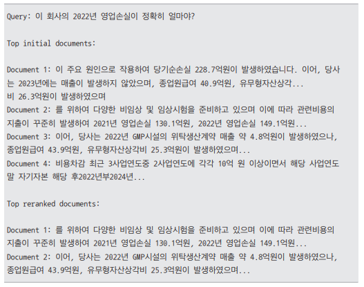  
  

문서 검색 결과 초기 4개의 문서 중 2022년 영업손실에 대해 정확히 언급한 2개의 문서만이 리랭킹을 거친 후 남게 되었음을 알 수 있다.  
  
이제 최종적으로 밀집 검색과 리랭킹을 거친 문서를 사용하여 답변까지 생성하는 시스템을 구현한다. 먼저 사용자 질문에 대한 검색과 리랭킹을 수행하는 CustomRetriever 
클래스를 정의한다.  
  
RERANKER_LLM.ipynb(리랭킹 RAG)  
  
CustomRetriever는 벡터 저장소에서 초기 검색 결과를 가져온 후 리랭킹을 통해 최종적으로 관련성이 높은 문서만 선별한다. vectorstore는 검색에 사용되는 
벡터 데이터베이스로 여기서는 FAISS를 사용할 수 있도록 설계되었다.  
  
get_relevant_documents() 메서드는 쿼리에 대한 초기 검색 결과를 가져온 후 reranking_documents 함수를 사용해 관련 문서를 재정렬한다. 최종적으로 
상위 num_docs개의 문서를 반환하며 기본값은 2다.  
  
이 구조를 통해 단순한 벡터 검색을 넘어 보다 정교한 리랭킹 기반 검색을 구현할 수 있다. 이제 CustomRetriever 인스턴스와 대규모 언어 모델 인스턴스를 
생성하고 이를 결합하여 최종적인 RetrievalAQ 체인을 구성한다.  
  
RERANKER_LLM.ipynb(체인 구성)  
  
최종적으로 QA 체인을 활용하여 실제 질문에 대한 답변을 생성한다. 예시 질문으로 "이 회사의 2022년 영업손실이 정확히 얼마야?"라고 질문한다.  
  
실행 결과 질문에 대해 정확히 149.1억원이라고 답변했다. 이는 리랭킹 과정을 거쳐 선별된 두 개의 관련 문서에서 정확한 정보를 추출한 결과로 LLM 기반 
리랭킹이 질문의 의도를 정확히 파악하고 관련성 높은 문서를 효과적으로 선별하였음을 알 수 있다.  
  
# **크로스 인코더 기반 리랭킹**  
크로스 인코더(cross-encoder) 기반 리랭킹은 주로 BERT와 같은 인코더 기반 언어 모델을 이용해 질문(query)와 문서(document)가 얼마나 잘 맞는지 
관련성을 평가하는 기법이다. 이 방법에서는 질문과 문서를 하나로 결합하여 입력하고 모델이 최종적으로 두 텍스트가 얼마나 관련 있는가를 단일 점수로 출력한다. 
구체적인 과정은 다음과 같다.  
  
1. 질문, 문서 입력: 질문과 문서를 "[CLS] 질문 [SEP] 문서 [SEP]" 형태로 결합한다. 여기서 [CLS]는 문장의 시작을 나타내는 토큰이고 [SEP]는 두 텍스트
(질문과 문서)를 구분하는 토큰이다.  
2. 인코딩: 이렇게 결합된 문자열을 BERT와 같은 인코더 모델에 넣어 각 토큰에 대한 임베딩 벡터를 구한다.  
3. [CLS] 토큰 임베딩 추출: 모델의 최종 층에서 나오는 [CLS] 토큰 임베딩은 전체 입력(질문과 문서)의 맥락을 요약한 정보를 담고 있다. 이 임베딩은 질문과 문서 
사이의 복잡한 의미적 관계를 반영한다.  
4. 점수 계산: [CLS] 임베딩을 간단한 선형 층(fully-connected layer)이나 다른 분류 층에 통과시켜 최종적으로 관련성(relevance) 점수를 산출한다.  
  
# **Bi-Encoder VS Cross-Encoder**  
Bi-Encoder는 앞에서 다룬 밀집 검색에서 사용되는 인코딩 방식으로 밀집 검색의 기반이 되는 벡터 표현을 생성한다. 질문 A와 문서 B가 있을 때 이들 각각을 
임베딩으로 동일한 크기의 벡터로 만든 뒤 코사인 유사도와 같은 유사도 분석을 통해 벡터 간의 거리를 수치화하는 방식이다. 두 벡터 간의 거리가 가깝다면 
질문과 문서가 의미적으로 유사하다고 판단하고 멀다면 관련성이 낮다고 판단한다.  
  
반면 Cross-Encoder는 질문 A와 문서 B가 있을 때 이들을 트랜스포머 기반의 인코더 모델에 함께 투입하여 둘 사이의 관련성을 나타내는 분류 점수(classification score)를 
직접 얻는다. 이 점수가 높을수록 관련성이 높다고 판단한다.  
  
  
  
두 인코더 방식은 속도와 정확도에서 뚜렷한 차이를 보인다.  
  
- Bi-Encoder: 각 문장을 독립적으로 인코딩한다. 예를 들어 100000개의 문장이 있다면 100000번의 인코딩 작업만 수행하면 된다.  
- Cross-Encoder: 모든 가능한 문장 쌍을 동시에 인코딩한다. 100000개의 문장이 있을 경우 조합에 의해 약 50억개(정확히 4999950000)의 쌍을 인코딩해야 한다.  
  
이러한 작동 방식의 차이로 인해 대규모 데이터셋에서 Cross-Encoder는 Bi-Encoder에 비해 현저히 느린 속도를 보인다. 특히 수천 개 이상의 문장을 비교해야 
하는 경우 Cross-Encoder의 속도 저하는 더욱 두드러진다.  
  
**정확도 비교**  
일반적으로 Cross-Encoder가 Bi-Encoder에 비해 더 높은 정확도를 보인다.  
  
- Bi-Encoder: 각 문장을 독립적으로 인코딩하기 때문에 두 문장 간의 관계를 직접적으로 고려하지 않는다. 따라서 빠른 처리가 가능하지만 문장 간의 복잡한 
상호작용을 포착하는 데 한계가 있을 수 있다.  
- Cross-Encoder: 두 문장을 동시에 인코딩하여 하나의 임베딩을 생성한다. 이 과정에서 두 문장 간의 관계를 직접적으로 모델링할 수 있어 더 정확한 
분류나 유사도 평가가 가능하다.  
  
결론적으로 속도 측면에서는 Bi-Encoder가 유리하고 정확도 측면에서는 Cross-Encoder가 유리하다. 따라서 작업의 성격과 요구사항에 따라 적절한 인코더를 
선택해야 한다.  
  
실제로는 두 방식을 조합하여 사용하기도 한다. 예를 들어 Bi-Encoder를 사용해 대규모 데이터셋에서 후보군을 빠르게 추려낸 후 Cross-Encoder를 사용해 
후보군을 재평가하여 최종 순위를 결정하는 방식이다. 이를 통해 빠른 속도와 높은 정확도 사이의 균형을 맞출 수 있다.  
  
크로스 인코더 기반 리랭킹에 쓰이는 모델은 앞에서 다른 고성능 언어 모델 기반 리랭커보다 낮은 사양의 모델을 사용하기 때문에 필요로 하는 계산 리소스 역시 
낮다. 또한 비교적 낮은 비용으로 특정 도메인의 데이터로 파인튜닝하여 리랭킹 성능을 더욱 향상시킬 수 있다는 장점이 있다.  
  
하지만 디코더 기반의 상용 언어 모델에 비해 사전 학습된 지식 범위가 제한적이라 추가적인 학습이 필요한 경우가 많으며 관련성 점수의 추론 과정을 자연어로 
제공하지 못한다는 점은 단점이 될 수 있다.  
  
랭체인을 이용해 코드로 구현한다. 앞선 고성능 llm 기반 리랭커 코드에서 리랭커 부분만 변환하면 된다.  
  
RERANKER_CROSS_ENCODER.ipynb(사전 준비)  
  
이제 크로스 인코더 기반 리랭킹 알고리즘을 생성한다. 이번 예제에서는 ms-marco-MiniLM-L-12-v2 모델을 사용한다. 해당 모델은 Microsoft가 개발한 
MS MARCOMicrosoft MAchine Reading COmprehension 데이터셋을 기반으로 학습되었다.  
  
필요한 라이브러리와 모듈들을 임포트한다. 핵심이 되는 CrossEncoder는 Sentence Transformers 라이브러리에서 제공하는 클래스로 크로스 인코더 모델을 
사용하여 텍스트 쌍의 관련성을 평가하는 데 사용된다.  
  
RERANKER_CROSS_ENCODER.ipynb(리랭킹 알고리즘)  
  
이제 리랭커 모델을 내려받기 위해 CrossEncoder 클래스의 인스턴스를 생성한다. 이때 인자로 cross-encoder/ms-marco-MiniLM-L-12-v2를 전달한다. 
이 문자열은 우리가 사용하고자 하는 특정 모델의 식별자다.  
  
이어서 벡터 저장소와 크로스 인코더를 결합한 검색 알고리즘을 구현한다.  
  
Retriever_with_cross_encoder 클래스를 정의한다. 이 클래스의 주요 역할은 벡터 기반 초기 검색과 크로스 인코더를 이용한 재순위화를 결합하여 더 정확한 
문서 검색을 수행하는것이다.  
  
클래스 내 get_relevant_document() 메서드를 구현한다. 이 메서드는 사용자의 질문을 입력받아 관련성 높은 문서 리스트를 반환하는 역할을 수행한다. 
동작 과정은 다음과 같다.  
  
1. 초기 검색: vectorstore를 사용하여 쿼리와 유사한 k개의 문서를 빠르게 검색한다. 이는 관련 문서의 후보군을 추려내는 역할을 한다.  
2. 문서-질문 쌍 준비: 검색된 각 문서와 질문을 쌍으로 만든다. 이는 크로스 인코더의 입력으로 사용된다.  
3. 관련성 점수 계산: 크로스 인코더 모델을 사용하여 각 질문-문서 쌍의 관련성 점수를 계산한다.  
4. 정렬: 계산된 점수를 기준으로 문서들을 내림차순으로 정렬한다. 이를 통해 가장 관련성 높은 문서가 상위에 오도록 한다.  
5. 최종 결과 반환: 정렬된 문서 중 상위 rerank_top_k개의 문서만 선택하여 최종 결과를 반환한다.  
  
리랭킹 알고리즘을 적용한 문서 검색을 수행한다.  
  
RERANKER_CROSS_ENCODER.ipynb(리랭킹 알고리즘 문서 검색)  
  
Retriever_with_cross_encoder 클래스의 인스턴스와 언어 모델의 인스턴스를 생성한다. 이 인스턴스는 벡터 저장소와 크로스 인코더를 결합한 검색을 
수행하는 데 사용된다. 인스턴스의 각 파라미터 설정은 다음과 같다.  
  
- vectorstore 설정: 앞서 생성한 vectordb를 벡터 저장소로 지정하여 초기 밀집 검색에 사용한다.  
- crossencoder 설정: 미리 준비된 crossencoder 모델을 지정하여 검색된 문서의 재순위화에 사용한다.  
- k 값 설정: 초기 밀집 검색에서 반환할 문서의 수를 4로 설정한다. 이는 벡터 검색을 통해 먼저 4개의 관련 문서를 추출함을 의미한다.  
- rerank_top_k 값 설정: 리랭킹 후 최종적으로 반환할 문서의 수를 2로 설정한다. 즉 크로스 인코더를 통해 재평가된 문서 중 가장 관련성 높은 2개만을 최종 
결과로 선택한다.  
  
다음으로 체인 인스턴스를 생성한다.  
  
이제 문서에서 매우 지엽적인 내용인 2022년 영업손실에 대해 질문한다. qa_chain에 해당 질문을 입력하면 문서를 찾은 뒤 리랭킹을 통해 관련성이 높은 
문서만을 남기는 작업을 수행한다. 해당 문서는 최종 답변에 사용된다.  
  
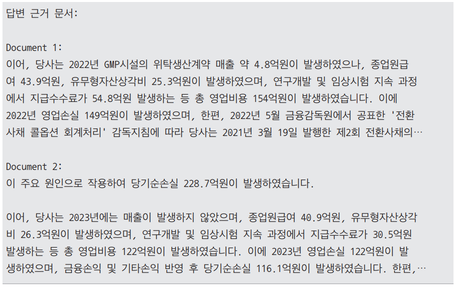  
  
리랭킹 수행 결과 반환된 2개의 문서 중 하나는 2022년 영업 손실에 대해 정확히 언급하고 있으나 다른 하나는 2023년 영업손실에 관한 내용을 포함하고 있다. 
이는 앞서 살펴본 고성능 언어 모델 기반 리랭킹 결과와는 차이를 보인다. 고성능 언어 모델 기반 방식에서는 두 문서 모두 2022년 영업손실을 정확하게 
언급하고 있었다.  
  
이러한 차이는 크로스 인코더 기반 리랭킹과 고성능 언어 모델 기반 리랭킹의 특성을 잘 보여준다. 크로스 인코더는 인코더 기반 트랜스포머를 사용하여 고성능 
대규모 언어 모델에 비해 빠른 처리 속도를 제공한다. 그러나 예제에서 볼 수 있듯이 정확도 측면에서는 고성능 언어 모델 기반 방식에 비해 다소 떨어질 수 
있다.  
  
따라서 리랭킹 방식을 선택할 때는 작업의 특성과 요구사항을 고려해야 한다. 빠른 처리가 필요한 경우 크로스 인코더 기반 방식이 유용할 수 있으며 높은 
정확도가 중요한 경우에는 고성능 언어 모델 기반 방식이 더 적합할 수 있다. 실제로 응용할 떄는 이 두 방식의 장단점을 고려하여 상황에 맞게 적절한 
방식을 선택하는 것이 중요하다.  
  
# **확장된 RAG 방법론**  
기존 RAG 워크플로우에 새로운 로직을 도입하여 RAG 시스템을 고도화시키는 전략에 대해 알아본다.  
  
# **Self-RAG 개요**  
앞에서 다룬 청킹 전략, 질의 변형, 검색 알고리즘, 리랭킹 등의 기술들로 RAG 시스템의 성능을 크게 향상시킬 수 있다. 그러나 전통적인 RAG 시스템은 여전히 
몇 가지 구조적 한계를 지니고 있다. 예를 들어 사용자 질문이 문서와 관련이 없더라도 정해진 수의 문서를 무작위로 검색하고 이를 프롬프트에 통합하는 
방식은 부정확하거나 부적절한 응답을 초래할 수 있다. 또한 검색된 정보를 효과적으로 활용하지 못하거나 원래 질문의 맥락을 잃어버리는 경우도 발생한다.  
  
이러한 문제를 해결하기 위해 등장한 방식이 바로 Self-RAG다. Self-RAG는 LLM이 기존 RAG의 각 단계에 직접 개입하여 보다 정교한 제어를 수행하는 
방식이다. LLM은 각 단계에서 특수 토큰을 출력하여 검색의 필요 여부를 판단하고 검색한 정보를 평가하며 최종 응답 생성 과정을 관리한다. 이를 통해 
LLM은 상황에 따라 필요한 경우에만 문서를 검색하고 정보를 스스로 검증한 뒤 보다 신뢰성 높은 답변을 생성할 수 있다.  
  
# **Self-RAG의 작동 방식**  
Self-RAG는 검색(retrieve), 생성(generate), 평가(critique)의 세 가지 주요 단계로 작동한다. 각 단계에서 LLM이 직접 특수 토큰을 출력하여 프로세스를 
제어하고 결과를 개선한다. 이를 통해 모델은 검색이 필요한지 여부를 스스로 판단하고 검색된 정보를 평가하며 답변을 생성하고 검토하는 전 과정을 주도한다.  
  
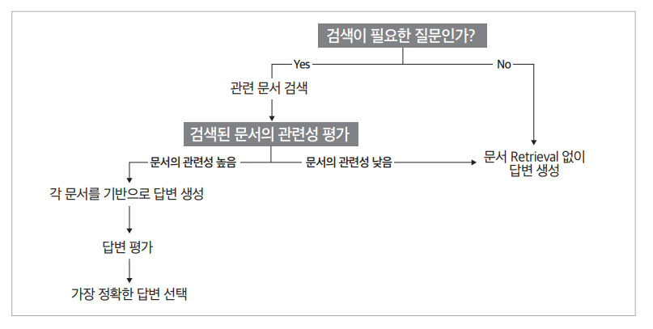  
  
예를 들어 사용자가 다음과 같은 질문을 한다고 가정한다.  
  
- 테슬라 주식이 향후 1년 동안 좋은 투자처가 될까요?  
  
이 질문에 대해 Self RAG는 다음과 같은 단계를 거쳐 최종 답변을 생성한다.  
  
1. 검색(Retrieve)  
Self-RAG는 먼저 사용자의 질문을 분석하여 외부 데이터 검색이 필요한지 결정한다. 이 과정에서 Retrieve 토큰을 활용한다. 모델의 판단 결과에 따라 
다음과 같은 토큰이 출력된다.  
  
- Retrieve=Yes: 외부 데이터가 필요한 경우  
- Retrieve=No: 외부 데이터가 필요하지 않은 경우  
  
현재 예시 질문은 테슬라 주식의 미래 전망에 대한 것으로 최신 정보와 경제적 지표를 포함해야 한다. 따라서 모델은 외부 데이터를 검색하는 것이 필요하다고 
판단할 가능성이 크다. 결과적으로 Self-RAG는 외부 데이터가 필요하다고 판단하여 Retrieve=Yes 토큰을 출력하고 테슬라의 최근 주가 동향, 분석가 평가, 
경제 보고서 등의 관련 정보를 검색한다.  
  
2. 생성(Generate)  
검색된 정보가 있으면 Self-RAG는 이를 바탕으로 답변을 생성한다. 이 단계는 다음과 같은 과정으로 진행된다.  

**(1)관련성 평가**  
Self-RAG는 먼저 검색된 문서의 관련성을 평가한다. 이 과정에서는 ISREL 토큰을 사용하여 관련성을 나타낸다.  
  
- ISREL=Relevant: 문서가 질문과 관련 있음  
- ISREL=Irrelevant: 문서가 질문과 관련 없음  
  
예를 들어 테슬라의 최근 재무 보고서는 Relevant로 무관한 일반 주식 시장 정보는 Irrelevant로 평가될 수 있다.  

**(2)답변 생성**  
관련 정보가 있는 문서가 존재한다면 이를 바탕으로 사용자 질문에 대한 답변을 생성한다. 이 과정에서 모델은 자신의 기존 지식과 검색된 정보를 결합하여 
포괄적인 답변을 만든다. 만약 관련 정보가 있는 문서가 없다면 검색된 문서를 무시하고 모델의 기존 지식을 활용하여 답변한다.  
  
3. 평가(Critique)  
마지막으로 Self-RAG는 생성된 답변의 유용성을 평가하고 필요 시 추가 검색이나 수정을 통해 답변을 개선한다. 이 단계는 다음과 같은 과정으로 진행된다.  

**(1)지원 평가**  
생성된 답변의 각 부분이 검색된 정보로 얼마나 뒷받침되는지 평가한다. 이때 ISSUP 토큰을 사용한다.  
  
- ISSUP=Fully supported: 완전히 지원됨  
- ISSUP=Partially supported: 부분적으로 지원됨
- ISSUP=No support: 지원 없음  

**(2)유용성 평가**  
Self-RAG는 생성된 답변이 사용자 질문에 얼마나 유용한지 평가한다. 이때 ISUSE 토큰을 사용한다.  
  
- ISUSE=1 (최저) ~ ISUSE=5(최고)  
  
# **최종 출력**  
모든 평가와 필요한 개선 과정을 거친 후 Self-RAG는 최종 답변을 출력한다. 이 답변에는 다음 요소가 포함될 수 있다.  
  
- 생성된 텍스트 답변  
- 사용된 정보 출처에 대한 인용  
- 각 세그먼트에 대한 평가 결과(ISREL, ISSUP, ISUSE 토큰 값)  
  
요약하자면 Self-RAG 방식의 핵심은 자체 반영(Self-Reflection)으로 볼 수 있다. Self-RAG는 기존 RAG 시스템과는 달리 각 단계마다 LLM이 자신의 
출력을 평가하고 스스로 개선하는 과정을 거친다. 이러한 자체 반영 과정을 통해 Self-RAG는 더 정확하고 유용한 답변을 생성할 수 있다.  
  
연구 결과에 따르면 Self-RAG의 7B 모델은 오픈 도메인 질의응답 태스크에서 챗GPT와 Llama2-chat을 비롯한 더 큰 규모의 모델들을 능가했다. 특히 
PopQA 데이터셋에서 Self-RAG(7B)는 54.9%의 정확도를 달성하여 챗GPT(29.3%)와 Llama2-chat 13B(20.0%)를 크게 앞섰다. 이는 Self-RAG의 자체 
반영 매커니즘이 가져오는 품질 향상을 보여주는 대표적인 사례다.  
  
# **Self-RAG 구현**  
랭체인을 이용하여 Self-RAG를 구현한다. Self-RAG는 원래 오픈소스 언어 모델을 직접 학습시켜야 하지만 그러려면 상당한 시간과 컴퓨팅 자원이 필요하다. 
따라서 여기서는 상용 언어 모델(챗GPT)을 사용하여 Self-RAG의 주요 메커니즘을 시뮬레이션하는 방식으로 개념을 실습한다. 이 방법은 Self-RAG의 핵심 
원리를 실험하고 이해하는 데 유용하지만 원래의 Self-RAG 시스템과는 성능 차이가 있을 수 있다.  
  
SELF_RAG.ipynb(사전 준비)  
  
Self-RAG 시스템의 첫 번째 단계는 사용자의 질문에 대해 외부 문서 검색이 필요한지 판단하는 것이다. 검색 필요 여부 판단을 위한 추론 파이프라인을 구축하는 
과정은 크게 세 가지 주요 컴포넌트로 구성된다.  
  
1. 출력 형식 클래스  
2. 프롬프트 템플릿  
3. 언어 모델  
  
이 세 가지를 결합해 retrieval_chain을 생성하며 사용자의 질문을 입력받아 검색 필요 여부를 판단하고 그 결과를 구조화된 형태로 반환한다.  
  
SELF_RAG.ipynb(검색 필요 여부 판단 추론 파이프라인)  
  
1. 출력 형식 클래스(RetrievalResponse): 이 클래스는 언어 모델의 출력 형식을 명시하는 역할을 하여 언어 모델이 해당 클래스의 내용에 맞게 출력하도록 
강제한다.  
2. 프롬프트 템플릿(retrieval_prompt): PromptTemplate을 사용하여 언어 모델에게 전달할 프롬프트를 정의한다.  
3. LLM 설정: ChatOpenAI 클래스를 사용하여 사용할 언어 모델을 설정한다. GPT-4o 모델을 사용하고 응답의 최대 길이는 2000으로 설정한다. 또한 temperature=0.2로 
낮은 값으로 설정하여 상대적으로 일관성 있는 응답을 유도한다.  
4. 최종적으로 이 세 컴포넌트를 결합하여 retrieval_chain을 생성한다.  
  
다음으로 Self-RAG의 관련성 평가 추론 과정을 위한 파이프라인을 생성한다. 이 단계는 문서 검색을 수행한 후 해당 문서와 질문의 연관성을 언어 모델을 활용해 
다시 한번 평가하는 과정이다. 즉 고성능 대규모 언어 모델 기반 리랭킹 과정과 유사하다 할 수 있다.  
  
이 부분 역시 앞서와 몇가지로 출력 형식 클래스(RelevanceResponse), 프롬프트 템플릿(relevance_prompt), 언어 모델 설정(llm), 세 가지 컴포넌트로 
구성된다. 이 세 컴포넌트를 결합해 relevance_chain을 만든다. 세부 코드의 구성은 검색 필요 여부를 판단하는 코드와 유사하다.  
  
SELF_RAG.ipynb(관련성 평가 추론 파이프라인)  
  
문서 검색과 관련성 평가까지 수행했다면 이제 검색 문서를 바탕으로 답변을 생성할 차례다. 이 과정에서도 앞서와 마찬가지로 출력 형식 클래스(GenerationResponse), 
프롬프트 템플릿(generation_prompt), 언어 모델 설정(llm) 부분의 세 가지 컴포넌트가 generation_chain이라는 하나의 체인을 구성한다.  
  
SELF_RAG.ipynb(검색 문서 답변 생성 파이프라인)  
  
Self-RAG 시스템에서는 답변을 생성한 뒤 해당 답변을 두 가지 측면(지원 평가, 유용성 평가)으로 평가하는 과정이 있다. 그중에서 지원 평가 파이프라인 
부분을 먼저 작성한다. 이 단계는 생성된 답변이 검색된 정보에 의해 얼마나 뒷받침되는지를 평가한다. support_chain을 지금까지와 마찬가지 방식으로 
구성한다.  
  
SELF_RAG.ipynb(지원 평가 파이프라인)  
  
다음으로 유용성 평가 부분이다. 이 단계는 생성된 답변이 사용자의 질문에 얼마나 유용한지를 평가한다. 이 과정 역시 동일한 방식을 거쳐 utility_chain이라는 
체인을 만든다.  
  
SELF_RAG.ipynb(유용성 평가 파이프라인)  
  
이렇게 Self-RAG의 각 단께별 파이프라인 구성을 완료했다. 이제 각 파이프라인을 연결하고 Self-RAG의 전체 프로세스를 구현한다.  
  
먼저 SelfRAG 클래스를 정의한다. 이 클래스는 앞서 구현한 각 단계의 체인들을 통합하여 Self-RAG 시스템의 전체 워크플로우를 관리한다. SelfRAG 클래스를 
구성하는 주요 메서드는 다음과 같다.  
  
1. init: 클래스 초기화  
2. determine_retrieval: 검색 필요 여부 결정  
3. retrieve_documents: 관련 문서 검색  
4. evaluate_relevance: 검색된 문서의 관련성 평가  
5. generate_response: 관련 컨텍스트로 응답 생성  
6. generate_without_retrieval: 검색 없이 응답 생성  
7. assess_and_evaluate: 생성된 응답의 지원 및 유용성 평가  
8. select_best_response: 최고의 응답 선택  
9. process_query: 전체 쿼리 처리 프로세스  
  
SELF_RAG.ipynb(SelfRAG 클래스)  
  
