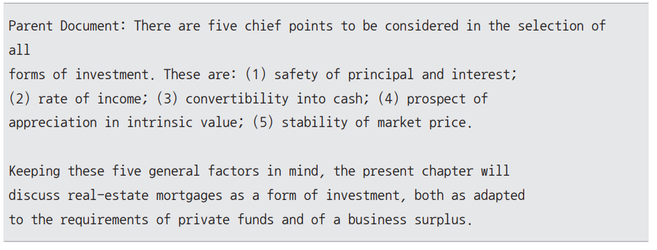
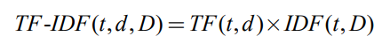

# **검색과 응답을 최적화하는 RAG 고도화 전략**  
RAG 고도화 전략 워크플로우  
  
  
RAG 고도화는 관련 문서를 가져오는 Retrieval 파트와 응답을 생성하는 Generation 파트 모두에서 달성할 수 있다. 각 파트에서 개선할 수 있는 주요 
구성요소와 고도화 방안을 정리하면 다음과 같다.  
  
  
  
# **청킹 전략**  
문서 전처리 단계는 RAG 시스템에서 실제 검색에 사용될 문서들을 가공하여 검색과 생성에 최적화된 형태로 변환하는 과정이다. 효과적인 전처리는 검색 정확도를 
높이고 관련성 있는 정보를 더 잘 추출할 수 있게 도우며 궁극적으로 생성 모델의 응답 품질을 향상시킨다.  
  
문서 전처리 과정은 여러 단계로 구성되는데 그중 핵심적인 단계가 청킹(chunking), 즉 문서 분할 단계다. 문서 분할은 긴 문서를 더 작고 관리하기 쉬운 
단위로 나누는 과정이다. 효과적인 분할 방식은 관련 정보의 검색 정확도를 높이고 문맥의 일관성을 유지하는 데 도움을 준다. 또한 생성 모델이 처리해야 할 
컨텍스트의 양을 적절히 조절하여 응답 생성의 품질을 향상시킬 수 있다.  
  
가장 기본적인 문서 분할 방식은 문자 수 기반 분할(character splitting)이다. 이는 문서를 단순히 일정 길이의 문자 단위로 나누는 방식으로 구현이 
간단하고 빠르다는 장점이 있다. 하지만 문장이나 단락의 의미적 구조를 고려하지 않기 때문에 중요한 정보가 분할되어 검색 시 누락되거나 문맥이 왜곡될 수 
있다는 단점이 있다. 또한 고정된 길이로 분할하기 때문에 문서의 내용과 구조에 따른 최적화가 어려울 수 있다.  
  
# **부모-자식 분할**  
재귀적 문자 텍스트 분할 방식은 문서의 구조를 고려하여 분할하지만 의미를 고려하지 않고 기계적인 규칙에 따라 텍스트를 분할하기 때문에 연관된 내용이 
분리되어 문맥이 끊길 수 있는 문제가 있다. 또한 의미 기반 분할은 텍스트의 의미적 연관성을 고려하여 일관된 청크를 생성하는 데 효과적이지만 긴 문서나 
복잡한 주제를 다룰 때 문서의 전체적인 구조와 계층적 관계를 완벽하게 포착하기에는 한계가 있다.  
  
이러한 한계를 보완하고 문서의 구조적 정보를 더 잘 활용하기 위한 방법으로 부모-자식 분할(parent-child chunking)이 있다. 이 방법은 문서의 계층 
구조를 유지하면서도 세부적인 내용까지 보존하는 접근 방식이다.  
  
부모-자식 분할은 다음과 같은 핵심 개념을 바탕으로 한다. 먼저 문서를 계층적으로 분할하여 원본 문서를 큰 단위의 부모 문서로 나누고 이를 다시 작은 단위의 
자식 문서로 세분화한다. 이렇게 원본 문서 -> 부모 문서 -> 자식 문서의 3단계 구조를 형성한다.  
  
부모-자식 분할 방식은 문서의 저장과 검색에서 이원화된 접근법을 채택한다. 문서의 계층구조를 유지하면서도 효율적인 검색을 위해 자식 문서는 벡터 
데이터베이스에 임베딩하여 저장하고 부모 문서는 별도의 저장소에 원본 형태로 보관한다. 실제 검색 시에는 자식 문서를 기반으로 유사성 검색을 수행하지만 
최종적으로 반환되는 문서는 해당 저장 문서가 속한 부모 문서다.  
  
이 방식에는 두 가지 주요 장점이 있다. 첫 번째는 정확한 정보 검색이다. 정보를 검색할 때는 자식 청크를 사용하기 때문에 질문과 관련성 높은 정보를 
정확히 찾아낼 수 있다. 자식 청크는 특정 주제에 집중된 정보를 담고 있어 질문과 정확한 매칭이 가능하다. 따라서 대량의 텍스트에서 특정 정보를 빠르고 정확하게 
식별하는 데 효과적이다.  
  
두 번째는 넓은 맥락을 제공한다는 점이다. 검색 결과로 부모 문서를 반환함으로써 특정 정보뿐만 아니라 그 정보가 포함된 전체적인 맥락까지 함께 파악할 
수 있다. 부모-자식 분할이 동작하는 자세한 과정은 다음과 같다.  
  
1. 문서 분할  
먼저 원본 문서를 비교적 큰 크기의 부모 문서로 나눈다. 이때 문서의 구조적 특성(예: 장, 절, 단락)을 고려할 수 있다. 이후 각 부모 문서를 더 작은 
자식 문서로 나눈다. 이 과정에서 의미 기반 분할같은 다른 기술을 활용할 수도 있다.  
2. 메타데이터 할당  
각 자식 문서에 해당 부모 문서의 식별자를 메타데이터로 할당한다. 이를 통해 자식 문서와 부모 문서 간의 관계를 추적할 수 있다.  
3. 임베딩 저장  
자식 문서는 벡터 데이터베이스에 저장된다. 이때 각 청크의 텍스트 내용은 임베딩되어 벡터 형태로 저장된다. 부모 문서는 별도의 문서 저장소에 저장된다.  
  
이후 부모-자식 청킹 처리된 문서의 검색 과정은 다음과 같다.  
  
1. 사용자 쿼리가 입력되면 먼저 벡터 데이터베이스에서 쿼리와 가장 유사한 자식 문서를 검색한다.  
2. 검색된 자식 문서의 메타데이터를 확인하여 해당하는 부모 문서의 식별자를 찾는다.  
3. 찾은 식별자를 이용해 문서 저장소에서 관련된 부모 문서를 반환한다.  
  
이러한 방식을 통해 부모-자식 분할은 문서의 구조적 정보를 유지하면서도 효율적인 검색과 정보 추출을 가능하게 한다. 중요한 점은 부모-자식 분할이 의미 
기반 분할을 대체하는 것이 아니라 두 기술을 상호 보완적으로 사용할 수 있다는 것이다. 예를 들어 부모 문서를 자식 문서로 나눌 때 의미 기반 분할을 적용하여 
의미적으로 더 일관된 청크를 만들 수도 있다.  
  
다음은 부모-자식 분할을 랭체인으로 구현한 코드다.  
  
PARENT_CHILD_CHUNKING.ipynb  
  
먼저 필요한 라이브러리를 설치하고 오픈AI API 키를 설정한다.  
  
이어서 분할에 사용할 문서를 로드한다. How_to_invest_money.txt 파일을 사용한다. 텍스트 파일을 사용하므로 랭체인의 TextLoader 클래스를 사용한다. 
TextLoader는 텍스트 파일을 읽어 랭체인의 Document 객체로 변환하는 클래스다.  
  
이제 부모-자식 분할에 필요한 설정을 진행한다. 재귀적 문자 텍스트 분할 방식을 활용하여 부모 문서와 자식 문서를 생성한다. 이때 부모 문서의 크기(chunk size)는 
1000으로 자식 문서의 크기는 200으로 설정함으로써 부모-자식 계층 구조를 만든다.  
  
자식 문서 저장소는 Chroma 벡터 데이터베이스를 사용한다. Chroma 인스턴스의 collection_name 파라미터를 "split_parents"로 지정하여 부모 문서와 
연관성을 유지한다.  
  
부모 문서 저장소는 InMemoryStore를 사용한다. 이는 RAM에 데이터를 저장하는 방식으로 빠른 읽기와 쓰기가 가능하지만 프로그램 종료 시 데이터가 
손실되는 특징이 있다. 이제 ParentDocumentRetriever 인스턴스를 생성한 후 실제 문서를 추가하여 문서가 성공적으로 분할되었는지 확인한다.  
  
먼저 자식 문서 저장소(vectorstore), 부모 문서 저장소(store), 자식 문서 텍스트 분할기(child_splitter), 부모 문서 텍스트 분할기(parent_splitter)를 
인자로 받는 ParentDocumentRetriever 인스턴스를 생성한다. 이를 통해 부모-자식 구조의 계층적 문서 검색을 수행할 수 있다.  
  
다음으로 retriever.add_documents(docs) 메서드를 사용하여 문서를 추가한다. 이 과정에서 문서들이 자동으로 부모와 자식 문서로 분할되어 각각의 저장소에 
저장된다. 이후 store.yield_keys()를 사용하여 저장된 모든 부모 문서의 키를 가져온 뒤 해당 키의 개수를 세어 총 부모 문서의 수를 확인하고 문서 분할과 
저장이 제대로 이루어졌는지 검증한다.  
  
코드 실행 결과로 총 219개의 부모 문서가 InMemoryStore에 저장되었다. 이는 원본 문서가 1000자 단위로 분할되어 219개의 부모 문서로 나뉘었다는 
뜻이다. 각 부모 문서는 다시 200자 단위의 자식 문서로 분할되어 Chroma 벡터 저장소에 저장되었다.  
  
이제 실제로 검색을 수행한다. "What are the types of investments?"라고 질의한다. 이 질문이 ParentDocumentRetriever를 거치면 관련된 부모 문서가 
검색된다. 첫 번쨰 연관 문서만 출력해서 확인해본다.  
  
  
  
이제 부모-자식 분할의 작동 방식을 이해하기 위해 벡터 저장소에서 직접 자식 문서를 검색해서 첫 번째 자식 문서를 출력해본다.  
  
  
  
결과를 보면 자식 문서와 부모 문서의 차이점과 각각의 역할을 명확히 확인할 수 있다. 자식 문서는 투자의 다섯 가지 주요 고려사항이라는 질문에 직접적으로 
관련된 핵심 정보를 간결하게 제공한다. 반면 부모 문서는 이 정보를 포함하면서도 해당 장에서 부동산 담보 대출에 대해 논의할 것이라는 추가적인 맥락을 
제공한다.  
  
자식 문서를 통해 질문과 가장 관련성 높은 정보를 정확히 찾아내고 부모 문서를 통해 해당 정보의 더 넓은 맥락을 제공한다. 이로써 사용자는 구체적인 정보와 
함께 정보가 속한 전체적인 맥락을 파악할 수 있게 된다.  
  
# **질의 변형**  
질의 변형(query reformation)은 사용자의 원래 질문을 보다 효과적인 검색 쿼리로 변환하는 과정을 말한다. 기본적인 RAG 검색 시스템에서는 사용자 질문을 
그대로 사용하여 관련 문서를 검색한다. 하지만 사용자의 질문이 모호하거나 검색에 최적화되지 않은 형태인 경우 연관 문서를 제대로 검색할 수 없어 RAG 
시스템의 정확도가 떨어지게 된다는 단점이 있다.  
  
질의 변형은 원래의 질문을 분석하고 재구성하여 이러한 문제를 해결한다. 이 과정에서 질문을 더 구체적이고 검색에 최적화된 형태로 재작성하거나 복잡한 질문을 
여러 개의 하위 질문으로 분해하는 등의 기법을 활용한다. 또한 질문의 의도를 파악하여 더 일반화된 쿼리로 확장하거나 가상의 문서를 생성하여 검색 성능을 
개선하는 방법도 포함된다.  
  
이러한 질의 변형 기법은 검색의 저확성과 포괄성을 크게 높여 결과적으로 RAG 시스템의 전반적인 성능 향상으로 이어진다.  
  
# **다중 질의 생성**  
다중 질의 생성(multiquery generation)은 질의 변형의 한 기법으로 사용자의 원래 질문을 바탕으로 여러 개의 다양한 쿼리를 생성하는 방법이다. 이 기법의 
동작 과정은 다음과 같다.  
  
1. 다중 질의 생성  
LLM을 사용하여 원래 질문을 다양한 관점으로 변형시킨 여러 개의 질문을 생성한다. 이 과정에서 동의어 사용, 질문 구조 변경, 특정 측면 강조 등 다양한 
기법을 적용할 수 있다.  
2. 병렬 검색  
생성된 각 쿼리를 사용하여 독립적으로 문서를 검색한다.  
3. 결과 통합  
각 쿼리로부터 얻은 검색 결과를 종합하여 중복을 제거하고 가장 관련성 높은 문서들을 선별한다.  
  
  
  
예를 들어 사용자가 주식 투자를 처음 시작하려면 어떻게 해야 하나요? 라고 질문했다면 이를 다양한 관점으로 변화시킨 다음 쿼리들을 생성할 수 있다.  
  
- 초보 투자자를 위한 투자 기초 지식은 무엇인가?  
- 주식 시장 분석을 위한 기본적인 재무제표 읽는 법은?  
- 주식 투자 시작 전 필요한 자금 관리 전략은?  
  
이들 각각의 쿼리는 독립적인 문서 검색에 사용되어 보다 다양한 문서를 수집하게 한다. 즉 기존의 단순한 주식 투자 시작 방법에 대한 정보뿐만 아니라 투자 지식, 
재무 분석, 자금 관리 방법 등 초보 투자자에게 필요한 다양한 측면의 정보를 포괄적으로 검색할 수 있게 되는 것이다. 이는 사용자가 명시적으로 언급하지 
않았지만 주식 투자를 시작하는 데 중요한 관련 주제들까지 탐색할 수 있어 더 풍부하고 실용적인 정보를 제공할 수 있다.  
  
다중 질의 생성 기법에는 여러 가지 이점이 있다. 먼저 다양한 쿼리를 생성함으로써 검색 범위를 넓혀 더 많은 관련 정보를 찾아낼 수 있다. 이는 단일 
쿼리로는 놓칠 수 있는 중요한 정보를 포착하는 데 도움이 된다. 또한 모호한 질문을 다룰 때 특히 유용하다. 하나의 질문을 여러 가지 방식으로 해석하고 
쿼리를 생성함으로써 사용자의 의도를 더 정확히 파악하고 그에 맞는 결과를 제공할 수 있기 떄문이다. 즉 사용자가 정확히 무엇을 원하는지 명확하지 않은 
상황에서도 적절한 답변을 찾는 데 도움을 줄 수 있다.  
  
다중 질의 생성을 랭체인으로 구현한 코드는 다음과 같다. 다중 질의 생성에는 오픈 AI의 gpt-4o 모델을 사용했다.  
  
MULTIQUERY_GENERATION.ipynb  
  
먼저 필요한 라이브러리를 설치하고 오픈AI API 키를 설정한다. 이어서 다중 질의 생성 과정을 모니터링하기 위한 로깅을 설정한다. 이를 활용하면 생성된 
질의들을 콘솔에서 확인할 수 있다.  
  
이제 벡터 데이터베이스와 문서 로더를 설정한 뒤 문서를 불러온다. 먼저 TextLoader를 사용하여 How_to_invest_money.txt 파일을 로드한 뒤 문서 데이터를 
가져온다.  
  
loaders 리스트에 하나의 TextLoader 인스턴스를 추가하고 docs라는 빈 리스트를 생성한다. 다음으로 for 문에서 loaders 리스트에 있는 로더의 load() 
메서드를 호출하여 각 로더로부터 로드된 문서 데이터를 docs 리스트에 추가한다.  
  
이제 문서를 분할하기 위한 텍스트 분할기와 벡터 저장소의 인스턴스를 생성한다. 먼저 RecursiveCharacterTextSplitter(재귀적 문서 분할기)를 사용해 문서를 
1000자 단위로 나누고 200자의 중복을 유지한다.  
  
문서를 분할한 후에는 OpenAIEmbeddings로 문서 데이터를 임베딩하여 Chroma 벡터 저장소에 저장하고 문서 검색과 유사도 계산에 활용한다.  
  
이제 다중 질의 생성을 위한 리트리버를 설정한다. 이 과정에서는 랭체인의 MultiQueryRetriever를 활용하여 사용자가 입력한 질의를 다양한 방식으로 변형하고 
더 정교한 검색 결과를 얻을 수 있도록 한다.  
  
먼저 대규모 언어 모델을 설정한다. 여기서는 오픈 AI의 GPT-4o 모델을 사용하는 ChatOpenAI를 사용한다. 모델 설정 시 temperature값을 0.2로 지정하여 
모델이 비교적 일관되고 신뢰성 있는 응답을 생성하도록 조정한다.  
  
다음으로 MultiQueryRetriever를 생성한다. 이 리트리버는 앞서 생성한 Chroma 벡터 저장소의 검색기를 기본 검색기로 사용하고 질의 변형을 위한 언어 
모델로 앞서 정의한 대규모 언어 모델(GPT-4o)을 사용한다.  
  
이제 실제 "주식 투자를 처름 시작하려면 어떻게 해야 하나요?"라는 질문을 한다. 질문은 invoke() 메서드를 통해 retriever 객체에 전달되어 세 가지 
다른 질문으로 변형된 뒤 벡터 데이터베이스에 전달된다.  
  
  
  
코드 실행 결과 "주식 투자를 처음 시작하려면 어떻게 해야 하나요?"라는 기존 질문이 다음과 같은 세 가지 다른 관점의 질문들로 변환되어 검색에 활용됨을 
알 수 있다.  
  
- 주식 투자 초보자가 알아야 할 기본 단계는 무엇인가요?  
- 주식 투자를 처음 시작할 때 필요한 준비 사항은 무엇인가요?  
- 주식 투자 입문자를 위한 가이드라인이나 조언이 있나요?  
  
이러한 각기 다른 세 가지 관점의 질문은 원본 질문보다 주식 투자 시작에 대한 더 폭넓은 정보를 검색할 수 있도록 한다. 이를 통해 사용자에게 더욱 풍부하고 
다양한 관점의 답변을 제공할 수 있다.  
  
이제 검색된 문서들을 활용하여 최종 답변을 생성하는 RetrievalQA 체인을 설정한다. 이 체인은 앞서 생성한 다중 질의 리트리버를 사용하여 문서를 검색하고 
검색된 문서들의 내용을 바탕으로 사용자의 질문에 대한 종합적인 답변을 생성한다.  
  
  
  
최종적으로 생성된 답변은 주식 투자를 시작하는 사람들이 알아야 할 기본 단계, 그리고 투자 전략에 대한 종합적인 정보를 제공함으로써 사용자의 질문에 더 
충실하게 응답할 수 있게 된다. 이는 RAG 시스템에서 다중 질의 전략이 검색과 응답 품질을 크게 향상시킬 수 있음을 보여준다.  
  
# **가상 문서 임베딩**  
가상 문서 임베딩(Hypothetical Document Embeddings, Hyde)은 기존 쿼리에 대해 가상의 문서를 만들어서 이를 기존 쿼리 대신 활용하는 방법이다. 즉 
질문을 이용하는 것이 아닌 질문에 대한 답변을 기반으로 문서를 찾는 방식이다. 이는 검색 대상 문서가 질문보다 답변과 더 높은 의미적 연관성을 가지는 경우가 
많다는 점을 활용한 접근이다.  
  
  
  
실제 금융 서적을 대상으로 한 RAG 시스템을 예로 든다. 편의상 이 시스템의 유사도 검색은 키워드를 활용한 bm25 방식을 활용한다고 가정한다.  
  
먼저 "주식시장의 변동성이 높을 떄 투자 전략은 무엇인가요?"와 같은 질문을 그대로 검색에 활용한다고 가정할 때 사용할 수 있는 키워드는 다음과 같다.  
  
주식 시장, 변동성, 투자 전략  
  
이 키워드들은 일반적이고 광범위해서 관련성이 낮은 많은 문서들과도 매칭될 수 있다. 반면 이 질문에 대한 답변인 주식 시장의 변동성이 높을 때는 분산 투자, 
달러 코스트 애버리징, 안전 자산 비중 확대 등의 전력을 고려할 수 있습니다. 에는 다음과 같은 구체적이고 전문적인 키워드들이 포함되어 있다.  
  
분산 투자, 달러 코스트 애버리징, 안전 자산, 비중 확대  
  
  
  
이러한 키워드들은 실제 금융 서적이나 투자 가이드에서 자주 등장하는 전문 용어다. 질문을 활용할 때와는 달리 이제는 질문과 연관된 구체적인 기법들인 
달러 코스트 애버리징, 리스크 관리, 장기적 수익 등의 내용과 연관된 문서들을 참조할 확률이 높아진다.  
  
이러한 원리로 가상 답변을 활용하는 방식은 문서 검색 시 더 정확하고 관련성 높은 문서를 찾을 가능성을 크게 높인다. HyDE 방식이 처음 소개된 논문에 따르면 
이 접근법은 기존 방식에 비해 웹 검색, 질문 답변, 사실 검증 등 11개의 다양한 쿼리 세트에서 우수한 성능을 보였다고 한다. 또한 구현이 쉬워서 기존의 
RAG 시스템과 쉽게 통합할 수 있어 실용성이 높다는 장점도 있다.  
  
하지만 단점도 있다. 가상의 답변(hypothetical document)을 생성하기 위해 대귬 언어 모델을 사용하기 때문에 추가적인 계산 비용이 발생한다. 이는 특히 
실시간 검색 시스템에서 중요한 문제가 될 수 있다. 또한 대규모 언어 모델의 추론 시간으로 인해 검색 지연 시간(latency)이 증가할 수 있어 빠른 응답이 
요구되는 애플리케이션에서는 제약이 될 수 있다.  
  
이제 랭체인을 활용하여 HyDE 방식을 코드로 구현해 본다.  
  
HYDE.ipynb(초기 세팅)  
  
필요한 라이브러리를 설치하고 오픈 AI API 키를 설정한다. 이어서 벡터 데이터베이스와 문서 로더를 설정한 뒤 문서를 불러온다.  
  
이어서 문서를 분할하기 위한 텍스트 분할기와 벡터 저장소의 인스턴스를 생성한다.  
  
이제 HyDE 방식을 구현하는 코드를 살펴본다. 이 코드에는 랭체인의 체인 개념이 사용된다. 랭체인의 체인 방식은 각각의 기능을 수행하는 여러 체인을 만들어서 
이들을 순차적으로 또는 병렬로 연결하는 방식이다. 이렇게 하면 각 체인은 자신의 역할에 집중하면서도 전체 파이프라인에서는 유기적으로 결합되어 효율적으로 
작업을 처리할 수 있다. 따라서 HyDE 방식의 순서에 따라 다음과 같은 여러 체인을 만든 후 이들을 결합하는 방식을 사용한다.  
  
- 가상 문서 생성 체인  
- 문서 검색 체인  
- 최종 응답 생성 체인  
  
먼저 가상 문서 생성 체인을 만든다. 가상 문서 생성 체인은 프롬프트 생성부터 결과 파싱까지의 과정을 연결한다. 각 단계는 다음과 같이 구성된다.  
  
1. 프롬프트: 시스템 메시지(system 변수)와 사용자 메시지(user 변수)를 정의한 뒤 이들을 ChatPromptTemplate에 넣어 대규모 언어 모델에 전달할 
프롬프트를 생성한다. 여기서 시스템 메시지는 AI의 역할을 정의하는 부분이고 사용자 메시지는 실제 사용자의 요청을 정의한다.  
  
2. 대규모 언어 모델: ChatOpenAI를 통해 GPT-4o 모델을 호출하여 입력된 프롬프트에 기반해 가상의 문서를 생성한다. 이때 temperature=0.2로 
설정하여 모델의 응답이 일관되고 구체적으로 생성되도록 조정한다.  
  
3. 파서: 대규모 언어 모델의 출력을 문자열 형태로 변환하기 위해 랭체인의 StrOutputParser를 사용한다. StrOutputParser는 대규모 언어 모델의 
출력을 그대로 문자열로 반환하며 이를 통해 개발자는 후속 처리 단계에서 원본 텍스트를 직접 활용할 수 있다.  

HYDE.ipynb(가상 문서 생성 체인)  
  
다음으로 문서 검색 체인을 생성한다. 이 체인에서는 가상의 답변을 기반으로 벡터 DB에서 가장 유사한 문서를 찾아서 반환하는 역할을 수행한다. 
추가로 반환한 문서에서 메타데이터는 제외하고 순수한 문서 내용만 추출하는 유틸리티 함수도 정의한다.  
  
마지막으로 최종 응답을 생성하는 체인을 생성한다. 이 체인은 앞선 문서 검색 체인에서 반환한 유사 문서를 기반으로 원본 질문에 대한 답변을 생성하는 
역할을 한다. 답변 생성 모델 역시 gpt-4o를 사용한다.  
  
이제 앞서 정의한 3개의 체인과 1개의 유틸리티 함수를 묶어서 전체 파이프라인을 생성하는 함수를 만든다.  
  
먼저 RunnableLambda 클래스를 임포트한 뒤 로깅을 위한 유틸리티 함수를 생성한다. 이 함수는 각 단계에서 입력과 출력을 프린트하는 함수로 이를 
통해 코드의 동작을 이해할 수 있다.  
  
이제 HyDE 방식을 구현하는 전체 파이프라인을 생성하는 메인 함수를 만든다. 이 함수는 앞서 정의한 각 체인을 순서대로 연결하여 하나의 실행 흐름을 
구성한다. 또한 각 단계에서 입력과 출력을 로깅하여 파이프라인의 동작을 추적하고 디버깅을 쉽게 할 수 있도록 했다.  
  
이 함수는 다소 복잡하므로 전체 함수의 구조를 먼저 살펴본 후, 각 컴포넌트에 대해 자세히 알아본다.  
  
1. 가상 문서 생성 단계: virtual_doc_step 함수  
가상 문서 생성 단계에서는 사용자의 질문을 바탕으로 가상의 문서를 생성한다. 이 단계는 HyDE 방식 파이프라인의 첫 번째 과정으로 이후 검색과 응답 
생성의 토대가 된다. 입력값은 사용자의 질문을 포함하는 딕셔너리다. 예를 들어 {"question": "주식 시장의 변동성이 높을 떄 투자 전략은 무엇인가요?"}
와 같은 형태이다.  
  
처리 과정에서는 virtual_doc_chain.invoke() 메서드를 호출하여 가상 문서를 생성한다. 이때 query에는 사용자의 질문이, chunk_size에는 생성할 
문서의 길이를 지정하는 값이 전달된다. 가상 문서가 생성되면 기존 입력값과 병합하여 반환한다. 이렇게 반환된 결과는 다음 단계인 문서 검색 과정으로 
넘어가게 된다.  
  
2. 문서 검색 단계: retrieval_step 함수  
문서 검색 단계에서는 앞서 생성한 가상 문서를 기반으로 벡터 데이터베이스에서 관련 문서를 검색한다. 입력값은 이전 단계에서 생성된 가상 문서와 원본 
질문이 포함된 딕셔너리 x다.  
  
처리는 retrieval_chain.invoke(x)를 호출하여 수행된다. 이 과정에서는 내부적으로 retriever.get_relevant_documents(x['virtual_doc'])으로 
가상 문서를 활용한 관련 문서 검색이 이루어진다. 검색이 완료되면 생성되는 retrived_docs를 기존 입력값 x와 병합하여 다음 단계로 전달한다.  
  
3. 컨텍스트 포매팅 단계: context_formatting_step 함수  
이 단계에서는 검색된 문서들을 하나의 문자열로 포매팅하여 최종 답변 생성에 사용할 컨텍스트를 만든다. 입력값은 앞 단계에서 검색된 문서들이 
포함된 딕셔너리 x다.  
  
처리 과정은 format_docs(x["retrieved_docs"]) 함수를 호출하여 진행된다. 이 함수는 검색된 문서들을 하나의 문자열로 결합하여 컨텍스트를 생성한다. 
생성된 컨텍스트는 기존 입력값과 병합하여 반환되며 최종 응답 생성을 위한 다음 단계로 전달된다.  
  
4. 최종 응답 생성 단계: final_response_step 함수  
최종 응답 생성 단계에서는 앞서 생성된 컨텍스트와 원본 질문을 바탕으로 최종 답변을 생성한다. 입력값은 컨텍스트와 원본 질문을 포함한 딕셔너리 x다. 
처리 과정에서는 final_response_chain.invoke(x)가 호출되며 이때 대규모 언어 모델이 동작하여 입력된 컨텍스트와 질문을 기반으로 최종 답변 
result를 생성하여 반환한다.  
  
5. 전체 파이프라인 구성  
앞서 정의한 모든 단계를 순차적으로 연결하여 전체 파이프라인을 완성하는 단계다. 각 단계의 함수를 RunnableLambda로 감싸 실행 가능한 객체로 만들고 
virtual_doc_step -> retrieval_step -> context_formatting_step -> final_response_step 순으로 연결한다.  
  
이렇게 연결된 파이프라인은 pipeline 객체로 완성되며 이후 사용자의 질문에 대해 답변을 생성하는 데 사용한다.  
  
이제 앞에서 만든 체인을 기반으로 실제 예시 질문을 입력하여 결과를 확인한다. 앞서 생성한 파이프라인 객체의 invoke() 메서드를 호출하여 답변을 생성한다. 
예시로 사용할 질문은 "주식 시장의 변동성이 높을 때 투자 전략은 무엇인가요?"이다.  
  
이때 pipeline.invoke()에 전달하는 입력값은 반드시 {"question": question} 형태의 딕셔너리여야 한다. 이는 파이프라인의 첫 단계인 virtual_doc_step 함수가 
question 키를 기준으로 동작하기 떄문이다.  
  
  
  
  
코드 실행 결과를 보면 HyDE 시스템이 단계별로 어떻게 작동하는지 명확히 알 수 있다. "주식 시장의 변동성이 높을 때 투자 전략은 무엇인가요?" 라는 예시 
질문에 대해 먼저 가상 답변인 '주식 시장의 변동성이 높을 때 투자 전략은 주로 보수적이거나...'가 생성됨을 알 수 있다. 그리고 이를 기반으로 관련 
문서들이 검색되었다.  
  
이후 검색된 문서들이 포매팅되어 컨텍스트로 사용되며 마지막으로 이 모든 정보를 종합하여 최종 응답인 '주식 시장의 변동성이 높을 때 투자자는 큰 가격 변동을 
이용하여 자신의 수익을 증가시키는 방법을 알아야 합니다. 투자자가...' 부분이 생성됨을 알 수 있다.  
  
# **검색 알고리즘**  
검색 알고리즘(search algorithm)은 사용자가 작성한 쿼리(질문)와 참조 문서 간의 관련성을 평가하고 가장 적합한 문서를 선별하는 로직을 뜻한다. 최적화된 
검색 알고리즘은 RAG 시스템의 성능과 정확도를 크게 높일 수 있으며 최종적으로 생성되는 응답 품질에도 큰 영향을 미친다.  
  
검색 알고리즘은 크게 두 가지로 분류할 수 있다. 첫 번째는 희소 검색(sparse retrieval) 알고리즘이고 두 번째는 밀집 검색(dense retrival) 알고리즘이다.  
  
희소 검색은 전통적인 키워드 기반 방식으로 대표적인 예로 BM25 알고리즘이 있다. 이 방식은 문서와 쿼리 간에 일치하는 키워드를 중심으로 관련성을 평가한다. 이 방법은 
구현이 간단하고 계산 효율성이 높지만 의미적 유사성을 포착하는 데 한계가 있을 수 있다.  
  
반면 밀집 검색은 쿼리와 문서를 고차원의 벡터 공간에 임베딩하여 비교하는 방식이다. 이 과정은 텍스트 임베딩 방식과 밀접하게 관련되어 있다. 밀집 검색에서는 
단어의 의미와 문맥을 포착할 수 있는 신경망 기반 임베딩 모델을 사용하여 쿼리와 문서를 벡터화하고 이들 간의 유사도를 계산하여 관련성을 판단한다. 덕분에 
키워드가 정확히 일치하지 않더라도 의미적으로 연관된 문서를 효율적으로 포착할 수 있다. 다만 이러한 방식은 계산 비용이 크고 대규모 데이터셋을 학습하는 
과정이 필요하기 때문에 리소스 측면에서 부담이 될 수 있다.  
  
# **희소 검색**  
희소 검색(sparse retrieval)은 문서와 쿼리를 희소 벡터 형태로 표현하여 검색을 수행하는 방법이다. 희소 벡터는 전체 어휘 사전의 크기에 해당하는 차원을 
가진 벡터로 해당 문서나 쿼리에 등장하는 단어에 해당하는 위치만 1(또는 다른 가중치 값)이고 나머지는 모두 0인 형태를 갖는다.  
  
- 희소 벡터의 예  
금융 뉴스 검색 시스템의 어휘 사전이 500000개의 단어로 구성되어 있다고 가정한다. 이때 다음과 같은 주식 관련 뉴스 헤드라인이 있다고 해보자.  
"Tesla stock surges as electric vehicle demand rises"  
  
이 헤드라인의 희소 벡터 표현을 다음과 같이 표현할 수 있다.  
  
  
이 벡터는 500000개의 요소를 가지며 그중 8개의 요소만 1이고 나머지는 499992개의 요소는 0이다. 이처럼 벡터의 대부분이 0으로 채워져 있어 듬성듬성하다는 
의미로 희소 벡터라고 부른다.  
  
이러한 희소 벡터를 기반으로 한 검색법은 본질적으로 키워드 기반 검색 방식이다. 문서나 쿼리에 특정 단어가 존재하는지 여부를 중심으로 관련성을 판단하며 
단어의 출현 빈도나 분포를 고려하여 문서의 관련성을 평가한다.  
  
구현이 비교적 간단하고 계산 효율성이 높아 대규모 문서 컬렉션에서도 빠른 검색이 가능하지만 단어의 의미적 관계나 문맥을 고려하지 못하는 한계도 존재한다. 
희소 검색의 단계별 동작 과정은 다음과 같다.  
  
1. 문서 변환: 각 단어의 출현 정보를 저장하는 방식으로 모든 문서를 희소 벡터 기반으로 변환한다. 한국어의 경우 이 과정에서 불용어 제거, 어간 추출 등의 
전처리가 수행될 수 있다.  
2. 질문 처리: 사용자의 질문을 동일한 방식으로 벡터화한다.  
3. 유사도 계산: 질문 벡터와 문서 벡터 간의 유사도를 계산한다. 흔히 사용하는 방법으로는 코사인 유사도가 있다.  
4. 랭킹: 계산된 유사도를 기반으로 문서들의 순위를 매긴다.  
5. 결과 반환: 가장 유사도가 높은 상위 N개의 문서를 결과로 반환한다.  
  
희소 검색의 대표적인 방식을 살펴보면 다음과 같다.  
  
## **TF-IDF(Term Frequency-Inverse Document Frequency)**  
TF-IDF는 단어의 중요도를 문서 내 빈도와 전체 문서에서 희소성을 고려하여 관련성을 계산하는 방식이다. 이 방법은 다음 두 요소를 곱하여 각 단어의 최종 TF-IDF 점수를 
계산한다.  
  
1. TF(Term Frequency)  
특정 단어가 한 문서에서 얼마나 자주 등장하는지를 나타낸다. 빈도가 높을수록 해당 문서의 주제와 관련이 깊다고 판단한다.  
  
계산 방법: TF(t, d) = (단어 t의 문서 d내 등장 횟수) / (문서 d의 총 단어 수)  
  
2. IDF(Inverse Document Frequency)  
특정 단어가 전체 문서 집합에서 얼마나 희귀한지를 나타낸다. 많은 문서에 공통적으로 나타나는 단어(예: 그리고, 그러나)는 덜 중요하다고 판단하여 가중치를 
낮춘다. 반면 소수의 문서에만 나타나는 희귀한 단어일수록 높은 가중치를 받는다.  
  
계산 방법: IDF(t, D) = log(전체 문서 수 / 단어 t가 등장하는 문서 수)  
  
3. TF-IDF 계산식  
  
  
여기서 t는 단어, d는 개별 문서, D는 전체 문서 집합을 의미한다.  
  
결론적으로 TF-IDF는 문서 내에서 자주 등장하면서도 전체 문서 집합에서는 비교적 드물게 나타나는 단어에 높은 점수를 부여한다. 이를 통해 개별 문서의 
특징을 잘 나타내는 핵심 단어를 식별할 수 있으며 불용어(stopwords)와 같이 빈번하지만 의미적으로 중요하지 않은 단어들의 영향을 줄일 수 있다는 장점이 
있다.  
  
하지만 TF-IDF에는 다음과 같은 몇 가지 한계가 있다.  
- 문서 길이 고려 부족: 긴 문서에서는 단어 빈도가 자연스럽게 높아질 수 있어 문서 길이에 따른 편향이 발생할 수 있는 문제점이 있다.  
- 단어 빈도의 선형적 증가: 단어 빈도가 증가함에 따라 TF 값이 계속 선형적으로 증가하여 과도하게 반복되는 단어에 지나치게 높은 가중치를 매기는 일이 발생한다.  
  
## **BM25(Best Matching 25)**  
이러한 TF-IDF의 한계점을 개선하기 위해 개발된 것이 BM25 알고리즘이다. BM25는 TF-IDF의 기본 아이디어를 유지하면서 문서 길이와 단어 빈도의 영향을 
보다 정교하게 조정하여 검색 정확도를 높였다.  
  
- 문서 길이 정규화: 문서의 길이를 고려하여 긴 문서에서 단어 빈도를 적절히 조정한다.  
- 단어 빈도의 포화 처리: 단어 빈도가 증가함에 따라 점수 증가율이 감소하도록 설계되어 과도한 반복이 결과에 미치는 영향을 제한한다.  
  
BM25의 유사도 계산식은 다음과 같다.  
  
  
  
- D: 문서  
- Q: 쿼리(여기서 쿼리는 사용자가 정보 검색 시스템에 전달하는 하나 이상의 키워드, 검색어 또는 문구를 말함)  
- f(q, D): 문서 D에서 쿼리 단어 q의 빈도 수  
- |D|: 문서의 길이  
- avgdl: 전체 문서 집합의 평균 문서 길이  
- k1, b: 알고리즘의 조정 매개변수(일반적으로 k1은 1.2-2.0, b는 0.75)  
  
TF-IDF와 마찬가지로 BM25에도 IDF가 계산식에 포함되어 있다. 하지만 이전과는 달리 계산식의 마지막 부분에 (1 - b + b * |D| / avgdl)을 추가하여 문서 
길이에 따른 편향을 줄이도록 만들었다. 또한 계산식의 (f(qi, D) * (k1 + 1)) / (f(qi, D) + k1 * (...)) 부분은 f(q1, D)가 증가함에 따라 점수 
증가율이 감소하는 형태가 되도록 한다. 이를 통해 단어 빈도가 높아졌을 때에도 점수가 지나치게 높아지지 않도록 조절한다.  
  
결과적으로 BM25는 TF-IDF의 기본 아이디어를 유지하면서도 문서 길이와 단어 빈도의 영향을 더 정교하게 조절하는 알고리즘이다. 이를 통해 더 균형 잡힌 
검색 결과를 제공하며 특히 다양한 길이의 문서가 포함된 컨텐츠에서 우수한 성능을 보인다. 이러한 특징 덕분에 BM25는 희소 벡터 기반 검색 시스템에서 기본 랭킹 
알고리즘으로 널리 사용되고 있다.  
  
## **형태소 전처리를 통한 BM25 성능 향상**  
한국어와 같은 교착어에서는 영어와 달리 동일한 의미의 단어도 매우 다양한 형태로 활용된다. 따라서 키워드 추출에 앞서 형태소 분석을 통해 전처리를 수행하는 
것이 검색 성능 향상에 큰 영향을 미친다. BM25 알고리즘의 성능을 향상시키는 형태소 전처리 기법은 다음과 같다.  
  
1. 기본적인 형태소 분석  
기본적인 형태소 분석은 문장을 최소 의미 단위인 형태소로 분리하고, 각 형태소에 품사 태그를 부여하는 과정이다. 예를 들어 다음과 같이 진행된다.  
  
- 입력: "먹었다"  
- 분석 결과: "먹/VV + 었/EP + 다/EF"  
  
이를 통해 동사 먹다(VV)의 기본형, 과거 시제 선어말어미 었(EP), 종결어미 다(EF)를 파악할 수 있다. 이렇게 문장의 구조와 각 요소의 문법적 기능을 
정확히 이해할 수 있으며 핵심 의미를 가진 형태소를 효과적으로 추출할 수 있다.  
  
2. 주요 품사 추출  
형태소 분석 후 명사(NNG, NNP), 동사(VV), 형용사(VA) 등 핵심 의미를 전달하는 품사만을 선택적으로 추출한다.  
  
- 입력: "아름다운 꽃이 피었습니다"  
- 추출 결과: "아름답/VA", "꽃/NNG", "피/VV"  
  
이를 통해 조사나 어미 등 검색에 큰 영향을 미치지 않는 요소를 제거하여 노이즈를 줄일 수 있다. 이렇게 핵심 키워드에 집중함으로써 검색 쿼리와 문서 간의 
매칭 정확도를 높일 수 있다.  
  
3. 복합 명사 처리  
한국어에서는 여러 명사가 결합하여 복합명사를 이루는 경우가 많다. 이러한 복합명사를 구성요소로 분리하여 처리하면 검색 성능을 향상시킬 수 있다.  
  
- 입력: "정보검색시스템"  
- 분리 결과: "정보/NNG + 검색/NNG + 시스템/NNG"  
  
복합명사를 분리함으로써 각 구성요소에 대한 개별 검색이 가능해지며 부분 일치 검색의 정확도를 높일 수 있다. 이렇게 하면 사용자 쿼리가 복합명사의 일부만 포함하더라도 
관련 문서를 효과적으로 찾아낼 수 있다.  
  
4. 어근 추출 및 표제어 처리  
동사와 형용사의 다양한 활용 형태를 기본형(표제형)으로 통일하여 처리한다.  
  
- "먹었습니다" -> "먹다"  
- "먹고 있다" -> "먹다"  
- "먹을 것이다" -> "먹다"  
  
이렇게 어근을 추출하면 단어의 일관성이 유지되어 검색 쿼리와 문서 내 단어의 매칭 확률이 높아진다. 이는 형태가 다른 동일한 의미의 단어들을 효과적으로 
연결해 준다.  
  
이러한 전처리 과정을 거치면 문서와 쿼리에서 실질적인 의미를 가진 키워드만을 추출할 수 있고 단어 형태가 달라도 동일한 의미로 처리할 수 있어 검색 
성능이 향상된다.  
  
특히 한국어와 같이 교착어 특성이 뚜렷한 언어에서는 이러한 전처리 과정을 거치는 것이 검색 정확도를 높이는 효과적인 방법이다. 그 결과 BM25 알고리즘에서도 
키워드 매칭의 품질이 크게 개선되어 사용자에게 더 관련도 높은 검색 결과를 제공할 수 있게 된다.  
  
