# **지식 그래프를 활용한 그래프 RAG**  
  
# **그래프 RAG 개요**  
그래프 RAG는 기존 RAG 시스템의 한계를 극복하기 위해 새롭게 개발된 모델로 지식 그래프(knowledge graph)를 활용하여 정보 간의 관계를 더 깊이 이해하고 
처리하는 방식이다. 기존 RAG가 문서를 검색하고 정보를 추출하는 데 집중했다면 그래프 RAG는 복잡한 데이터 간의 연결성을 파악하여 다층적인 질의응답이 가능하도록 
한다.  
  
# **기존 RAG 방식의 한계**  
기존의 RAG 방식에는 두 가지 주요 한계점이 있다.  
  
1. 정보 연결의 어려움  
기존 RAG는 질문에 답하기 위해 개별 문서에서 정보를 검색할 수 있지만 데이터 간의 관계를 분석하여 새로운 통찰을 제공하는 데 한계가 있다. 즉 정보 조각을 
연결하여 전체적인 의미를 도출하는 능력이 부족한다. 예를 들어 다음과 같은 질문이 주어졌다고 가정해 본다.  
  
질문: "이 문서의 주요 주제는 무엇인가요?"  
  
이 질문에 대해 기존 RAG 시스템에서는 나뉘어진 개별 문서에서 특정 소주제나 키워드를 검색할 수 있다. 기업의 사업보고서를 예시로 든다. 이 질문을 기존 
RAG 시스템에 입력한다면 한 문서에서 기업의 사업 영역에 대한 내용을 찾고 다른 문서에서 기업의 재무 상태에 대한 정보를 찾을 수 있을 것이다. 그러나 이러한 
정보들은 각각 개별적으로 제공될 뿐, 데이터셋 전체에서 이러한 정보들이 어떻게 연결되고 전반적인 패턴이 무엇인지에 대해서는 알지 못한다. 따라서 문서 주제와 
같이 전체 내용을 아우르는 영역을 파악하는 데는 한계가 있다.  
  
2. 대규모 데이터 이해의 한계  
기존 RAG 시스템은 데이터의 규모가 클수록 개념들을 전체적으로 파악하는 데 어려움을 겪는다. 다음 질문이 주어졌다고 가정한다.  
  
질문: "지난 10년간의 연간 보고서를 바탕으로 회사의 지속가능성 전략 변화를 설명해 주세요."  
  
질문에 대해 기존 RAG 시스템은 연간 보고서에서 관련 정보를 검색하여 개별 문서들을 얻을 수 있다. 하지만 이렇게 얻은 개별 문서는 각각 독립적으로 이루어져 
있으며 각 문서 안의 내용들이 다른 문서들과 어떻게 연결되는지 알 수 없다. 따라서 10년간의 연간 보고서라는 대규모 데이터셋에서 각 정보들이 어떻게 서로 
연결되고 그 속에서 지속 가능성 전략이 어떤 식으로 변화해왔는지 추적하는 데는 한계가 있다.  
  
이를 해결하기 위해 그래프 RAG가 제안되었다. 그래프 RAG는 전체 텍스트 코퍼스에 대한 질문에 답하기 위해 지식 그래프와 검색 증강 생성을 결합한 접근 방식이다. 
그래프 RAG는 지식 그래프를 활용해 개별 정보 조각들 간의 관계를 모델링함으로써 데이터셋 전체에서 연결성과 패턴을 파악할 수 있다. 또한 대규모 데이터셋의 
구조적 관계를 분석함으로써 시간 경과에 따른 변화나 전체적인 개념을 더 효과적으로 이해할 수 있다.  
  
# **지식 그래프란?**  
그래프는 네트워크 구조를 수학적으로 표현한 모델로 상호 연결된 요소들 간의 관계를 나타내는 구조이다. 여기서 네트워크란 우리 주변에서 흔히 볼 수 있는 
상호 연결된 시스템을 말한다.  
  
네트워크는 우리 일상 곳곳에 존재한다. 예를 들어 소셜 미디어 플랫폼은 거대한 소셜 네트워크다. 페이스북이나 인스타그램에서 사용자들은 서로 친구를 맺거나 
팔로우를 하며 관계를 맺는다. 이러한 관계들이 모여 하나의 큰 네트워크를 이룬다.  
  
또 다른 예로 교통 시스템을 들 수 있다. 도시들은 도로, 철도, 항공로 등으로 서로 연결되어 있다. 이 연결망은 사람과 물자가 이동할 수 있는 교통 네트워크를 
형성한다. 인터넷 역시 대표적인 네트워크으 예이다. 전 세계 컴퓨터와 서버들이 서로 연결되어 정보를 주고받는 거대한 시스템을 형성하고 있다.  
  
이러한 네트워크들의 공통점은 모두 개체와 그들 사이의 관계로 구성되어 있다는 점이다. 소셜 네트워크에서는 사람들이 개체이고 그들 사이의 친구 관계나 팔로우가 
연결 요소이다. 교통 네트워크에서는 도시가 개체이고 도로나 철도가 그 사이의 연결 역할을 한다. 인터넷에서는 컴퓨터나 서버가 개체이고 데이터 전송 경로가 
연결 요소로 작용한다.  
  
이러한 현실 세계의 네트워크 구조를 수학적으로 표현하고 분석하기 위해 그래프라는 모델을 사용한다. 그래프에서는 맥락에 따라 용어가 다양하게 사용된다. 
수학적 맥락에서는 주로 노드(정점)와 에지(간선)라는 용어를 사용하고 응용 분야에서는 개체와 관계로 표현하는 경향이 있다.  
  
특히 그래프는 단순한 연결 구조뿐만 아니라 방향성과 가중치도 표현할 수 있다. 예를 들어 SNS의 팔로우 관계처럼 한쪽에서 다른 쪽으로 향하는 단방향 연결을 
나타낼 수 있으며 교통 네트워크에서 도시 간 거리처럼 연결 강도나 관계의 중요도를 반영하는 가중치를 추가할 수도 있다.  
  
  
  
결론적으로 그래프는 네트워크를 수학적으로 표현하는 모델이며 이를 통해 복잡한 시스템의 구조를 명확하게 모델링하고 다양한 수학적 기법을 적용하여 네트워크의 
특성을 분석할 수 있다.  
  
이러한 기본적인 그래프 개념을 바탕으로 지식 그래프는 정보와 지식을 보다 구조화하여 표현하는 특별한 형태의 그래프로 확장되었다. 일반적인 그래프는 노드와 
에지로 구성되며 개체와 그들 간의 연결 구조를 나타내는 데 초점을 둔다. 하지만 개체와 관계의 구체적인 의미나 속성에 중점을 두지 않고 단순히 연결되어 있다는 
사실만을 표현하는 경우가 많다.  
  
반면 지식 그래프는 개체와 관계에 의미론적 정보를 부여하여 각 요소가 무엇을 의미하는지 명확하게 정의한다. 즉 지식 그래프는 일반 그래프의 기본 구조 위에 
의미를 추가하여 정보를 보다 체계적으로 구조화하여 표현한다.  
  
예를 들어 아이폰과 애플이라는 두 개체를 생각했을때 일반 그래프에서는 이 둘이 단순히 연결선으로 이어져 있을 뿐이지만 지식 그래프에서는 이 연결을 개발
이라는 명확한 관계로 정의함으로써 아이폰이 애플에 의해 개발되었다는 사실을 구체적으로 나타낸다.  
  
  
  
또한 지식 그래프는 개체와 관계에 풍부한 속성을 부여할 수 있다는 점에서 일반 그래프와 차별화된다. 예를 들어 아이폰이라는 개체에는 다음과 같은 세부 속성을 
추가할 수 있다.  
  
- 출시일: 2007년, 운영체제: iOS, 디스플레이 크기: 3.5인치  
  
마찬가지로 개발이라는 관계 자체에도 다음과 같은 속성을 추가할 수 있다.  
  
- 개발 시기: 2007년 이후, 개발 조건: iOS 기반  
  
이러한 구조 덕분에 지식 그래프는 일반 그래프와 다른 여러 특징을 지니고 있다.  
  
첫 번째 특징은 단순한 관계 연결을 넘어 복잡한 정보 구조를 표현할 수 있다는 점이다. 일반 그래프에서는 아이폰과 애플이라는 두 개체가 단순히 연결되어 있을 
뿐이고 이때 연결선은 그저 이 둘이 어떤 관계를 맺고 있다는 사실만을 나타낸다. 반면 지식 그래프에서는 이 연결선을 개발이라는 명확한 의미를 지닌 관계로 정의함으로써 
아이폰이라는 제품이 애플이라는 기업에 의해 개발되었다는 사실을 기계가 해석하고 활용할 수 있게 한다.  
  
더 나아가 지식 그래프는 이러한 관계를 더욱 풍부하게 표현할 수 있다. 예를 들어 아이폰 개체에는 출시일, 운영체제, 디스플레이 크기 등 세부 속성을 명확하게 
정의할 수 있고 애플 개체에는 기업의 위치, 설립일, 창업자 정보, 주력 제품군 등 다양한 속성을 추가할 수 있다. 또한 개발 관계 자체에도 특정 시기, 특정 조건 
등을 기술하여 단수히 애플이 아이폰을 개발했다는 사실 이상으로 풍부한 정보를 담아낼 수 있다.  
  
지식 그래프의 두 번째 특징은 추론 능력이다. 그래프 구조를 활용하면 직접적으로 연결되지 않은 정보 사이의 관계를 유추할 수 있다. 예를 들어 다음 두 정보가 
있다고 가정한다.  
  
1. 스티브 잡스가 애플을 공동 창업했다.  
2. 스티브 잡스가 픽사의 CEO였다.  
  
이 정보들을 개별적인 문장으로만 볼 때는 애플과 픽사 사이의 연관성을 바로 파악하기 어렵다. 하지만 이를 다음과 같은 지식 그래프로 표현하면 스티브 잡스라는 
노드를 중심으로 애플과 픽사가 연결되어 있음을 한눈에 확인할 수 있다.  
  
  
  
이를 통해 애플과 픽사 사이의 간접적인 연관성을 쉽게 추론할 수 있으며 두 회사의 혁신적인 기업 문화나 창의적인 제품 개발 철학과 같은 공통점을 예측해볼 수도 있다. 
이렇듯 그래프 구조는 개별적인 정보 조각들을 연결하여 보다 심층적인 관계를 도출하는 데 유용하다.  
  
세 번째 특징은 효율적인 정보 검색이다. 지식 그래프를 활용하면 노드와 에지의 연결을 따라 관련 정보를 빠르게 탐색하고 검색할 수 있다. 예를 들어 애플 
노드에서 시작하여 이웃 노드인 맥북, 스티브 잡스, 팀 쿡 등의 정보를 쉽게 검색할 수 있다.  
  
  
  
이러한 특성 덕분에 지식 그래프는 검색 엔진이나 추천 시스템, 질의응답 시스템 등 다양한 분야에서 활용되고 있다. 그래프 RAG는 이러한 지식 그래프의 장점을 
적극적으로 활용하여 단순한 키워드 매칭을 넘어 정보 간의 복잡한 관계를 고려한 고급 추론과 답변 생성을 수행한다.  
  
# **그래프 RAG의 동작 과정**  
그래프 RAG 시스템은 먼저 그래프 DB를 구축한 후 사용자 질의에 따라 적절한 검색 방식을 적용하여 답변을 생성하는 방식으로 작동한다. 그래프 DB 구축 단계에서는 
문서 내용을 분석하여 지식 그래프를 생성한다. 이 과정에서 문서에서 추출한 주요 개념(개체)과 그들 사이의 관계를 구조화하여 그래프 형태로 저장한다. 이후 
구축된 그래프 내에서 서로 밀접하게 연관된 개체들의 그룹(커뮤니티)을 찾아내고 각 커뮤니티의 핵심 내용을 요약하여 정보 검색을 보다 효율적으로 수행할 수 있도록 
한다.  
  
사용자가 질문을 하면 그래프 RAG 시스템은 질문의 성격에 따라 두 가지 검색 방식을 사용한다.  
  
- 로컬 검색(Local Search): 질문과 직접적으로 관련된 개체들을 식별하고 이들과 연관된 정보를 수집하여 상세한 답변을 제공한다. 이는 특정 주제나 세부 정보를 
묻는 질문에 효과적이다.  
- 글로벌 검색(Global Search): 문서 전체를 아우르는 포괄적인 질문에 대해 여러 커뮤니티 요약을 활용하여 종합적인 답변을 제공한다.  
  
이러한 과정을 통해 그래프 RAG는 방대한 문서 컬렉션에서도 관련성 높은 정보를 빠르게 찾아내고 이를 바탕으로 포괄적이고 정확한 답변을 생성할 수 있다.  
  
# **그래프 DB 구축**  
# **그래프 DB 구축 과정**  
  
  
그래프 DB 구축 과정은 4개의 주요 단계로 이루어져 있다.  
  
첫 번째 단계는 문서 분할이다. 이 과정에서는 대용량 문서를 효율적으로 처리하기 위해 문서를 적절한 크기로 나눈다.  
  
두 번째 단계는 지식 그래프 구축이다. 이 과정에서는 앞서 분할한 문서에서 핵심 개체(entity)와 그들 간의 관계(relationship)를 추출하여 기본적인 그래프 
구조를 만든다.  
  
세 번째 단계는 그래프 증강이다. 이 과정에서는 그래프 임베딩을 생성하여 기존에 생성된 그래프를 더욱 풍부하게 만들며 지식 그래프 내에서 서로 밀접하게 연관된 
엔티티들을 그룹화한 커뮤니티를 구축하여 실제 활용이 가능한 수준으로 발전시킨다.  
  
마지막 단계는 커뮤니티 요약이다. 이 과정에서는 구축된 커뮤니티의 핵심 정보를 요약한다. 이를 통해 최종적으로 검색과 활용이 용이한 형태의 지식 네트워크를 
완성한다.  
  
이러한 단계적 접근을 통해 단순한 텍스트 문서들이 구조화되고 의미적으로 연결된 지식 네트워크로 변환된다.  
  
1. 문서 분할  
사용할 문서를 적절한 크기로 분할한다. 이때 분할할 문서의 길이 설정이 중요하다. 문서의 길이가 길수록 LLM을 호출하는 횟수가 적어지므로 지식 그래프 구축에 
드는 비용이 줄어든다는 장점이 있지만 지식 그래프 품질이 낮아질 수 있다는 단점이 있다. 반대로 문서의 길이가 짧아질수록 지식 그래프 구축에 드는 비용은 
늘어나지만 지식 그래프 품질은 높아질 수 있다.  
  
연구에 따르면 문서를 600토큰 수준으로 분할했을 때, 2400토큰 수준으로 분할한 경우보다 감지되는 엔티티(개체)의 수가 거의 두 배 가까이 증가한 것으로 
나타났다. 따라서 문서 분할의 경우 가용 가능한 자원과 원하는 수준의 품질을 고려하여 적절히 선택하는 것이 중요하다.  
  
2. 지식 그래프 구축  
다음으로 지식 그래프를 생성하고 DB를 구축한다. 지식 그래프는 소스 문서에서 엔티티(개체)와 그들 사이의 관계를 추출하여 만들 수 있다. 이 단계에서 
만든 지식 그래프는 이후 사용할 모든 정보의 기반이 된다. 즉 지식 그래프를 구축함으로써 단순한 텍스트 집합을 구조화된 데이터로 변환하여 이후 단계에서 
효과적으로 활용할 수 있게 된다.  
  
이러한 지식 그래프 구축을 최근에는 대규모 언어 모델(LLM)을 활용하여 구축하는 방법을 많이 사용하지만 이전에는 다른 방법을 사용했다. LLM 이전에 사용된 
기술들에는 규칙 기반 접근법과 기계학습 모델 등이 있다.  
  
## **규칙 기반 접근법**  
규칙 기반 접근법은 미리 정의된 언어 규칙이나 패턴을 사용하여 엔티티와 관계를 기계적으로 추출하는 방식이다. 예를 들어 다음 패턴을 사용한다고 가정한다.  
  
- 패턴: "회사명 + '은/는' + 제품명 + '을/를 출시했다'"  
  
만약 문서 내에 삼성전자는 갤럭시 S23을 출시했다 라는 문장이 있다면 이 패턴이 동작하여 삼성전자와 갤럭시 S23이 엔티티로 추출되며 출시가 이들을 잇는 관계로 
추출될 것이다. 규칙 기반 접근법은 구현이 간단하고 명확하지만 패턴이 정확히 일치하는 경우에만 작동하기 떄문에 확장성과 유연성이 부족하며 다양한 표현과 
복잡한 문장을 처리하는 데는 한계가 있다.  
  
## **기계학습 모델**  
기계학습 기반 모델은 머신러닝 알고리즘을 활용하여 엔티티 및 관계 추출 모델을 만든다. 사용되는 알고리즘에는 대표적으로 SVM(서포트 벡터 머신), CRF(조건부 랜덤 필드)
가 있다. 앞선 규칙 기반 접근법과 비교할 때 실제 단어의 특징이나 문맥 정보에 기반하여 정보를 추출하기 때문에 좀 더 높은 정확도를 보인다는 장점이 있다. 또한 
모델 구동에 많은 자원이 필요하지 않다는 점도 장점이다.  
  
하지만 전통적인 머신러닝 알고리즘은 최신 딥러닝 모델에 비해 복잡한 언어 표현을 처리하는 능력이 제한적이다. 최근에는 기술 발전에 따라 지식 그래프 구축에 
딥러닝 모델과 대규모 언어 모델을 많이 사용하고 있다.  
  
# **딥러닝 모델**  
딥러닝 기반 모델은 RNN, 트랜스포머와 같은 신경망 구조를 사용하여 엔티티와 관계를 추출한다. BERT와 같은 Transformer 기반 모델은 1억 개 이상의 파라미터를 
사용한다. 이러한 대규모 파라미터를 통해 더 깊은 문맥 이해와 복잡한 언어 패턴 감지가 가능하다. 다만 성능이 좋은 만큼 모델을 학습하는 데 대규모 데이터셋이 
필요하고 모델 구동에 많은 자원이 필요하다는 단점이 있다.  
  
# **대규모 언어 모델 활용**  
최근에는 GPT와 같은 대규모 언어 모델을 활용하여 지식 그래프를 구축하는 방식이 널리 사용되고 있다. 디코더 기반의 트랜스포머 아키텍처를 사용하는 
LLM은 방대한 데이터로 사전 학습되어 뛰어난 문맥 이해력과 복잡한 문장 처리 능력을 제공한다.  
  
GPT와 같은 언어 모델을 활용하면 높은 정확도로 엔티티와 관계를 추출할 수 있다. 다만 대규모 언어 모델은 매우 높은 컴퓨팅 자원이 필요하거나 API 
비용이 발생하며 처리 속도가 상대적으로 느리다는 단점이 있다. 또한 출력 결과의 일관성이 완벽하지는 않아 후처리가 필요할 수도 있다.  
  
테슬라와 관련된 정보에서 엔티티와 관계를 추출하는 예를 살펴보자.  
  
- 입력 문장: "테슬라는 일론 머스크가 설립한 회사로, 전기차와 태양광 패널을 생산합니다."  
  
LLM을 활용하여 이 문장을 처리하려면 명확한 지침을 포함한 프롬프트가 필요하다.  
  
- 입력 프롬프트: "다음 글에서 인티티의 이름, 타입, 설명을 추출하고, 엔티티들 간의 관계를 설명과 함께 1-10 사이의 강도로 표시하세요."  
  
이 프롬프트를 통해 얻을 수 있는 출력 예는 다음과 같다.  
  
  
  
이러한 기술의 발전으로 지식 그래프 구축의 효율성과 정확성이 크게 향상되었다. 특히 LLM을 활용하면 복잡한 문서에서도 높은 품질의 지식 그래프를 손쉽게 
구축할 수 있다. 복잡한 전처리 과정이나 별도의 머신러닝 모델 학습 없이도 신속하게 구축할 수 있어 그래프 RAG 시스템을 보다 효율적으로 구현할 수 있다.  
  
# **Gleaning을 통한 지식 그래프 품질 향상**  
Gleaning(이삭 줍기)은 LLM의 출력을 반복적으로 검증하고 보완하여 정보 추출의 품질을 높이는 기법이다. 이는 마치 농작물을 수확한 후 남은 이삭이 있는지 
확인 후에 다시 한번 수집하는 것과 같이, 초기 정보 추출 이후에 누락되거나 불완전한 정보를 보완하는 과정을 의미한다.  
  
마이크로소프트의 연구에 따르면 Gleaning을 통한 엔티티 참조 추출 성능이 반복 횟수에 비례하여 개선되는 것으로 나타났다. 특히 청크 크기가 600일 때 
가장 효과적이었으며 Gleaning을 세 번 수행했을 때 초기 추출 대비 약 세 배 많은 엔티티(~28000개)를 탐지할 수 있었다. 또한 더 큰 청크 사이즈(1200, 2400)을 
사용하더라도 Gleaning을 통해 성능 저하를 상당 부분 보완할 수 있음이 확인되었다.  
  
  
  
대규모 언어 모델을 활용해 지식 그래프를 구축할 때 Gleaning은 다음과 같은 방식으로 적용한다.  
  
1. 초기 추출 단계에서 얻은 엔티티와 관계 정보를 LLM에 다시 입력하여 누락된 정보가 있는지 검토한다.  
2. 누락된 정보가 식별되면 언어 모델에 추가 질의를 수행하여 보완 정보를 수집한다.  
3. 이 과정을 일정 기준에 도달할 때까지 여러 차례 반복 수행하여 점진적으로 정보의 완전성을 높인다.  
  
이러한 Gleaning 기법을 통해 LLM의 능력을 최대한 활용하면서도 보다 정확하고 신뢰성 높은 지식 그래프를 구축할 수 있다.  
  
이제 그래프 RAG에서 지식 그래프를 생성하는 구체적인 과정을 살펴본다. 지식 그래프 생성은 크게 다음의 네 가지 단계로 진행된다.  
  
## 1. 엔티티와 관계 추출  
분할된 각 문서에서 엔티티와 관계를 추출한다. 각 엔티티는 이름(name), 타입(type), 설명(description)을 함께 추출하고, 각 관계는 출발점(source), 
도착점(target), 설명(description), 강도(intensity)를 포함하여 추출한다.  
  
- 예: "일론 머스크는 2022년에 수백억 달러로 트위터를 인수했습니다."  
  
이 문장에서 추출되는 정보는 다음과 같다.  
  
  
  
## 2. 그래프 통합  
두 번쨰 단계에서는 추출된 엔티티와 관계들을 통합하여 중복을 제거한다. 동일한 이름과 타입을 가진 엔티티들은 하나로 통합되며 각각의 각각의 설명은 
배열 형태로 저장된다. 동일한 출발점과 도착점을 가진 관계들도 통합되어 여러 설명이 배열로 저장된다. 예를 들어 앞선 단계에서 다음과 같은 엔티티가 추출되었다고 
가정한다.  
  
  
  
이들의 통합 후 형태는 다음과 같다.  
  
  
  
## 3. 설명 요약  
세 번째 단계에서는 LLM을 활용하여 통합된 설명들을 하나의 간결한 설명으로 요약한다. 이를 통해 각 엔티티와 관계는 핵심 정보를 포함한 하나의 설명을 
갖게 된다. 앞선 단계에서 ㅌㅇ합한 트위터의 설명을 요약하면 다음과 같은 형태가 된다.  
  
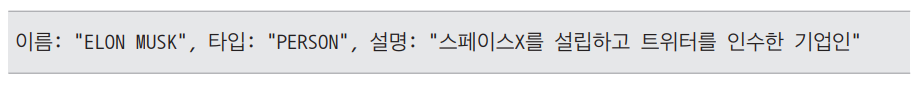  
  
## 4. 주장 추출 (선택사항)  
마지막으로 선택적으로 주장(claim)을 추출할 수 있다. 텍스트에서 사실적 진술을 추출하고 상태(state)와 시간(time) 정보를 포함하여 구조화된 주장으로 
변환한다. 다음과 같은 텍스트에서 주장을 추출하는 예를 알아본다.  
  
- "2022년 10월 27일, 일론 머스크가 440억 달러를 들여 트위터를 인수했습니다. 이후 그는 2023년 7월에 트위터의 브랜드를 X로 변경했다고 발표했습니다."  
  
추출된 첫 번쨰 주장은 다음과 같다.  
  
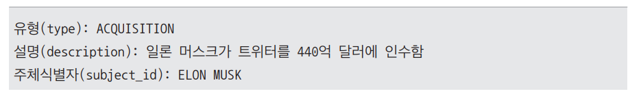  
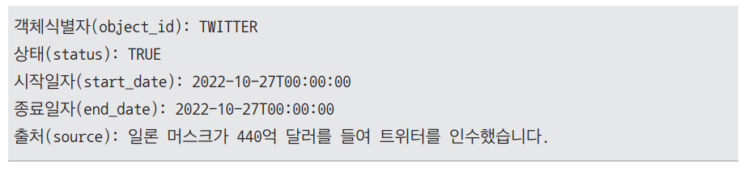  
  
추출된 두 번째 주장은 다음과 같다.  
  
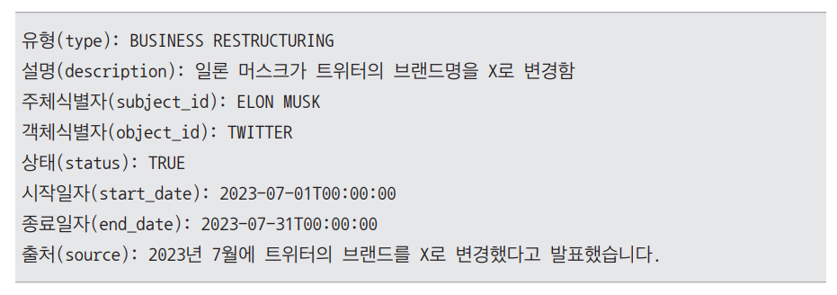  
  
이렇게 추출된 주장들은 공변량(covariate) 형태로 저장되어 시간적 맥락이나 상태 변화를 반영한 고도화된 질의응답에 활용된다.  
  
## **그래프 증강**  
앞선 단계들을 통해 지식 그래프를 생성했다면 이제는 그래프 구조를 더욱 풍부하게 만들고 의미 있게 활용하기 위한 증강 과정이 필요하다. 그래프 증강은 
크게 두 가지 방향으로 진행된다. 커뮤니티 탐지(community detection)와 그래프 임베딩(graph embedding)이다.  
  
## 1. 커뮤니티 탐지  
커뮤니티란 지식 그래프 내에서 서로 밀접하게 연관된 엔티티들의 그룹을 의미한다. 방대한 지식 그래프에서 모든 엔티티를 일일이 살피는 것은 비효율적이므로 
엔티티를 그룹화하여 커뮤니티로 분류하면 정보 검색과 처리가 훨씬 효율적이다. 이를 통해 유사한 주제나 특성을 가진 엔티티를 한데 묶어 이후의 검색 과정에서 
관련성 높은 정보를 빠르게 찾아낼 수 있다.  
  
예를 들어 지식 그래프에서 '애플', '아이폰', '맥북' 등의 엔티티는 '애플 제품' 커뮤니티로, '구글', '안드로이드', '픽셀' 등은 '구글 제품' 커뮤니티로 
그룹화할 수 있다. 이렇게 형성된 커뮤니티는 지식 그래프의 구조를 단순화하고 관련성 높은 정보 검색을 신속하게 수행할 수 있도록 돕는다.  
  
그래프 RAG 시스템은 커뮤니티 구조를 활용하여 사용자 질문에 대한 답변을 생성할 때 관련된 커뮤니티의 요약 정보나 핵심 내용을 참고하여 더욱 풍부하고 
정확한 답변을 제공한다. 이러한 커뮤니티 구조를 통해 대규모 지식 그래프에서도 효율적으로 관련 정보를 추출하며 사용자의 질문에 효과적으로 답변할 
수 있게 된다.  
  
지식 그래프에서 커뮤니티를 탐지하는 데는 다양한 그래프 이론 알고리즘이 사용된다. 많은 알고리즘들이 있으나 여기서는 대표적으로 로우벤 알고리즘과 레이든 
알고리즘을 알아본다.  
  
## **로우벤 알고리즘**  
로우벤 알고리즘(Louvain algorithm)은 복잡한 관계망에서 서로 밀접하게 연결된 노드(개체)들을 그룹으로 묶는 방식이다. 이 알고리즘은 그룹 내 연결 
밀도를 나타내느 지표인 모듈성이라는 개념을 사용한다. 여기서 모듈성이 높다는 것은 그룹 안의 멤버들끼리 많이 연결되어 있고 다른 그룹과는 적게 연결되어 있다는 
뜻이다. 바로 이 모듈성을 계산하여 커뮤니티를 나누는 방식이 로우벤 알고리즘의 핵심이다.  
  
구체적인 작동 방식은 다음과 같다.  
  
1. 초기화 단계: 모든 노드가 각자 하나의 그룹(커뮤니티)으로 분배된다.  
2. 그룹화 및 모듈성 계산: 각 노드를 이웃 노드들의 그룹으로 이동시켜 보며 모듈성 변화를 계산한다. 이때 모듈성이 가장 많이 증가하는 그룹으로 해당 
노드를 이동시킨다. 모듈성 증가가 없으면 현재 그룹에 그대로 둔다.  
3. 반복 및 병합: 2번 과정을 모든 노드에 대해 반복한다. 더 이상 개선이 없으면 형성된 그룹들을 하나의 노드로 간주하고 네트워크를 재구성한다. 재구성된 
네트워크에 대해 다시 2번 과정을 반복해서 수행한다.  
4. 종료: 전체 네트워크의 모듈성이 더 이상 증가하지 않을 때 알고리즘을 종료한다.  
  
이 방법을 통해 알고리즘은 자동으로 내부적으로는 밀접하게 연결되어 있지만 외부와는 상대적으로 덜 연결된 최적의 그룹 구조를 찾아낸다. 로우벤 알고리즘의 
장점은 계산 효율성과 간단한 구현이다. 대규모 네트워크에서도 빠른 속도로 커뮤니티를 탐지할 수 있으며 알고리즘 구조가 단순하여 구현이 용이하다는 것이 큰 
장점이다.  
  
단점으로는 결과의 불안정성과 모듈성 함수의 한계가 있다. 초기 설정이나 노드의 처리 순서에 따라 결과가 달라질 수 있으므로 불안정한 결과가 도출될 
수 있다. 또한 모듈성 함수가 항상 최적의 커뮤니티 구조를 반영하는 것은 아니다. 예를 들어 모듈성 함수를 이용하면 실제로는 존재하지 않는 커뮤니티 구조를 
찾아내기도 한다.  
  
## **레이든 알고리즘**  
레이든 알고리즘(Leiden algorithm)은 2018년에 소개된 로우벤 알고리즘의 개선 버전이다. 기존 로우벤 알고리즘은 커뮤니티를 탐지할 때 때때로 서로 연결되지 
않은 노드들이 같은 커뮤니티로 묶이는 문제가 있다. 레이든 알고리즘은 이런 문제를 해결하기 위해 노드를 다른 커뮤니티로 이동할 때 이동 후에도 커뮤니티가 
항상 서로 연결된 상태를 유지하도록 설계되었다. 이를 통해 로우벤 알고리즘에서 발생할 수 있었던 비연결 커뮤니티 문제를 해결하고 연결된 커뮤니티를 
형성하여 탐지의 정확성을 높였다.  
  
또한 커뮤니티 병합 전에 정제 단계를 추가하여 각 커뮤니티 내에서 모듈성을 최적화하고 하위 커뮤니티를 탐지함으로써 더 세밀한 커뮤니티 구조를 형성한다. 
이 과정에서 잘못 할당된 노드들을 재배치하여 커뮤니티의 품질을 향상시킨다.  
  
이러한 개선 덕분에 레이든 알고리즘은 대규모 네트워크에서 뛰어난 성능을 발휘하며 안정적이고 정확한 커뮤니티 탐지를 제공한다. 특히 연결된 커뮤니티를 
보장하는 설계는 네트워크 분석에서 신뢰도를 높이는 중요한 요소로 작용한다.  
  
하지만 한계 또한 존재한다. 모듈성 함수 자체의 한계(예: 해상도 한계)가 완전히 해결되지는 않았으며 정제 단계 등으로 인해 개별 반복에서 계산량이 증가할 
수 있다는 점은 단점으로 꼽힌다. 물론 레이든 알고리즘은 더 적은 반복으로 더 나은 결과를 얻을 수 있어 전반적으로는 로우벤 알고리즘보다 효율적인 경우가 
많다.  
  
이러한 커뮤니티 탐지 기법들에 더해 마이크로소프트의 그래프 RAG에서는 계층적 커뮤니티 구조를 도입했다. 계층 구조를 도입함으로써 데이터의 추상화 
수준을 조절하여 다양한 사용자 요구에 대응할 수 있게 되었다.  
  
구체적으로는 레이든 알고리즘을 사용하여 3단계(Level 0-2)의 계층적 커뮤니티를 생성한다. 이 커뮤니티 구조의 핵심은 상위 레벨(Root Level)에서 
하위 레벨(High Level)로 갈수록 더 세부적인 주제와 정보를 포함한다는 점이다.  
  
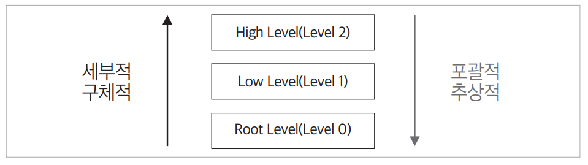  
  
계층별 커뮤니티 탐지를 통해 얻을 수 있는 장점은 첫 번째로 정보의 효율적 조직화를 들 수 있다. 커뮤니티를 계층 구조로 나눔으로써 각 레벨에서 적절한 
수준의 상세 정보를 제공할 수 있다. 이는 사용자가 요구하는 정보의 깊이에 따라 적절한 레벨의 커뮤니티를 선택하여 맞춤형 답변을 제공할 수 있음을 의미한다.  
  
두 번째는 대규모 언어 모델의 토큰 제한 관리다. 대규모 지식 그래프에서 모든 정보를 한꺼번에 처리하면 토큰 제한에 걸릴 수 있다. 이때 계층 구조를 
활용하면 질문의 범위에 맞는 레벨의 정보만 선택적으로 활용할 수 있으므로 토큰 사용을 최적화할 수 있다는 장점이 있다.  
  
테슬라 관련 뉴스 데이터를 예로 살펴본다.  
  
- Level 0: 전기차 산업과 같은 광범위한 주제의 커뮤니티가 형성된다.  
- Level 1: "Tesla", "SpaceX", "Twitter(X)"등 주요 기업별로 커뮤니티가 나뉜다.  
- Level 2: 각 기업의 제품 라인업, 주요 인물, 주요 사건 등 세부 정보를 포함하는 커뮤니티가 만들어진다.  
  
이러한 계층 구조의 활용 방식은 다음과 같다.  
  
- 광범위한 질문: '테슬라의 전반적인 현황'에는 Level 1의 요약 정보를 사용하여 전체적인 맥락을 제공한다.  
- 구체적인 질문: '테슬라의 신규 공장 건설 현황'에는 Level 2의 상세 정보를 활용하여 심도 있는 답변을 제공한다.  
  
이를 통해 시스템은 질문의 범위와 깊이에 따라 가장 적절한 레벨의 정보를 선택적으로 활용하여 효율적이면서도 정확한 답변을 제공할 수 있다.  
  
# **그래프 임베딩**  
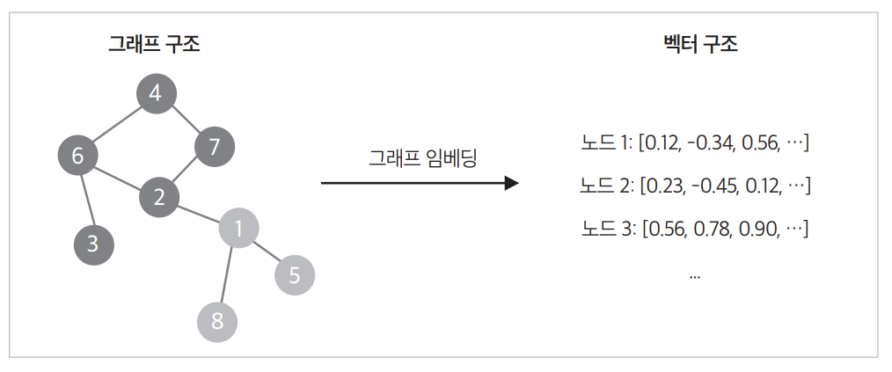  
  
커뮤니티 탐지를 통해 그래프의 세부 구조까지 파악했다면 그다음 단계는 이 그래프를 벡터 형태로 변환하여 활용하는 과정, 즉 그래프 임베딩(graph embedding)이다. 
그래프 임베딩을 통해 그래프의 구조적 특성과 노드 간의 관계를 정량적 수치(벡터)로 변환하여 이후 단계에서 그래프 구조의 시각화 등 다양한 수치 기반 
작업을 수행할 수 있다.  
  
일반적인 그래프 임베딩 방법은 다음과 같이 분류할 수 있다.  
  
- 행렬 분해 기반 방법: 그래프의 인접 행렬이나 라플라시안 행렬 등을 분해하여 노드의 임베딩을 얻는다. 대표적인 예로는 Laplacian Eigenmaps가 있다.  
- 확률적 방법: 랜덤워크나 확률 모델을 활용하여 노드 간의 유사성을 추정한다. DeepWalk와 Node2vec이 이에 해당한다.  
- 딥러닝 기반 방법: 그래프 신경망(GNN)을 이용하여 그래프 구조를 학습한다. GCN(Graph Convolutional Network), GAT(Graph Attention Network) 등이 
이에 해당한다.  
  
이 중에서도 Node2vec은 랜덤워크(random walk)기반의 임베딩 기법으로 그래프의 구조적 다양성을 효과적으로 포착할 수 있는 방법이다. 특히 수만 개 이상의 
노드와 에지를 가진 대규모 문서 그래프에서 지역적/전역적 구조를 모두 고려해야 하는 그래프 RAG의 특성을 잘 반영할 수 있다. 이러한 특성 떄문에 
마이크로소프트의 그래프 RAG에서도 Node2vec을 채택했다.  
  
## **Node2vec**  
Node2vec의 핵심 아이디어는 다음과 같다.  
  
1. 비슷한 컨텍스트를 가진 노드는 비슷한 임베딩을 갖는다.  
2. 각 노드의 컨텍스트는 랜덤워크를 통해 수집된 이웃 노드의 집합으로 정의된다.  
  
그래프에서 노드의 정성적인 특성을 정량적인 수치로 변환하려면 각 노드의 특징을 대표하는 값이 필요하다. 예를 들어 자연어 처리에서 단어의 의미를 주변 단어들로부터 
파악하듯이 그래프에서도 노드의 의미를 나타내는 값을 정의해야 한다. Node2vec에서는 이 값으로 컨텍스트를 활용한다.  
  
컨텍스트란 특정 노드와 연관된 이웃 노드들의 집합을 의미한다. 이는 해당 노드가 그래프 내에서 어떤 역할을 하는지, 어떤 노드들과 연결되어 있는지를 
나타내어 노드의 특성을 파악하는 데 유용하다.  
  
Node2vec은 이러한 컨텍스트를 생성하기 위해 확률적 랜덤워크 방식을 사용한다. 랜덤워크는 그래프에서 임의의 경로를 따라 이동하며 노드들을 방문하는 과정이다. 
이때 다음 노드를 선택할 확률은 p와 q라는 하이퍼파리미터에 의해 조정된다. 이를 통해 각 노드의 주변 환경을 탐색하고 노드 간의 관계를 자연스럽게 
수집할 수 있다.  
  
즉 Node2vec은 노드 주변을 무작위로 걸어 다니며(랜덤 워크) 해당 노드와 자주 함께 등장하는 이웃 노드들을 컨텍스트로 삼아 노드의 특징을 추출하는 
방법이다. 이때 p와 q를 통해 탐색의 경향(깊이 있는 탐색 VS 폭넓은 탐색)을 조절하여 그래프 구조를 균형 있게 반영한다.  
  
## **Node2vec의 p와 q 파라미터 역할**  
- p (Return Parameter): 이전 노드로 돌아갈 확률을 제어한다.  
p값이 클수록 이전 노드로 돌아갈 확률이 낮아져 새로운 경로를 탐색하게 되며 작을수록 이전 노드로 돌아갈 확률이 높아진다. 예를 들어 p = 0.5일 경우 
새 경로를 탐색할 확률보다 이전 노드로 돌아갈 확률이 높아진다.  
  
- q (In-out Parameter): 탐색의 폭과 깊이를 결정한다.  
q가 1보다 크면 너비 우선 탐색(BFS)에 가까워져 주변 이웃 노드들을 폭넓게 탐색하며 1보다 작으면 깊이 우선 탐색(DFS)에 가까워져 이전 노드에서 더 멀리 
떨어진 노드들을 방문할 가능성이 높아진다. 예를 들어 q = 2일 경우 BFS에 가까운 탐색을 유도하며 주변 이웃 노드들을 더 많이 방문한다.  
  
다음 단계로 랜덤워크를 통해 생성된 컨텍스트를 정량적인 벡터로 표현한다. 이때 벡터로 표현하는 데는 단어 임베딩 기법이 그대로 적용된다. 즉 랜덤워크로 만든 
노드 시퀀스를 마치 한 문장 안의 단어들로 보고 특정 노드(단어) 주변에 어떤 노드(단어)들이 자주 함께 등장하는지를 파악하는 원리다. 이를 통해 각 노드를 
수치 벡터 형태로 나타낼 수 있는데 이 벡터는 해당 노드의 역할과 특성을 반영하며 비슷한 역할을 하는 노드들은 벡터 공간에서도 서로 가깝게 위치하게 된다.  
  
다시 말해 랜덤워크로 얻은 컨텍스트를 단어-문장 관계처럼 이해하고 이를 수치 벡터로 변환하여 노드의 특성을 정량적으로 표현하는 것이다. 이렇게 얻은 
그래프 임베딩은 그래프 구조 시각화 등 다양한 작업에 쓰인다.  
  
# **커뮤니티 요약**  
앞선 단계들을 통해 엔티티와 관계로 구성된그래프, 엔티티들의 집합으로 이루어진 커뮤니티, 그리고 노드들의 임베딩을 구했다. 이제 구축된 커뮤니티의 요약문을 
작성할 차례다. 커뮤니티 요약문은 각 커뮤니티의 핵심 엔티티와 관계, 주요 주장을 압축하여 포함하고 있다. 이러한 요약문은 추후 검색 과정에서 사용자 
질의와 관련된 정보를 더욱 효과적으로 찾아내는 데 핵심적인 역할을 한다. 전체 문서를 검색하는 대신 관련성이 높은 커뮤니티 요약문만 참조함으로써 검색 
효율성을 크게 향상시킬 수 있기 떄문이다.  
  
커뮤니티를 요약하려면 먼저 해당 커뮤니티를 구성하는 모든 요소를 일종의 중요도에 따라 정렬하는 과정이 필요하다. 예를 들어 특정 인물(개체)들이 어떤 
사건(개체)과 어떻게 연결되어 있는지(관계)를 파악하고 그 연결망 속에서 누가 가장 많은 관련성을 갖는지를 판단하는 식이다. 이렇게 우선순위를 매기는 
기준은 연결된 개체의 전체 연결 정도(degree) 같은 정량적 지표이다. 즉 한 개체가 다른 개체들과 얼마나 많이, 얼마나 긴밀하게 연결되어 있는가가 요약 
과정에서 그 정보의 우선순위를 결정한다.  
  
이렇게 중요도에 따라 주요 요소들을 파악했다면 이제 대규모 언어 모델에 이들을 차례대로 넣어 요약문을 생성한다. 언어 모델은 한 번에 처리할 수 있는 
정보량에 제한이 있기 때문에 먼저 우선순위가 높은 정보부터 집어넣어 요약문을 생성하고 토큰 제한에 도달할 떄까지 이 과정을 반복한다. 이 방식으로 만든 
커뮤니티 요약문은 결과적으로 가장 핵심적이고 의미 있는 관계와 정보를 전달할 수 있게 된다.  
  
생성된 커뮤니티 요약문은 이후 임베딩 벡터로 변환되어 저장된다. 이 커뮤니티 임베딩은 해당 커뮤니티의 의미론적 특성을 반영하므로 사용자 질의와 유사도를 
빠르게 계산할 수 있다. 또한 커뮤니티의 계층 구조를 통해 상위 레벨에서 하위 레벨로 점진적 검색이 가능하므로 대규모 문서 컬렉션에서도 효율적인 정보 
접근이 가능하다.  
  
# **그래프 DB 구축 실습**  
이번 실습은 마이크로소프트의 GraphRAG 패키지를 주로 활용하여 진행한다. 단 GraphRAG는 지금도 활발히 개발되고 있는 패키지로 추후 달라지는 부분이 
있을 수 있다.  
  
## **환경 설정**  
GRAPHRAG_DB구축.ipynb(환경 설정)  
  
먼저 실습에 필요한 환경을 구성한다. GraphRAG에는 Python 3.10 이상의 버전이 필요하다.  
  
1. GraphRAG 설치  
마이크로소프트의 GraphRAG 라이브러리를 설치한다.  
  
2. 작업 디렉터리 설정  
파일 시스템 작업을 효율적으로 관리하기 위해 pathlib 라이브러리를 사용하여 GraphRAG에서 사용할 작업 디렉터리를 생성한다. pathlib 라이브러리를 활용하면 
파일 시스템 경로를 객체지향적으로 다룰 수 있다. 경로를 나타내는 Path 객체를 생성하고 mkdir() 메서드로 디렉터리를 생성한다. 이때 디렉터리의 이름은 
working_directory로 지정한다.  
  
3. GraphRAG 초기화  
작업 디렉터리를 생성한 후에는 GraphRAG 초기화를 수행하는 명령어를 실행한다.  
이 명령어를 실행하면 두 개의 설정 파일이 생성된다.  
  
- .env: 오픈AI API 키 등 환경 변수를 저장  
- settings.yaml: 전체 파이프라인의 설정을 저장  
  
구글 코랩에서 실행한다면 다음과 같은 파일 구조가 형성된다.  
  
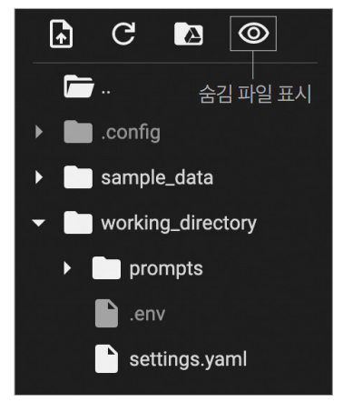  
  
코랩에서는 .env 파일이 숨겨진 파일로 인식되기 떄문에 파일 브라우저의 숨김 파일 표시 기능을 활성화해야 한다.  
  
GRAPHRAG_DB구축.ipynb(graphRag 설정)  
  
4. .env 파일 입력  
생성된 .env 파일에 사용할 대규모 언어 모델의 API 키를 입력한다. 이번 예제에서는 챗GTP를 사용하므로 다음과 같이 작성한다.  
  
- GRAPHRAG_API_KEY=API 키  
  
5. settings.yaml 파일 입력  
settings.yaml 파일은 GraphRAG의 동작과 관련된 전체 파라미터를 담은 설정 파일이다. 이 파일을 통해 데이터 처리, LLM 설정, 병렬 처리 등 다양한 
요소를 세부적으로 설정한다. 주요 설정 항목을 살펴보면 다음과 같다.  
  
## **대규모 언어 모델 설정: llm 파라미터**  
대규모 언어 모델과 상호작용을 설정하는 항목으로 API 키로부터 모델 종류까지 세부적으로 지정한다.  
  
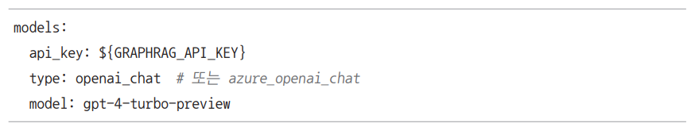  
  
type에는 사용할 언어 모델의 유형을 지정한다. 여기서는 오픈 AI의 채팅 모델을 사용하므로 openai_chat으로 설정하고 api_key 부분에 오픈AI API 키를 
작성한다.  
  
## **문서 분할 설정: chunks 파라미터**  
대용량 텍스트를 처리하기 위해 문서를 청크로 분할하는 설정이다.  
  
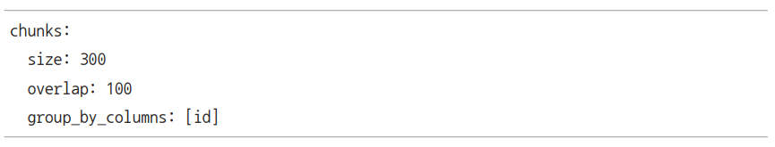  
  
group_by_columns는 지정된 컬럼별로 문서를 그룹화하여 청크를 생성하는 옵션이다.  
  
## **엔티티 추출 설정: extract_graph 파라미터**  
지식 그래프 구축 과정에서 엔티티를 추출하는 단계를 위한 설정이다.  
  
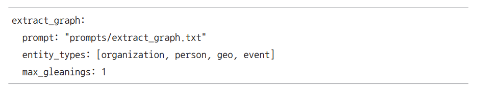  
  
prompt에는 LLM에 전달할 프롬프트 텍스트 파일의 위치를 지정한다. 또한 entity_types로 추출 대상 엔티티의 종류를 지정한다. max_gleanings에는 
반복 추출 횟수를 지정한다.  
  
## **요약 설정: summarize_descriptions 파라미터**  
같은 엔티티에 대한 설명(description)이 여러 개일 때 이들을 하나로 통합하는 단계의 설정값이다.  
  
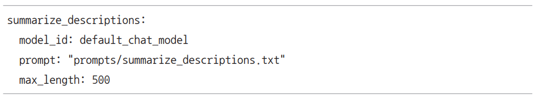  
  
생성되는 요약문의 최대 길이는 max_length 파라미터를 통해 제한할 수 있다.  
  
## **주장 추출 설정: claim_extraction 파라미터**  
텍스트에서 특정 엔티티(개인, 기업 등)와 관련된 주장들을 추출하고 이를 체계적으로 정리하는 방식을 지정하는 단계의 설정이다. 각 주장에 대해 주체, 
대상, 주장 유형, 상태, 날짜 등의 정보를 구조화된 형태로 추출한다.  
  
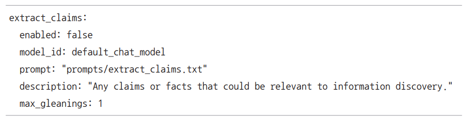  
  
enabled 파라미터를 통해 활성화 여부를 결정한다.  
  
## **커뮤니티 요약문 설정: community_reports 파라미터**  
특정 커뮤니티의 주요 엔티티들과 그들 간의 관계를 분석하여 종합적인 보고서를 생성하는 단계, 즉 앞서 설명한 커뮤니티 요약문 생성 단계의 설정값이다.  
  
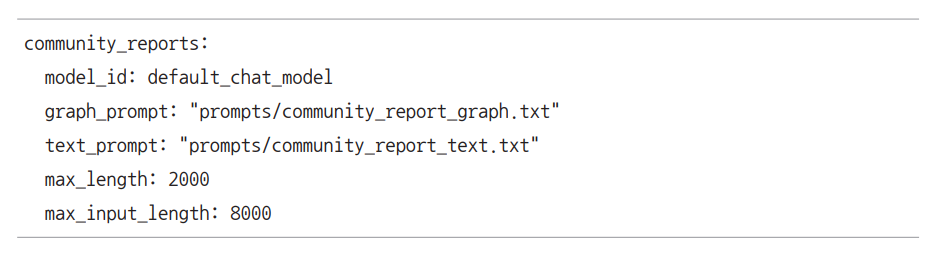  
  
이 과정을 완료하면 그래프 RAG를 실행할 기본 환경 구성이 끝난다.  
  
# **지식 그래프 구축**  
working_directory 폴더 내에 input 폴더를 만들고 그래프 DB로 사용할 문서를 업로드한다.  
  
GRAPHRAG_DB구축.ipynb(지식 그래프 구축)  
  
그래프 구축에 사용할 글은 투자에 관한 서적으로 조지 게어 헨리가 쓴 How to Invest Money라는 책의 텍스트 파일을 사용한다. 이후 .env 파일에 오픈 
AI API키를 입력한다.  
  
그 후 다음 명령어를 입력하여 그래프 DB 구축을 실행한다.  
  
- !graphrag index --root ./working_directory  
  
그래프 DB 구축은 매우 복잡한 워크플로우를 거쳐 진행된다. 전체 과정은 크게 두 가지 범주로 나눌 수 있다.  
  
1. Base processing 단계  
이 단계에서는 원본 문서를 처리하기 위한 기초적인 작업을 수행한다. 즉 앞서 설명한 문서 분할을 수행하고 지식 그래프 및 그래프 증강의 초기 버전을 
구현하는 단계다.  
  
우선 문서 분할(create_base_text_units)을 통해 긴 문서를 여러 개의 텍스트 단위로 쪼갠 뒤 이를 바탕으로 엔티티 추출, 기본 그래프 생성, 커뮤니티 탐지, 
임베딩 작업(create_base_extracted_entities, create_base_entity_graph), 공변량 추출(create_final_covariates)을 진행한다. 이 과정을 통해 
초기 형태의 엔티티 그래프를 구축하고 각 엔티티 및 관계들을 식별할 수 있는 토대를 마련한다.  
  
2. Enrichment(고도화) 단계  
기본적으로 구축된 그래프에 대해 추가적인 보강 작업을 수행하는 단계이다. 즉 구축된 지식 그래프를 보강하고 커뮤니티 요약 및 시각화를 수행하여 더욱 
풍부한 정보를 제공할 수 있도록 완성도를 높이는 과정이다.  
  
이 단계에서는 엔티티, 관계, 커뮤니티 데이터의 정제(create_final_entities, create_final_communities, create_final_relationships), 
그래프 시각화(create_final_nodes) 등을 거쳐 더욱 풍부하고 의미 있는 그래프 DB를 생성한다. 또한 커뮤니티 요약(create_final_community_reports) 
생성을 통해 특정 커뮤니티를 중심으로 요약된 정보와 통계, 임베딩 등을 도출한다.  
  
즉 Base processing 단계가 문서 -> 엔티티 -> 기본 그래프 생성 과정이라면 Enrichment 단계는 해당 그래프를 정제하는 과정으로 이해할 수 있다.  
  
DB 구축 워크 플로우의 핵심 7단계  
  
1. 문서 분할: create_base_text_units  
입력 텍스트를 여러 청크로 분할하는 작업을 수행한다. 문서 분할은 대규모 언어 모델의 입력 길이 제한을 고려하여 긴 문서를 여러 부분으로 나누고 병렬 
처리를 가능하게 하며 메모리 효율성을 높인다.  
  
이 작업은 토큰 수 기준 분할로 분할 기준이 되는 토큰 수는 앞선 settings.yaml 설정값을 따른다. 이 부분은 create_base_text_units라는 작업 이름으로 
수행된다. 예를 들어 다음과 같은 방식으로 진행된다.  
  
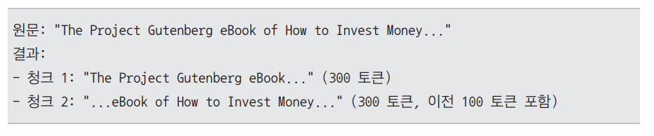  
  
2. 엔티티 추출: create_base_extracted_entities  
텍스트 조각에서 중요한 엔티티를 추출하고 이를 기반으로 기본 엔티티 그래프를 생성한다. 이 단계는 텍스트 내에서 중요한 엔티티를 식별하고 그들 간의 
관계를 파악하기 위한 초기 작업이라고 생각하면 된다.  
  
이 작업은 create_base_extracted_entities라는 워크플로우로 실행된다. 예를 들어 다음과 같은 방식으로 진행된다.  
  
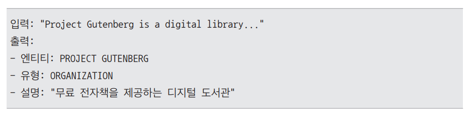  
  
3. 기본 엔티티 그래프 처리 및 확장: create_base_entity_graph  
이전 단계에서 생성된 엔티티 그래프를 바탕으로 추가적인 그래프 처리 및 분석을 수행하는 단계. 이 단계에서는 개별 텍스트 유닛에서 생성된 엔티티 그래프를 
통합하고 커뮤니티 탐지 그래프 임베딩 생성 등의 작업을 수행하여 그래프를 확장하고 정제한다. 구체적인 작업 내역은 다음과 같다.  
  
- 그래프 통합: 개별 텍스트 유닛에서 생성된 그래프를 하나의 통합된 그래프로 병합하여 전체적인 데이터 구조를 구성한다.  
- 커뮤니티 탐지: 그래프 클러스터링 알고리즘을 적용하여 유사한 엔티티들을 그룹화하고 커뮤니티 구조를 파악한다.  
- 그래프 임베딩 생성: 그래프의 구조적 특성을 벡터화하여 노드 임베딩을 생성한다.  
  
이 작업은 create_base_entity_graph라는 이름의 워크플로우로 실행된다. 작업 예를 살펴보면 다음과 같다.  
  
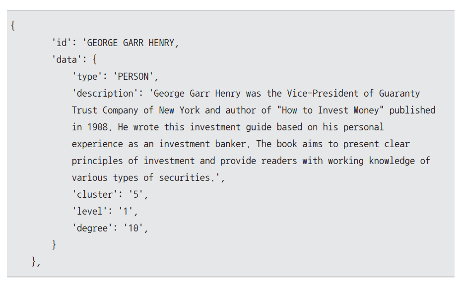  
  
이 예는 create_base_entity_graph 작업의 대표적인 결과를 보여준다. 각 구성요소는 다음과 같다.  
  
- 커뮤니티 탐지: cluster 번호 '5'를 부여받았으며 이는 5번 커뮤니티에 속한 다른 엔티티들과 유사하거나 연관성이 있음을 나타낸다. level은 '1'로 
커뮤니티 구조에서의 위치를 보여준다.  
- 그래프 속성: degree가 '10'으로 표시되어 있는데 이는 이 엔티티가 그래프 내에서 다른 엔티티와 10개의 연결을 가지고 있음을 의미한다. 이를 통해 
해당 엔티티의 중요도나 영향력을 유추할 수 있다.  
  
4. 공변량 추출: create_final_covariates  
create_final_covariates 워크플로우에서는 앞선 단계들에서 얻은 텍스트 유닛과 추출된 엔티티들을 사용하여 공변량을 추출한다. 공변량은 통계나 머신러닝 
모델에서 종속 변수에 영향을 미칠 수 있는 독립 변수를 의미하며 여기서는 텍스트에서 주장(claim)을 추출하여 공변량으로 사용한다. 즉 그래프 DB 구축에 
사용할 수 있는 정보를 추가로 추출하여 더 풍부한 정보를 담은 DB를 구축하는 데 목적이 있다.  
  
5. 최종 엔티티 데이터 생성: create_final_entities  
앞선 단게에서 얻은 기본 엔티티 그래프의 노드 데이터를 기반으로 최종적인 엔티티 데이터를 생성하는 단계. 이 단계는 create_final_entities 워크플로우로 
실행된다. 구체적으로 구현되는 작업은 다음과 같다.  
  
- 엔티티 데이터 정제: 엔티티 데이터의 중복 제거, 빈 값 필터링 등을 통한 정제를 수행한다.  
- 임베딩 생성: 엔티티의 이름과 설명에 대한 임베딩을 생성하여 의미를 벡터화한다. 이는 그래프 임베딩과는 다른 임베딩으로 엔티티 텍스트 정보에 대한 임베딩을 
의미한다. 즉 그래프 임베딩이 그래프의 구조를 임베딩한 것이었다면 이번 임베딩은 엔티티 텍스트를 임베딩한 것이다.  
- 데이터 구조 개선: 컬럼명 변경 및 데이터 정리를 통해 이후 분석에 용이하도록 데이터 구조를 개선한다.  
  
6. 최종 노드 데이터 생성 및 그래프 레이아웃 계산: create_final_nodes  
엔티티 추출 작업이 완료되었으므로 이제 해당 엔티티들을 시각화하기 위한 작업을 진행한다. 먼저 그래프의 레이아웃을 계산하여 노드의 위치 정보를 생성하고 
최종 노드 테이블을 완성한다. 이때 노드의 위치 정보 생성에는 차원 축소 기법이 사용된다.  
  
## **차원 축소 기법을 사용한 노드 좌표 생성**  
차원 축소 기법을 활용하면 노드의 임베딩을 바탕으로 좌표 정보를 생성할 수 있다. 이 과정은 다음과 같은 단계로 이루어진다.  
  
1. 임베딩 벡터 준비: 각 노드에 대한 그래프 임베딩 벡터를 수집한다.  
2. 차원 축소 수행: 임베딩 벡터를 사용하여 고차원 공간에서 2D 또는 3D 공간으로 차원 축소를 수행한다. 이떄 UMAP(Uniform Manifold Approximation and Projection)과 
같은 차원 축소 기법을 적용한다. UMAP은 고차원 데이터의 구조를 보존하면서 2D 공간으로 변환하는 알고리즘으로 가까운 노드들은 2D 공간에서도 가깝게, 먼 노드들은 
멀게 배치한다. 이 과정에서 노드 간의 유사성과 관계가 최대한 보존되어 원래 그래프의 구조적 특성을 직관적으로 시각화할 수 있게 된다.  
3. 좌표 할당: 축소된 벡터 값을 노드의 x, y 좌표(필요에 따라 z 좌표도 포함)로 할당된다.  
  
이 단계는 create_final_nodes 워크플로우로 구현된다. 작업 예를 살펴보면 다음과 같다.  
  
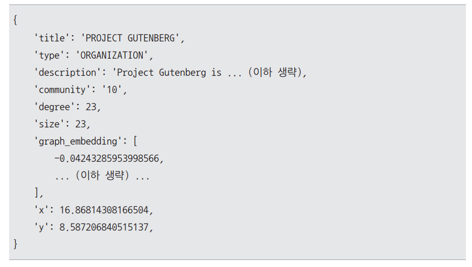  
  
이 예의 구성요소는 다음과 같다.  
  
- title: 노드의 제목을 나타낸다.  
- type: 노드의 유형을 나타낸다.  
- description: 노드에 대한 상세 설명이다.  
- community: 노드가 속한 커뮤니티를 나타내는 번호이다.  
- degree: 노드의 연결 정도(다른 노드와의 연결 수)를 나타낸다.  
- size: 노드의 크기를 나타낸다.  
- graph_embedding: 노드의 의미를 벡터화한 임베딩 값들의 리스트이다.  
- x, y: 그래프 시각화에서 노드의 위치를 나타내는 좌표값이다.  
  
이 단계의 핵심 중 하나는 그래프 시각화를 위한 좌표 생성으로 이를 수행하기 위해선 반드시 그래프 임베딩 정보가 있어야 한다. 따라서 그래프 시각화를 원한다면 
반드시 그래프 DB 구축 설정에서 그래프 임베딩 수행 관련 설정을 활성화해야 한다.  
  
7. 커뮤니티 요약문 생성: create_final_community_reports  
커뮤니티 요약문을 생성하는 단계. 앞서 만든 각 커뮤니티에 대한 요약문을 생성하고 이를 임베딩하여 최종 커뮤니티 요약문 테이블을 만든다. 작업 예를 살펴보면 
다음과 같다.  
  
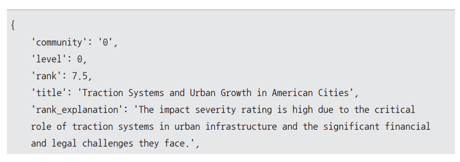  

  
이 예의 구성요소를 자세히 살펴보면 다음과 같다.  
  
- level: 요약문이 다루는 커뮤니티의 계층 레벨이다.   
- rank: 요약문의 중요도 점수.  
- title: 요약문의 제목.  
- rank_explanation: 중요도 점수에 대한 설명. 
- summary: 요약문의 주요 내용.  
- findings: 주요 발견 사항들의 목록. 각 발견 사항은 explanation(상세 설명)과 summary(요약)로 구성되어 있다.  
  
이러한 과정을 통해 그래프 DB를 성공적으로 구축할 수 있다. 구축된 그래프 DB 결과 파일은 working_directory/output 폴더 내에 위치하게 된다. 다만 
구글 코랩 환경에서는 런타임이 종료되면 데이터가 삭제되기 떄문에 구글 드라이브에 저장해두는 것이 좋다.  
  
# **그래프 RAG 질의**  
먼저 그래프 RAG에서 사용자 질문에 대해 답변을 생성하는 방식을 이론적으로 살펴본다.  
  
그래프 RAG에서 사용자 질문에 대한 답변을 생성하는 방식은 크게 로컬 검색(local search)과 글로벌 검색(global search)으로 나눌 수 있다. 이들 두 검색 
방식은 각각 고유한 장점을 지니고 있어 질의의 성격과 필요한 정보의 범위에 따라 적절한 방식을 선택할 수 있다.  
  
로컬 검색은 문서 내의 특정 부분에서 답을 찾을 수 있는 명시적인 질문에 적합하다. 예를 들어 "특정 제품의 출시일은 언제인가요?" 또는 "이 사건의 핵심 인물은 누구인가요?" 
와 같은 질문은 문서의 제한된 영역 내에서 답을 찾을 수 있으므로 로컬 검색이 효율적이다.  
  
반면 글로벌 검색은 전체 문서 컬렉션에 대한 포괄적인 이해가 필요한 질무에 유용하다. "이 글 전반에 걸친 주요 주제는 무엇인가요?" 또는 "글이 진행됨에 따라 저자의 생각이 어떻게 변화하고 있나요?" 
와 같이 문서 전반에 걸쳐 정보를 종합적으로 분석해야 하는 경우에 적합하다.  
  
각각의 검색 방식은 서로 다른 접근 방법을 사용하여 정보를 찾고 답변을 생성한다.  
  
# **그래프 RAG 질의 과정**  
## **로컬 검색**  
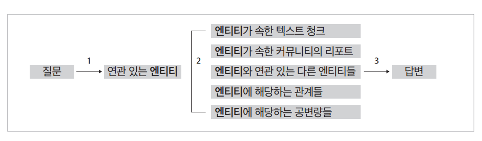  
  
로컬 검색은 질문과 가장 관련 있는 엔티티들을 선택한 후 그래프 DB에서 이들 엔티티와 연관된 컴포넌트들을 수집하고 필터링하여 사용하는 방식이다.  
이 방법은 크게 세 단계로 이루어진다.  
  
첫 번째 단계에서는 사용자의 질문에서 관련 엔티티를 추출한다. 먼저 질문을 임베딩하고 그래프 DB에 저장된 엔티티들의 임베딩과 유사도를 계산하여 연관성이 
높은 엔티티를 식별한다. 예를 들어 사용자가 "테슬라의 최근 전기차 판매량은 어떻게 되나요?"라고 질문하면 시스템은 질문의 임베딩을 기반으로 그래프 DB 
내에서 '테슬라', '전기차' 등의 관련 엔티티를 찾아낸다.  
  
두 번째 단계에서는 앞서 식별된 엔티티들과 연관된 다양한 정보를 수집한다. 수집되는 정보는 크게 다섯 가지 유형으로 나눌 수 있다.  
  
1. 식별된 엔티티가 포함된 원본 텍스트 청크: 예를 들어 테슬라의 판매량이 언급된 문서의 일부가 여기에 해당된다.  
2. 식별된 엔티티가 속한 커뮤니티의 리포트: 예를 들어 테슬라가 속한 전기차 주제의 커뮤니티 리포트가 여기에 포함될 수 있다.  
3. 식별된 엔티티와 연관된 다른 엔티티: 예를 들어 테슬라와 연관된 일론 머스트, Model S/3/X/Y 등이 여기에 해당한다.  
4. 식별된 엔티티와 연결된 관계: 예를 들어 테슬라와 일론 머스크 사이의 관계 정보(관계의 강도 등)기 여기에 포함된다.  
5. 엔티티에 대한 주장(claims): 예를 들어 테슬라의 시장 성과에 대한 주장이 여기에 해당한다.  
  
세 번째 단계에서는 수집된 정보들의 우선순위를 매기고 필터링하여 최종 응답을 생성한다. 즉 앞의 두 단계를 통해 얻은 많은 정보 중 실제로 질문과 연관된 
정보만을 선별하여 사용하는 단계다. 이는 이전에 설명한 리랭킹 과정과 동일하다고 볼 수 있다. LLM은 각 수집된 정보가 원래 질문과 얼마나 관련이 있는지 
평가하고 가장 관련성이 높은 정보들을 선별한다. 마지막으로 이렇게 찾아낸 정보들을 활용하여 최종 답변을 도출한다.  
  
이러한 로컬 검색 방식은 단순히 키워드 매칭이나 임베딩 유사도만 사용하는 것이 아니라 그래프 구조를 활용하여 연관된 다양한 컨텍스트를 종합적으로 
고려할 수 있다는 장점이 있다.  
  
## **글로벌 검색**  
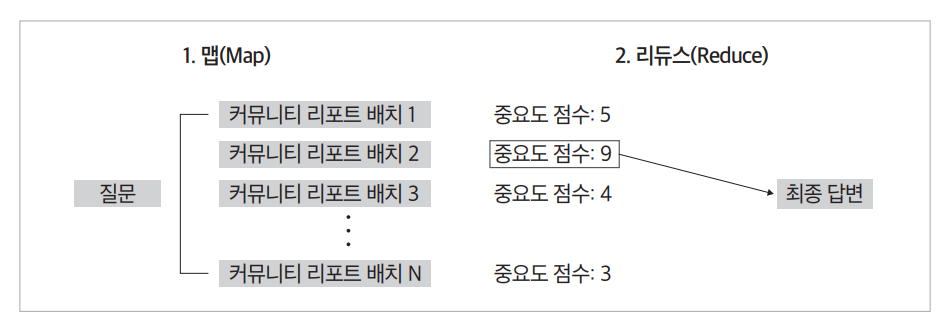  
  
글로벌 검색은 데이터셋 전체를 아우르는 질문에 답하기 위한 방식이다. 예를 들어 "이 문서 전바을 아우르는 주제는 무엇인가요?"와 같은 질문은 기존 RAG 
방식으로는 적절한 답변을 얻기 어렵다. 기존 RAG 시스템은 데이터셋 내에서 의미적으로 유사한 텍스트를 찾는 벡터 검색에 의존하지만 이러한 종류의 질문에서는 
어떤 정보를 검색해야 할지 특정하기 어렵기 때문이다. 또한 기존 방식은 주로 국소적인 데이터만을 활용하기 때문에 데이터 전체를 아우르는 맥락을 반영하기 
어렵다.  
  
그래프 RAG의 글로벌 검색은 이러한 한계를 LLM이 생성한 지식 그래프 구조를 활용하여 극복한다. 글로벌 검색은 맵-리듀스(map-reduce) 방식을 통해 
답변을 생성하며 전체 과정은 다음과 같은 단계로 이루어진다.  
  
먼저 사용할 커뮤니티의 레벨을 선택한다. 이때 선택하는 커뮤니티의 레벨은 응답의 상세함과 효율성 사이에서 균형을 조절하는 역할을 한다. 예를 들어 
하위 레벨(Level 2, Level 3)의 커뮤니티 리포트를 사용하면 보다 세부적인 정보를 포함할 수 있지만 포괄성은 떨어지고 처리해야 할 리포트의 양이 많아지기 
떄문에 시간과 자원이 더 많이 소모된다. 반대로 상위 레벨의 리포트를 사용하면 포괄적인 정보를 제공하는 대신 세부적인 정보가 부족할 수 있지만 더 적은 
자원으로 빠르게 답변을 생성할 수 있다.  
  
맵 단계에서는 커뮤니티 리포트들을 작은 텍스트 조각으로 분할한 후 이 조각들을 컨텍스트로 활용하여 LLM에 투입해 중간 응답 리스트를 생성한다. 각 
중간 응답에는 해당 정보가 최종 답변 구성에 얼마나 중요한지를 나타내는 중요도 점수가 부여된다.  
  
리듀스 단계에서는 이전 단계에서 생성된 중간 응답들 중 중요도 점수가 높은 것들을 선별하여 통합한다. 필터링된 정보는 최종 응답을 생성하기 위한 컨텍스트로 
사용되며 이를 바탕으로 LLM이 종합적이고 포괄적인 답변을 작성한다.  
  
이러한 글로벌 검색 방식은 데이터셋 전체의 구조와 주제를 파악하고 그 속에서 의미 있는 정보를 선별하여 답변을 생성하는 데 탁월하다. 특히 문서 전체의 
패턴이나 전반적인 내용을 파악해야 하는 질문에 효과적이며 기존 RAG 방식이 갖는 한계를 보완하는 중요한 역할을 한다.  
  
# **그래프 RAG 질의 실습**  
## **환경 설정**  
GRAPHRAG_질의과정.ipynb(환경 설정)  
  
GraphRAG 패키지를 설치하고 구글 드라이브에 저장한 그래프 DB를 불러오기 위해 드라이브를 연결한다.  
  
구글 드라이브가 정상적으로 마운트되면 저장한 그래프 DB 폴더를 작업 디렉터리로 지정한다. 앞서 구글 드라이브 내에 working_directory 폴더로 저장했으므로 
이를 경로로 사용한다. 만약 다른 경로에 저장했다면 해당 경로를 os.chdir()에 입력한다.  
  

  
