# **랭그래프로 설계하는 RAG 파이프라인**  
랭그래프(LangGraph)는 LLM 기반 에이전트 시스템을 쉽고 효율적으로 개발할 수 있도록 지원하는 라이브러리다. 여러 개의 에이전트로 구성된 LLM 애플리케이션과 
RAG 파이프라인에서 자주 사용되는 순환(loop)과 분기(branch)를 포함한 복잡한 워크플로우를 간편하게 구현할 수 있도록 다양한 기능을 제공한다.  
  
다음과 같은 예를 떠올려 보자  
- LLM을 사용하여 생성된 답변이 충분한지 혹은 답변을 재생성할지 결정한다.  
- LLM을 사용하여 어떤 툴(Tool)을 호출할지 결정한다.  
  
이처럼 순환 구조를 갖는 LLM 파이프라인 안에는 여러 분기점이 존재할 수 있으며 이러한 분기점이 많아질수록 시스템 구현은 더욱 복잡해진다. 랭그래프는 
그래프 구조를 활용해 이를 간단하게 구현할 수 있도록 도우며 다양한 제어 방식을 제공해 애플리케이션의 기능과 유연성을 한층 강화한다.  
  
# **랭그래프의 구성요소**  
먼저 그래프의 기본 개념을 짚어본다. 그래프는 객체들 간의 관계를 나타낼 때 사용하는 데이터 구조로 노드와 에지로 이루어져 있다.  
  
- 노드(Node, 정점): 그래프에서 개별 객체를 나타내는 요소이다. 예를 들어 소셜 네트워크를 그래프로 표현한다면 각 사용자가 하나의 노드가 된다.  
- 에지(Edge, 간선): 드 노드를 연결하는 요소로 노드 간의 관계 또는 경로를 나타낸다. 소셜 네트워크를 그래프로 표현한다면 사람들 사이의 친구 관계가 
에지가 된다.  
  
랭그래프에서는 이러한 그래프 구조를 이용해 다양한 워크플로우를 구현한다. 기본 동작 방식은 노드가 작업을 완료하면 하나 이상의 에지를 통해 다른 노드에게 
메시지를 보내고 메시지를 받은 노드는 자신의 기능을 실행한 후 다음 노드로 메시지를 다시 전달하는 과정을 반복하는 방식이다.  
  
# **그래프**  
랭그래프의 그래프는 구글의 프리겔(Pregel)에서 영감을 받은 슈퍼스텝(super-steps) 방식으로 동작한다. 슈퍼스텝은 그래프 처리 과정의 한 단계로 각 노드가 
병렬로 동시에 작업을 수행하는 단위다. 병렬로 작업을 수행한다는 것은 한 노드가 일을 끝낸 후에 다른 노드가 일을 시작하는 것이 아니라 여러 노드가 동시에 
자신의 일을 하는 모습을 뜻한다. 이렇게 동시에 실행되는 노드는 동일한 슈퍼스텝에 속하며 순차적으로 실행되는 노드는 별도의 슈퍼스텝에 속한다.  
  
노드는 하나 이상의 입력 에지에서 새로운 메시지(상태)를 수신할 때 활성화된다. 활성화된 노드는 자신의 기능을 실행하고 처리 결과를 다른 노드로 전달한다. 
각 슈퍼스텝이 끝날 때 입력 메시지가 없는 노드는 자신을 비활성화료 표시하여 완료된 상태로 표시한다. 모든 노드가 비활성화되고 더 이상 메시지가 
전송 중이지 않은 상태가 되면 그래프 실행이 종료된다.  
  
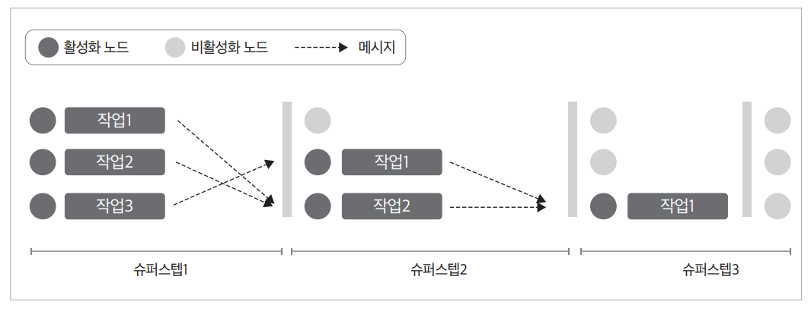  
  
랭그래프에서는 두 가지 유형의 그래프 클래스를 사용할 수 있다.  
  
- 상태 그래프(StateGraph): 일반적으로 사용하는 그래프 클래스다. 사용자가 정의하는 상태를 매개변수로 활용하며 다양한 워크플로우와 상태 관리를 
지원한다.  
- 메시지 그래프(MessageGraph): 오직 메시지 목록만으로 이루어지는 특별한 유형의 그래프 클래스다. 주로 챗봇과 같은 대화형 시스템에서 사용되며 메시지 
흐름을 단순화하여 관리하기에 적합하다.  
  
# **상태**  
그래프를 정의할 때 가장 먼저 해야 할 일은 그래프의 상태(state)를 정의하는 것이다. 상태란 애플리케이션 내에서 메시지로 주고받는 변수들의 집합이다. 
파이썬의 모든 타입으로 정의할 수 있지만 대체로 TypedDict나 Pydantic의 BaseModel 타입으로 선언한다. 상태는 그래프 내 모든 노드와 에지의 입력으로 
사용되며 각 노드의 상태를 업데이트할 수 있다.  
  
```
from typing import TypedDict

class State(TypedDict):
    count: int
    messages: list[str]  
```  
  
이 예시는 count와 messages라는 두 개의 필드를 갖는 상태 클래스다. 이 상태는 그래프 내 여러 노드에서 공유되며 지속적으로 업데이트된다.  
  
예를 들어 처음 노드에서 {"count": 1, "messages": ["hi"]}를 입력하고 다음 노드에서 {"count": 2}를 입력한다면 상태는 {"count": 2, "messages": ["hi"]}의 
형태가 된다. 그다음 노드에서 {"messages": ["bye"]}를 입력한다면 최종 상태는 {"count": 2, "messages": ["bye"]}의 형태가 된다.  
  
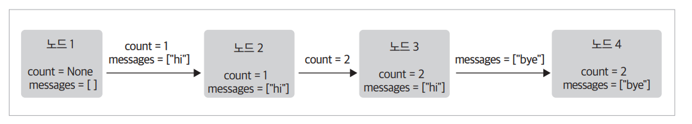  
  
리듀서(reducer)를 사용한다면 기존 상태에 새로운 업데이트를 결합하여 새로운 상태를 생성하는것도 가능하다. 다음 예시와 같이 Annotated 타입으로 
리듀서 함수를 정의한다면 messages 변수는 리듀서 함수를 통해 업데이트된다.  
  
```
from typing import TypedDict, Annotated
from operator import add 

class State(TypedDict):
    count: int
    messages: Annotated[list[str], add]
```  
  
이 예시에서는 messages 필드에 add 리듀서가 지정되어 있어 새로운 메시지가 추가될 때 기존 리스트와 병합된다.  
  
예를 들어 처음 노드에서 {"count": 1, "messages": ["hi"]}를 입력하고 다음 노드에서 {"count": 2}를 입력한다면 상태는 {"count": 2, "messages": ["hi"]}의 
형태가 된다. 그다음 노드에서 {"messages": ["bye"]}를 입력한다면 최종 상태는 messages에 operator.add를 실행하여 {"count": 2, "messages": ["hi", "bye"]}의 형태가 된다.  
  
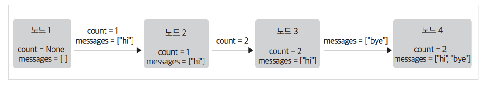  
  
# **노드**  
그래프에서 노드(node)는 실제 작업을 수행하는 실행 단위이다. 에이전트의 로직을 담은 파이썬 함수가 곧 노드가 되며 그래프에서 각 노드는 상태를 입력으로 
받아 동작하고 그 결과로 상태값을 업데이트하여 반환한다. 노드는 정상적으로 실행될 수도 있고 실패할 수도 있다. 한마디로 노드는 그래프 내에서 실질적인 
작업을 처리하는 핵심 구성 요소다.  
  
노드는 첫 번째 인자로 상태값(state)을 받으며 두 번째 인자로 설정값(config)을 받는다. 이렇게 생성한 노드는 add_node() 메서드를 통해 그래프에 추가할 
수 있다.  
  
```
from langchain_core.runnables import RunnableConfig
from langgraph.graph import StateGraph

# 상태 그래프 선언
builder = StateGraph(dict)

# 노드로 사용할 함수 정의
def my_node(state: dict, config: RunnableConfig):
    print("In node: ", config["configurable"]["user_id"])
    
    return {"result": f"Hello, {state['input']}!"}

def my_other_node(state: dict):
    return state # 상태를 그대로 반환
    
# 노드를 그래프에 추가
builder.add_node("my_node", my_node)
builder.add_node("other_node", my_other_node)
```  
  
앞의 코드에서 my_node는 입력된 상태값을 변경하기 않고 그대로 반환하는 간단한 노드다.  
  
# **START 노드**  
START 노드는 그래프 실행의 시작점을 나타내는 특별한 노드다. 사용자 입력을 처음 받아 그래프로 전달하며 그래프 내에서 첫 번재로 실행될 노드를 지정할 
때 사용한다.  
  
```
from langgraph.graph import START

graph.add_edge(START, "node_a")
```  
  
앞의 코드에서는 START 노드가 실행된 후 node_a로 상태가 전달된다.  
  
# **END 노드**  
END 노드는 그래프 실행이 완료되었음을 나타내는 종료 노드다. 특정 노드의 작업이 끝난 후 더 이상 처리할 작업이 없을 경우 END 노드로 연결하여 그래프 
실행을 종료한다.  
  
```
from langgraph.graph import END

graph.add_edge("node_a", END)
```  
  
이 코드는 node_a가 실행된 후 그래프가 종료되도록 설정한 예이다.  
  
# **에지**  
에지(edge)는 그래프 내에서 노드가 작업을 수행한 후 다음에 어떤 동작을 이어갈지 결정하는 흐름 제어 요소다. 파이썬 함수나 고정된 연결을 통해 다음 
실행 노드를 지정하며 조건에 따라 분기하거나 종료를 지시할 수도 있다. 한마리도 에지는 그래프 실행 흐름을 설계하는 핵심 구성요소다.  
  
하나의 노드는 여러 개의 에지를 가질 수 있으며 각각의 에지를 통해 다양한 경로로 분기하거나 순차적으로 작업을 이어갈 수 있다.  
  
# **일반 에지**  
가장 기본적인 형태로 한 노드에서 다음 노드로 직접 이동할 때 사용한다.  
  
```
graph.add_edge("node_a", "node_b")
```  
  
이 코드는 node_a의 작업이 끝난 후 node_b가 실행되도록 지정한다.  
  
# **조건부 에지**  
특정 조건에 따라 다른 노드로 분기하거나 플로우를 종료할 때 사용한다. 조건을 판단하는 함수가 필요하며 그 결과에 따라 다음 실행 노드를 선택한다.  
  
```
graph.add_conditional_edges("node_a", routing_function,
                            {True: "node_b", False: "node_c"})
```
  
이 코드에서는 routing_function이 node_a 다음으로 어떤 노드를 사용할지 결정하는 함수가 되며 해당 함수의 반환값이 True이면 node_b가, False면 
node_c가 다음 실행 노드가 된다.  
  
# **진입 지점**  
진입 지정(entry point)은 그래프가 시작될 때 처음 실행할 노드를 명시한다. 주로 START라는 가상의 노드를 사용하여 그래프의 첫 실행 지점을 설정한다.  
  
```
from langgraph.graph import START

graph.add_edge(START, "node_a")
```  
  
이 코드는 START 노드에서 첫 번째로 실행할 노드로 에지를 추가하는 add_edg() 메서드를 사용하여 그래프의 진입 지점을 지정한다.  
  
# **조건부 진입 지점**  
사용자의 입력이나 외부 조건에 따라 그래프 실행의 첫 번째 노드를 동적으로 결정할 수 있다. 진입 지점 역시 조건부로 설정하여 다양한 초기 상태에 대응한다.  
  
```
from langgraph.graph import START

graph.add_conditional_edges(START, routing_function,
                            {True: "node_b", False: "node_c"})
```  
  
add_conditional_edge() 메서드를 사용하여 가상의 START 노드와 라우팅 함수를 입력받는다. 세 번째 인자로 라우팅 함수의 반환값에 해당하는 노드의 
매핑 정보를 제공하여 조건부로 진입 지점 노드를 선택할 수 있다. 앞의 코드에서는 routing_function이 진입 지점으로 어떤 노드를 사용할지 결정하는 함수가 
되며 해당 함수의 반환값이 True이면 node_b가, False이면 node_c가 첫 실행 노드가 된다.  
  
# **랭그래프 활용**  
랭그래프를 사용해 오픈AI LLM을 기반으로 하는 챗봇 시스템을 단계별로 구현한다. 이번에 구현할 챗봇은 다음과 같은 기능을 포함한다.  
  
- 웹 검색 결과를 활용하여 일반적인 질문이나 최신 정보가 필요한 질문에 답변하기  
- 이전 대화와 사용자 설정을 저장하여 대화의 맥락 유지하기  
- 인간의 개입이 필요한 복잡한 질문의 경우 인간에게 라우팅하기  
- 필요에 따라 커스텀 상태값을 사용하여 챗봇의 동작을 유연하게 제어하기  
- 이전 대화로 되돌아가 수정하는 기능 지원하기  
  
LANG_GRAPH.ipynb(사전 준비)  
  
실습에서 사용할 그래프의 상태값을 먼저 정의한다. 상태는 대화 메시지들을 포함하며 랭그래프의 add_messages 기능을 활용하여 메시지를 누적한다.  
  
# **루프 구현하기**  
먼저 챗봇 노드를 추가한다. 이 노드는 LLM이 사용자의 질의를 받아 응답을 생성하는 역할을 한다. 이를 위해 오픈AI 클라이언트를 정의하고 오픈AI API로부터 
답변을 받아오는 파이썬 함수를 작성한다. 이 함수가 챗봇 노드로 동작하게 된다.  
  
LANG_GRAPH.ipynb(챗봇 노드)  
  
다음으로 그래프의 시작과 종료를 나타내는 진입 지점과 종료 지점을 지정한다. START와 END는 진입과 종료를 나타내는 특수 노드이기 때문에 langgraph.graph에서 
임포트하여 사용한다.  
  
그래프가 완성되었으면 compile() 함수를 호출하여 실행 가능한 형태로 변환한다. 그래프를 컴파일한다는 것은 정의한 노드와 흐름을 실제 실행할 수 
있는 구조로 만드는 것을 의미한다.  
  
이제 사용자가의 입력을 받아 순환하며 동작하는 챗봇을 실행할 수 있다. while 루프를 사용하여 사용자가 quit, exit, q 명령어를 입력할 때까지 계속해서 
질문과 응답을 주고받도록 구현한다. 사용자의 입력은 graph.stream() 함수를 통해 미리 구성한 챗봇 워크플로우에 전달되며 생성된 응답은 event에 누적되어 
확인할 수 있다.  
  
이제 기본적인 질문과 응답이 가능한 챗봇이 구현되었다. 예를 들어 다음과 같이 실행해 볼 수 있다.  
  
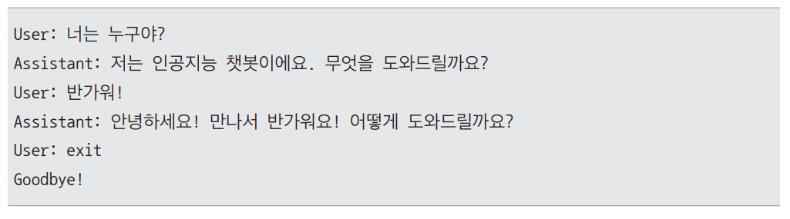  
  
마지막으로 현재까지 구성한 그래프를 시각화한다. draw_mermaid_png() 함수를 이용하면 그래프의 구조를 이미지로 출력할 수 있다. 생성된 이미지를 
IPython.display를 사용해 화면에 표시한다.  
  
LANG_GRAPH.ipynb(그래프 시각화)  
  
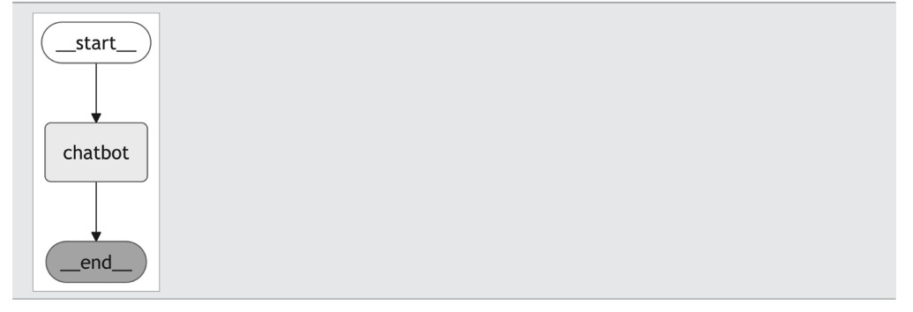  
  
이 과정을 통해 챗봇 워크플로우의 전반적인 구조를 한눈에 파악할 수 있다.  
  
# **조건문 구현하기**  
챗봇이 학습된 데이터만으로는 답할 수 없는 질문에도 대응할 수 있도록 외부 검색 도구를 연동하여 챗봇 노드를 변경한다. 이번 예제에서는 Tavily 검색 엔진을 
챗봇의 도구로 활용하여 실시간 정보를 제공할 수 있도록 한다.  
  
# **Tavily API Key 발급**  
Tabily 검색 엔진은 웹사이트에서 데이터를 수집하고 AI 알고리즘을 통해 검색어와 연관성이 높은 정보를 필터링하여 사용자에게 정형화된 형식(JSON)으로 
제공한다. 최신 정보가 필요하거나 실시간으로 신뢰할 수 있는 데이터를 빠르게 수집해야 할 때 유용하게 사용할 수 있다.  
  
Tavily 검색 엔진을 사용하려면 다음과 같은 절차를 통해 API 키를 발급받아야 한다.  
  
1. https://tavily.com/ 사이트에 접속한다.  
2. [Sing up]을 눌러 회원 가입하거나 [Continue with Google] 또는 [Continue with Github]을 통해 사이트에 로그인한다.  
3. https://app.tavily.com/home 대시보드에 접속한다.  
4. 발급된 API 키를 확인하고 복사한다.  
  
Tavily 검색 엔진을 사용하기 위한 패키지를 설치한다.  
  
LANG_GRAPH.ipynb(Tavily 검색 엔진 세팅)  
  
이어서 Tavily 검색 엔진을 사용하기 위한 API 키를 다음과 같이 .env 파일에 추가한다. 그리고 다시 한번 dotenv 라이브러리를 사용하여 환경 설정을 
불러와 API키를 로드한다.  
  
TAVILY_API_KEY = 발급받은 API 키  
  
다음으로 Tavily 검색 엔진을 랭체인 도구로 정의한다. Tavily는 랭체인 라이브러리로 제공되고 있으므로 패키지를 설치하고 임포트한 뒤 코드 한 줄로 간단히 
추가할 수 있다.  
  
정의한 도구를 llm.bind_tools(tools) 함수를 사용하여 LLM과 연결한다. 이제 LLM은 질문 유형에 따라 검색 도구를 사용할지 여부를 판단하고 필요한 
파라미터를 포함한 응답을 반환한다. 챗봇 노드에서는 llm_with_tools를 사용하여 외부 검색이 필요한 경우 도구를 자동으로 호출할 수 있도록 구현한다.  
  
LANG_GRAPH.ipynb(외부 검색 도구 노드)  
  
이제 챗봇은 LLM의 응답에 따라 두 가지 상황에 대응해야 한다.  
  
- LLM이 도구를 활용해야 한다고 판단하고 도구에 필요한 파라미터를 응답한 경우 도구를 호출해야 한다.  
- LLM이 단순 답변을 응답한 경우 사용자에게 응답을 반환하고 종료해야 한다.  
  
LLM이 도구 실행에 필요한 파라미터(정보)를 응답한 경우 해당 응답을 활용해 도구를 호출하는 노드를 추가한다.  
  
도구 함수 tools는 정의되어 있으므로 이를 호출하는 도구 노드를 정의한다. 도구 노드는 호출되면 상태값에 저장된 가장 최근 메시지 messages[-1]을 
검사하여 도구 호출 정보가 포함되어 있는지 확인한다. 도구 호출 정보가 message.tool_calls에 저장되어 있다면 이를 사용하여 도구를 호출해 결과를 
생성한다. 호출 결과는 ToolMessage 객체로 반환하여 이후 호출에 활용한다. 현재 예제에서는 Tavily 검색 도구가 저장되어 있으므로 이를 호출하게 된다.  
  
도구 노드는 항상 실행되는 것이 아니라 LLM 응답에 도구 호출 정보, 즉 tool_calls가 포함된 경우에만 활성화되어야 한다. 따라서 hasattr(ai_message, "tool_calls)"와 
len(ai_message.tool_calls) > 0 조건을 검사하여 LLM 응답에 tool_calls 응답이 있으면 도구 노드를 의미하는 tools를, 없다면 종료를 의미하는 
__end__를 반환한다.  
  
도구 노드가 실행된 이후에는 다시 챗봇 노드로 이동하여 검색 결과를 바탕으로 최종 응답을 생성한다. 이를 위해 도구 노드와 챗봇 노드를 연결한다. 또한 진입 
지점으로 챗봇 노드를 지정해준다.  
  
이제 외부 검색 결과를 활용하여 응답할 수 있는 챗봇이 완성되었다. graph_builder.compile() 함수를 호출하여 그래프를 컴파일하고 draw_mermaid_png() 
메서드를 통해 현재의 구성도를 확인한다.  
  
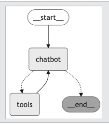  
  
구성도를 보면 챗봇의 응답에 따라 도구를 호출하거나 직접 답변을 반환하고 종료하는 흐름을 확인할 수 있다.  
  
# **스트리밍**  
랭그래프에서는 실시간으로 데이터를 지속적으로 전송하는 스트리밍(streaming) 기능을 지원한다. 이 기능을 활용하면 대규모 작업이나 연산이 진행 중일 
때도 중간 결과를 즉시 확인할 수 있으며 전체 결과가 준비되기 전에도 사용자와 상호작용할 수 있다.  
  
스트리밍은 graph.stream() 함수를 호출할 때 stream_mode 파라미터 값을 다음과 같이 지정해 동작 방식을 선택할 수 있다.  
  
- values: 각 노드가 실행된 후 그래프의 전체 상태를 실시간으로 반환한다. 전체 워크플로우의 상태 변화를 추적할 떄 유용하다.  
- updates: 각 노드가 실행된 후 상태값에 어떤 변경이 발생했는지만 반환한다. 변경된 부분만 빠르게 확인할 수 있다.  
  
다음은 완성된 그래프를 updates 모드로 스트리밍을 수행하는 코드다. 사용자의 질문을 입력받아 그래프를 실행하고 노드 실행 결과를 실시간으로 출력한다.  
  
LANG_GRAPH.ipynb(스트리밍)  
  
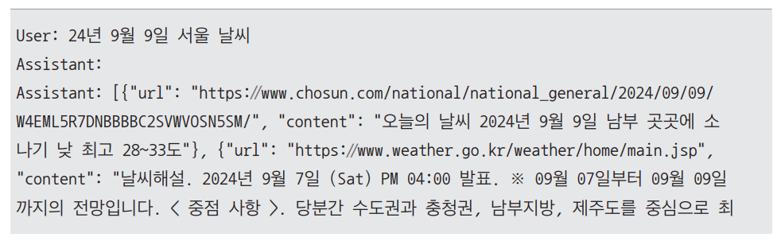  
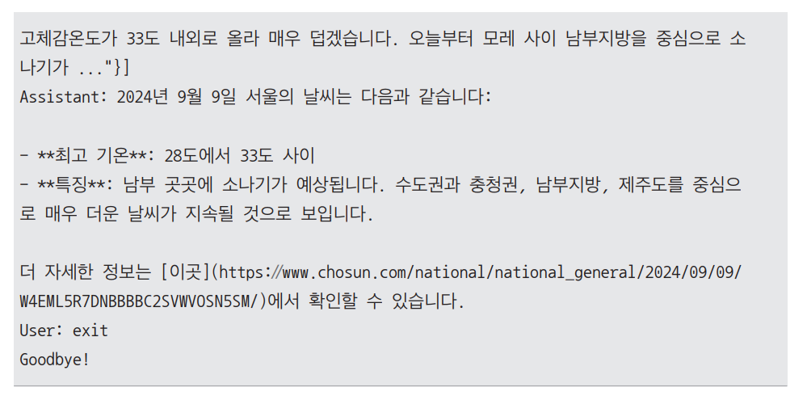  
  
스트림 모드를 update로 지정했기 때문에 Assistant에 출력되는 결과는 매번 상태가 변경될 때마다 업데이트된 마지막 메시지를 실시간으로 보여준다. 따라서 
전체 대화 내역이 아니라 최신 응답만을 확인할 수 있다.  
  
# **상태 저장하기**  
지금까지 구현한 챗봇은 외부 검색 도구를 활용하여 최신 정보를 제공할 수 있지만 이전 질문과 답변의 맥락을 기억하지 못하기 떄문에 멀티턴 대화를 자연스럽게 
이어가는 데 한계가 있다.  
  
이 문제를 해결하기 위해 랭그래프에서는 그래프 상태를 메모리나 데이터베이스 같은 외부 저장소에 저장하고 이후 동일한 상태를 복원하여 지속적인 대화를 
이어갈 수 있는 기능을 제공한다. 즉 그래프를 실행할 때마다 상태를 새로 시작하는 것이 아니라 특정 세션이나 대화 스레드의 상태를 유지하고 관리할 
수 있다.  
  
랭그래프는 체크포인트(checkpoint) 기능을 제공한다. 그래프를 컴파일할 때 데이터를 저장할 체크포인트(checkpointer)를 설정하고 그래프를 호출할 때 
thread_id를 함께 제공하면 이전 대화 상태를 불러와서 대화를 이어서 진행할 수 있다.  
  
가장 간단한 형태인 MemorySaver를 사용하여 상태 저장 기능을 구현한다.  
  
MemorySaver는 랭그래프 기본 라이브러리에 포함된 메모리 기반 체크포인터로 라이브러리 임포트 후 memory = MemorySaver() 한 줄로 정의할 수 있다.  
  
LANG_GRAPH.ipynb(상태 저장하기)  
  
이어서 graph_builder.compile 함수로 그래프를 컴파일할 떄 checkpointer 파라미터에 MemorySaver를 지정한다. 이 작업만으로도 이제 상태를 저장할 
수 있는 그래프가 된다.  
  
# **Prebuilt Components**  
랭그래프에서는 자주 사용하는 기능과 패턴을 쉽게 구현할 수 있도록 미리 빌드된 구성요소(Prebuilt Components)를 제공한다.  
  
앞선 조건문 구현에서는 BasicToolNode 클래스를 직접 정의하여 도구 노드를 만들고 route_tools 메서드로 조건부 에지를 직접 작성했다. 하지만 이와 
같은 LLM의 도구 사용 기능은 자주 사용되는 전형적인 패턴이다. 따라서 랭그래프에서는 이러한 기능을 매번 직접 주현하지 않고 import 만으로 손쉽게 활용할 
수 있도록 미리 빌드된 컴포넌트를 제공한다.  
  
- 미리 빌드된 도구 노드: ToolNode  
직접 만든 BasicToolNode와 동일하게 동작하며 정의한 도구 리스트만 넘겨주면 바로 사용할 수 있다.  
  
```
from langgraph.prebuilt import ToolNode

tool_node = ToolNode(tools=[tool])
graph_builder.add_node("tools", tool_node)
```  
  
- 미리 빌드된 도구 조건부 에지: tools_condition  
앞에서 정의한 route_tools 메서드와 같은 역할을 하며 조건에 따라 도구 노드로 분기하거나 종료 노드로 이동한다.  
  
```
from langgraph.prebuilt import tools_condition

graph_builder.add_conditional_edges(
    "chatbot",
    tools_condition,
)
```  
  
이처럼 미리 빌드된 구성요소를 활용하면 코드가 훨씬 간결해지고 구현 과정이 더 직관적이며 효율적으로 바뀐다.  
  
이제 상태를 저장해서 맥락을 기억할 수 있는 챗봇과 상호작용한다. 대화의 키(key)로 사용될 thread_id를 다음과 같은 딕셔너리 형태로 정의한다. 
이는 랭그래프에서 사용하는 config 형식이다.  
  
챗봇에게 첫 번째 대화를 건네면서 이름을 알려준다. 이때 그래프를 스트리밍으로 실행하는 graph.stream() 메서드 호출 시 앞에서 thread_id를 정의한 
config 파라미터를 함께 전달한다.  
  
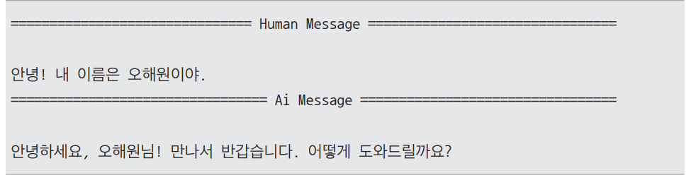  
  
이제 챗봇이 이름을 기억하는지 확인한다. 이때 앞서 사용한 것과 동일한 thread_id가 포함된 config를 계속 전달해야 맥락이 유지된다.  
  
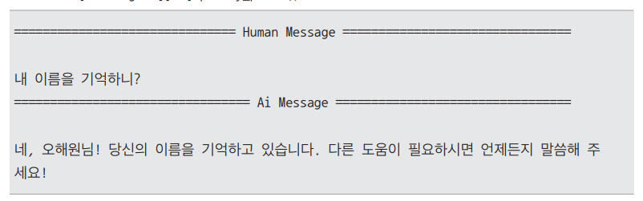  
  
이처럼 메모리에 대화 맥락(context)을 저장하고 있기 때문에 여러 턴에 걸친 대화에서도 이전 대화 내용을 활용하여 답변을 생성한다.  
  
단 해당 내용은 thread_id = 1에 저장되어 있기 때문에 다음과 같이 thread_id를 변경하면 챗봇은 thread_id = 1 에서 했던 대화 내용은 기억하지 못한다.  
  
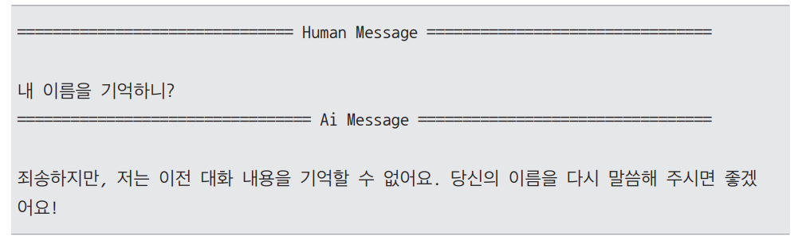  
  
이처럼 thread_id 값에 따라 챗봇이 기억하는 대화 맥락이 분리된다. 이제 체크포인트에 어떤 정보가 저장되어 있는지 확인해본다. graph 객체의 get_state() 
메서드를 사용하면 현재 그래프 상태의 스냅샷을 반환하므로 체크포인트에 저장된 정보를 확인할 수 있다.  
  
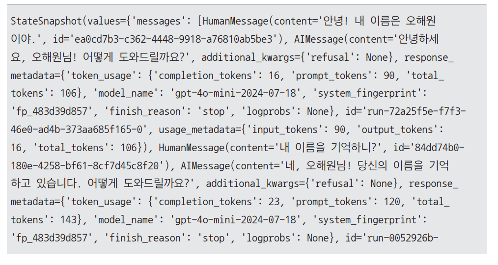  
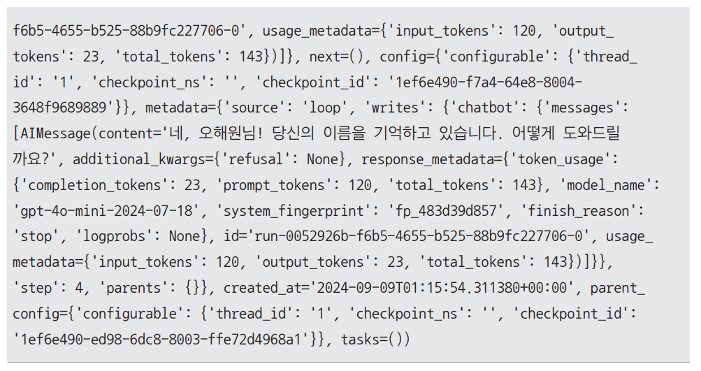  
  
StateSnapshot의 출력 결과에는 지금까지 주고받은 모든 메시지와 상태값, 각종 파라미터의 히스토리가 포함되어 있다. 즉 StateSnapshot은 해당 thread_id에 
저장된 모든 맥락을 보여주는 역할을 하며 이를 통해 멀티턴 대화가 어떻게 유지되고 있는지 직접 확인할 수 있다.  
  
# **루프 개입하기**  
때때로 에이전트의 행동을 신뢰할 수 없어 작업을 성공적으로 수행하기 위해 인간의 개입이 필요할 수 있다. 가령 에이전트가 계획한 다음 작업을 직접 검토하고 
승인하거나 그래프 실행을 수동으로 중단하고 흐름을 수정하는 등의 작업이 필요할 수 있다.  
  
랭그래프에서는 이러한 인간 개입(human-in-the-loop)을 쉽게 구현할 수 있다. 그래프를 컴파일하는 graph_builder.compile() 메서드를 호출할 떄 
interrupt_before 파라미터에 개입하고자 하는 노드를 명시하면 해당 노드를 실행하기 직전에 흐름이 멈춘다.  
  
LANG_GRAPH.ipynb(루프 개입하기)  
  
이처럼 interrupt_befor 파라미타에 tools로 명명된 도구 노드를 선언한다면 tools 노드를 호출하기 전에 흐름이 멈추게 된다. interrupt_before 
파라미터에는 리스트 형식으로 여러 개의 노드를 지정할 수도 있다.  
  
다음과 같이 graph.stream()을 실행하여 "지금 서울 날씨 어때?"라는 질문을 입력하면 도구 호출이 필요한 상태에서 실행이 중단된다.  
  
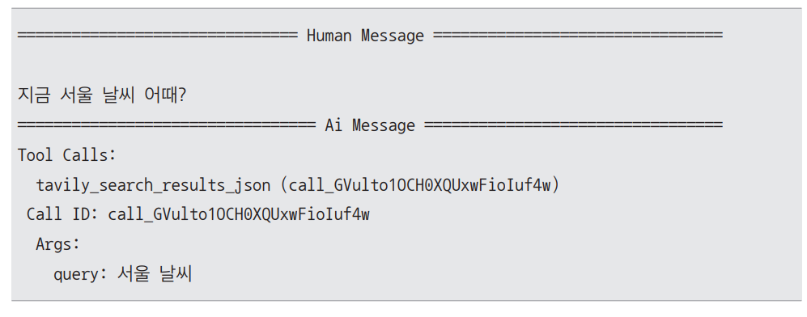  
  
기존 예제의 출력과 다르게 AI 메시지에 응답이 들어 있지 않고 도구 호출 파라미터들이 담겨 있다. 도구 노드를 호출하기 위한 정보들은 갖춰 놓고 호출 직전에 
멈춰 있는 상태다.  
  
이제 get_state() 메서드를 통해 현재 그래프 상태의 스냅샷을 가져온 뒤 다음 실행될 노드가 무엇인지 조회해본다.  
  
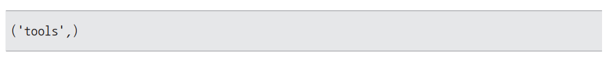  
  
다음 노드가 tools 메서드임을 확인할 수 있다. 현재 그래프는 더 진행되지 않고 멈춰 있으므로 지금 시점에서 상태 변경이 필요하다면 마음껏 업데이트할 
수 있다. 예를 들어 다음 단계에 도구 사용이 예정되어 있지만 도구 호출을 하지 않고 임의의 응답을 강제로 입력해본다.  
  
먼저 snapshot.values["messages"][-1]을 통해 최근 메시지를 가져와서 그 안의 tool_call id 값을 저장한다. 이 id는 ToolMessage를 직접 수정할 
떄 필요하다.  
  
"서울의 날씨는 매우 맑아요."라는 응답을 포함하는 새로운 메시지 new_messages를 정의한다. 도구 노드의 응답은 ToolMessage와 AIMessage를 동시에 포함하므로 
두 메시지를 동일한 형식으로 맞춘다.  
  
이후 graph 객체의 update_state() 메서드를 호출하여 현재의 상태값을 업데이트할 수 있다. 정의한 new_messages를 인자로 전달하여 업데이트한다.  
  
LANG_GRAPH.ipynb(state 업데이트)  
  
이제 get_state() 메서드를 다시 호출하여 그래프의 상태(즉, messages)가 실제로 업데이트되었는지 학인한다. 가장 최근 두 개의 메시지를 조회해 보면 다음과 
같이 업데이트되었음을 확인할 수 있다.  
  
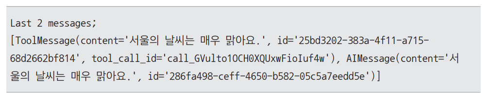  
  

