# **리액트 에이전트를 활용한 RAG**  
프린스턴 대학교와 구글 연구원들이 공동으로 개발한 ReAct 방법론에 대해 알아본다. ReAct는 Reason(추론)과 Act(행동)를 결합한 용어로 대규모 언어 모델이 
추론과 행동을 유기적으로 함께 사용ㅇ하며 문제를 해결하는 방식을 의미한다.  
  
ReAct 방법론의 핵심은 대규모 언어 모델이 이전에 경험하지 못한 상황이나 정보가 부족한 상황에서도 언어 모델 스스로가 적절한 의사결정을 통해 문제를 
해결할 수 있도록 하는 것이다. 이 방법론은 인간의 자연스러운 문제 해결 과정을 모델링하여 만들어졌으며 '생각 -> 행동 입력 -> 관찰' 사이클을 목표를 
달성할 떄까지 계속 반복하는 구조다. 하나의 사이클에서 각 단계가 지니는 의미는 다음과 같다.  
  
- 생각(Thought): 현재 상황을 분석하고 다음 행동을 추론하는 단계  
- 행동(Action): 필요한 구체적 행동을 선택하는 단계  
- 행동 입력(Action Input): 선택한 행동에 필요한 구체적인 값을 정하는 단계  
- 관찰(Observation): 행동 결과를 확인하는 단계이며 이를 바탕으로 다음 생각으로 이어진다.  
  
이 개념을 이해하기 위해 인간의 일상적인 사고 과정을 해당 사이클에 대입하여 예를 들어본다. 주방에서 파스타를 요리하는 상황을 가정해 본다.  
  
- 첫 번째 생각(Thought): 파스타를 삶아야 한다. 파스타를 삶으려고 하는데 물의 양을 정확히 모르겠다. 요리책을 봐야겠다.  
- 행동(Action): 요리책 펼치기  
- 행동 입력(Action Input): 목차에서 '파스타' 항목을 찾아 해당 페이지로 이동  
- 관찰(Observation): 파스타 레시피를 찾았다. 100g당 물 1L가 필요하다는 정보가 있다.  
  
- 두 번째 생각(Thought): 파스타 레시피에서 100g당 물 1L가 필요하단 사실을 알았다. 파스타 300g을 요리할 예정이다. 따라서 물이 3L 필요하겠다. 계량컵을 찾아야겠다.  
- 행동(Action): 주방 서랍 찾아보기  
- 행동 입력(Action Input): 계량컵을 찾기 위해 아래 서랍을 열어본다.  
- 관찰(Observation): 물의 양을 측정할 수 있는 계량컵을 찾았다.  
  
이 다음은 계량컵을 찾았다는 관찰 결과를 바탕으로 다음 행동을 위한 세 번째 생각과 행동이 이어질 것이다. 이처럼 우리는 일상에서 생각을 통해 상황을 
파악하고 행동을 결정하며 구체적으로 실행하여 행동의 결과를 관찰한다. 이어서 다시 다음 생각을 하는 과정을 반복적으로 거친다.  
  
ReAct는 이러한 인간의 자연스러운 문제 해결 방식을 대규모 언어 모델을 통해 구현한 것이다. 대규모 언어 모델은 마치 사람처럼 이전 관찰 결과를 바탕으로 
새로운 생각을 하고, 그에 따른 행동을 선택하며, 그 결과를 다시 관찰하는 과정을 반복하게 된다. 이 반복적인 과정을 통해 모델은 현재 상황에 따라 적절한 
행동을 취할 수 있게 된다.  
  
ReAct 방법론을 적용하여 RAG 문제를 해결하는 과정을 살펴본다. 이를 통해 대규모 언어 모델이 어떻게 실제 상황에서 유연하게 대응하고 문제를 해결하는지 
이해할 수 있다.  
  
# **생각의 사슬**  
ReAct 방법론에서는 행동을 결정하기 전에 항상 생각이라는 과정을 거친다. 대규모 언어 모델이 무언가 답을 결정하기 전에 생각하는 과정을 거치도록 하는 
기법을 생각의 사슬(Chain of Thought, CoT)이라고 한다. 이 개념은 Chain-of-Thought Prompting Elicits Reasoning in Large Language Models 
논문에서 대규모 언어 모델의 답변 정확도를 높일 수 있는 방법으로 제시했으며 ReAct 에서도 이 방법을 사용한다.  
  
생각의 사슬이란 대규모 언어 모델이 답을 최종적으로 결정하기 전에 답을 찾아가는 과정을 글로 써내려가도록 하면 모델이 정답에 더 정확하게 도달할 수 
있다는 아이디어다. 조금 더 간단하게 설명하면 답을 결정하기 전에 대규모 언어 모델이 풀이 과정 먼저 작성하도록 하면 더 정확한 답에 도달한다는 뜻이다.  
  
ReAct 논문에서는 생각의 사슬 개념을 차용하여 모델이 다음 행동을 결정하기 전에 생각이라는 과정을 반드시 거치도록 하여 현재 상황에 맞는 적절한 다음 
행동을 좀 더 정확히 결정하도록 유도한다. 생각의 사슬이라는 아이디어는 비단 ReAct 방법론에만 쓰이는 것이 아니며 대규모 언어 모델이 답을 결정해야 하는 
많은 문제에서 사용할 수 있다. 일반 프롬프트와 생각의 사슬을 유도하는 프롬프트의 차이를 비교하며 예를 들어본다.  
  
  
  
위 그림의 일반 프롬프트를 사용한 경우를 살펴본다. 일반 프롬프트로 질문할 때 대규모 언어 모델에게 예시를 하나 제시한다. 예시로 '홍길동의 테니스 공 문제'를 
주고 그에 대한 답을 '정답:11개'라고 알려준다. 이때 '정답:11개'와 같이 단답형으로 답변하는 모습을 예시로 제공했다.  
  
대규모 언어 모델은 예시가 주어지면 해당 예시를 흉내내려는 특성이 있다. 예시에서 단답형으로 답변했으므로 대규모 언어 모델은 '홍길동의 테니스 공 문제' 예시를 
참고하여 실제로 답해야 하는 '카페에 있는 사과' 문제에도 단답형으로 답변한다.  
  
그렇게 답변한 정답: 27개는 오답이다. 그렇다면 이번에는 답을 적기 전에 풀이 과정부터 적도록 유도해본다. 생각의 사슬을 유도하는 프롬프트다.  
  
  
  
이번에는 예시로 작성된 '홍길동의 테니스 공 문제'에서 풀이 과정을 먼저 작성하고 답변을 작성하는 모습을 보여줬다. 그 후에 실제로 '카페에 있는 사과' 
문제를 풀어보면 주어진 예시를 흉내내려는 특성에 따라서 풀이 과정을 먼저 작성하고 답변을 한다. 그리고 이렇게 작성한 답변은 정답이다. 항상 보장되는 것은 
아니지만 동일한 문제를 풀게 하더라도 '풀이 과정'(또는 '생각')을 거친 후에 답변하도록 하면 성능이 오르는 경우가 많다. 이는 대규모 언어 모델에서 
심심찮게 발견할 수 있는 현상이다.  
  
그리고 이와 같은 생각의 사슬 프롬프트를 이용하여 대규모 언어 모델이 도구의 선택이나 입력값을 적절하게 사용할 수 있도록 유도하는 것이 ReAct 방법론이다.  
  
# **에이전트 RAG**  
에이전트 RAG는 RAG에 대규모 언어 모델의 의사결정 능력을 결합한 시스템이다. 여기서 '에이전트'란 특정 목표를 달성하기 위해 현재 상황을 인식하고 
목표 해결을 위해 방법을 추론하며 다음에 할 행동을 계획하고 실행할 수 있는 AI 시스템을 의미한다.  
  
앞서 설명한 생각 -> 행동 -> 행동 입력 -> 관찰 사이클을 목표를 달성할 때까지 계속 반복하는 ReAct 방법론은 대표적인 에이전트의 구현 방식 중 하나다.  
  
두 개의 서로 다른 PDF 파일로부터 두 개의 검색기를 각각 만들고 이를 ReAcT 에이전트와 연결하여 복잡한 질문을 처리할 수 있는 에이전트 RAG를 구현한다.  
  
# **라이브러리와 데이터 준비**  
REACT_AGENT.ipynb(환경 설정)  
  
# **필요한 도구 임포트**  
각 도구의 쓰임새는 다음과 같다.  
  
- 문서 처리와 관련된 기본 라이브러리  
1. os: API 키와 같은 중요한 정보를 저장할 때 사용하는 기본 라이브러리다. 여기서는 오픈 AI API 키 값을 설정하늗데 사용한다.  
2. requests: 인터넷에서 정보나 파일을 요청할 떄 사용하는 라이브러리다. 여기서는 실습에 사용할 학습 데이터를 다운로드하는데 사용한다.  
  
- 문서 로딩과 분할  
1. PyMuPDFLoader: PDF 문서를 읽어들이고 텍스트를 추출하는 도구다.  
2. RecursiveCharacterTextSplitter: 긴 문서를 의미 있는 단위로 분할하는 도구로 문장과 단락의 문맥을 보존하며 텍스트를 청크 단위로 나눈다.  
  
- 임베딩과 벡터 저장소  
1. OpenAIEmbeddings: 오픈AI의 임베딩 모델을 사용해 텍스트를 벡터로 변환한다.  
2. Chroma: 벡터화된 텍스트를 저장하고 검색하기 위한 벡터 데이터베이스다.  
  
- ReAct 에이전트 구성  
1. create_retriever_tool: 벡터 검색을 ReAct 에이전트의 도구로 변환한다.  
2. hub: LangChain의 프롬프트 템플릿 저장소에 접근한다.  
3. ChatOpenAI: 오픈AI의 챗GPT 모델을 활용하기 위한 인터페이스다.  
4. AgentExecutor, creaste_react_agent: ReAct 에이전트를 생성하고 실행하는 핵심 컴포넌트다.  
5. PromptTemplate: 에이전트의 프롬프트를 템플릿화하여 관리한다.  
  
# **오픈 AI키 설정**  
답변을 생성하는 데 ChatGPT API를 사용하므로 오픈 AI API 키를 .env 파일에서 로드한다.  
  
# **실습 데이터 다운로드**  
인터넷을 통해 이번 실습에서 사용할 데이터를 다운로드한다.  
  
REACT_AGENT.ipynb(데이터 다운로드)  
  
이 코드는 일본과 미국의 ICT 정책 보고서 PDF를 로컬 환경으로 가져온다. urls 리스트는 Github의 raw 콘텐츠 URL을 담고 있다. 각 URL은 2024년 
발행된 일본과 미국의 ICT 정책 보고서를 가리킨다.  
  
반복문에서 각 URL의 파일을 차례로 다운로드한다. split() 메서드로 URL의 마지막 부분에서 파일명을 추출하고 requests로 원격 파일의 내용을 받아온다. 
받아온 내용은 바이너리 쓰기 모드로 로컬에 저장되며 저장이 끝날 때마다 완료 메시지가 출력된다. 이 파일들은 벡터 데이터베이스를 구축할 떄 원본 자료로 
사용한다.  
  
# **에이전트 도구 만들기**  
주어진 PDF 파일들을 임베딩하고 벡터 데이터베이스에 적재한다. 이어서 이들을 ReAct 에이전트가 상황에 따라 선택해서 사용할 수 있는 도구들로 정의한다.  
  
# **벡터 데이터베이스**  
주어진 문서들을 임베딩하기 위해 오픈AI 임베딩 모델 객체 embd를 선언한다.  
  
REACT_AGENT.ipynb(벡터 데이터베이스)  
  
PDF 문서를 벡터 데이터베이스로 변환하고 사용자 질의로부터 유사한 문서를 반환하는 검색기 객체인 retruever를 생성하는 함수 create_pdf_retriever를 
구현한다.  
  
create_pdf_retriever 함수는 PDF 파일 경로와 벡터 저장소 경로, 오픈AI 임베딩 모델을 필수로 입력받으며 청크 크기와 오버랩 크기는 선택적 매개변수로 
기본값이 각각 512와 0으로 설정되어 있다.  
  
함수 내부적으로 PDF를 처리하는 과정은 세 단계로 이루어진다. 먼저 PyMuPDF 라이브러리로 PDF를 읽어들인다. 그 다음 RecursiveCharacterTextSplitter를 
사용해 텍스트를 청크 단위로 분할한다. 이는 긴 문서를 다수의 문서로 분할하기 위함이다. 분할된 다수의 문서들은 오픈AI의 임베딩 모델을 통해 Chroma 벡터 
데이터베이스에 저장된다. 마지막으로 create_pdf_retriever 함수는 생성된 벡터 데이터베이스의 검색 인터페이스(retriever)를 반환한다. 이 retriever는 
자연어 질의에 대해 관련성 높은 PDF 내용을 검색할 수 있는 검색기다.  
  
이제 이 함수를 이용하여 일본 ICT 정책에 대해 검색하는 검색기와 미국 ICT 정책에 대해 검색하는 검색기를 각각 만든다.  
  
create_pdf_retriever 함수를 사용해 일본과 미국의 ICT 정책 문서를 각각의 벡터 데이터베이스 검색기로 생성한다. persist_directory에 "db_ict_policy_japan_2024"와 
"db_ict_policy_usa_2024"라는 서로 다른 경로를 지정함으로써 두 문서의 벡터 데이터베이스가 서로 영향을 주지 않도록 독립적으로 저장하여 관리할 수 있다. 
만약 같은 경로를 사용한다면 두 번째 문서를 처리할 떄 첫 번쨰 문서의 데이터가 덮어써지거나 섞일 수 있기 떄문에 이렇게 경로를 분리하는 것이 중요하다.  
  
일본 ICT 정책의 경우 "ict_japan_2024.pdf"파일을 읽어 "db_ict_policy_japan_2024" 디렉터리에 벡터 데이터베이스를 생성한다. 마찬가지로 미국 ICT 
정책은 "ict_usa_2024.pdf" 파일을 "db_ict_policy_usa_2024" 디렉터리에 저장한다.  
  
이렇게 만든 두 개의 retriever 객체를 create_retriever_tool 함수를 사용해 ReAct 에이전트가 사용할 수 있는 검색 도구로 변환한다.  
  
REACT_AGENT.ipynb(ReAct 에이전트 검색 도구)  
  
create_retriever_tool 함수는 retriever 객체를 ReAct 에이전트가 활용할 수 있는 도구 형태로 변환해주는 함수다. 앞서 생성한 retriever_japan과 
retriever_usa 객체를 바탕으로 도구의 이름(name)과 설명(description)을 추가하여 ReAct 에이전트가 활용할 수 있는 형태로 만든다.  
  
description에는 각 검색기의 상세한 용도를 작성해야 한다. 예를 들어 일본 ICT 검색기의 경우 "일본의 ICT 시장 동향 정보를 제공합니다. 일본 ICT와 
관련된 질문은 해당 도구를 사용하세요."라고 작성했다. 여기서 주의할 점은 각 도구에 대한 description을 매우 자세하게 작성해야 한다는 점이다. 이후 
ReAct 에이전트가 동작할 떄 에이전트는 여기에 적힌 설명을 보고 사용자의 질문에 따라 도구를 선택한다. 따라서 description에 도구에 대한 설명이 
제대로 적혀 있지 않다면 에이전트는 상황에 맞는 도구를 제대로 선택할 수 없으므로 주의해야 한다.  
  
생성된 jp_engine과 usa_engine은 tools 리스트에 담았다. 이렇게 만든 tools 리스트는 나중에 코드에서 ReAct 에이전트에게 전달된다. 에이전트는 이들 
도구의 상세한 description을 통해 각 질문에 가장 적합한 도구를 선택하고 효과적인 검색을 수행할 수 있게 된다.  
  
# **에이전트 프롬프트 설정**  
ReAct 에이전트를 동작시키는 프롬프트를 작성한다. 랭체인에는 기본적으로 ReAct 에이전트를 동작시킬 때 기본값으로 제공하는 프롬프트가 있다. 하지만 랭체인에서 
기본값으로 제공하는 프롬프트는 너무 단순하다. 따라서 에이전트의 제대로 된 동작을 유도하려면 사용자가 조금 더 자세하게 작성하는 것이 좋다. 먼저 ReAct 에이전트의 
동작 과정을 이해하기 위해 랭체인에서 제공하는 기본 프롬프트를 확인해본다.  
  
REACT_AGENT.ipynb(기본 ReAct 프롬프트)  
  
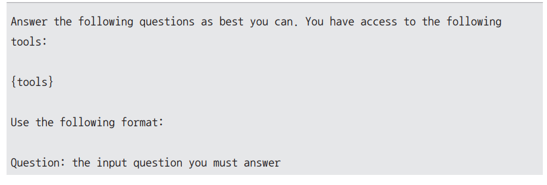  
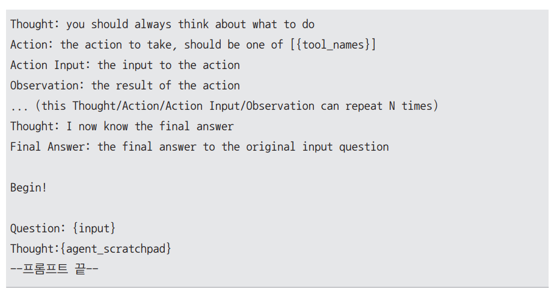  
  
기본 프롬프트가 영어로 작성되어 있다. 이를 좀 더 쉽게 이해할 수 있게 한글로 번역하면 다음과 같다.  
  
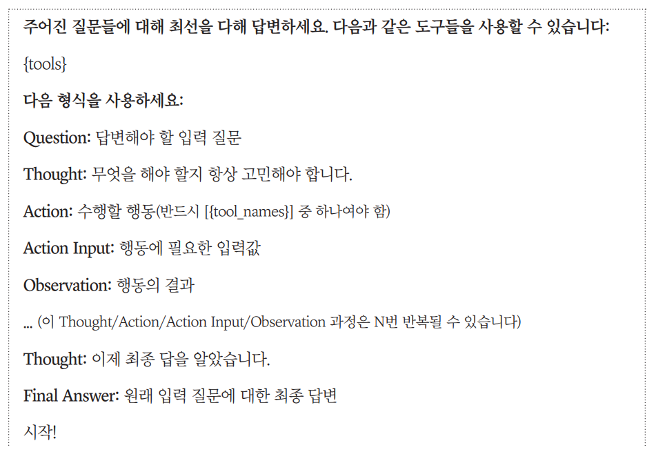  
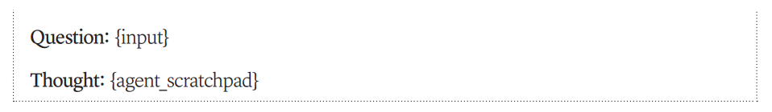  
  
프롬프트 사이에 중괄호 {}로 감싼 부분은 변수에 해당한다. 실제 실행 시에는 각 변수에 적절한 값이 채워지는 구조다. 프롬프트에 속해 있는 변수들의 
역할은 아래와 같다.  
  
- {tools}: 에이전트가 사용할 수 있는 도구들의 설명이 포함된 목록. 예를 들어 계산기나 벡터 데이터베이스, 다양한 API 등이 해당할 수 있다. 이번 
실습에서는 create_retriever_tool()에서 정의한 도구들의 이름(name)과 설명(description)이 해당 위치에 들어간다. 다시 말해 {tools}에는 japan_ict와 
usa_ict라는 두 개의 도구에 대한 설명이 포함된다.  
- {tool_names}: 에이전트가 선택할 수 있는 도구의 이름들을 기재한다. 앞서 설명한 {tools}에는 도구들의 이름과 설명이 포함되지만 여기에는 설명 
없이 도구들의 이름만 리스트 형태로 들어간다. 다시 말해 {tool_names}에 들어가는 값은 {japan_ict, usa_ict}다.  
- {input}: 사용자가 현재 물어본 질문이 이 부분에 들어간다. 에이전트는 이 질문을 해결하기 위해 주어진 도구들을 활용하게 된다.  
- {agent_scratchpad}: 에이전트의 모든 사이클(Thought/Action/Observation의 기록)이 이 부분에 누적된다. 이를 통해 에이전트는 이전의 사이클들을 
참고하여 다음 행동을 결정할 수 있다.  
  
앞선 프롬프트의 구성요소를 살펴보면 먼저 에이전트가 사용할 수 있는 도구들을 설명하고 문제 해결을 위해 "Thought/Action/Action Input/Observation"의 각 
사이클을 N번 반복할 수 있다고 안내한다. 프롬프트에서 주목할 점은 Thought 단계를 각 Action 전후에 하도록 지시한다는 점이다. 이는 에이전트가 행동을 
취하기 전에 충분히 고민하고 또 행동의 결과를 관찰한 후에도 다시 한번 생각하면서 사이클을 돌도록 유도한다.  
  
또한 사용자의 Question에 답하기 위한 Observation(관찰 결과)이 충분히 취합되면 Final Answer(최종 답변) 전에 "이제 최종 답을 알았습니다."라는 
명시적인 마지막 생각 단계를 작성하도록 하여 에이전트가 자신의 결론에 확신을 갖는 경우에 답변하도록 설계되었다.  
  
이번 실습에서는 기본으로 제공되는 프롬프트를 사용하지 않고 프롬프트를 한글로 변경하고 더 자세한 설명을 추가하여 실습한다. template이라는 문자열 변수에 다음과 
같이 새로운 프롬프트를 작성하고 PromptTemplate.from_template() 안에 해당 문자열을 전달하면 에이전트가 사용할 프롬프트 객체를 만들 수 있다.  
  
REACT_AGENT.ipynb(사용자 정의 ReAct 프롬프트)  
  
새롭게 사용할 프롬프트가 prompt라는 변수에 저장되었다. 기본으로 제공되는 프롬프트와는 달리 ## 추가적인 주의사항 이라는 내용이 추가되었는데 더 나은 
성능을 얻기 위해 임의로 추가한 내용이다. 이처럼 ReAct 에이전트를 사용할 때는 본인이 직접 작성한 커스텀 프롬프트를 사용하여 더 자세하게 설명하면 좋은 성능을 
얻을 수 있다.  
  
# **에이전트 객체 생성**  
ReAct 에이전트를 동작시키기 위해 작성한 프롬프트를 대규모 언어 모델에 설정하여 에이전트 객체를 생성한다.  
  
REACT_AGENT.ipynb(ReAct 에이전트 생성)  
  
랭체인의 ChatOpenAI()를 사용하여 llm 객체를 생성한다. gpt-4o 모델을 사용하고 모델 답변의 창의성을 제어하는 temperature 값을 0으로 설정해 초기화한다. 
temperature 값을 0으로 사용하여 모델의 답변 다양성을 줄이는 이유는 에이전트를 생성할 떄는 예측하지 못한 창의적인 답변을 얻고자 하기보다는 지시사항에 
명확히 따르기를기대하는 상황이기 때문이다.  
  
이어서 앞서 만든 검색 도구들(tools)과 llm 객체를 결합해 react_agent를 생성한다. 또한 앞서 작성한 커스텀 프롬프트인 prompt 매개변수를 전달한다.  
  
마지막으로 react_agent와 tools를 AgentExecutor로 감싼다. vervose=True로 설정하면 모델이 최종 답변을 얻기까지 내부적으로 몇 번레 걸쳐서 Thought/
Action/Action Input/Observation 사이클을 수행하는 과정을 사용자도 볼 수 있게 된다. handle_parsing_errors=True로 설정해 파싱 오류가 
발생하더라도 자동으로 처리한다. 여기서 파싱 오류란 Thought/Action/Action Input/Observation을 작성하는 과정에서 간혹 대규모 언어 모델이 
형식을 잘못 작성하는 경우를 의미한다.  
  
# **에이전트 RAG 실습**  
에이전트에게 질문을 입력하고 답변을 얻는다. react_agent_executor.invoke({"input": "사용자의 질문"}) 형식으로 에이전트에게 질문을 입력할 수 있다. 
여기서는 "한국과 미국의 ICT 기관 협력 사례"라는 질문을 입력한다.  
  
REACT_AGENT.ipynb(ReAct 에이전트 실습)  
  
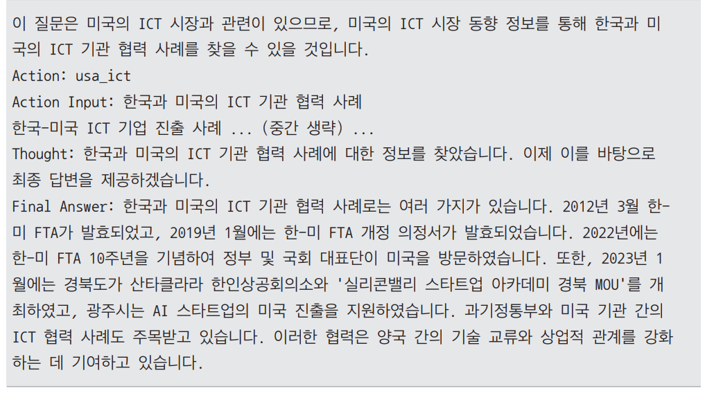  
  
만들었던 ReAct 에이전트 프롬프트에서 template 이라는 변수에 저장했던 프롬프트를 보면 마지막이 Thought: {agnet_scratchpad}로 끝난다. 다시 말해 
에이전트의 입력으로 Thought: 까지는 주어졌으므로 가장 처음에 출력되는 문장은 Thought에서 이어지는 에이전트의 첫 번재 생각에 해당한다. 첫 실행에서는 
누적된 기록이 없으므로 이것이 에이전트가 문제를 풀기 위해 가장 처음하는 생각이 된다.  
  
또한 앞의 출력 결과를 해석할 떄 랭체인에서 Observation 이라는 문자열은 별도로 출력되지 않는다. 즉 Action Input:과 Thought: 사이에 출력되는 내용은 
검색 결과에 해당한다. 따라서 에이전트로부터 얻은 앞의 결과를 정리하면 다음과 같다.  
  
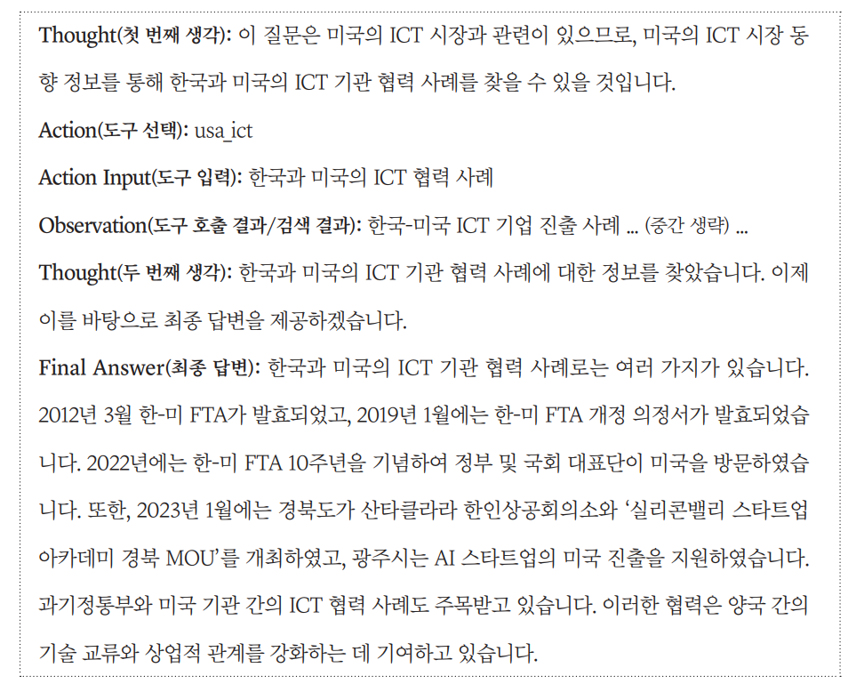  
  
에이전트는 첫 번쨰 생각에서 "한국과 미국의 ICT 기관 협력 사례"라는 질문이 미국 ICT 시장과 관련이 있으므로 미국의 ICT 시장 동향 정보를 찾아야 한다고 
판단한다. 다시 말해 두 개의 사용 가능한 도구 중 usa_ict를 사용해야 한다고 판단한 것이다. 실제로 첫 번째 생각 이후에 작성한 Action에서 usa_ict를 
선택하고 Action Input에는 "한국과 미국의 ICT 협력 사례"라고 작성하여 검색을 시도하였다.  
  
이후 검색 결과가 나오며 이 검색 결과를 바탕으로 에이전트는 두 번째 생각을 작성한다. 에이전트는 두 번째 생각에서 질문을 해결하기에 충분한 정보를 얻었다고 
판단하고 Final Answer(최종 답변)를 작성했다. 만약 최종 답변만 별도로 값으로 꺼내오고 싶다면 다음과 같이 출력할 수 있다.  
  
```
print('최종 답변:', result['output'])
```  
  
이때 최종 답변은 실습이 실행되는 시점에 따라 여기서 얻은 답변과 다소 다를 수 있다. 이번에는 두 개의 서로 다른 도구를 호출해야만 문제를 해결할 수 
있는 "미국과 일본의 ICT 주요 정책의 공통점과 차이점을 설명해줘."라는 질문을 입력한다. 해당 질문을 해결하려면 usa_ict와 japan_ict를 각각 호출해야만 
질문에 답변할 수 있다.  
  
실제 실행 결과를 정리하면 다음과 같은 결과를 얻는다.  
  
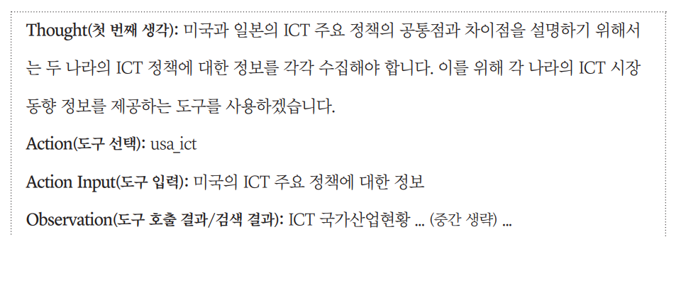  
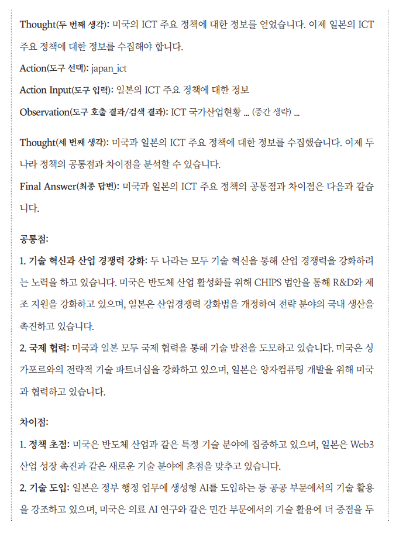  
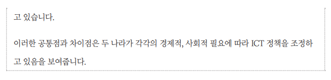  
  
실행 과정을 보면 첫 번째 생각에서 질문 해결을 위해서 각 도구를 사용해야겠다는 계획을 세우고 먼저 usa_ict를 호출하여 미국의 ICT 주요 정책에 대한 
정보를 얻는다. 두 번째 생각에서는 미국 ICT 주요 정책에 대한 정보를 얻었으므로 japan_ict를 호출해야겠다고 판단한 뒤에 이어서 japan_ict를 호출하여 
일본의 ICT 주요 정책에 대한 정보를 얻는다.  
  
이후 두 번의 검색 결과를 바탕으로 에이전트는 세 번쨰 생각을 작성한다. 에이전트는 세 번째 생각에서 질문을 해결하기에 충분한 정보를 얻었다고 판단하고 
Final Answer를 작성한다.  
  
이번에는 보다 복잡한 질문을 입력한다. 이번 질문을 해결하려면 usa_ict를 세 번, japan_ict를 최소 한 번 호출해야만 한다.  
  
실제 실행 결과를 정리하면 다음과 같은 결과를 얻는다.  
  
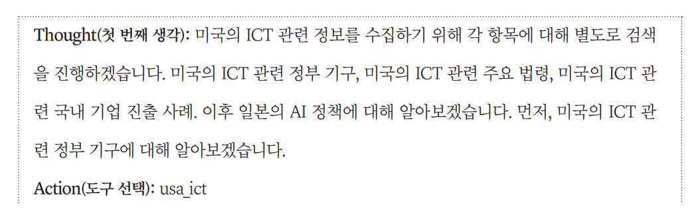  
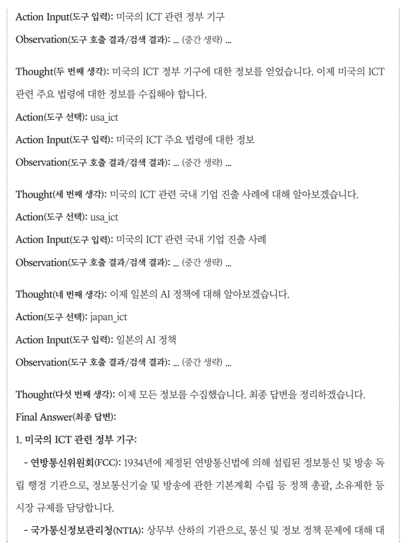  
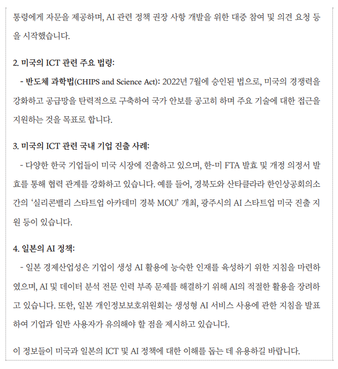  
  
실행 과정을 보면 시작과 함께 에이전트는 질문의 의도에 따라 적절한 도구를 배정하기 위해서 Thought를 거친다. 에이전트는 먼저 미국 관련 세 가지 정보를 usa_ict 
도구로 순차적으로 검색한다('미국의 ICT 관련 정부 기구', '미국의 ICT 관련 주요 법령에 대한 정보', '미국의 ICT 관련 국내 기업 진출 사례'), 각 
검색마다 관찰 결과(Observation)를 확인하고 다음 검색으로 넘어간다.  
  
미국 관련 정보 수집을 마친 후 japan_ict 도구를 사용해 일본의 AI 정책을 검색한다. 모든 정보가 수집되면 에이전트는 이제 모든 정보를 수집했습니다. 
최종 답변을 정리하겠습니다. 라는 생각을 거쳐 체계적인 최종 답변(Final Answer)을 작성한다.  
  
이처럼 에이전트는 간단한 질문부터 다수의 검색 도구가 주어진 상황에서 복잡한 질문을 해결하는 등 일반적인 RAG로 해결할 수 없는 문제도 순차적으로 
차근차근 해결할 수 있는 능력을 갖고 있다.  
  

