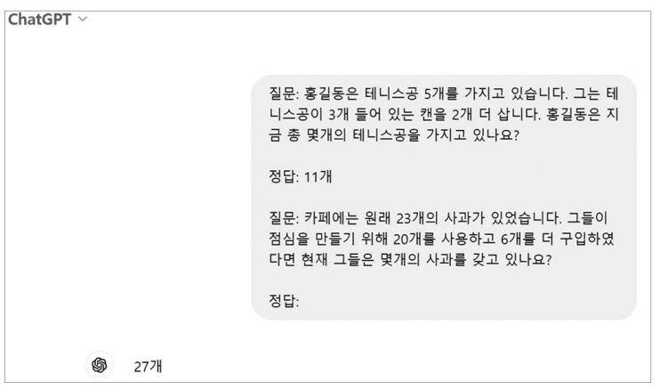
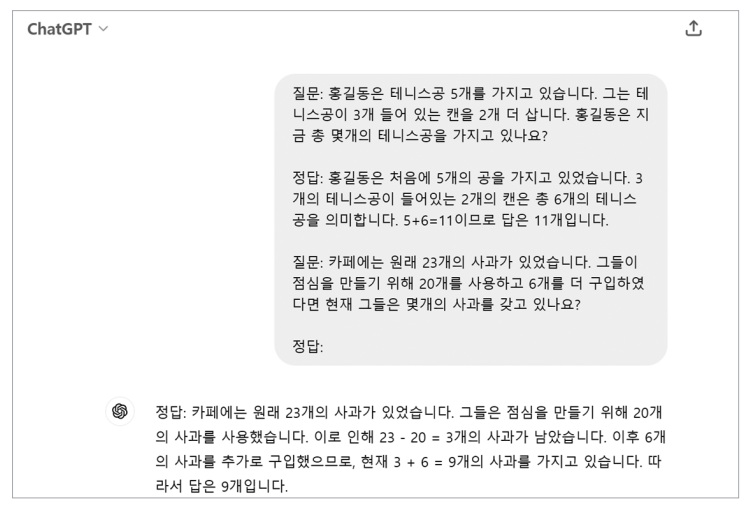

# **리액트 에이전트를 활용한 RAG**  
프린스턴 대학교와 구글 연구원들이 공동으로 개발한 ReAct 방법론에 대해 알아본다. ReAct는 Reason(추론)과 Act(행동)를 결합한 용어로 대규모 언어 모델이 
추론과 행동을 유기적으로 함께 사용ㅇ하며 문제를 해결하는 방식을 의미한다.  
  
ReAct 방법론의 핵심은 대규모 언어 모델이 이전에 경험하지 못한 상황이나 정보가 부족한 상황에서도 언어 모델 스스로가 적절한 의사결정을 통해 문제를 
해결할 수 있도록 하는 것이다. 이 방법론은 인간의 자연스러운 문제 해결 과정을 모델링하여 만들어졌으며 '생각 -> 행동 입력 -> 관찰' 사이클을 목표를 
달성할 떄까지 계속 반복하는 구조다. 하나의 사이클에서 각 단계가 지니는 의미는 다음과 같다.  
  
- 생각(Thought): 현재 상황을 분석하고 다음 행동을 추론하는 단계  
- 행동(Action): 필요한 구체적 행동을 선택하는 단계  
- 행동 입력(Action Input): 선택한 행동에 필요한 구체적인 값을 정하는 단계  
- 관찰(Observation): 행동 결과를 확인하는 단계이며 이를 바탕으로 다음 생각으로 이어진다.  
  
이 개념을 이해하기 위해 인간의 일상적인 사고 과정을 해당 사이클에 대입하여 예를 들어본다. 주방에서 파스타를 요리하는 상황을 가정해 본다.  
  
- 첫 번째 생각(Thought): 파스타를 삶아야 한다. 파스타를 삶으려고 하는데 물의 양을 정확히 모르겠다. 요리책을 봐야겠다.  
- 행동(Action): 요리책 펼치기  
- 행동 입력(Action Input): 목차에서 '파스타' 항목을 찾아 해당 페이지로 이동  
- 관찰(Observation): 파스타 레시피를 찾았다. 100g당 물 1L가 필요하다는 정보가 있다.  
  
- 두 번째 생각(Thought): 파스타 레시피에서 100g당 물 1L가 필요하단 사실을 알았다. 파스타 300g을 요리할 예정이다. 따라서 물이 3L 필요하겠다. 계량컵을 찾아야겠다.  
- 행동(Action): 주방 서랍 찾아보기  
- 행동 입력(Action Input): 계량컵을 찾기 위해 아래 서랍을 열어본다.  
- 관찰(Observation): 물의 양을 측정할 수 있는 계량컵을 찾았다.  
  
이 다음은 계량컵을 찾았다는 관찰 결과를 바탕으로 다음 행동을 위한 세 번째 생각과 행동이 이어질 것이다. 이처럼 우리는 일상에서 생각을 통해 상황을 
파악하고 행동을 결정하며 구체적으로 실행하여 행동의 결과를 관찰한다. 이어서 다시 다음 생각을 하는 과정을 반복적으로 거친다.  
  
ReAct는 이러한 인간의 자연스러운 문제 해결 방식을 대규모 언어 모델을 통해 구현한 것이다. 대규모 언어 모델은 마치 사람처럼 이전 관찰 결과를 바탕으로 
새로운 생각을 하고, 그에 따른 행동을 선택하며, 그 결과를 다시 관찰하는 과정을 반복하게 된다. 이 반복적인 과정을 통해 모델은 현재 상황에 따라 적절한 
행동을 취할 수 있게 된다.  
  
ReAct 방법론을 적용하여 RAG 문제를 해결하는 과정을 살펴본다. 이를 통해 대규모 언어 모델이 어떻게 실제 상황에서 유연하게 대응하고 문제를 해결하는지 
이해할 수 있다.  
  
# **생각의 사슬**  
ReAct 방법론에서는 행동을 결정하기 전에 항상 생각이라는 과정을 거친다. 대규모 언어 모델이 무언가 답을 결정하기 전에 생각하는 과정을 거치도록 하는 
기법을 생각의 사슬(Chain of Thought, CoT)이라고 한다. 이 개념은 Chain-of-Thought Prompting Elicits Reasoning in Large Language Models 
논문에서 대규모 언어 모델의 답변 정확도를 높일 수 있는 방법으로 제시했으며 ReAct 에서도 이 방법을 사용한다.  
  
생각의 사슬이란 대규모 언어 모델이 답을 최종적으로 결정하기 전에 답을 찾아가는 과정을 글로 써내려가도록 하면 모델이 정답에 더 정확하게 도달할 수 
있다는 아이디어다. 조금 더 간단하게 설명하면 답을 결정하기 전에 대규모 언어 모델이 풀이 과정 먼저 작성하도록 하면 더 정확한 답에 도달한다는 뜻이다.  
  
ReAct 논문에서는 생각의 사슬 개념을 차용하여 모델이 다음 행동을 결정하기 전에 생각이라는 과정을 반드시 거치도록 하여 현재 상황에 맞는 적절한 다음 
행동을 좀 더 정확히 결정하도록 유도한다. 생각의 사슬이라는 아이디어는 비단 ReAct 방법론에만 쓰이는 것이 아니며 대규모 언어 모델이 답을 결정해야 하는 
많은 문제에서 사용할 수 있다. 일반 프롬프트와 생각의 사슬을 유도하는 프롬프트의 차이를 비교하며 예를 들어본다.  
  
  
  
위 그림의 일반 프롬프트를 사용한 경우를 살펴본다. 일반 프롬프트로 질문할 때 대규모 언어 모델에게 예시를 하나 제시한다. 예시로 '홍길동의 테니스 공 문제'를 
주고 그에 대한 답을 '정답:11개'라고 알려준다. 이때 '정답:11개'와 같이 단답형으로 답변하는 모습을 예시로 제공했다.  
  
대규모 언어 모델은 예시가 주어지면 해당 예시를 흉내내려는 특성이 있다. 예시에서 단답형으로 답변했으므로 대규모 언어 모델은 '홍길동의 테니스 공 문제' 예시를 
참고하여 실제로 답해야 하는 '카페에 있는 사과' 문제에도 단답형으로 답변한다.  
  
그렇게 답변한 정답: 27개는 오답이다. 그렇다면 이번에는 답을 적기 전에 풀이 과정부터 적도록 유도해본다. 생각의 사슬을 유도하는 프롬프트다.  
  
  
  
이번에는 예시로 작성된 '홍길동의 테니스 공 문제'에서 풀이 과정을 먼저 작성하고 답변을 작성하는 모습을 보여줬다. 그 후에 실제로 '카페에 있는 사과' 
문제를 풀어보면 주어진 예시를 흉내내려는 특성에 따라서 풀이 과정을 먼저 작성하고 답변을 한다. 그리고 이렇게 작성한 답변은 정답이다. 항상 보장되는 것은 
아니지만 동일한 문제를 풀게 하더라도 '풀이 과정'(또는 '생각')을 거친 후에 답변하도록 하면 성능이 오르는 경우가 많다. 이는 대규모 언어 모델에서 
심심찮게 발견할 수 있는 현상이다.  
  
그리고 이와 같은 생각의 사슬 프롬프트를 이용하여 대규모 언어 모델이 도구의 선택이나 입력값을 적절하게 사용할 수 있도록 유도하는 것이 ReAct 방법론이다.  
  
# **에이전트 RAG**  
에이전트 RAG는 RAG에 대규모 언어 모델의 의사결정 능력을 결합한 시스템이다. 여기서 '에이전트'란 특정 목표를 달성하기 위해 현재 상황을 인식하고 
목표 해결을 위해 방법을 추론하며 다음에 할 행동을 계획하고 실행할 수 있는 AI 시스템을 의미한다.  
  
앞서 설명한 생각 -> 행동 -> 행동 입력 -> 관찰 사이클을 목표를 달성할 때까지 계속 반복하는 ReAct 방법론은 대표적인 에이전트의 구현 방식 중 하나다.  
  
두 개의 서로 다른 PDF 파일로부터 두 개의 검색기를 각각 만들고 이를 ReAcT 에이전트와 연결하여 복잡한 질문을 처리할 수 있는 에이전트 RAG를 구현한다.  
  
# **라이브러리와 데이터 준비**  
REACT_AGENT.ipynb(환경 설정)  
  
# **필요한 도구 임포트**  
각 도구의 쓰임새는 다음과 같다.  
  
- 문서 처리와 관련된 기본 라이브러리  
1. os: API 키와 같은 중요한 정보를 저장할 때 사용하는 기본 라이브러리다. 여기서는 오픈 AI API 키 값을 설정하늗데 사용한다.  
2. requests: 인터넷에서 정보나 파일을 요청할 떄 사용하는 라이브러리다. 여기서는 실습에 사용할 학습 데이터를 다운로드하는데 사용한다.  
  
- 문서 로딩과 분할  
1. PyMuPDFLoader: PDF 문서를 읽어들이고 텍스트를 추출하는 도구다.  
2. RecursiveCharacterTextSplitter: 긴 문서를 의미 있는 단위로 분할하는 도구로 문장과 단락의 문맥을 보존하며 텍스트를 청크 단위로 나눈다.  
  
- 임베딩과 벡터 저장소  
1. OpenAIEmbeddings: 오픈AI의 임베딩 모델을 사용해 텍스트를 벡터로 변환한다.  
2. Chroma: 벡터화된 텍스트를 저장하고 검색하기 위한 벡터 데이터베이스다.  
  
- ReAct 에이전트 구성  
1. create_retriever_tool: 벡터 검색을 ReAct 에이전트의 도구로 변환한다.  
2. hub: LangChain의 프롬프트 템플릿 저장소에 접근한다.  
3. ChatOpenAI: 오픈AI의 챗GPT 모델을 활용하기 위한 인터페이스다.  
4. AgentExecutor, creaste_react_agent: ReAct 에이전트를 생성하고 실행하는 핵심 컴포넌트다.  
5. PromptTemplate: 에이전트의 프롬프트를 템플릿화하여 관리한다.  
  
# **오픈 AI키 설정**  
답변을 생성하는 데 ChatGPT API를 사용하므로 오픈 AI API 키를 .env 파일에서 로드한다.  
  
# **실습 데이터 다운로드**  
인터넷을 통해 이번 실습에서 사용할 데이터를 다운로드한다.  
  
REACT_AGENT.ipynb(데이터 다운로드)  
  
이 코드는 일본과 미국의 ICT 정책 보고서 PDF를 로컬 환경으로 가져온다. urls 리스트는 Github의 raw 콘텐츠 URL을 담고 있다. 각 URL은 2024년 
발행된 일본과 미국의 ICT 정책 보고서를 가리킨다.  
  
반복문에서 각 URL의 파일을 차례로 다운로드한다. split() 메서드로 URL의 마지막 부분에서 파일명을 추출하고 requests로 원격 파일의 내용을 받아온다. 
받아온 내용은 바이너리 쓰기 모드로 로컬에 저장되며 저장이 끝날 때마다 완료 메시지가 출력된다. 이 파일들은 벡터 데이터베이스를 구축할 떄 원본 자료로 
사용한다.  
  
# **에이전트 도구 만들기**  
주어진 PDF 파일들을 임베딩하고 벡터 데이터베이스에 적재한다. 이어서 이들을 ReAct 에이전트가 상황에 따라 선택해서 사용할 수 있는 도구들로 정의한다.  
  
