# **RAG 성능을 높이는 LLM 파인튜닝**  
대규모 언어 모델에 사용자가 가진 데이터셋을 추가로 학습시켜서 해당 데이터에 한해서 더 좋은 성능을 얻을 수 있도록 조정하는 과정을 파인튜닝이라고 
한다. 파인튜닝을 통해 다양한 문제를 풀 수 있지만 검색 증강 생성의 성능을 높이기 위해서도 사용할 수 있다.  
  
# **RAFT 논문 살펴보기**  
검색 증강 생성의 성능을 높이고자 데이터셋 제작 방법이나 학습 방법을 고민할 때 제일 먼저 참고하기 좋은 자료로 미국 버클리 대학에서 작성한 "RAFT: 
Adapting Language Model to Domain Specific RAG"라는 논문이 있다. 논문을 직접 살펴볼 수 있는 링크는 다음과 같다.  
  
URL - https://arxiv.org/pdf/2403.10131  
   
# **네거티브 샘플**  
인공지능 분야에서 네거티브 샘플(negative sample)은 주로 모델이 찾고자 하는 대상과 반대되는 예시들을 의마한다. 예를 들어 이메일이 오면 정상 
이메일인지, 스팸 이메일인지 판단하는 스팸 메일 분류기를 만든다고 가정한다. 스팸 메일 분류기 입장에서는 스팸 이메일을 탐지해야 하므로 정상 이메일이 네거티브 
샘플에 해당한다. 그리고 이때 모델이 찾아야 할 대상에 해당하는 스팸 이메일은 네거티브 샘플의 반대로 포지티브 샘플(positive sample)이라고 한다.  
  
  
  
위 그림은 증강 생성의 검색 단계에서 발생할 수 있는 네거티브 샘플들의 예시다. 예를 들어 '한글을 창제한 조선의 왕은?'이라는 사용자 질의에 '장영실', 
'이순신', '이방원', '세종대왕' 총 네 개의 문서가 검색되었다고 가정한다. 대규모 언어 모델이 챗봇의 질문에 답변하려면 '세종대왕' 문서를 참고해야 하고 
나머지 세 개의 문서에는 세종대왕의 한글 창제와 관련된 이야기가 없다. 이때 세 개의 문서는 답변에 참고하지 않을 문서들이므로 여기서 이들 문서는 
네거티브 샘플이다.  
  
다시 말해 검색 증강 생성에서는 사용자 질의에 대한 정답이 있는 문서가 포지티브 샘플, 검색은 되었지만 정답이 포함되지 않은 문서들이 네거티브 샘플이다.  
  
실제로 검색 증강 생성을 하다 보면 검색 결과에 질문과 연관되지 않은 문서가 함께 검색되는 상황이 잦다. 이때 대규모 언어 모델은 해당 상황에서 연관되지 
않은 문서의 내용은 무시하고 연관된 문서의 내용만을 참고해 답변하는 능력이 길러져 있어야 한다. 따라서 RAFT 논문에서는 이러한 상황에 대해 대규모 언어 
모델이 충분히 학습할 수 있도록 학습 데이터에 네거티브 샘플이 포함되도록 데이터셋을 구성하고 있다.  
  
# **생각의 사슬**  
생각의 사슬 기법이란 대규모 언어 모델이 답변을 작성할 때 문제의 인과 관계에 대해 차근차근 풀어서 전개하다 보면 정답에 더 잘 도달할 수 있다는 개념이다. 
즉 '문제-답' 대신에 '문제-풀이-답' 형태로 프롬프트를 구성하도록 하는 것이다. RAFT 논문에서 사용한 생각의 사슬 프롬프트를 확인해 본다.  
  
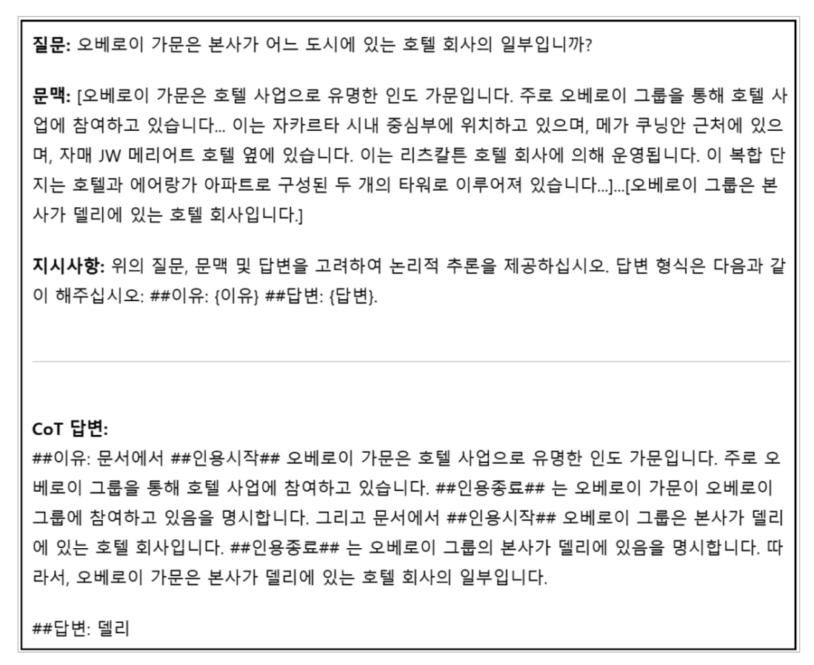  
  
위 그림은 실제 RAFT 논문에서 사용한 프롬프트와 답변 형식이다. 주요 입력으로는 질문, 문맥, 지시사항 세 가지가 존재한다. 사용자가 질문을 입력하면 
대규모 언어 모델은 주어진 문맥으로부터 질문에 대해 답변해야 한다.  
  
문맥은 사용자 질문으로부터 검색된 문서가 들어가는 위치다. 지시사항을 보면 사용자의 질문에 답변하기 전에 먼저 이유를 작성하라고 강제하고 있다. 
답변을 작성하기 전에 중간 추론 과정을 강제하고 실제로 모델은 이유를 작성하고 답변을 작성할 것이므로 이 방식은 생각의 사슬 프롬프트다.  
  
'CoT 답변:' 부분을 보면 실제로 대규모 언어 모델이 생성하게 될 출력이다. 대규모 언어 모델은 주어진 지시사항에 따라 먼저 사용자의 질문을 답변하기 전에 
그 근거를 '##이유:'에 작성해야 한다. RAFT 논문에서는 이유를 작성할 떄 '##인용시작##'과 '##인용종료##'를 사용하여 실제 주어진 문맥에서 원문을 
인용하도록 강제하고 있다. '##인용시작##'과 '##인용종료##' 사이에 있는 문장은 반드시 문맥에 주어진 원문에 존재하는 문장을 그대로 작성해야 한다.  
  
다시 말해 질문에 대한 답변을 작성하기 전에 반드시 원문을 인용하도록 강제함으로써 모델이 주어진 문맥을 통해서만 답변하도록 유도한다. 실제로 검색 증강 
생성에서 검색 결과에 없는 내용인데도 대규모 언어 모델이 질문에 대해 자신이 알고 있는 지식을 답변하는 과정에서 잘못된 답변이 생성되곤 한다. 이를 고려하면 
반드시 원문을 기반으로 답변하도록 강제하는 것만으로도 검색 증강 생성의 성능을 올릴 수 있다.  
  
# **성능 향상을 위한 팁**  
실제 검색 증강 생성 상황에서 발생할 수 있는 다양한 시나리오에 대응하기 위한 데이터셋 유형을 추가로 정리해본다.  
  
# **답변 없음 데이터**  
검색 증강 생성에서 사용자 질의와 관계없는 문서를 네거티브 샘플, 질의와 관계있는 문서를 포지티브 샘플이라 정의했다. 그런데 실제 검색 증강 생성 상황에서는 
검색된 모든 문서가 네거티브 샘플일 수 있다.  
  
  
  
사용자가 갖고 있는 문서들로는 답변할 수 없는 질문을 던지거나 검색 성능이 좋지 않아서 사용자 질의를 고려한 검색 결과를 얻을 수 없는 상황이 그런 경우다. 
이떄 대규모 언어 모델이 검색 문서에 없는 내용이라고 해서 언어 모델 스스로 답변하도록 동작한다면 할루시네이션이 발생하여 완전히 잘못된 답변이 생성될 
여지가 있다.  
  
때문에 모든 검색 문서가 네거티브 샘플일 경우에는 대규모 언어 모델이 '검색 결과를 찾을 수 없습니다'와 같은 답변을 하도록 학습시켜 자체적으로 답변하는 
것을 막을 수 있다. 이어질 실습에서는 이를 위해 '답변 없음' 데이터를 임의로 추가해서 만든 데이터셋을 사용한다.  
  
# **출처 인용**  
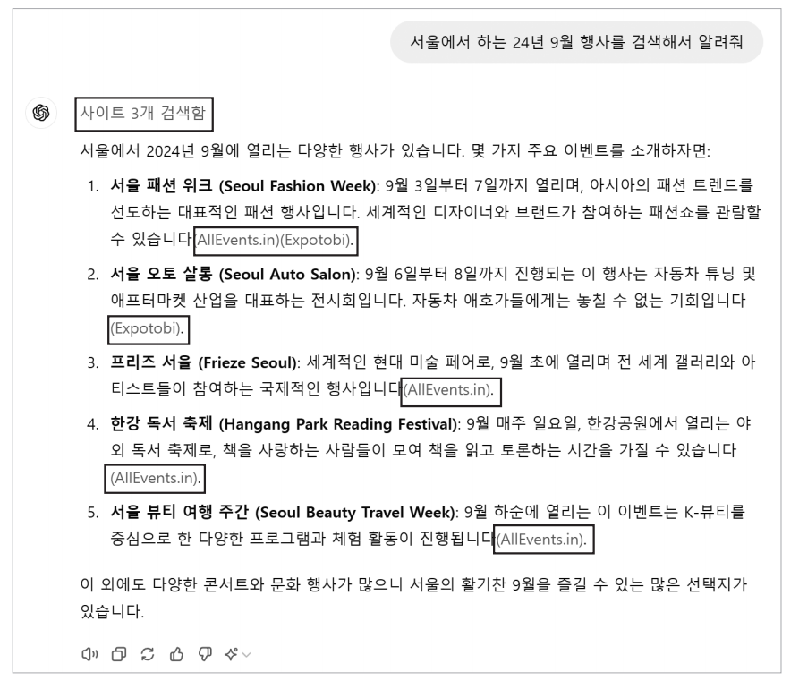  
  
챗GPT는 기본적으로는 검색 기능을 사용하지 않고 언어 모델 스스로 답변을 제공하지만 어떠한 질문을 할 때 '검색해서 알려줘'라는 문장을 붙이면 높은 확률로 
검색을 사용하여 답변한다. 위 그림은 챗GPT에게 '서울에서 하는 24년 9월 행사를 검색해서 알려줘'라고 질의했을 때의 답변을 보여준다.  
  
위쪽에 [사이트 3개 검색함]이라는 표시가 있고 아래에 답변이 제공되고 있다. 그리고 이때 각각의 주요 문장마다 해당 내용을 어떤 웹사이트에서 가져왔는지 
뒤에 괄호와 함께 출처를 남기고 있다. 이렇게 각 주요 답변마다 인용한 출처를 남기면 답변을 보는 사용자 입장에서는 언제든 원문을 확인하여 진위를 검토할 
수 있으므로 신뢰할 수 있는 답변을 얻을 수 있다. 또한 대규모 언어 모델 입장에서도 답변 작성 시 반드시 원 출처를 남기도록 강제하면 잘못된 답변을 할 
가능성이 줄어들게 된다.  
  
실제로 이러한 예를 검색 증강 생성에 적용한 사례를 살펴보자. 다음은 이미 검색 증강 생성에 파인튜닝되어 공개된 대표적인 모델 중 하나인 Orion-14B-Chat-RAG로 
검색 증강 생성을 수행한 예다. 사용자의 질의와 검색 결과가 다음과 같았다고 가정한다.  
  
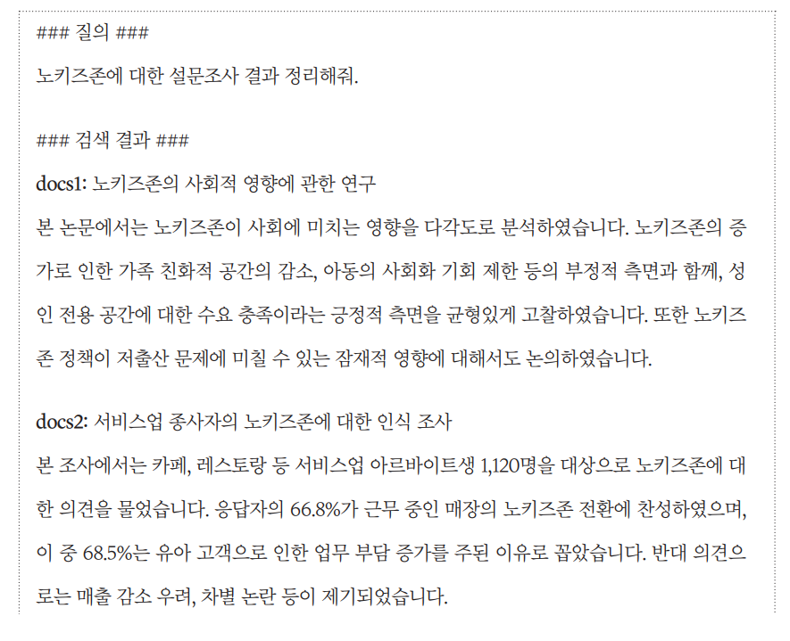  
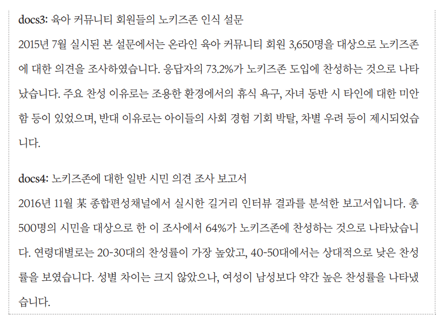  
  
사용자의 질의는 '노키즈존에 대한 설문조사 결과 정리해줘'에 해당하며 총 네 개의 검색 결과를 얻었다고 가정한다. 이에 대해 Orion-14B-Chat-RAG에 
기본으로 설정된 시스템 프롬프트를 사용하여 호출하면 다음과 같은 답변을 얻을 수 있다.  
  
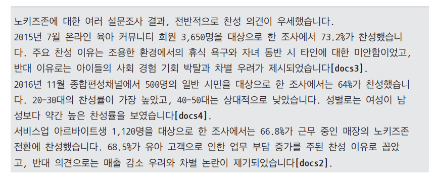  
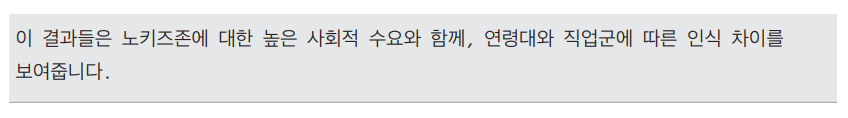  
  
답변 결과를 보면 검색 결과를 바탕으로 답변하며 각 인용한 문장 내지는 단락에 대해 몇 번 문서에서 인용했는지 대괄호 안에 출처를 남기고 있다. 사용자는 
이러한 출처를 통해 실제 원문을 확인하고 답변에 대해 검증할 수 있게 된다. 이처럼 답변의 주요 내용이 검색 결과로 나온 문서 중 어떤 문서에서 나왔는지 
남기도록 학습시키면 사용자에게 신뢰를 줄 수 있을 뿐만 아니라 성능 측면에서도 모델이 잘못된 답변을 할 가능성도 줄일 수 있다.  
  
# **RAG 학습 데이터셋 살펴보기**  
허깅페이스 웹사이트에 검색 증강 생성을 위한 학습 데이터가 있다.  
  
URL - https://huggingface.co/datasets/iamjoon/klue-mrc-ko-rag-dataset  
  
# **학습 데이터 탐색**  
# **학습 데이터 로드하기**  
RAG_DATASET.ipynb(학습 데이터 로드)  
  
학습 데이터를 다운로드받아 데이터의 특징을 살펴본다. 먼저 필요한 라이브러리를 설치한다. 여기서는 허깅페이스로부터 데이터를 다운로드할 수 있는 datasets 
라이브러리를 설치한다.  
  
데이터 전처리를 위한 라이브러리 numpy와 데이터 시각화를 위한 라이브러리 matplotlib 그리고 datasets 라이브러리로부터 허깅페이스의 데이터를 
다운로드하는 데 사용할 load_dataset을 임포트한다.  
  
허깅페이스로부터 데이터를 로드하고 이를 출력해본다. 먼저 데이터셋을 허깅페이스의 datasets 라이브러리를 사용하여 불ㄹ온다. 데이터셋 이름은 "iamjoon/klue-mrc-ko-rag-dataset"
이다. 로드된 데이터셋을 판다스 데이터프레임으로 변환한다. 데이터프레임으로 변환한 이유는 데이터 조작과 분석을 보다 쉽게 하기 위함이다.  
  
데이터프레임에서 실습에 필요한 열만 선택하여 새로운 데이터프레임을 만든다. 선택한 열은 question, search_result, answer, extracted_ref_numbers, 
type이다. 마지막으로 데이터프레임의 상위 5개 행을 출력하여 데이터의 구조와 내용을 확인한다.  
  
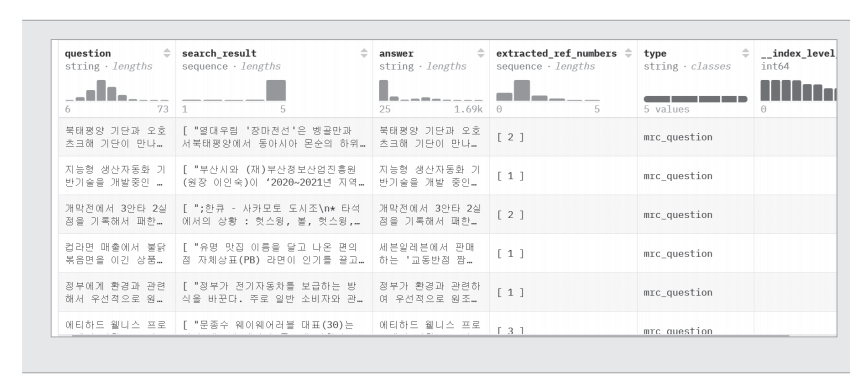  
  
선택한 총 5개의 열이 출력된 것을 확인할 수 있다. 출력된 열은 question(질문), search_result(질문에 대한 검색 결과), answer(최종 답변), extracted_ref_numbers
(답변에서 인용된 문서 번호의 리스트), type(데이터 유형이다.  
  
type열을 살펴면 해당 데이터에 어떤 종류의 값들이 있는지 확인할 수 있다.  
  
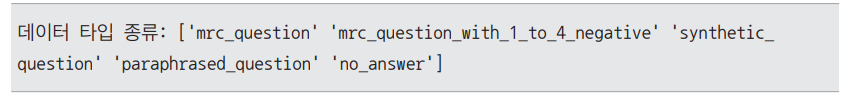  
  
결과를 보면 type에는 총 5가지 종류의 값이 존재한다. 해당 값들은 각각 다음과 같은 데이터의 유형을 나타낸다.  
  
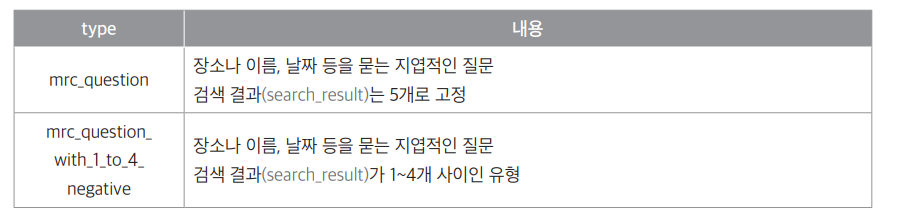  
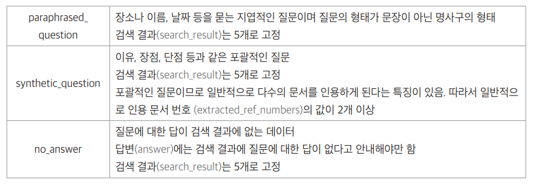  
  
각 데이터의 유형은 실제 검색 증강 생성에서 발생할 수 있는 다양한 시나리오에 대응하기 위한 목적으로 만들어졌다. 학습 후에 실제 상황에서 질문에 
대한 답이 데이터에 없는 경우가 발생하면 성능이 저하되는 경우가 많다.  
  
따라서 '지엽적인 질문', '검색 결과가 5개인 경우 또는 5개 미만인 경우', '지엽적인 질문이지만 질문 형태가 명사구인 경우', '포괄적인 질문으로 답변 시 
다수의 문서를 인용해야 하는 경우', '질문에 대한 답이 검색 결과에 없는 경우'와 같이 다양한 경우에 대비해야 한다. 이렇게 학습 데이터를 구성해서 학습해야만 
실제 상황에서 발생할 수 있는 다양한 상황에 성능 하락없이 대응할 수 있다.  
  
# **mrc_question 유형**  
type 값이 mrc_question인 경우는 질문이 굉장히 지엽적인 데이터 휴형이다. 예를 들어 type 값이 mrc_question인 데이터에 해당하는 인덱스가 5번인 
샘플의 질문, 즉 question 열의 값을 출력한다.  
  
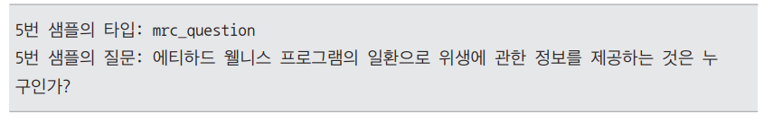  
  
출력된 질문은 '위생에 관한 정보를 제공하는 것'이라는 특정 대상에 대한 질문이다. type 값이 mrc_question이면 특정 장소나 대상, 날짜를 물어보는 질문이므로 
답변 또한 단답형이거나 답변의 길이가 짧은 편이다. 5번 샘플의 답변을 확인해 본다.  
  
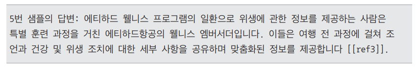  
  
질문에 대한 답으로 '에티하드항공의 웰니스 엠버서더'라는 사실을 언급한다. 그 외의 설명은 해당 답변에 대한 부가적인 내용이다. 마지막에 [[ref3]]이라는 
표기가 나오는데 이는 검색 결과 중 답변을 작성할 때 인용한 문서가 세 번째 문서라는 의미다. 이렇게 답변에 출처를 표기함으로써 답변의 성능을 높이고, 
사용자가 답변의 출처를 확인할 수 있게 해준다.  
  
데이터의 extracted_ref_numbers 열은 답변에서 인용한 문서의 번호를 의미한다. 5번 샘플의 extracted_ref_numbers 값을 출력해본다.  
  
  
  
답변에서 확인했던 바와 같이 세 번째 문서를 의미하는 정수 3이 출력된다. type 값이 mrc_question일 때 또 다른 특징은 검색 결과가 항상 5개로 고정된 
데이터라는 점이다. 5번 샘플의 검색 결과 개수를 확인해본다. search_result 열에 검색 결과가 문자열 리스트로 들어 있으므로 해당 문자열의 길이를 
출력하면 된다.  
  
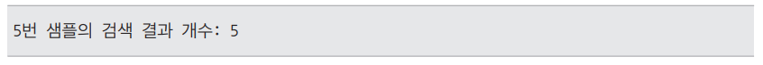  
  
검색 결과 개수가 5임을 확인할 수 있다. 여기서 5번 샘플의 답변에 해당하는 answer 값을 출력했을 때 정답은 세 번째 문서에 있다는 의미로 [[ref3]]이 
표기되어 있었다. 현재 다루고 있는 데이터는 기본적으로 답변에서 인용된 문서의 출처를 [[ref문서번호]]와 같이 표기하는 규칙이 있다.  
  
세 번째 문서를 인용하여 답변을 작성했다는 것을 실제로 검색 결과에 해당하는 search_result에서 세 번째 문서에 질문에 대한 답이 존재한다는 의미다. 
따라서 search_result에서 세 번째 문서를 출력해본다. 5개의 검색 결과 중 세 번째 문서를 출력하려면 search_result에서 인덱스 2번을 출력해야 한다. 
파이썬 리스트의 인덱스는 0부터 시작하기 때문이다.  
  
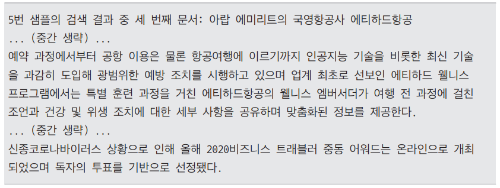  
  
검색 결과 중 세 번째 문서의 중간에 있는 내용을 보면 위생에 관한 정보를 제공하는 업체로 에티하드항공의 웰니스 엠버서더가 언급되고 있음을 확인할 
수 있다.  
  
이번에는 type 값이 mrc_question인 데이터에서 전반적으로 몇 개의 문서를 인용하며 몇 개의 검색 결과를 지니는지 전체적인 통계를 확인해 본다.