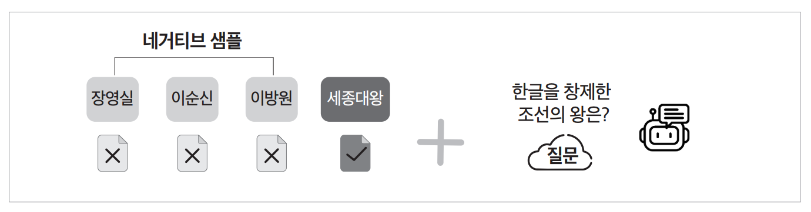

# **RAG 성능을 높이는 LLM 파인튜닝**  
대규모 언어 모델에 사용자가 가진 데이터셋을 추가로 학습시켜서 해당 데이터에 한해서 더 좋은 성능을 얻을 수 있도록 조정하는 과정을 파인튜닝이라고 
한다. 파인튜닝을 통해 다양한 문제를 풀 수 있지만 검색 증강 생성의 성능을 높이기 위해서도 사용할 수 있다.  
  
# **RAFT 논문 살펴보기**  
검색 증강 생성의 성능을 높이고자 데이터셋 제작 방법이나 학습 방법을 고민할 때 제일 먼저 참고하기 좋은 자료로 미국 버클리 대학에서 작성한 "RAFT: 
Adapting Language Model to Domain Specific RAG"라는 논문이 있다. 논문을 직접 살펴볼 수 있는 링크는 다음과 같다.  
  
URL - https://arxiv.org/pdf/2403.10131  
   
# **네거티브 샘플**  
인공지능 분야에서 네거티브 샘플(negative sample)은 주로 모델이 찾고자 하는 대상과 반대되는 예시들을 의마한다. 예를 들어 이메일이 오면 정상 
이메일인지, 스팸 이메일인지 판단하는 스팸 메일 분류기를 만든다고 가정한다. 스팸 메일 분류기 입장에서는 스팸 이메일을 탐지해야 하므로 정상 이메일이 네거티브 
샘플에 해당한다. 그리고 이때 모델이 찾아야 할 대상에 해당하는 스팸 이메일은 네거티브 샘플의 반대로 포지티브 샘플(positive sample)이라고 한다.  
  
  
  
위 그림은 증강 생성의 검색 단계에서 발생할 수 있는 네거티브 샘플들의 예시다. 예를 들어 '한글을 창제한 조선의 왕은?'이라는 사용자 질의에 '장영실', 
'이순신', '이방원', '세종대왕' 총 네 개의 문서가 검색되었다고 가정한다. 대규모 언어 모델이 챗봇의 질문에 답변하려면 '세종대왕' 문서를 참고해야 하고 
나머지 세 개의 문서에는 세종대왕의 한글 창제와 관련된 이야기가 없다. 이때 세 개의 문서는 답변에 참고하지 않을 문서들이므로 여기서 이들 문서는 
네거티브 샘플이다.  
  
다시 말해 검색 증강 생성에서는 사용자 질의에 대한 정답이 있는 문서가 포지티브 샘플, 검색은 되었지만 정답이 포함되지 않은 문서들이 네거티브 샘플이다.  
  
실제로 검색 증강 생성을 하다 보면 검색 결과에 질문과 연관되지 않은 문서가 함께 검색되는 상황이 잦다. 이때 대규모 언어 모델은 해당 상황에서 연관되지 
않은 문서의 내용은 무시하고 연관된 문서의 내용만을 참고해 답변하는 능력이 길러져 있어야 한다. 따라서 RAFT 논문에서는 이러한 상황에 대해 대규모 언어 
모델이 충분히 학습할 수 있도록 학습 데이터에 네거티브 샘플이 포함되도록 데이터셋을 구성하고 있다.  
  
