# **RAG 성능을 높이는 LLM 파인튜닝**  
대규모 언어 모델에 사용자가 가진 데이터셋을 추가로 학습시켜서 해당 데이터에 한해서 더 좋은 성능을 얻을 수 있도록 조정하는 과정을 파인튜닝이라고 
한다. 파인튜닝을 통해 다양한 문제를 풀 수 있지만 검색 증강 생성의 성능을 높이기 위해서도 사용할 수 있다.  
  
# **RAFT 논문 살펴보기**  
검색 증강 생성의 성능을 높이고자 데이터셋 제작 방법이나 학습 방법을 고민할 때 제일 먼저 참고하기 좋은 자료로 미국 버클리 대학에서 작성한 "RAFT: 
Adapting Language Model to Domain Specific RAG"라는 논문이 있다. 논문을 직접 살펴볼 수 있는 링크는 다음과 같다.  
  
URL - https://arxiv.org/pdf/2403.10131  
   
# **네거티브 샘플**  
인공지능 분야에서 네거티브 샘플(negative sample)은 주로 모델이 찾고자 하는 대상과 반대되는 예시들을 의마한다. 예를 들어 이메일이 오면 정상 
이메일인지, 스팸 이메일인지 판단하는 스팸 메일 분류기를 만든다고 가정한다. 스팸 메일 분류기 입장에서는 스팸 이메일을 탐지해야 하므로 정상 이메일이 네거티브 
샘플에 해당한다. 그리고 이때 모델이 찾아야 할 대상에 해당하는 스팸 이메일은 네거티브 샘플의 반대로 포지티브 샘플(positive sample)이라고 한다.  
  
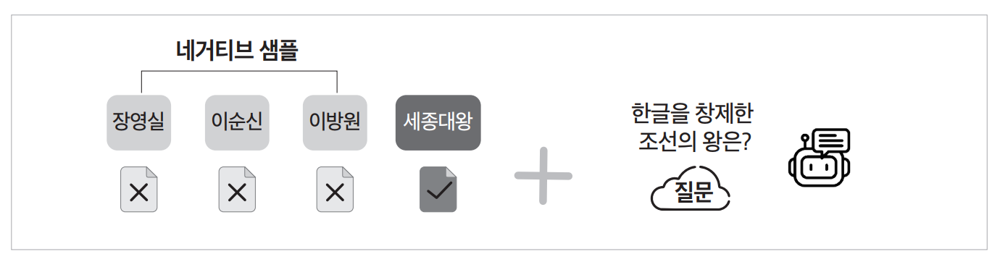  
  
위 그림은 증강 생성의 검색 단계에서 발생할 수 있는 네거티브 샘플들의 예시다. 예를 들어 '한글을 창제한 조선의 왕은?'이라는 사용자 질의에 '장영실', 
'이순신', '이방원', '세종대왕' 총 네 개의 문서가 검색되었다고 가정한다. 대규모 언어 모델이 챗봇의 질문에 답변하려면 '세종대왕' 문서를 참고해야 하고 
나머지 세 개의 문서에는 세종대왕의 한글 창제와 관련된 이야기가 없다. 이때 세 개의 문서는 답변에 참고하지 않을 문서들이므로 여기서 이들 문서는 
네거티브 샘플이다.  
  
다시 말해 검색 증강 생성에서는 사용자 질의에 대한 정답이 있는 문서가 포지티브 샘플, 검색은 되었지만 정답이 포함되지 않은 문서들이 네거티브 샘플이다.  
  
실제로 검색 증강 생성을 하다 보면 검색 결과에 질문과 연관되지 않은 문서가 함께 검색되는 상황이 잦다. 이때 대규모 언어 모델은 해당 상황에서 연관되지 
않은 문서의 내용은 무시하고 연관된 문서의 내용만을 참고해 답변하는 능력이 길러져 있어야 한다. 따라서 RAFT 논문에서는 이러한 상황에 대해 대규모 언어 
모델이 충분히 학습할 수 있도록 학습 데이터에 네거티브 샘플이 포함되도록 데이터셋을 구성하고 있다.  
  
# **생각의 사슬**  
생각의 사슬 기법이란 대규모 언어 모델이 답변을 작성할 때 문제의 인과 관계에 대해 차근차근 풀어서 전개하다 보면 정답에 더 잘 도달할 수 있다는 개념이다. 
즉 '문제-답' 대신에 '문제-풀이-답' 형태로 프롬프트를 구성하도록 하는 것이다. RAFT 논문에서 사용한 생각의 사슬 프롬프트를 확인해 본다.  
  
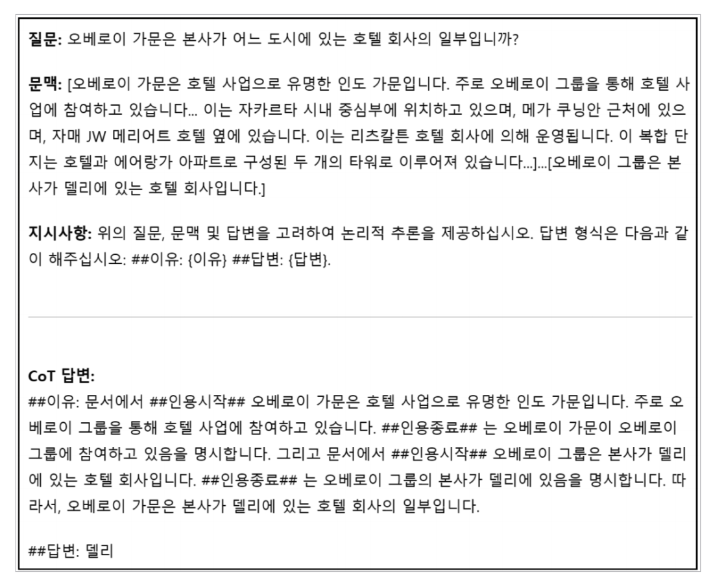  
  
위 그림은 실제 RAFT 논문에서 사용한 프롬프트와 답변 형식이다. 주요 입력으로는 질문, 문맥, 지시사항 세 가지가 존재한다. 사용자가 질문을 입력하면 
대규모 언어 모델은 주어진 문맥으로부터 질문에 대해 답변해야 한다.  
  
문맥은 사용자 질문으로부터 검색된 문서가 들어가는 위치다. 지시사항을 보면 사용자의 질문에 답변하기 전에 먼저 이유를 작성하라고 강제하고 있다. 
답변을 작성하기 전에 중간 추론 과정을 강제하고 실제로 모델은 이유를 작성하고 답변을 작성할 것이므로 이 방식은 생각의 사슬 프롬프트다.  
  
'CoT 답변:' 부분을 보면 실제로 대규모 언어 모델이 생성하게 될 출력이다. 대규모 언어 모델은 주어진 지시사항에 따라 먼저 사용자의 질문을 답변하기 전에 
그 근거를 '##이유:'에 작성해야 한다. RAFT 논문에서는 이유를 작성할 떄 '##인용시작##'과 '##인용종료##'를 사용하여 실제 주어진 문맥에서 원문을 
인용하도록 강제하고 있다. '##인용시작##'과 '##인용종료##' 사이에 있는 문장은 반드시 문맥에 주어진 원문에 존재하는 문장을 그대로 작성해야 한다.  
  
다시 말해 질문에 대한 답변을 작성하기 전에 반드시 원문을 인용하도록 강제함으로써 모델이 주어진 문맥을 통해서만 답변하도록 유도한다. 실제로 검색 증강 
생성에서 검색 결과에 없는 내용인데도 대규모 언어 모델이 질문에 대해 자신이 알고 있는 지식을 답변하는 과정에서 잘못된 답변이 생성되곤 한다. 이를 고려하면 
반드시 원문을 기반으로 답변하도록 강제하는 것만으로도 검색 증강 생성의 성능을 올릴 수 있다.  
  
# **성능 향상을 위한 팁**  
실제 검색 증강 생성 상황에서 발생할 수 있는 다양한 시나리오에 대응하기 위한 데이터셋 유형을 추가로 정리해본다.  
  
# **답변 없음 데이터**  
검색 증강 생성에서 사용자 질의와 관계없는 문서를 네거티브 샘플, 질의와 관계있는 문서를 포지티브 샘플이라 정의했다. 그런데 실제 검색 증강 생성 상황에서는 
검색된 모든 문서가 네거티브 샘플일 수 있다.  
  
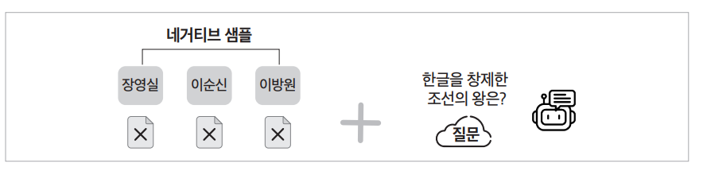  
  
사용자가 갖고 있는 문서들로는 답변할 수 없는 질문을 던지거나 검색 성능이 좋지 않아서 사용자 질의를 고려한 검색 결과를 얻을 수 없는 상황이 그런 경우다. 
이떄 대규모 언어 모델이 검색 문서에 없는 내용이라고 해서 언어 모델 스스로 답변하도록 동작한다면 할루시네이션이 발생하여 완전히 잘못된 답변이 생성될 
여지가 있다.  
  
때문에 모든 검색 문서가 네거티브 샘플일 경우에는 대규모 언어 모델이 '검색 결과를 찾을 수 없습니다'와 같은 답변을 하도록 학습시켜 자체적으로 답변하는 
것을 막을 수 있다. 이어질 실습에서는 이를 위해 '답변 없음' 데이터를 임의로 추가해서 만든 데이터셋을 사용한다.  
  
# **출처 인용**  
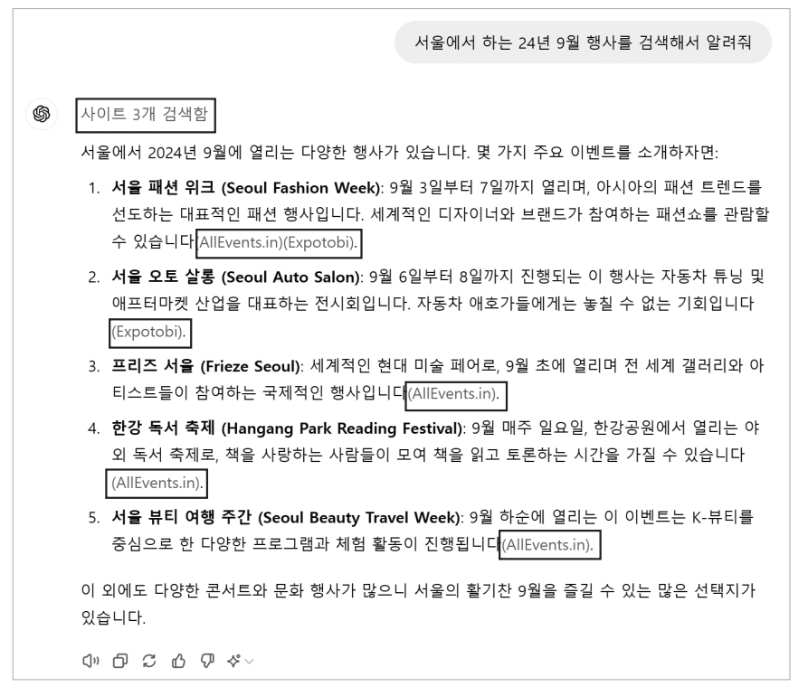  
  
챗GPT는 기본적으로는 검색 기능을 사용하지 않고 언어 모델 스스로 답변을 제공하지만 어떠한 질문을 할 때 '검색해서 알려줘'라는 문장을 붙이면 높은 확률로 
검색을 사용하여 답변한다. 위 그림은 챗GPT에게 '서울에서 하는 24년 9월 행사를 검색해서 알려줘'라고 질의했을 때의 답변을 보여준다.  
  
위쪽에 [사이트 3개 검색함]이라는 표시가 있고 아래에 답변이 제공되고 있다. 그리고 이때 각각의 주요 문장마다 해당 내용을 어떤 웹사이트에서 가져왔는지 
뒤에 괄호와 함께 출처를 남기고 있다. 이렇게 각 주요 답변마다 인용한 출처를 남기면 답변을 보는 사용자 입장에서는 언제든 원문을 확인하여 진위를 검토할 
수 있으므로 신뢰할 수 있는 답변을 얻을 수 있다. 또한 대규모 언어 모델 입장에서도 답변 작성 시 반드시 원 출처를 남기도록 강제하면 잘못된 답변을 할 
가능성이 줄어들게 된다.  
  
실제로 이러한 예를 검색 증강 생성에 적용한 사례를 살펴보자. 다음은 이미 검색 증강 생성에 파인튜닝되어 공개된 대표적인 모델 중 하나인 Orion-14B-Chat-RAG로 
검색 증강 생성을 수행한 예다. 사용자의 질의와 검색 결과가 다음과 같았다고 가정한다.  
  
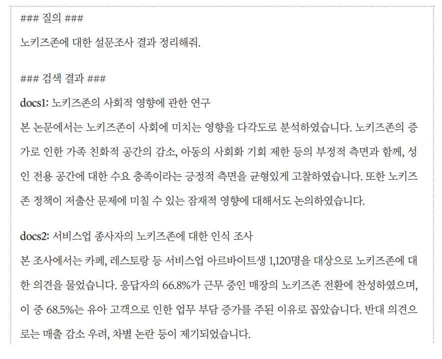  
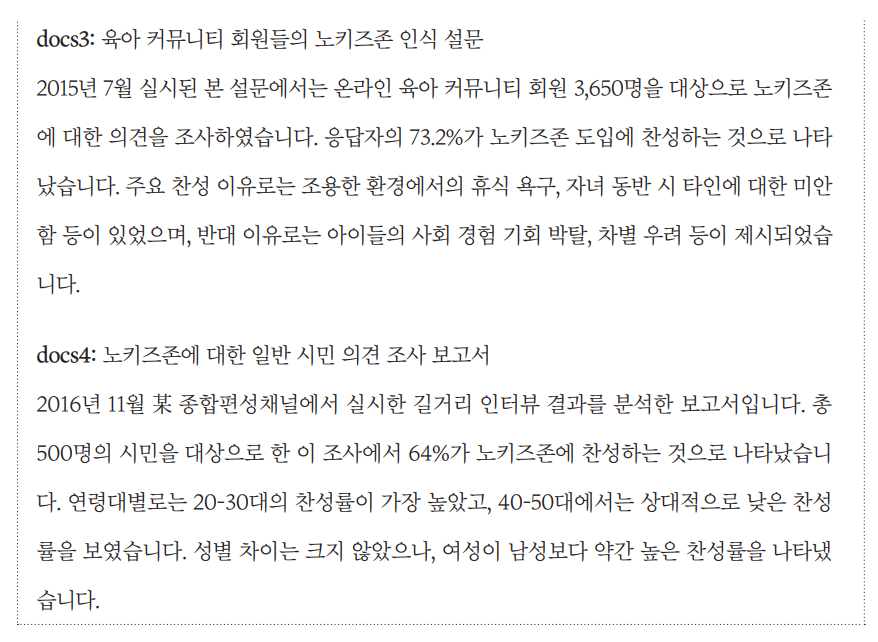  
  
사용자의 질의는 '노키즈존에 대한 설문조사 결과 정리해줘'에 해당하며 총 네 개의 검색 결과를 얻었다고 가정한다. 이에 대해 Orion-14B-Chat-RAG에 
기본으로 설정된 시스템 프롬프트를 사용하여 호출하면 다음과 같은 답변을 얻을 수 있다.  
  
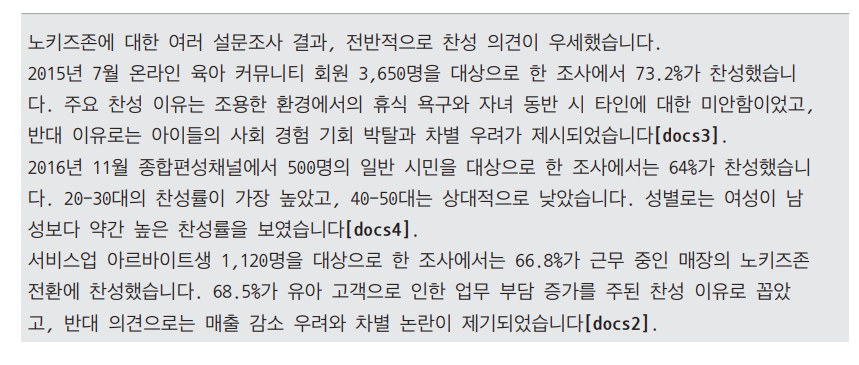  
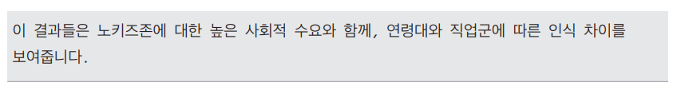  
  
답변 결과를 보면 검색 결과를 바탕으로 답변하며 각 인용한 문장 내지는 단락에 대해 몇 번 문서에서 인용했는지 대괄호 안에 출처를 남기고 있다. 사용자는 
이러한 출처를 통해 실제 원문을 확인하고 답변에 대해 검증할 수 있게 된다. 이처럼 답변의 주요 내용이 검색 결과로 나온 문서 중 어떤 문서에서 나왔는지 
남기도록 학습시키면 사용자에게 신뢰를 줄 수 있을 뿐만 아니라 성능 측면에서도 모델이 잘못된 답변을 할 가능성도 줄일 수 있다.  
  
# **RAG 학습 데이터셋 살펴보기**  
허깅페이스 웹사이트에 검색 증강 생성을 위한 학습 데이터가 있다.  
  
URL - https://huggingface.co/datasets/iamjoon/klue-mrc-ko-rag-dataset  
  
# **학습 데이터 탐색**  
# **학습 데이터 로드하기**  
RAG_DATASET.ipynb(학습 데이터 로드)  
  
학습 데이터를 다운로드받아 데이터의 특징을 살펴본다. 먼저 필요한 라이브러리를 설치한다. 여기서는 허깅페이스로부터 데이터를 다운로드할 수 있는 datasets 
라이브러리를 설치한다.  
  
데이터 전처리를 위한 라이브러리 numpy와 데이터 시각화를 위한 라이브러리 matplotlib 그리고 datasets 라이브러리로부터 허깅페이스의 데이터를 
다운로드하는 데 사용할 load_dataset을 임포트한다.  
  
허깅페이스로부터 데이터를 로드하고 이를 출력해본다. 먼저 데이터셋을 허깅페이스의 datasets 라이브러리를 사용하여 불ㄹ온다. 데이터셋 이름은 "iamjoon/klue-mrc-ko-rag-dataset"
이다. 로드된 데이터셋을 판다스 데이터프레임으로 변환한다. 데이터프레임으로 변환한 이유는 데이터 조작과 분석을 보다 쉽게 하기 위함이다.  
  
데이터프레임에서 실습에 필요한 열만 선택하여 새로운 데이터프레임을 만든다. 선택한 열은 question, search_result, answer, extracted_ref_numbers, 
type이다. 마지막으로 데이터프레임의 상위 5개 행을 출력하여 데이터의 구조와 내용을 확인한다.  
  
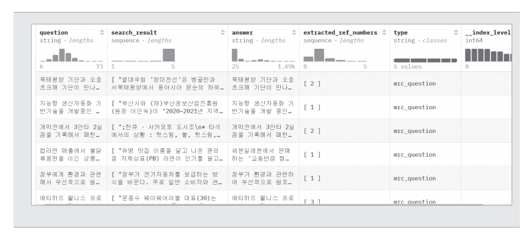  
  
선택한 총 5개의 열이 출력된 것을 확인할 수 있다. 출력된 열은 question(질문), search_result(질문에 대한 검색 결과), answer(최종 답변), extracted_ref_numbers
(답변에서 인용된 문서 번호의 리스트), type(데이터 유형이다.  
  
type열을 살펴면 해당 데이터에 어떤 종류의 값들이 있는지 확인할 수 있다.  
  
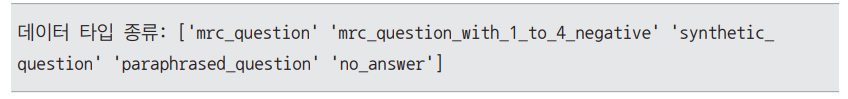  
  
결과를 보면 type에는 총 5가지 종류의 값이 존재한다. 해당 값들은 각각 다음과 같은 데이터의 유형을 나타낸다.  
  
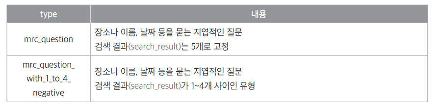  
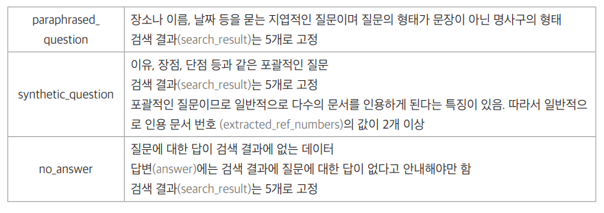  
  
각 데이터의 유형은 실제 검색 증강 생성에서 발생할 수 있는 다양한 시나리오에 대응하기 위한 목적으로 만들어졌다. 학습 후에 실제 상황에서 질문에 
대한 답이 데이터에 없는 경우가 발생하면 성능이 저하되는 경우가 많다.  
  
따라서 '지엽적인 질문', '검색 결과가 5개인 경우 또는 5개 미만인 경우', '지엽적인 질문이지만 질문 형태가 명사구인 경우', '포괄적인 질문으로 답변 시 
다수의 문서를 인용해야 하는 경우', '질문에 대한 답이 검색 결과에 없는 경우'와 같이 다양한 경우에 대비해야 한다. 이렇게 학습 데이터를 구성해서 학습해야만 
실제 상황에서 발생할 수 있는 다양한 상황에 성능 하락없이 대응할 수 있다.  
  
# **mrc_question 유형**  
type 값이 mrc_question인 경우는 질문이 굉장히 지엽적인 데이터 휴형이다. 예를 들어 type 값이 mrc_question인 데이터에 해당하는 인덱스가 5번인 
샘플의 질문, 즉 question 열의 값을 출력한다.  
  
  
  
출력된 질문은 '위생에 관한 정보를 제공하는 것'이라는 특정 대상에 대한 질문이다. type 값이 mrc_question이면 특정 장소나 대상, 날짜를 물어보는 질문이므로 
답변 또한 단답형이거나 답변의 길이가 짧은 편이다. 5번 샘플의 답변을 확인해 본다.  
  
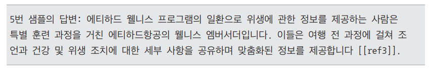  
  
질문에 대한 답으로 '에티하드항공의 웰니스 엠버서더'라는 사실을 언급한다. 그 외의 설명은 해당 답변에 대한 부가적인 내용이다. 마지막에 [[ref3]]이라는 
표기가 나오는데 이는 검색 결과 중 답변을 작성할 때 인용한 문서가 세 번째 문서라는 의미다. 이렇게 답변에 출처를 표기함으로써 답변의 성능을 높이고, 
사용자가 답변의 출처를 확인할 수 있게 해준다.  
  
데이터의 extracted_ref_numbers 열은 답변에서 인용한 문서의 번호를 의미한다. 5번 샘플의 extracted_ref_numbers 값을 출력해본다.  
  
  
  
답변에서 확인했던 바와 같이 세 번째 문서를 의미하는 정수 3이 출력된다. type 값이 mrc_question일 때 또 다른 특징은 검색 결과가 항상 5개로 고정된 
데이터라는 점이다. 5번 샘플의 검색 결과 개수를 확인해본다. search_result 열에 검색 결과가 문자열 리스트로 들어 있으므로 해당 문자열의 길이를 
출력하면 된다.  
  
  
  
검색 결과 개수가 5임을 확인할 수 있다. 여기서 5번 샘플의 답변에 해당하는 answer 값을 출력했을 때 정답은 세 번째 문서에 있다는 의미로 [[ref3]]이 
표기되어 있었다. 현재 다루고 있는 데이터는 기본적으로 답변에서 인용된 문서의 출처를 [[ref문서번호]]와 같이 표기하는 규칙이 있다.  
  
세 번째 문서를 인용하여 답변을 작성했다는 것을 실제로 검색 결과에 해당하는 search_result에서 세 번째 문서에 질문에 대한 답이 존재한다는 의미다. 
따라서 search_result에서 세 번째 문서를 출력해본다. 5개의 검색 결과 중 세 번째 문서를 출력하려면 search_result에서 인덱스 2번을 출력해야 한다. 
파이썬 리스트의 인덱스는 0부터 시작하기 때문이다.  
  
  
  
검색 결과 중 세 번째 문서의 중간에 있는 내용을 보면 위생에 관한 정보를 제공하는 업체로 에티하드항공의 웰니스 엠버서더가 언급되고 있음을 확인할 
수 있다.  
  
이번에는 type 값이 mrc_question인 데이터에서 전반적으로 몇 개의 문서를 인용하며 몇 개의 검색 결과를 지니는지 전체적인 통계를 확인해 본다. 
먼저 전체 데이터에 대해 search_result의 개수와 extracted_ref_numbers의 개수를 계산하여 새로운 열인 search_result_len과 extracted_ref_len에 
저장한다.  
  
'search_result_len'열에는 각 데이터의 검색 결과의 개수, 'extracted_ref_len'열에는 각 데이터가 답변할 떄 인용한 문서의 개수가 기록되었다. 이제 
해당 두 개의 열을 참고하여 특정 type 값을 입력하면 해당하는 데이터 유형의 검색 결과와 인용 문서 개수에 대한 통계 정보와 차트를 시각화하는 함수 
plot_lengths_by_type을 작성한다.  
  
RAG_DATASET.ipynb(데이터 유형 통계)  
  
이제 plot_lengths_by_type 함수에 데이터프레임 df와 통계를 확인할 데이터의 유형인 mrc_question을 입력하여 'search_result_len'과 'extracted_ref_len'의 
통계 정보와 차트를 확인해 본다.  
  
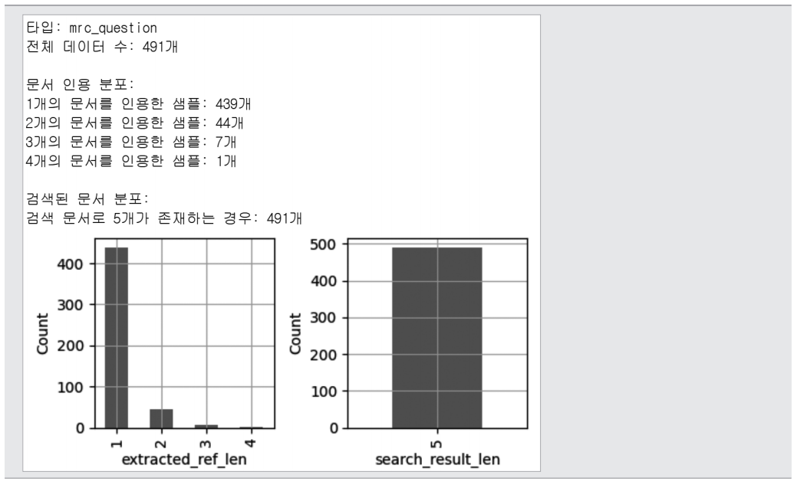  
  
출력된 결과를 보면 mrc_question 데이터의 유형인 경우 모든 데이터 491개의 검색 결과가 5개로 동일하며 이 중 439개는 답변 시 1개의 문서를 인용하는 
데이터다. 그 외에 44개의 데이터가 답변 시 검색 결과 중 2개의 문서를 인용하고 답변 시 검색 결과 중 3개나 4개의 문서를 인용하는 데이터는 극소수이며 
5개의 문서를 인용하는 데이터는 없다. 이는 해당 유형의 데이터가 질문이 매우 지엽적이어서 답변 시 다수의 문서를 인용하는 경우가 극히 드물다는 것을 
보여준다.  
  
# **mrc_question_with_1_to_4_negative 유형**  
type 값이 mrc_question_with_1_to_4_negative 유형을 살펴본다. 기본적으로 데이터의 질문 형태는 데이터 유형이 mrc_question인 경우와 동일하다. 즉 
질문이 매우 지엽적인 편이다. 차이점은 search_result 열에 있는 검색 결과의 개수가 1~4 사이의 값을 갖는다는 점이다.  
  
만약 학습 데이터 전체의 검색 결과가 5개로 동일하다면 학습 후의 모델이 검색 결과가 5개가 아닌 경우에 대해서는 제대로 동작하지 않는 경우가 발생할 수 
있다. 따라서 이를 방지하기 위해 검색 결과가 5개가 아닌 경우를 가정하고 만든 데이터 유형이다. 이러한 유형에 대해 함수 plot_lengths_by_type을 호출해 
구성을 확인해본다.  
  
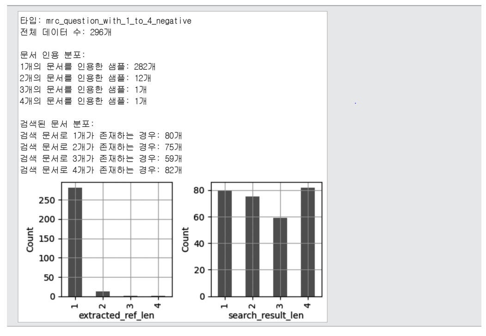  
  
출력된 결과를 보면 mrc_question_with_1_to_4_negative 데이터의 유형인 경우 대부분의 데이터에 해당하는 282개의 데이터가 답변 시 1개의 문서를 
인용하는 데이터다. 이는 해당 유형의 데이터가 질문이 매우 지엽적이어서 답변 시 다수의 문서를 인용하는 경우가 극히 드물다는 것을 보여준다. 또한 이전에 
소개한 데이터 유형 mrc_question에서는 검색 문서의 수가 전부 5개로 동일했던 것과는 달리 mrc_question_with_1_to_4_negarive에서는 검색 문서가 
1개, 2개, 3개, 4개인 경우가 균일하게 분포된 것을 확인할 수 있다.  
  
# **synthetic_question 유형**  
지엽적인 질문과 반대로 포괄적인 질문 데이터에 해당하는 synthetic_question 유형에 해당하는 787번 샘플의 질문, 답변, 답변에서 인용한 문서의 개수를 
확인해 본다.  
  
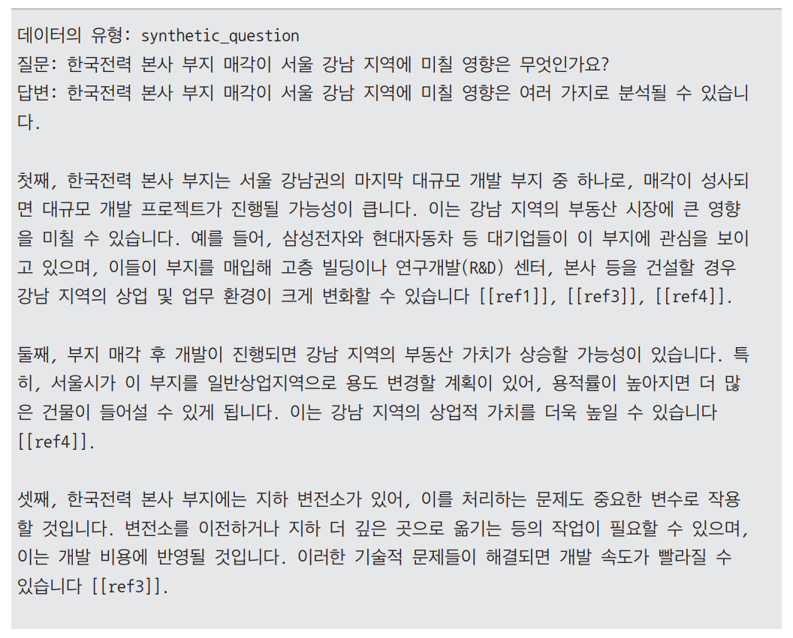  
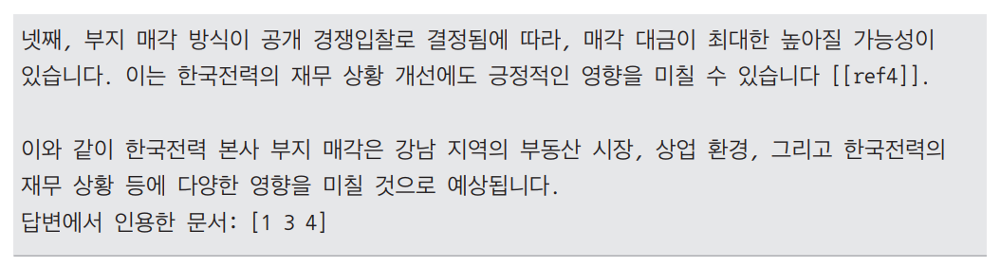  
  
질문은 '한국전력 본사 부지 매각이 서울 강남 지역에 미칠 영향'으로 하나의 대상에 대한 질문이 아니라 여러 가지 사실 관계가 포함될 수 있는 질문이다. 
이러한 포괄적인 질문은 일반적으로 답변의 길이가 길 뿐만 아니라 인용하는 문서도 하나가 아니라 여러 개일 수 있다. 실제로 답변을 보면 첫째, 둘째, 셋째, 
넷ㅉ와 같이 네 개의 사실 관계를 나열하고 있을 뿐만 아니라 1번 문서, 3번 문서, 4번 문서와 같이 검색 결과 중 다수의 문서를 인용하고 있다.  
  
이러한 유형에 대해 함수 plot_lengths_by_type을 호출한다.  
  
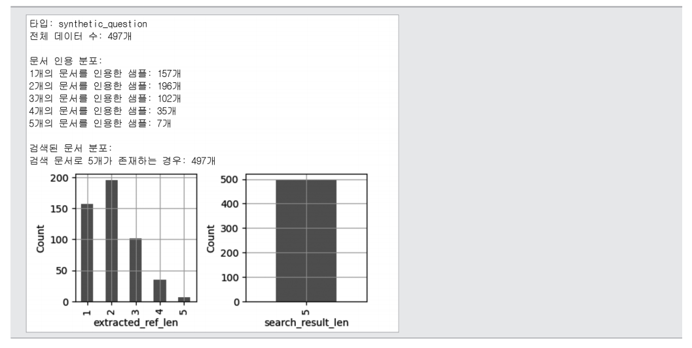  
  
통계 결과를 보면 synthetic_question 데이터 유형에서 extracted_ref_numbers 열의 길이별 분포를 확인할 수 있다.  
  
살펴보면 2개의 문서를 인용하는 데이터가 196개로 가장 많다. 이는 상당수의 synthetic_question 데이터가 2개의 문서를 참조하고 있음을 의미한다. 
1개의 문서를 인용하는 데이터가 157개로 그다음으로 많으며 3개의 문서를 인용하는 데이터는 102개다. 4개 이상의 문서를 인용하는 데이터는 35개, 
5개의 문서를 인용하는 데이터는 7개로 4개 이상의 문서를 참조하는 경우는 상대적으로 적다. 결론적으로 synthetic_question 유형의 데이터는 2개 
이상의 문서를 인용하는 데이터 비율이 앞서 살펴본 데이터들에 비해 많다.  
  
# **paraphrased_question 유형**  
지엽적인 질문이면서 명사구 형태의 질문에 해당하는 paraphrased_question 유형의 데이터를 확인해 본다. 이에 해당하는 데이터 중 인덱스가 1285번인 
샘플의 질문값을 출력해 본다.  
  
  
  
type 값이 paraphrased_question인 데이터의 질문을 보면 앞서 확인했던 데이터들처럼 '누구인가?' 또는 '무엇인가요?'와 같이 질문이 문장 형태의 완성형으로 
끝나는 것이 아니라 명사구 형태로 끝나는 것을 볼 수 있다. 이러한 유형은 완전한 문장 형태의 질문 데이터로만 학습했을 때 그 부작용으로 사용자가 명사구 
형태의 질문을 넣을 때는 성능이 저하되는 현상을 방지하기 위해 추가된 데이터다.  
  
이 유형에 대해 함수 plot_lengths_by_type을 호출해본다.  
  
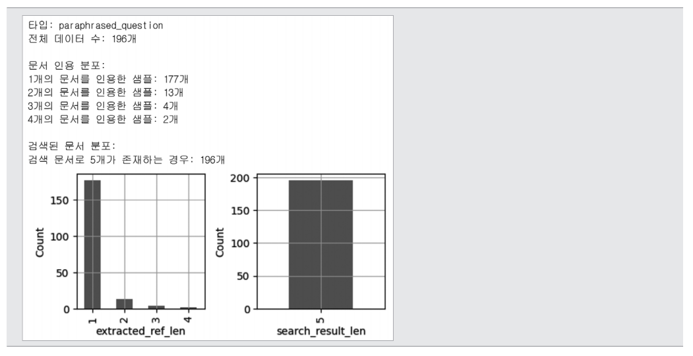  
  
통계 결과를 보면 paraphrased_question 데이터 유형에서 extracted_ref_numbers 열의 리스트 길이별 분포를 확인할 수 있다.  
  
살펴보면 모든 데이터 196개의 검색 결과가 5개로 동일하며 이 중 177개의 데이터에서 답변 시 1개의 문서를 인용한다. 그 외에 답변 시 검색 결과 중 
2개의 문서를 인용하는 데이터는 13개이고 답변 시 검색 결과 중 3개나 4개의 문서를 인용하는 데이터는 극소수이며 5개의 문서를 인용하는 데이터는 없다. 
이는 해당 유형의 데이터가 질문이 명사구 형태일 뿐, 지엽적인 질문으로 구성되어 답변 시 다수의 문서를 인용하는 경우가 극히 드물다는 것을 나타낸다.  
  
# **no_answer 유형**  
검색 결과에서 질문에 대한 답을 찾을 수 없는 no_answer 유형의 데이터를 살펴본다. 이러한 유형에 해당하는 인덱스가 1480번인 샘플 데이터를 출력해본다.  
  
  
  
해당 데이터는 답변에서 질문에 대한 답을 찾을 수 없다고 답변하고 어떠한 문서도 인용하지 않는다. 따라서 extracted_ref_numbers 값을 출력해도 빈 
리스트가 출력된다.  
  
이 유형에 대해 함수 plot_lengths_by_type을 호출한다.  
  
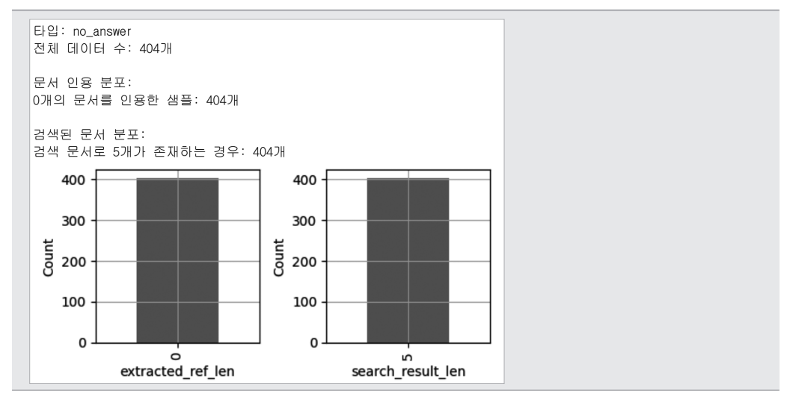  
  
통계 결과를 보면 no_answer 데이터 유형에서 extracted_ref_numbers 열의 리스트 길이별 분포를 확인할 수 있다.  
  
살펴보면 모든 데이터 404개의 검색 결과가 5개로 동일하며 모든 데이터가 답변 시 0개의 문서를 인용한다. 이는 해당 유형의 모든 데이터가 검색된 문서들 
중 어떠한 문서도 인용하지 않으며 질문에 대해 답을 할 수 없다고 답변하는 데이터임을 의미한다.  
  
# **로컬 LLM Qwen 파인튜닝하기**  
대규모 언어 모델을 학습하려면 고성능 GPU가 필요하다. 이번ㅂ 실습에는 런팟(RunPod)이라는 상대적으로 매우 저렴한 가격으로 고성능 GPU를 빌릴 수 있는 
유료 클라우드를 사용한다.  
  
# **런팟을 이용한 실습 환경**  
런팟에서 GPU 서버를 대여하여 실습하는 방법을 알아본다.  
  
1. 구글 검색창에 runpod을 검색하거나 다음 링크를 통해 RunPod 웹사이트에 접속한다.  
- URL - https://www.runpod.io/  
  
2. 처음 사이트에 접속했다면 오른쪽 위 Sing up 버튼을 클릭하여 회원 가입을 진행한다.  
  
3. 회원 가입 후 왼쪽 메뉴의 Billing을 클릭한다. 이후 Pay With Card 버튼을 클릭하여 결제를 진행한다. 런팟의 경우 최소 결제 금액이 10달러고 사용 
시간만큼 과금되는 방식이다.  
  
4. 회원 가입 후 결제를 마쳤다면 왼쪽 메뉴의 Pods를 클릭하고 화면 중앙의 +Deploy를 클릭한다. 그러면 선택 가능한 GPU 서버 목록이 나온다.  
  
5. A100 SXM을 선택한다. 해당 서버를 클릭하면 GPU 개수, 디스크 용량 등을 선택할 수 있는 팝업창이 나온다.  
  
6. GPU Count 아래쪽 숫자를 조절하여 사용할 GPU 개수를 선택할 수 있다. GPU 개수에 따라 과금되는 금액이 달라지며 그림에서는 2개를 선택할 때 
$3.78/hr, 즉 시간당 3.78달러가 과금될 수 있음을 나타낸다. 이번 실습에서는 GPU 1개로도 충분하다.  
  
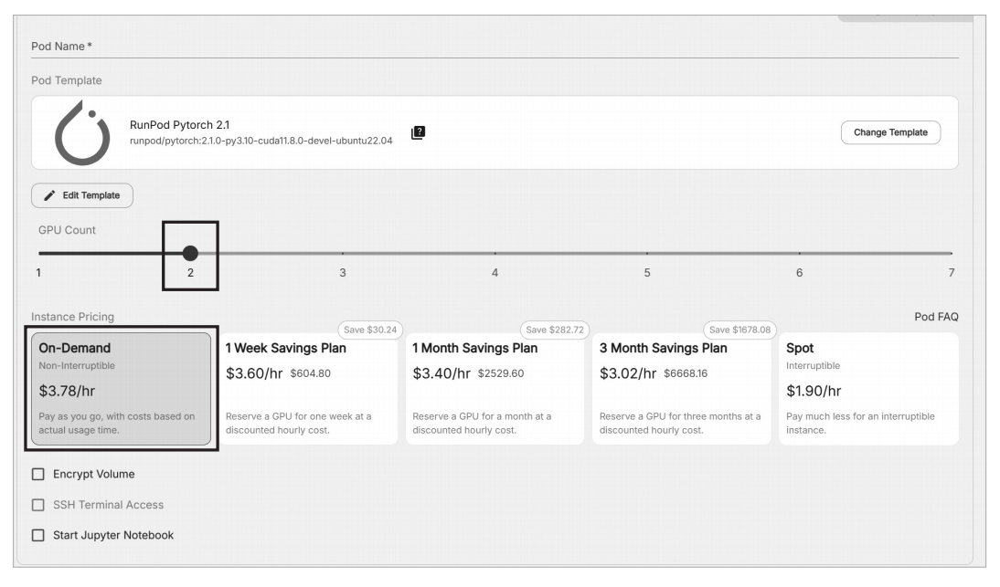  
  
7. 대규모 언어 모델과 데이터셋을 다운로드할 때 저장 용량이 부족하지 않도록 용량을 넉넉하게 설정한다. Edit Template 버튼을 클릭하여 디스크 용량을 
수정할 수 있는 팝업창을 연다.  
  
8. 팝업창에서 Container Disk 값을 넉넉하게 50GB로 수정한다. 그 후 Set Overrieds 버튼을 클릭하여 설정값을 적용한다.  
  
9. 다시 기존 화면으로 돌아와서 Start Jupyter Notebook 체크박스를 클릭하고 Deploy On-Demand 버튼을 클릭한다. 해당 버튼을 누르면 실시간으로 
과금이 시작된다. 실습 후에는 반드시 GPU 서버를 종료한다.  
  
10. 이후 화면이 전환되면 오른쪽의 화살표 방향 버튼을 클릭하여 현재 사용하고 있는 GPU 서버의 정보를 상세하게 볼 수 있다. 이제 다른 페이지로 이동한 
후에도 Runpod 사이트에서 왼쪽 메뉴의 Pods를 누르면ㅁ 이처럼 현재 대여 중인 GPU 현황을 계속해서 모니터링할 수 있다.  
  
11. 다음과 같이 GPU 서버가 Running 상태가 되면 COnnect 버튼을 클릭한다.  
  
12. 팝업창이 열리면 Connect to Jupyter Lab [Port 8888]을 클릭한다.  
  
13. 실습할 수 있는 환경인 주피터 랩이 실행된다. 여기서는 코랩이나 주피터 노트북과 같이 파이썬으로 실습할 수 있다. 가운데 위쪽의 Notebook이라는 
글자 아래쪽에 파이썬 아이콘과 함께 있는 Python 3 버튼을 클릭한다.  
  
14. 그러면 코드를 실행할 수 있는 주피터 노트북 환경이 나온다. 코드를 실행하는 방법은 코드를 작성한 후 위쪽 > 버튼을 클릭하거나 Shift + Enter 키를 
이용하여 코드를 실행할 수 있다.  
  
15. 현재 실습 파일의 이름이 Untitled.ipynb이므로 파일 이름을 수정한다. 왼쪽 위 메뉴의 File 버튼을 클릭하고 이어서 Save Notebook As...를 
클릭한다. 창이 열리면 파일 이름을 RAG_TUNING.ipynb로 변경하고 Save 버튼을 누른다.  
  
# **데이터 전처리**  
# **라이브러리 설치 & 필요한 도구 임포트**  
필요한 라이브러리를 설치하고 실습에 사용할 각종 라이브러리의 도구들을 임포트한다.  
  
RAG_TUNING.ipynb(준비)  
  
각 도구의 쓰임새는 다음과 같다.  
  
1. 데이터셋 로딩 및 변환  
- load_dataset, Dataset: 다양한 데이터셋을 쉽게 로드하고 처리할 수 있다. load_dataset은 허깅페이스에 업로드된 데이터셋을 불러오거나 로컬 파일을 
로드하는 데 사용하며 Dataset은 개별 데이터셋 객체를 다룰 때 사용한다.  
  
2. 딥러닝 모델과 토크나이저  
- AutoModelForCausalLM: 허깅페이스 Transformers 라이브러리에서 제공하는 모델 다운로드를 위한 도구. 언어 모델을 로드하는데 사용한다.  
- AutoTokenizer: 특정 모델에 맞는 토크나이저를 자동으로 불러오는 도구. 토크나이저는 텍스트를 언어 모델이 처리할 수 있는 정수 시퀀스로 변환하거나 
정수 시퀀스를 다시 텍스트 문자열로 복원하는 역할을 한다.  
  
3. 파인튜닝 및 효율적인 학습 구성  
- LoraConfig: 이번 실습에서 사용할 학습 방법인 LoRA(Low-Rank Adaptation) 학습 방식을 사용할 때 필요한 각종 설정값을 정의한다. LoRA는 
학습할 때 대규모 언어 모델 전체를 업데이트하는 것이 아니라 대규모 언어 모델의 특정 부분만 업데이트하여 보다 효율적으로 학습하는 방식이다.  
  
4. SFT(지도 학습 방식의 파인튜닝) 설정 및 학습 도구  
- SFTConfig: 모델을 학습할 때 필요한 다양한 설정값을 정의하는 도구. 학습 과정에서 모델을 어떻게 업데이트할지 조정하며 여기에는 학습률과 배치 크기, 
옵티마이저 등의 설정이 포함된다. 모델 전체를 학습할 때도 쓰일 수 있지만 LoRA 학습에서처럼 모델의 특정 부분만 학습하는 방식에서도 사용한다. 
STFConfig에서 설정하는 설정값들은 모델의 학습 성능과 안정성에 큰 영향을 준다.  
  
예를 들어 학습률이 너무 크면 학습이 불안정하고 너무 작으면 속도가 느려진다. 배치 크기는 한 번에 처리하는 데이터 개수를 결정하며 크기에 따라 학습 
안정성과 메모리 사용량이 달라진다. 옵티마이저는 모델을 업데이트하는 방식과 관련된 것으로 Adam, SGD 등 여러 종류가 있으며 학습 성능을 좌우한다.  
  
SFTConfig에는 이 외에도 가중치 감쇠, 학습 스케줄링, 혼합 정밀도 학습(fp16) 등 학습에 영향을 주는 다양한 설정을 포함할 수 있다. LoRA를 적용하면 
모델 전체가 아닌 일부 가중치만 학습하므로 LoRA와 연관된 설정은 LoraConfig에서 관리하지만 LoRA 학습과는 별개인 학습 과정 전반의 설정은 여전히 
SFTConfig에서 관리한다. 따라서 SFTConfig는 LoRAConfig와 함께 사용하며 학습을 조정하는 역할을 한다.  
  
- SFTTrainer: 실제 학습을 수행하는 클래스. 주어진 데이터셋을 이용해 파인튜닐 과정을 자동으로 수행하며 특정 부분만 업데이트하는 LoRA와 같은 
학습 기법도 적용할 수 있다. 모델, 데이터셋, 학습 설정을 한 번에 입력하여 효율적인 학습을 진행할 수 있도록 돕는다.  
  
# **실습 데이터 다운로드**  
사용할 데이터를 다운로드하고 특정 형식으로 전처리를 진행한다.  
  
RAG_TUNING.ipynb(데이터 전처리)  
  
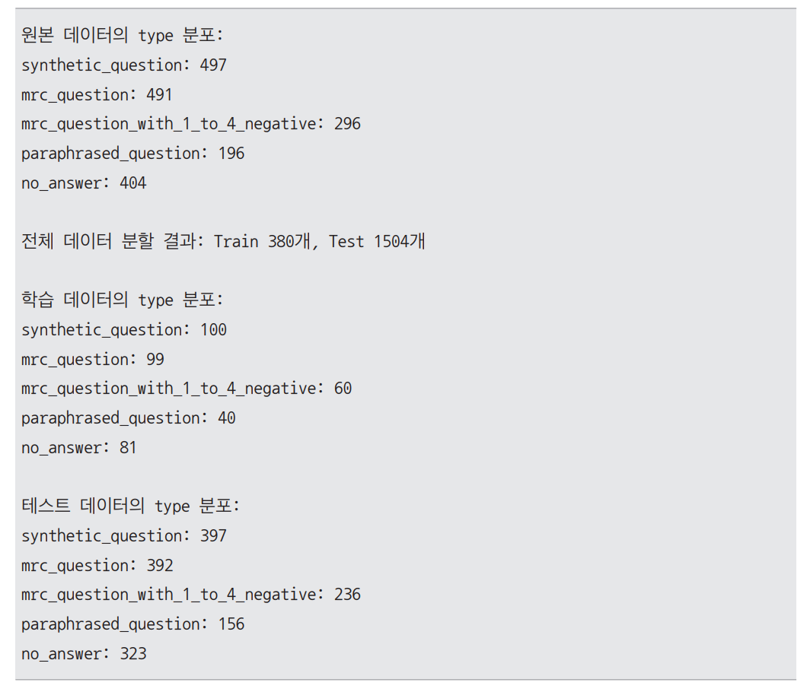  
  
각 코드 블록이 어떤 역할을 하는지 구체적으로 살펴본다.  
  
1. 데이터셋 로드  
허깅페이스 허브에서 RAG 데이터셋을 불러온다. load_dataset() 함수를 사용하여 "iamjoon/klue-mrc-rag-dataset"이라는 데이터셋을 불러온다. 
이 데이터셋은 실습에 사용할 전체 데이터를 담고 있다.  
  
```
dataset = load_dataset("iamjoon/klue-mrc-ko-rag-dataset", split="train")
```  
  
2. 시스템 프롬프트 정의  
학습에 사용할 시스템 프롬프트를 정의한다. 이 프롬프트에는 RAG 성능을 높이기 위한 여러 가지 중요한 지침이 담겨 있다.  
  
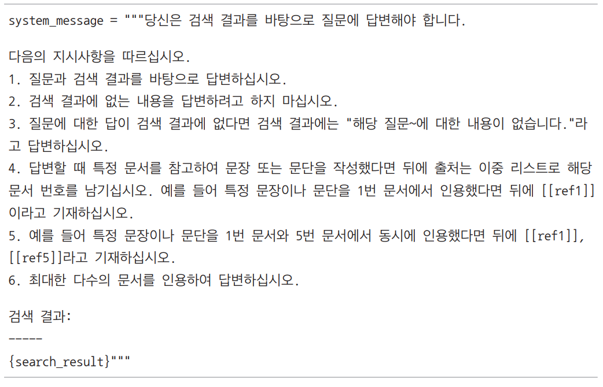  
  
프롬프트 끝의 {search_result}는 추후 실제 검색 결과로 대체된다. 학습할 때도 우리가 원하는 방향으로 대규모 언어 모델이 답변하도록 상세한 시스템 
프롬프트를 작성해야 한다.  
  
3. 원본 데이터 타입 분포 확인  
원본 데이터의 type별 분포를 확인한다. set() 함수로 중복 없는 type 목록을 만들고 count() 메서드로 각 type이 몇 번 등장하는지 계산해 출력한다. 
데이터셋에는 synthetic_question, mrc_question, mrc_question_with_1_to_4_negative, paraphrased_question, no_answer라는 5가지 타입이 있다.  
  
```
print("원본 데이터의 type 분포:")
for type_name in set(dataset['type']):
    print(f"{type_name}: {dataset['type'].count(type_name)}")
```  
  
4. 학습용/테스트용 데이터 분할 비율 설정  
train/test 데이터 분할 비율을 설정한다. test_ratio 변수에 0.8을 할당하여 전체 데이터의 80%를 테스트 데이터로, 나머지 20%를 학습 데이터로 사용하도록 
지정한다. 보통은 학습 데이터의 양이 더 많고 성능을 평가하기 위한 데이터의 양이 더 적다. 하지만 이번 실습에서는 유료 클라우드인 런팟을 사용하므로 실습 
시 과도한 학습 비용을 방지하기 위해서 학습 데이터를 적게 설정했다.  
  
```
test_ratio = 0.8

train_data = []
test_data = []
```  
  
5. 타입별 데이터 분할  
데이터셋의 균형을 유지하면서 학습용과 테스트용 데이터를 분리하는 부분. 각 타입별로 동일한 비율로 분할하는 이유는 무작위로 전체 데이터를 나누면 
특정 타입에 데이터가 한쪽으로 쏠릴 수 있기 떄문이다. 예를 들어 synthetic_question 타입이 학습 데이터에 너무 많이 들어가고 테스트 데이터에는 
거의 없다면 모델이 이 타입의 질문에 대해서만 잘 학습하게 될 위험이 있다. 이를 방지하고자 각 타입별로 80:20의 비율을 유지하면서 분할한다.  
  
```
for type_name in set(dataset['type']):
    curr_type_data = [i for i in range(len(dataset)) if dataset[i]['type'] == type_name]
    
    test_size = int(len(curr_type_data) * test_ratio)
    
    test_data.extend(curr_type_data[:test_size])
    train_data.extend(curr_type_data[test_size:])
```  
  
구현을 살펴보면 set(dataset['type'])으로 원문 각 type에 대해 반복문을 실행한다. 각 반복문에서 현재 type에 해당하는 모든 데이터의 인덱스를 릿트 컴프리헨션으로 
추출한다. 코드 [i for i in range(len(dataset)) if dataset[i]['type'] == type_name]은 데이터셋을 순회하면서 현재 type과 일치하는 데이터의 
인덱스만 수집한다. 그다음 test_ratio를 사용해 테스트 데이터 개수를 계산하고 슬라이싱으로 현재 type의 데이터를 test_data와 train_data 리스트에 
분배하여 추가한다. 이는 나중에 실제 학습과 테스트에 사용할 데이터의 인덱스를 보관하는 것이다.  
  
5. OpenAI 형식으로 데이터 변환 함수 정의  
OpenAI 형식으로 데이터를 변환하는 format_data() 함수를 정의한다. OpenAI 형식이란 챗GPT를 개발한 OpenAI에서 만든 데이터의 표준 형식을 말하는데 
messages라는 리스트 안에 각각의 대화를 역할(role)과 내용(content)으로 구분하여 담는 구조다. 여기서 system은 AI의 행동 지침을, user는 사용자의 
질문을, assistant는 AI의 답변을 나타낸다.  
  
```
def format_data(sample):
    search_result = "\n------\n".join([f"문서{idx + 1}: {result}" for idx, result in enumerate(sample["search_result"])])
    
    return {
        "messages": [
            {
                "role": "system",
                "content": system_message.foramt(search_result=search_result),
            },
            {
                "role": "user",
                "content": sample["question"],
            },
            {
                "role": "assistant",
                "content": sample["answer"]
            },
        ],
    }
```  
  
7. 분할된 데이터를 OpenAI 형식으로 변환  
분할한 train_data와 test_data의 각 샘플에 format_data() 함수를 적용하여 최종 데이터셋을 생성한다. 각 인덱스에 해당하는 데이터를 format_data() 
함수를 이용해 OpenAI 형식으로 변환하여 train_dataset과 test_dataset에 저장한다.  
  
```
train_dataset = [format_data(dataset[i]) for i in train_data]
test_dataset = [format_data(dataset[i) for i in test_data]
```  
  
8. 최종 데이터셋 크기 출력  
최종적으로 만들어진 train_dataset과 test_dataset의 크기를 출력한다. 이를 통해 데이터 분할이 의도한 대로 이루어졌는지 확인할 수 있다.  
  
```
print(f"\n전체 데이터 분할 결과: Train {len(train_dataset)}개, Test {len(test_dataset)}개")
```  
  
9. 분할된 데이터 타입별 분포 출력  
분할된 데이터의 type별 분포를 출력한다. 이를 통해 데이터 분할이 각 type에 대해 균형 있게 이루어졌는지 검증할 수 있다.  
  
```
print("\n학습 데이터의 type분포:")
for type_name in set(dataset['type']):
    count = sum(1 for i in train_data if dataset[i]['type'] == type_name)
    print(f"{type_name}: {count}")
    
print("\n테스트 데이터의 type 분포:")
for type_name in set(dataset['type']):
    count = sum(1 for i in test_data if dataset[i]['type'] == type_name)
    print(f"{type_name}: {count}") 
```  
  
# **OpenAI 형식 확인하기**  
OpenAI 형식으로 전처리가 완료된 데이터를 하나 임의로 출력하여 형식을 살펴본다. 여기서는 학습 데이터 중 임의로 345번 샘플을 출력한다. messages
라는 리스트 안에 데이터가 저장되어 있으므로 이를 출력한다.  
  
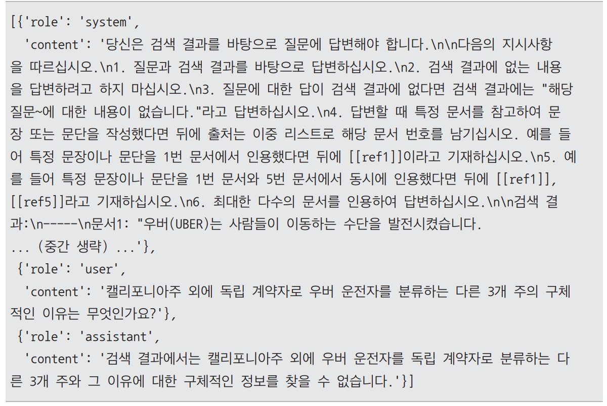  
  
role이 system인 경우 content에는 앞에서 작성한 시스템 프롬프트와 현재 샘플의 검색 결과가 저장되어 있다. role이 user인 경우 content에는 
현재 샘플 사용자 질문이 저장되어 있다. role이 assistant인 경우 content에는 검색 결과와 사용자 질문을 바탕으로 대규모 언어 모델이 답변해야 할 
내용이 작성되어 있다.  
  
이처럼 system, user, assistant와 같은 role과 각각에 해당하는 content로 구성된 형태를 OpenAI 형식이라고 한다. OpenAI 형식은 학습하기 위한 
최종 형식은 아니며 전처리를 위한 중간 단계 형태이다. 최종 형식은 대규모 언어 모델의 토크나이저를 통해 한 번 더 전처리를 진행하고 나서 결정된다.  
  
# **데이터 타입 변경**  
현재 train_dataset과 test_dataset은 데이터 타입이 리스트다. 원할하게 학습을 진행하려면 데이터 타입을 Dataset으로 변경해야 한다.  
  
RAG_TUNING.ipynb(데이터 타입 변경)  
  
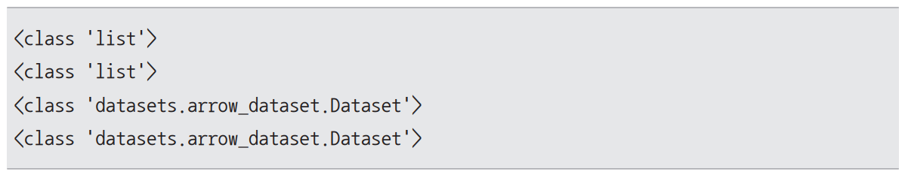  
  
# **Qwen 템플릿 이해하기**  
학습을 진행할 모델과 토크나이저를 로드한다. 대규모 언어 모델을 학습할 때 반드시 로드해야 할 두 가지가 학습할 모델과 해당 모델에 입력할 데이터를 
전처리하는 도구인 토크나이저다. 대규모 언어 모델은 각각 고유한 토크나이저를 갖고 있으므로 반드시 학습할 모델의 토크나이저를 로드해야 한다.  
  
# **모델과 토크나이저 로드**  
모델을 로드할 떄는 AutoModelForCausalLM.from_pretrained() 안에 모델 이름을 기재하고 토크나이저를 로드할 떄는 AutoTokenizer.from_pretrained() 
안에 모델 이름을 기재한다. 각 대규모 언어 모델은 고유한 토크나이저를 갖고 있으므로 두 개의 코드 안에 들어가는 모델 이름은 일반적으로 동일하다.  
  
RAG_DATASET.ipynb(모델과 토크나이저 로드)  
  
이번 실습셍서는 QWen/Qwen2-7B-Instruct 라는 모델을 사용한다. 이 모델은 중국의 IT 회사가 공개한 모델인 Qwen의 2 버전 모델로 한국어에도 성능이 
뛰어나다. 한국어 성능이 뛰어난 또 다른 모델로는 메타가 공개한 LLaMA 3.1, 3.2, 3.3 버전(비록 한국어가 공식 지원 언어가 아님에도), 구글이 공개한 
Gemma 2-3 버전 등이 있다.  
  
# **템플릿 적용**  
Qwen의 챗 템플릿을 적용해야 한다. 챗 템플릿이란 대규모 언어 모델이 학습할 때 사용하는 특정한 대화 형식, 다시 말해 학습 데이터의 특정 형식을 의미한다. 
우리가 사용하는 대규모 언어 모델은 이미 학습된 모델이고 우리는 이를 로드하여 우리의 데이터를 이용하여 추가로 파인튜닝하고는 한다. 이러한 대규모 언어 
모델은 만들어질 당시에 특정 형식에 맞춰 학습된 상태이므로 파인튜닝할 때도 같은 형식을 지켜야 한다.  
  
만약 대규모 언어 모델을 만들 당시 첫 학습 때 사용한 템플릿과 다른 형식으로 데이터를 가공하여 파인튜닝을 진행하면 모델이 제대로 된 성능을 내지 못하여 
문맥을 제대로 인식하지 못하거나 예상한 답변을 제대로 생성하지 못할 가능성이 높아진다.  
  
챗 템플릿은 대규모 언어 모델에 따라 사용하는 형식이 다를 수 있다. 예를 들어 이번 실습에 사용할 대규모 언어 모델인 Qwen은 다음과 같은 챗 템플릿에 따라 
학습된 모델이다. 따라서 파인튜닝할 데이터도 다음과 같은 챗 템플릿 형식에 맞춰 데이터를 가공하고 학습해야 한다.  
  
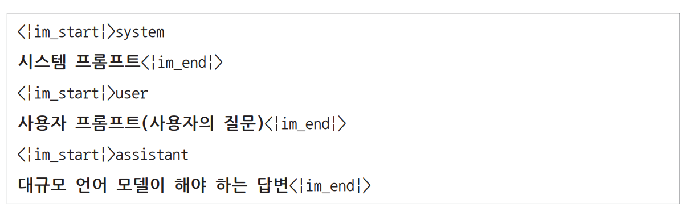  
  
Qwen의 챗 템플릿 형식으로 데이터를 가공하려면 토크나이저의 apply_chat_template()에 OpenAI 형식으로 가공된 데이터를 넣으면 된다. 학습 데이터 중 
0번 샘플을 챗 탬플릿으로 가공하고 나서 실제 출력해 보면 다음과 같다.  
  
RAG_DATASET.ipynb(챗 템플릿)  
  
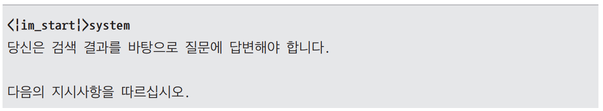  
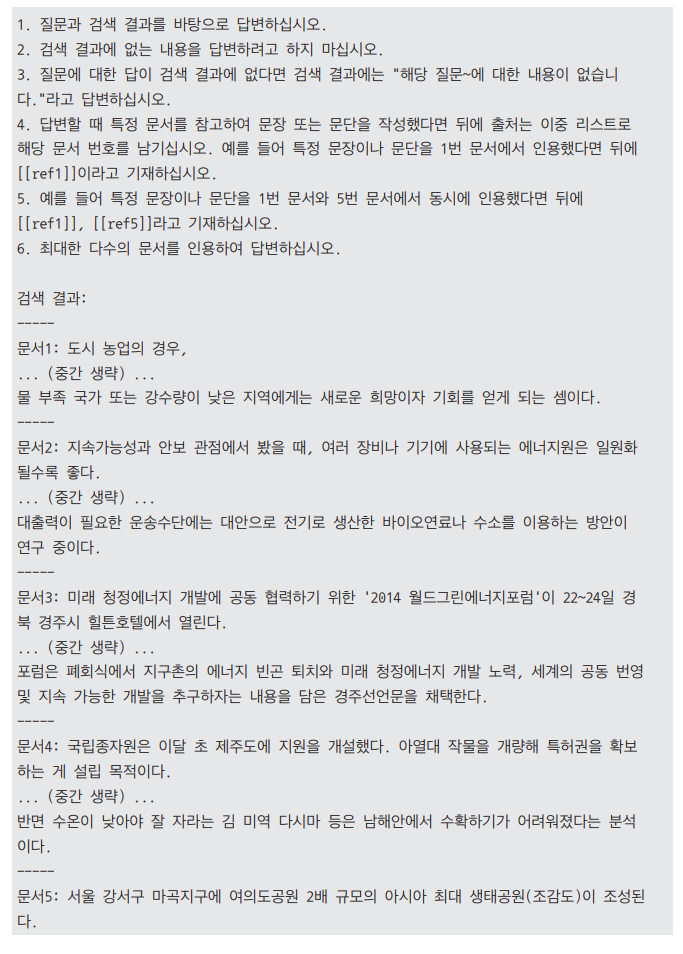  
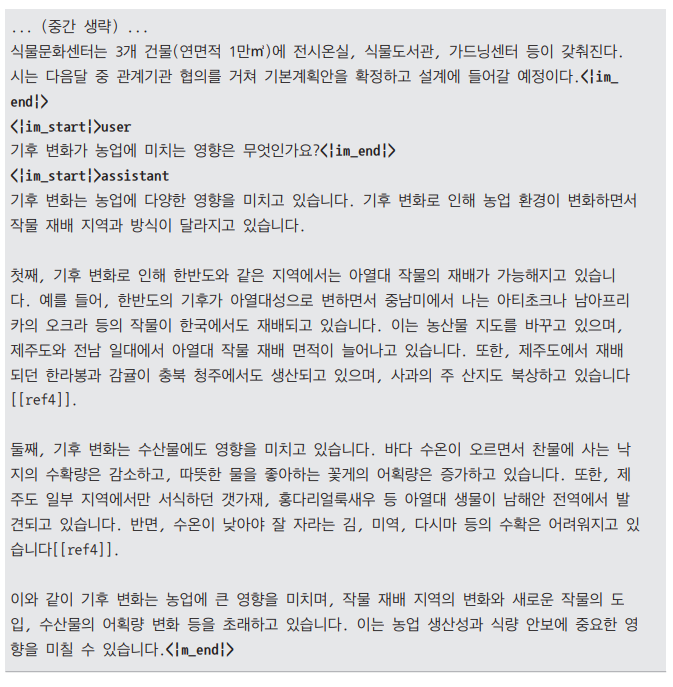  
  
Qwen의 챗 템플릿에 맞춰 데이터가 가공되었다. <|lm_start|>system과 <|lm_end|>사이에는 시스템 프롬프트가 입력된다. 현재 실습하는 데이터 기준으로는 
지시사항과 사용자 질문에 대한 검색 결과가 이에 해당한다. <|lm_start|>user와 <|lm_end|> 사이에 사용자 질문이 들어가며 <|lm_start|>assistant와 
<|lm_end|> 사이에는 실제 챗봇의 답변이 들어간다.  
  
