# **임베딩 모델 파인튜닝**  
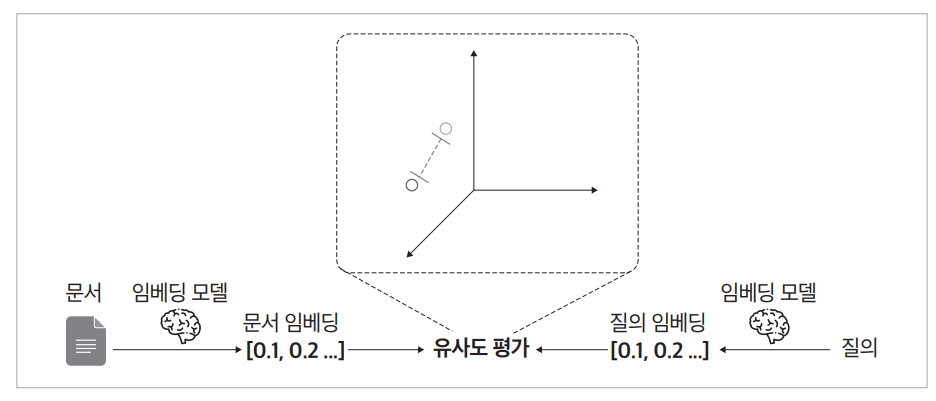  
  
임베딩 모델 파인튜닝은 사전 학습된 임베딩 모델을 특정 도메인이나 작업에 맞게 최적화하는 과정이다. 대규모 언어 모델이 정확한 답변을 제공하려면 효과적인 
문서 검색이 필수이다. 하지만 전문 분야의 문서나 복잡한 내용을 다룰 경우 일반 임베딩 모델은 검색 성능이 떨어질 수 있다. 이러한 상황에서 임베딩 모델을 
파인튜닝하면 검색 정확도를 향상시킬 수 있으며 결과적으로 RAG 시스템의 전반적인 답변 품질을 개선할 수 있다.  
  
# **임베딩 모델의 학습 원리**  
임베딩 학습의 핵심 목표는 의미적으로 유사한 텍스트는 임베딩 공간에서 가깝게, 의미적으로 다른 텍스트는 멀리 위치하도록 만드는 것이다. 즉 임베딩 모델이 
실제로 의미가 비슷한 문장 쌍에는 높은 임베딩 유사도를, 의미가 다른 문장 쌍에는 낮은 유사도를 반환하도록 임베딩 벡터를 업데이트하는 방식이다.  
  
임베딩 모델을 학습할 때는 의미가 유사한 문장 쌍과 유사하지 않은 문장 쌍을 대조하여 학습하는 방식, 즉 대조 학습(contrastive learning)을 활용한다.  
  
# **대조 학습**  
대조 학습을 이해하려면 학습 데이터를 만들 떄 필수로 만들어야 하는 포지티브 샘플(positive sample)과 네거티브 샘플(negative sample)을 알아야 한다.  
  
포지티브 샘플은 의미적으로 관련이 있는 문장 쌍을 의미한다.  
  
- 예:(기준 문서: "서울의 인구는?", 비교 문서: "서울의 인구는 약 970만 명입니다.")  
  
네거티브 샘플은 포지티브 샘플과 대조되는 데이터로 기준 문서는 동일하지만 비교 문서는 의미적으로 관련이 없거나 관련성이 낮은 문장을 준비하여 이들을 
쌍으로 구성한 데이터다.  
  
- 예:(기준 문서: "서울의 인구는?", 비교 문서: "파리는 프랑스의 수도입니다.")  
  
학습 데이터를 만들 떄 포지티브 샘플은 실제 RAG를 수행할 때 사용자가 입력할 만한 검색어를 기준 문서, 그리고 검색 결과로 유사도가 높게 나오기를 바라는 
문서를 관련 있는 문서로 삼아 구성한다. 반면 네거티브 샘플은 실제 RAG 상황에서 같은 앵커에 대해 검색 결과에 포함되지 않기를 바라는 문서를 짝지어 
구성한다.  
  
일반적인 임베딩 학습은 다음과 같은 과정을 따른다.  
  
1. 포지티브 샘플과 네거티브 샘플 구성: 기준 문서를 중심으로 유사도가 높은 쌍인 포지티브 샘플(관련 있는 쌍)과 유사도가 낮은 네거티브 샘플(관련 없는 쌍)
을 모두 학습 데이터로 준비한다.  
2. 대조 학습: 모델이 포지티브 샘플 쌍의 임베딩 간 거리는 가깝게, 네거티브 샘플 쌍의 임베딩 간 거리는 멀게 만들도록 학습한다.  
3. 손실 함수 최적화: 임베딩 간 유사도(보통 코사인 유사도)를 계산하여 포지티브 쌍의 임베딩 유사도는 높이고 네거티브 쌍의 임베딩 유사도는 낮추는 방향으로 
손실 함수를 최적화한다.  
  
여기서 손실 함수는 모델이 예측한 결과와 실제 정답 간의 오차를 계산해 학습을 조정하는 기준이 된다.  
  
# **데이터셋 구성**  
대조 학습에서는 일반적으로 하나의 기준 문서에 대해 하나의 포지티브 샘플과 하나 이상의 네거티브 샘플을 명시적으로 준비해야 한다(일반적으로 기준 문서는 
앵커[anchor]라고 부른다). 특히 네거티브 샘플은 포지티브 샘플보다 양이 많을수록 좋다. 대조 학습용 데이터셋은 보통 다음과 같은 방식으로 구성한다.  
  
# **트리플렛 구성**  
전통적인 방식은 각 학습 데이터를 (앵커, 포지티브, 네거티브) 형태의 트리플렛(triplet)으로 구성하는 것이다.  
  
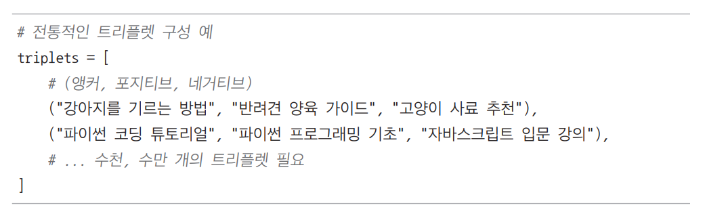  
  
이 구성은 하나의 앵커에 대해 의미적으로 유사한 문장 하나(포지티브), 관련 없는 문장 하나(네거티브)를 짝지어 학습한다.  
  
# **다중 네거티브 구성**  
실제 모델 학습에서는 하나의 앵커에 여러 개의 네거티브 샘플을 포함하는 구성이 더 효과적인 경우가 많다.  
  
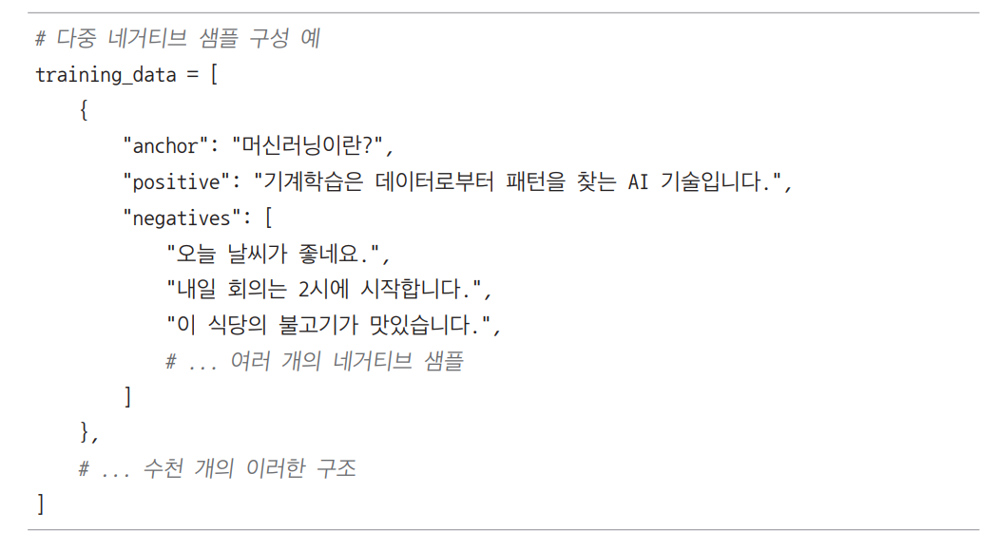    
  
다중 네거티브 구성은 학습 효과를 높일 수 있지만 그만큼 데이터 준비의 난이도도 높아진다.  
  
임베딩 모델을 효과적으로 파인튜닝하기 위해서는 특히 네거티브 샘플 선정이 가장 까다로운 작업 중 하나다. 그 이유는 다음과 같다.  
  
- 네거티브 샘플의 문서는 각 앵커와 관련 없는 텍스트여야만 한다.  
- 적절한 난이도의 네거티브 샘플을 선택해야 한다. 두 개의 쌍이 너무 관련이 없다면 임베딩 모델이 판단하기 너무 쉬워서 학습 효과가 거의 없게 되고 
사람이 보아도 관련이 있는 것인지 관련이 없는 것인지 헷갈릴 정도의 문서 쌍이라면 난이도가 너무 높아져 학습에 오히려 방해가 된다.  
- 다중 네거티브 샘플을 구성할 경우 네거티브 샘플을 포지티브 샘플 대비 몇 배로 구성하느냐에 따라 데이터셋 크기가 기하급수적으로 증가하고 따라서 만들어야 
하는 데이터의 양이 많아지게 된다(앵커 * 네거티브 수).  
  
이러한 이유로 임베딩 파인튜닝에서 양질의 네거티브 샘플을 구성하는 것은 종종 전체 학습 과정에서 가장 어려운 부분 중 하나다. 따라서 이번 실습에서는 
이러한 부담을 덜기 위해 네거티브 샘플을 자동으로 생성하는 방법을 사용한다.  
  
# **배치 내 네거티브 샘플링**  
이번 실습에서는 배치 내에서 네거티브 샘플을 선정하는 학습 방법을 사용한다. 이 방법은 기존에 네거티브 샘플을 직접 준비하는 방식과 달리, 명시적인 
네거티브 샘플을 별도로 준비할 필요가 없다는 큰 장점이 있다. 대신 학습 데이터에서 다른 앵커에서 사용하고 있는 샘플(현재 배치 내의 다른 샘플)을 
참고하여 자동으로 네거티브로 활용한다.  
  
먼저 이 원리를 이해하려면 배치(batch)라는 개념을 알아야 한다. AI 모델은 학습할 때 일반적으로 데이터를 1개씩 학습하거나 전체 데이터를 한 번에 
학습하지 않는다. 데이터를 적당한 개수의 묶음으로 나누어 학습한다. 예를 들어 학습 데이터가 5000개이고 배치 크기를 40으로 설정했다면 모델은 이 데이터를 
40개씩 묶어 총 125회(5000 / 40)에 걸쳐 학습하게 된다. 다시 말해 배치란 모델이 한 번에 학습하는 데이터의 단위를 뜻하며 병렬적으로 데이터를 몇 
개씩 학습할 것이냐를 의미한다.  
  
배치 내 네거티브 데이터 생성 방법은 포지티브 샘플만으로 데이터를 구성하더라도 배치 내에서 네거티브 샘플들을 자동으로 만드는 학습 방법이다. 이는 
데이터 준비 과정을 크게 단순화하고 학습 효율성을 높이는 핵심 요소이다. 사용자는 학습을 위해 포지티브 샘플만 제공하면 되며 네거티브 샘플은 학습 시 
배치 내에서 자동으로 생성된다.  
  
예를 들어 배치 크기가 4인 경우 한 번의 학습에 네 개의 서로 다른 앵커 문서와 그에 대응하는 포지티브 샘플이 사용되며 이들 간 교차로 네거티브 샘플 역할도 
동시에 수행된다.  
  
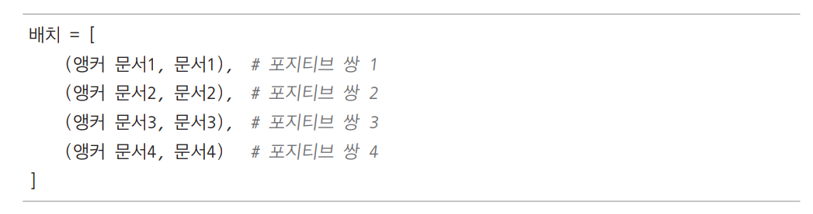  
  
이때 대조 학습은 다음과 같이 진행된다.  
  
- 앵커 문서1의 포지티브는 문서1, 나머지 문서2, 문서3, 문서4는 네거티브로 간주된다.  
- 앵커 문서2의 포지티브는 문서2, 나머지 문서1, 문서3, 문서4는 네거티브로 간주된다.  
- 앵커 문서3과 4도 같은 방식으로 처리된다.  
  
이처럼 하나의 배치 안에서 다른 쌍의 문서를 네거티브로 자동 활용하면서 대조 학습을 수행하게 된다.  
  
조금 더 구체적인 예로 다음과 같은 4개의 문장 쌍이 있다고 가정한다. 다음은 배치 크기가 4인 경우의 포지티브 샘플을 가정한다.  
  
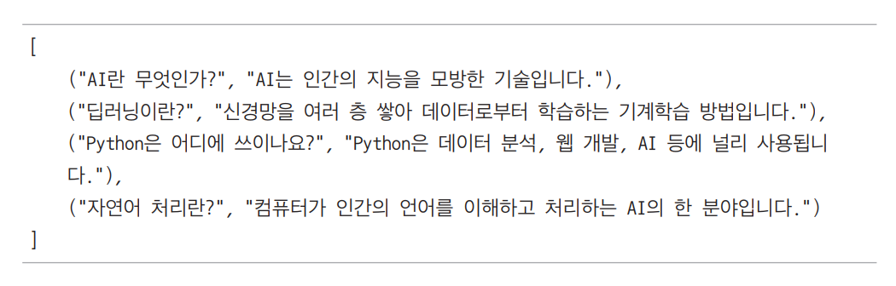  
  
배치 크기가 4일 때 "AI란 무엇인가?"라는 앵커(실제 RAG에서 검색어에 해당)를 기준으로 보면 다음과 같은 방식으로 학습이 이루어진다.  
  
- 포지티브 샘플: "AI는 인간의 지능을 모방한 기술입니다."  
- 네거티브 샘플: "신경망을 여러 층 쌓아 데이터로부터 학습하는 기계학습 방법입니다.", "Python은 데이터분석, 웹 개발, AI 등에 널리 사용됩니다.", 
"컴퓨터가 인간의 언어를 이해하고 처리하는 AI의 한 분야입니다."  
  
이와 같이 이번 실습에서 사용할 배치 내 네거티브 샘플링 방법을 사용하면 하나의 배치 안에서 다른 샘플들이 자동으로 네거티브로 활용되므로 사용자는 
포지티브 샘플만 구성하면 된다.  
  
# **MultipleNegativesRankingLoss**  
손실 함수란 AI 모델이 학습 중에 오차를 계산하고 그 오차를 줄이도록 모델을 업데이트하는 기준이 되는 수식을 의미한다. 이번 실습에서는 학습 시 
MultipleNegativesRankingLoss라는 손실 함수를 사용한다. 모델은 이 함수의 값을 줄이는 방향으로 학습이 진행된다.  
  
손실 함수 MultipleNegativeRankingLoss는 다음과 같이 계산된다.  
  
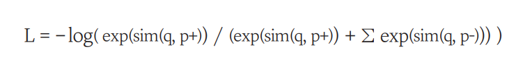  
  
여기서 각각의 변수가 의미하는 바는 다음과 같다.  
  
- q: 앵커 임베딩(검색어 임베딩)  
- p+: 포지티브 샘플에서 앵커와 연관 있는 문서의 임베딩  
- p-: 네거티브 샘플에서 앵커와 연관 없는 문서의 임베딩  
- sim(): 유사도 함수(일반적으로 코사인 유사도 사용)  
  
이 식은 포지티브 샘플과의 유사도는 높이고 네거티브 샘플과의 유사도는 낮추도록 설계되어 있다. 학습 과정에서 모델은 이 손실값을 최소화하는 방향으로 
학습되며 결과적으로 학습이 완료된 후에는 포지티브 쌍의 유사도는 높아지고 네거티브 쌍의 유사도는 낮아진 형태로 모델이 업데이트된다.  
  
# **학습 코드의 이해**  
다음은 실제로 학습에 사용할 구현 코드를 간단하게 작성해본 예이다.  
  
EXAMPLE.ipynb(예제)  
  
sentence_transformers 라이브러리를 통해 'BAAI/bge-m3'모델을 기본 모델로 로드한다. 이 모델은 한국어, 영어, 중국어에 뛰어난 임베딩 모델이다. 
훈련 데이터는 InputExample 객체의 리스트로 준비하는데, 각 예제는 의미적으로 유사한 두 문장 쌍으로 구성된다. 따라서 모델은 이러한 문장 쌍들을 
통해 유사한 문장들이 임베딩 공간에서 가깝게 위치하도록 학습한다.  
  
다음은 DataLoader를 활용하여 배치 크기 32로 데이터를 효율적으로 처리하도록 설정한다(예제에서는 데이터가 4개밖에 없지만 실제 상황에서는 데이터가 32개보다 많다고 
가정한다).  
  
손실 함수로는 MultipleNegativesRankingLoss를 채택했으며 이 함수는 의미적으로 유사한 문장들(긍정적 쌍)은 가깝게, 그렇지 않은 문장들(부정적 쌍)은 
멀리 위치시키도록 모델을 유도한다. 또한 scale=20.0 파라미터는 온도의 역수로서 손실 함수의 강도를 적절히 조절하는 역할을 한다.  
  
학습 과정에서는 안정적인 학습을 위해 워밍업 단계를 전체 훈련 데이터의 10%로 설정하고 임베딩 모델을 학습할 떄 업데이트하는 정도를 조절하는 학습률
은 2e-5로 지정한다. 이러한 워밍업 단계는 모데링 초기에 안정적으로 학습할 수 있도록 학습률을 점진적으로 증가시키는 효과적인 기법이다.  
  
마지막으로 model.fit() 함수를 호출하여 모델을 학습한다. 이때 주어진 데이터에 대한 학습 횟수를 의미하는 에포크의 경우 총 3 에포크동안 모델을 학습시키고 
완성된 모델은 korean-sentence-embedding-model 디렉터리에 저장한다. 파인튜닝된 임베딩 모델은 한국어 문장의 의미적 특성을 더욱 정확하게 포착할 
수 있으므로 궁극적으로 RAG에서 더욱 향상된 성능을 발휘할 수 있게 된다.  
  
# **학습 시 성능을 높이는 방법**  
# **배치 크기 키우기**  
임베딩 모델을 효과적으로 학습시키려면 배치 크기를 크게 설정하는 것이 중요한 전략 중 하나다. 일반적으로 대조 학습은 동일 앵커 기준으로 네거티브 샘플이 
포지티브 샘플보다 많을수록 학습 성능이 올라간다는 특징이 있다. 이번 실습에서는 배치 내 네거티브 샘플을 구성하는 방식을 사용하므로 배치 크기가 클수록 
더 많은 네거티브 샘플이 생성되어 모델 성능이 향상될 가능성이 있다.  
  
- 배치 크기가 4인 경우: 각 질문에 대해 3개의 네거티브 샘플  
- 배치 크기가 32인 경우: 각 질문에 대해 31개의 네거티브 샘플  
- 배치 크기가 128인 경우: 각 질문에 대해 127개의 네거티브 샘플  
  
하지만 배치 크기는 GPU 메모리 용량에 따라 제한되므로 무한정 키울 수는 없다. 사용중인 GPU의 자원이 넉넉할수록 더 큰 배치 크기를 설정할 수 있지만 
메모리 한도를 초과하면 학습이 실패하거나 오류가 발생할 수 있다.  
  
예를 들어 구글 코랩에서 제공되는 무료 GPU를 사용할 경우 일반적으로 설정 가능한 배치 크기는 3~4 수준에 그치는 경우가 많다.  
  
# **하드 네거티브 선정**  
기본적인 배치 내 네거티브 샘플링만으로도 만족할 만한 성능을 낼 수 있지만 더 어려운 네거티브 샘플, 즉 하드 네거티브(hard negative)를 추가하면 성능을 
더욱 향상시킬 수 있다. 하드 네거티브는 명시적으로 사용자가 직접 선택하여 학습 데이터에 포함시키는 네거티브 샘플을 의미한다. 일반적인 MultipleNegativesRankingLoss의 
배치 내 네거티브 샘플링이 자동으로 선택되는 이지 네거티브(easy negative)인 반면 하드 네거티브는 사용자가 의도적으로 선별하는 샘플이다.  
  
# **코드 내 하드 네거티브 구현 방법**  
하드 네거티브는 다음과 같은 형태로 데이터를 수정하여 사용할 수 있다.  
  
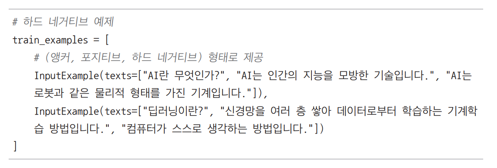  
  
이때 트리플셋의 구성은 다음과 같다.  
  
- 각 InputExample의 첫 번째 항목은 앵커(질문)이다.  
- 두 번째 항목은 포지티브 샘플(관련 있는 응답)이다.  
- 세 번째 이후 항목들은 하드 네거티브(관련 없지만 구분하기 어려운 응답)이다.  
  
손실 함수는 각 쌍 (앵커, 포지티브)에 대해 다른 모든 앵커의 포지티브 샘플들과 모든 하드 네거티브 샘플들을 네거티브로 사용한다. 즉 각 앵커는 자신의 
포지티브와 유사도가 높아지도록 학습되고 다른 앵커의 포지티브나 모든 하드 네거티브와는 유사도가 낮아지도록 학습된다. 하드 네거티브와 일반 네거티브의 
차이점을 정리하면 다음과 같다.  
  
- 일반 네거티브(배치 내 무작위 네거티브)  
1. 자동으로 배치 내에서 생성됨  
2. 대부분 주제가 완전히 다른 무관한 문장들  
3. 모델이 구분하기 상대적으로 쉬움  
  
- 하드 네거티브(명시적 네거티브)  
1. 사용자가 직접, 의도적으로 선택함  
2. 포지티브와 주제는 유사하나 정확한 답변이 아님  
3. 미묘한 의미 차이를 포함하여 모델에게 더 큰 도전이 됨  
  
예시  
- 질문: "당뇨병의 증상은 무엇인가요?"  
- 포지티브: "당뇨병의 주요 증상으로는 갈증 증가, 빈뇨, 체중 감소 등이 있습니다."  
- 하드 네거티브(명시적): "저혈당의 증상으로는 현기증, 발한, 불안감 등이 있습니다." (의료 관련 주제이지만 당요병이 아닌 저혈당에 관한 내용)  
- 일반 네거티브(배치 내 자동 선택): "파이썬은 객체지향 프로그래밍 언어입니다." (완전히 다른 주제)  
  
하드 네거티브 샘플을 사용하면 모델이 더 미묘한 의미 차이를 학습하게 되어 정확도가 크게 향상될 수 있다. 이러한 하드 네거티브를 구성하려면 해당 
분야에 대한 도메인 지식과 추가 작업이 필요하지만 가능하다면 일반 네거티브와 하드 네거티브를 병행해 사용하는 것이 이상적이다.  
  
# **그 외 학습 성능 향상을 위한 팁**  
임베딩 모델의 학습 성능을 높이기 위해 다음과 같은 방법들도 고려해볼 수 있다.  
  
- 학습 데이터와 실전과의 괴리 최소화: 학습에 사용할 데이터의 앵커는 실제 RAG에서 사용자가 입력할만한 질문으로 구성해야 한다. 학습 데이터와 실제 
RAG에서 입력될 질문의 차이가 클수록 학습 후의 효용은 떨어지기 마련이다.  
- 데이터 증강: 난이도가 높은 하드 네거티브 샘플을 충분히 확보하면 모델이 더 섬세한 의미 차이를 학습할 수 있어 성능 향상에 도움이 된다.  
- 학습률 조정: 학습률을 바꿔가면서 여러 번 학습하여 모델의 성능을 평가하고 최적의 학습률을 찾아보는 것이 좋다.  
- 온도 파라미터 조정: 손실 함수의 scale 파라미터를 조절하면 학습 강도를 세밀하게 조정할 수 있다.  
  
# **실전 파인튜닝**  
이번 실습은 GPU 사용 환경을 전제로 진행된다. 구글 코랩 상단 메뉴의 런타임 -> 런타임 유형 변경 버튼을 클릭하고 T4 GPU를 선택해 런타임을 변경한다.  
  
# **데이터 로드하기**  
# **라이브러리 설치 및 도구 임포트**  
EMBEDDING_FINE-TUNING.ipynb(라이브러리 설치 및 도구 임포트)  
  
각 라이브러리의 주요 역할과 용도는 다음과 같다.  
  
- os: 환경 변수 설정에 사용되며 임베딩 모델 파인튜닝 과정에서 오픈AI API키를 설정한다.  
- requests: PDF 파일과 같은 학습 데이터를 인터넷에서 다운로드할 때 사용한다.  
- json: API 응답을 처리하거나 구성 설정을 저장/로드할 때 활용한다.  
- pandas: 임베딩 모델 성능 평가 결과를 데이터프레임으로 구성하고 분석하는데 사용한다.  
- numpy: 벡터 연산을 수행하며 특히 임베딩 벡터 간 코사인 유사도 계산에 사용한다.  
- tqdm: 대용량 데이터셋을 처리할 때 진행 상황을 시작적으로 표시하여 학습 과정을 모니터링한다.  
- OpenAI: GPT 모델을 사용해 문서로부터 질문을 생성하는 등의 작업에 활용한다.  
- DataLoader: 임베딩 모델 학습 시 배치 단위로 데이터를 효율적으로 로드한다. 이때 배치 크기는 성능에 큰 영향을 미친다.  
- SentenceTransformer: 문장 임베딩 모델의 핵심 라이브러리로 다양한 사전 학습 모델을 로드하고 파인튜닝한다.  
- losses: MultipleNegativesRankingLoss와 같은 손실 함수를 제공하여 임베딩 모델이 관련 문서 쌍은 가깝게, 관련 없는 문서 쌍은 멀게 학습하도록 한다.  
- InputExample: 파인튜닝용 학습 데이터 포맷으로 질문과 관련 문서 쌍을 모델이 이해할 수 있는 형태로 구성한다.  
- InformationRetrievalEvaluator: 파인튜닝된 모델의 검색 성능을 정확도, MRR, NDCG 등 다양한 지표로 평가한다.  
- torch: 임베딩 모델의 기본 프레임워크로 텐서 연산과 GPU 가속을 지원한다.  
- cosine_similarity: 임베딩 벡터 간 유사도를 계산하여 질문에 가장 관련성 높은 문서를 찾는 데 사용한다.  
- PyPDF2: PDF 파일을 읽는 데 사용한다.  
  
# **하드 네거티브 선정**  
일본 ICT 동량 문서와 미국 ICT 동향 문서 두 가지를 다운로드한다. 여기서는 미국 ICT 동향 문서를 기준으로 임베딩 모델을 학습시키고 동일한 도메인 문서인 
일본 ICT 동향 문서에 대해 검색 성능을 평가해본다. 실제 현업에서 임베딩 모델을 파인튜닝할 때도 실제 RAG에서 사용할 동일한 도메인의 데이터로 파인튜닝하면 
더 좋은 효과를 얻을 수 있다.  
  
EMBEDDING_FINE-TUNING.ipynb(PDF 추출)  
  
앞의 코드를 실행하면 깃허브 저장소에서 두 개의 PDF 파일을 다운로드한다. 이제 내려받은 두 개의 파일을 PDF 로더를 이용하여 각각 파이썬 문자열 리스트로 
읽는다.  
  
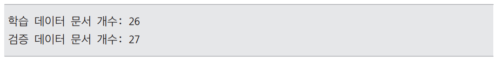  
  
extract_text_from_pdf 함수는 PDF 파일 경로를 입력받아 해당 PDF의 텍스트 내용을 페이지 단위로 추출한다. 추출된 텍스트는 앞뒤 공백을 제거하고 
의미 있는 내용을 보장하기 위해 길이가 10자를 초과하는 텍스트만 text_chunks 리스트에 추가한다. 이렇게 수집된 모든 청크가 함수의 반환값이 된다.  
  
ict_usa_2024.pdf에서 추출한 텍스트는 학습 데이터로 사용할 train_corpus에 저장하고 ict_japan_2024.pdf에서 추출한 텍스트는 검증 데이터로 
사용할 val_corpus에 저장한다.  
  
# **합성 데이터 생성**  
이번에는 배치 인 네거티브 샘플 선정 방법을 사용하므로 네거티브 샘플을 따로 준비할 필요는 없다. 하지만 학습에 필요한 포지티브 샘플은 반드시 존재해야 
한다. 따라서 GPT-4o API를 이용하여 자동으로 포지티브 샘플을 만든다. 이떄 GPT-4o를 사용하여 각 문서에 대해 떠오를 수 있는 질문을 작성하라고 
지시를 내리는 방식으로 만든다.  
  
EMBEDDING_FINE-TUNING.ipynb(합성 데이터 생성)  
  
generate_queries 함수는 PDF에서 추출한 텍스트 데이터 train_corpus와 val_corpus를 입력받아 처리한다. 각 텍스트 문서마다 오픈AI API를 통해 GPT-4o 
모델에게 질문 생성을 요청한다. num_questions_per_chunk=2 파라미터는 각 문서당 2개의 질문을 생성하도록 지정한다.  
  
예를 들어 주어진 문서 내용이 다음과 같다고 가정한다.  
  
- "2024년 일본의 반도체 산업은 전년 대비 15% 성장했으며 정부는 300억 엔의 추가 투자를 발표했다."  
  
GPT-4o는 이 내용을 바탕으로 다음과 같은 두 개의 질문을 생성할 수 있다.  
  
- "2024년 일본 반도체 산업의 성장률은 얼마인가?"  
- "일본 정부가 반도체 산업에 발표한 추가 투자 금액은?"  
  
GPT-4o API를 이용하여 두 개의 포지티브 샘플을 만들어낸 셈이다. 각 질문과 그에 대응하는 연관된 문서 쌍이 생겼기 때문이다. 앞의 함수는 이와 같이 각 
문서별로 질문을 만들면서 두 개의 리스트 all_queries와 all_positive_docs를 생성한다.  
  
- all_queries: 생성된 모든 질문이 들어있다.  
- all_positive_docs: 각 질문의 출처가 된 문서들이 순서대로 들어있다.  
  
이 두 리스트는 인덱스를 기준으로 서로 매칭된다. 예를 들어 all_queries[0]에 있는 질문은 all_positive_docs[0]에 있는 문서를 기반으로 만들어졌으며 
이 둘은 포지티브 샘플 쌍이다.  
  
참고로 이렇게 합성 데이터를 생성하는 작업을 실제 실무에 적용할 때는 예제의 프롬프트를 그대로 사용하기 보다 현재 구현하는 RAG 시스템의 실제 상황에서 사용자가 
입력할 만한 질문들이 생성되도록 프롬프트를 조정하는 것이 바람직하다.  
  
generate_queries 함수를 사용하여 학습 데이터와 테스트 데이터를 만들고 개수를 출력해본다.  
  
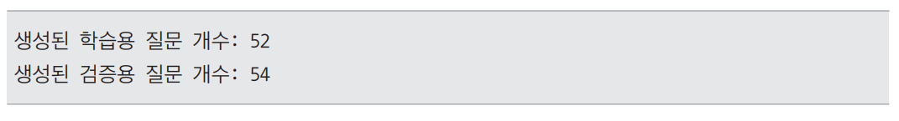  
  
train_queries에는 '미국 ICT 동향 문서'로부터 만들어낸 26개의 문서에 해당하는 train_corpus를 입력하여 만든 질문들이 저장되어 있다. 출력 결과를 
보면 각 문서당 질문을 2개씩 생성하도록 지정했기 떄문에 총 52개의 질문이 만들어졌다. 따라서 학습 데이터는 총 52개의 포지티브 샘플이다.  
  
이와 같은 원리로 val_queries에는 '일본 ICT 동향 문서'로부터 만들어낸 27개의 문서에 해당화는 val_corpus를 입력하여 만든 질문들이 저장되어 
있으며 테스트 데이터는 총 54개의 포지티브 샘플이다.  
  
이제 이 데이터를 학습에 사용할 수 있도록 InputExample 객체의 리스트 형태로 변환한다.  
  
InputExample 객체의 리스트로 변환한 후 54개의 학습 데이터 train_examples에서 첫 번째 데이터를 출력해본다. .texts를 붙이면 실제 데이터를 출력할 
수 있다.  
  
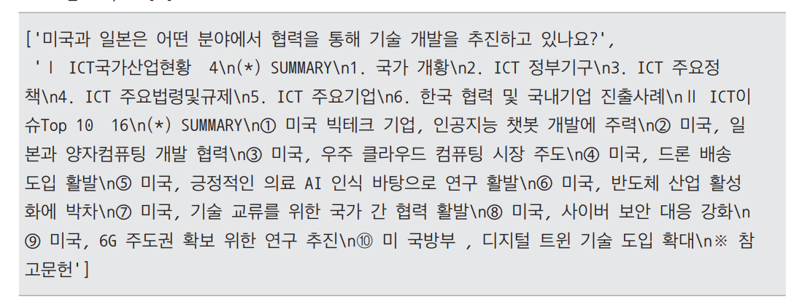  
  
출력 결과를 보면 두 개의 원소를 지닌 리스트가 출력되는데 각각 GPT-4o가 생성한 질문과 GPT-4o가 질문을 생성하기 위해 참고한 문서다. 이 둘은 서로 
연관이 있는 질문과 문서이므로 포지티브 샘플 관계다. 마찬가지로 두 번째 데이터를 출력해본다.  
  
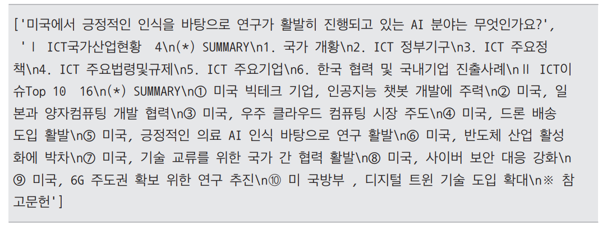  
  
질문은 다르지만 문서 자체는 첫 번째 데이터와 동일한데 이는 GPT-4o API가 동일한 문서에 대해 질문을 2개씩 생성했기 떄문이다. 결과적으로 하나의 
문서에 대해 2개의 질문-문서 쌍이 포지티브 샘플로 생성된다.  
  
# **모델 로드하기**  
배치 크기, 학습할 모델, 사용할 손실 함수를 설정한다. 배치 크기는 4로 설정한다. DataLoader()에 train_examples를 전달하고 batch_size 값을 
4로 설정한다. 이 설정에 따라 총 54개의 학습 데이터는 4개씩 묶여 배치 단위로 처리된다. 여기서는 코랩 GPU의 한계로 매우 작은 배치 크기인 4를 
선택하지만 일반적으로 배치 크기가 클수록 더 많은 네거티브 샘플이 생성되므로 성능이 더 좋아질 수 있다.  
  
EMBEDDING_FINE-TUNING.ipynb(모델 로드하기)  
  
이제 학습에 사용할 모델을 선택한다. 학습에 사용할 모델은 한국어에서 다른 모델 대비 상대적으로 뛰어난 성능을 보이는 모델 "BAAI/bge-m3"이다. 
SentenceTransformer 모듈을 사용하여 허깅페이스 저장소로부터 모델을 다운로드한다.  
  
손실 함수로는 MultipleNegativesRankingLoss를 사용한다. 손실 함수는 모델이 얼마나 잘 작동하는지를 측정하는 기준이다. 이 손실 함수는 다음과 같은 
방식으로 작동한다.  
  
- 포지티브 샘플과의 유사도는 높일수록 좋다. 즉, 검색어(앵커)와 관련 있는 문서가 가까이 있도록 학습한다.  
- 네거티브 샘플과의 유사도는 낮을수록 좋다. 즉, 관련 없는 문서는 멀어지도록 학습한다.  
  
MultipleNegativesRankingLoss는 이 두 가지 목표를 달성하기 위해 설계된 특별한 손실 함수다. 이 손실 함수의 값, 즉 오차가 작아진다는 것은 
모델이 검색어와 문서 간의 관계를 더 정확히 이해하고 있다는 뜻이다. 이를 통해 검색어와 관련 없는 문서를 검색 결과에서 멀리하고 관련성이 높은 문서를 
강조할 수 있다.  
  
# **평가 데이터 전처리**  
이번 실습에서는 검색 성능을 평가하는 데 InformationRetrievalEvaluator를 사용한다. 이 도구를 사용하려면 평가 데이터를 특정 형식으로 전처리해야 한다. 
InformationRetrievalEvaluator는 정보 검색 모델을 평가하는 도구로 다음 세 가지 필수 데이터 구조를 입력받는다.  
  
1. queries  
질문 ID를 키(key)로, 질문 텍스트를 값(value)으로 갖는 파이썬 딕셔너리다. 예를 들어 다음과 같은 구조다.  
   
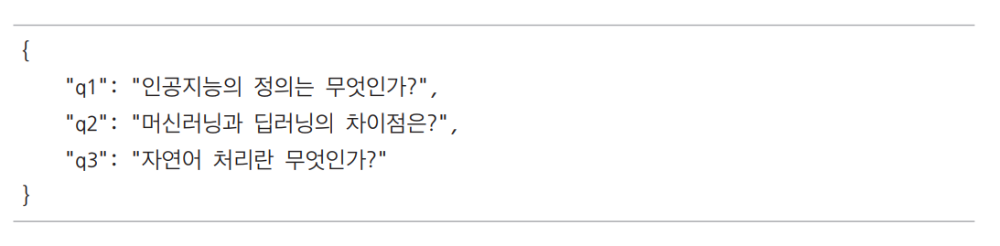  
  
2. corpus  
문서 ID를 키로, 문서 텍스트를 값으로 갖는 파이썬 딕셔너리다. 예를 들어 다음과 같은 구조다.  
  
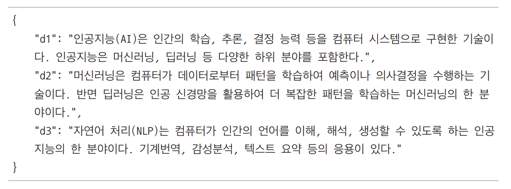  
  
3. relevant_docs  
질문 ID를 키로, 해당 질문에 관련된 문서 ID들의 집합(set)을 값으로 갖는 파이썬 딕셔너리다. 예를 들어 다음과 같은 구조다.  
  
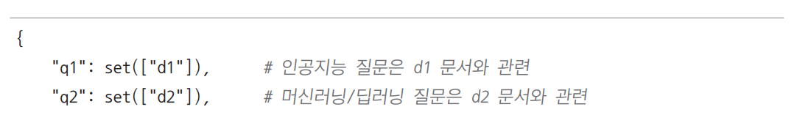  
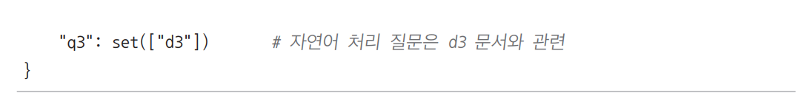  
  
실제 코드를 가정하여 조금 더 구체적인 예를 들어 살펴본다. 앵커 질문들이 저장된 val_queries와 이와 연관되는 문서들이 저장된 val_positive_doc가 
다음과 같다고 가정한다.  
  
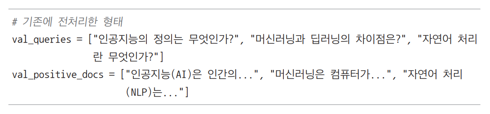  
  
이 데이터를 InformationRetrievalEvaluator에서 사용하려면 다음과 같은 형식으로 변환해야 한다.  
  
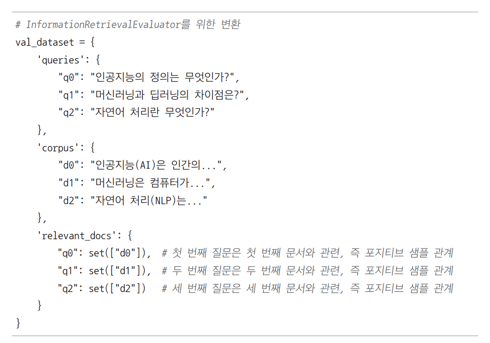  
  
이러한 형식을 참고하여 기존의 val_queries, val_positive_docs를 이와 같은 형태로 전처리하는 코드를 작성한다.  
  
이제 dataset에는 InformationRetrievalEvaluator를 사용하는 데 필요한 데이터인 queries, corpus, relevant_docs가 저장되어 있다. 먼저 
dataset['corpus']를 통해 corpus를 출력해본다.  
  
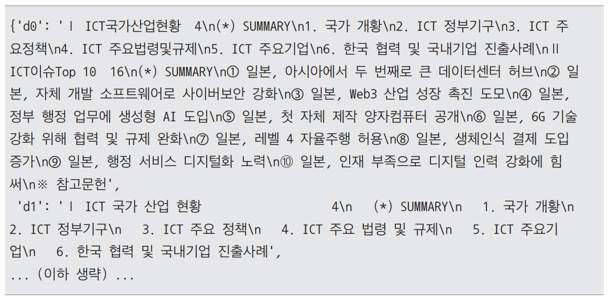  
  
출력 결과를 보면 평가 데이터로 사용할 일본 ICT 문서에 'd+숫자' 형태로 문서 ID가 부여되어 문서 ID를 키로, 문서 텍스트를 값으로 갖는 파이썬 딕셔너리다. 
이제 queries를 출력해본다.  
  
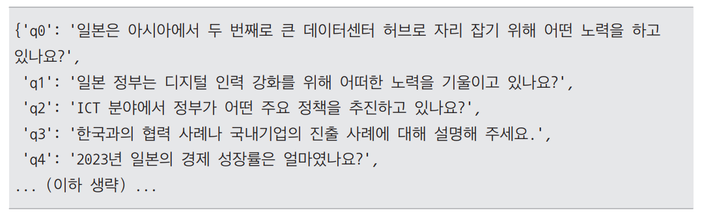  
  
출력 결과를 보면 평가 데이터로 사용할 일본 ICT 문서로부터 GPT-4o가 생성한 앵커에 해당하는 질문들이 저장되어 있다. 해당 질문에 키 값이 부여된 파이썬 
딕셔너리다. relevant_docs를 출력해 본다.  
  
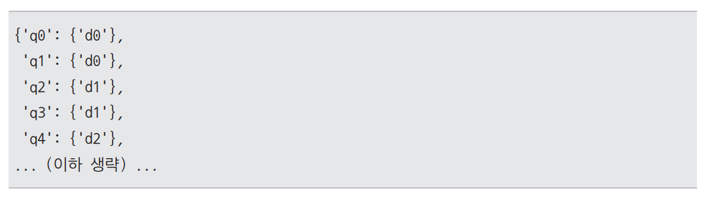  
  
출력 결과를 보면 질문 ID를 키로, 해당 질문에 관련된 문서 ID들의 집합(set)을 값으로 갖는 파이썬 딕셔너리다. 즉 포지티브 샘플 관계를 각 키 값을 통해 
표현한 상태이다. 이제 dataset['queries'], dataset['corpus'], dataset['relevant_docs']를 각각 corpus, queries, relevant_docs에 
저장하고 이를 InformationRetrievalEvaluator에 전달한다.  
  
# **모델 학습하기**  
데이터의 양이 적기 떄문에 많은 학습이 필요하지는 않다. 학습 횟수를 의미하는 EPOCHS 값을 2로 설정한다. 이렇게 설정하면 학습 데이터 52개에 대해 총 
2회 반복하여 학습한다.  
  
EMBEDDING_FINE-TUNING.ipynb(모델 학습하기)  
  
코드에서 os.environ["WANDB_DISABLED"] = "ture"는 학습 시 로그를 기록하는 모듈을 여기서는 사용하지 않는다는 의미다. 학습 과정을 시각화하지 
않고 간단히 진행할 떄 유용하다. wramup_steps는 학습 초기에 학습률을 점진적으로 증가시키는 단계 수다. 여기서는 데이터로더(loader)의 길이와 
에포크 수를 곱한 값의 10%를 사용하므로 전체 학습의 초반 10%는 학습률을 서서히 증가하게 된다.  
  
실제 학습은 model.fit() 함수를 통해 이루어진다. train_objectives=[(loader, loss)]를 통해 준비한 데이터 로더(질문-문서 쌍이 담긴 train_examples
를 배치 크기 4로 로드)와 손실 함수(MultipleNegativesRankingLoss)를 연결한다. output_path='ext_finetune'은 파인튜닝된 모델을 exp_finetune 
디렉터리에 저장한다는 의미다.  
  
GPU를 사용하고 있다면 데이터가 매우 소량이므로 수 분 이내에 학습이 끝나게 된다.  
  
# **검색 성능 평가 지표**  
RAG에서 검색 성능을 평가할 때는 몇 가지 대표적인 평가 지표(metric)를 사용한다. InformationRetrievalEvaluator 역시 이러한 지표들을 기반으로 
평가를 수행한다.  
  
이제 학습 전후 모델의 성능 변화를 올바르게 해석하기 위해 InformationRetrievalEvaluator에서 사용하는 총 6개의 주요 평가 지표를 정리해본다.  
  
1. Accuracy  
Accuracy는 정답이 상위 몇 개의 검색 결과 안에 포함되었는지를 평가하는 지표다. 중요한 점은 정답이 포함되기만 하면 성공으로 간주한다는 것이다. 예를 
들어 Accuracy@5가 0.92라는 값은 전체 질문 중 약 92%에서 상위 5개의 결과 안에 정답이 하나라도 포함되었다는 뜻이다. Accuracy는 검색 시스템이 얼마나 자주 
정답을 포함하는지를 측정하며 정답의 개수나 위치는 고려하지 않는다.  
  
예를 들어 질문에 대해 상위 5개의 검색 결과가 다음과 같다고 가정한다.  
  
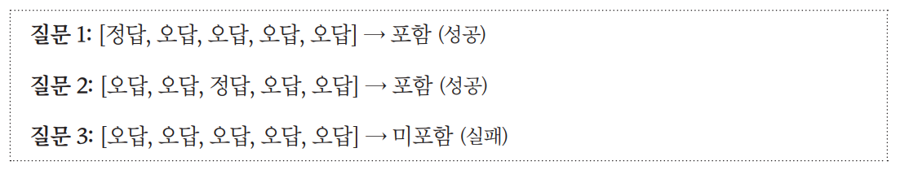  
  
이때 Accuracy@5 = 2/3 = 0.667, 즉 약 66.7%다.  
  
2. Precision  
Precision은 상위 검색 결과가 얼마나 정확히 정답으로 이루어져 있는가?를 평가한다. Precision@k는 상위 k개의 검색 결과 중 정답이 차지하는 비율이다. 
예를 들어 Precision@5가 0.20이라는 값은 상위 5개의 결과 중 평균적으로 20%가 정답이라는 뜻이다. Precision은 검색 결과가 불필요한 정보를 얼마나 
적게 포함하고 있는지를 보여준다.  
  
예를 들어 질문에 대해 상위 5개의 검색 결과가 다음과 같다고 가정한다.  
  
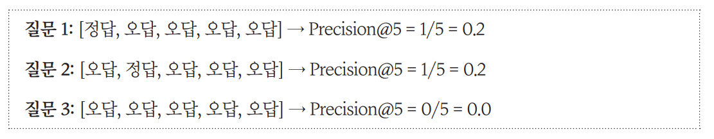  
  
이때 평균 Precision@5 = (0.2 + 0.2 + 0.0) / 3 = 0.133, 즉 약 13.3%이다.  
  
3. Recall
Recall은 검색 결과가 얼마나 포괄적으로 정답을 포함하고 있는지를 평가한다. Recall@k는 전체 정답 중 검색 결과 상위 k개 안에 포함된 정답의 비율을 나타낸다. 
Recall은 정답을 놓치지 않고 얼마나 잘 찾아내는지를 보여준다. 참고로 실습 데이터에서는 각 질문당 정답이 하나씩만 있기 때문에 Recall과 Accuracy의 
값이 동일하다.  
  
예를 들어 질문 하나에 정답이 두 개 있다고 가정한다.  
  
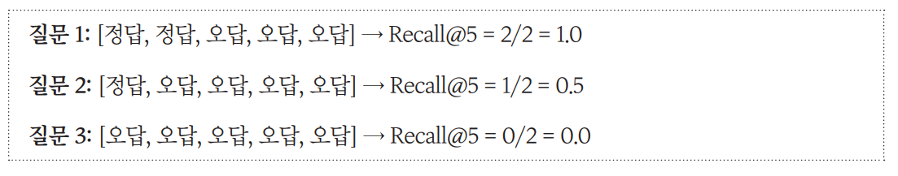  
  
이때 평균 Recall@5 = (1.0 + 0.5 + 0.0) / 3 = 0.5, 즉 50%이다.  
  
4. NDCG(Normalized Discounted Cumulative Gain)  
NDCG는 검색 결과에서 정답이 높은 순위에 배치될수록 높은 점수를 부여한다. 이는 단순히 정답이 포함되었는지를 넘어 정답의 순위가 사용자에게 얼마나 
유용한지를 평가하는 지표다. NDCG@10이 0.85라는 값은 정답이 대체로 높은 순위에 배치되었음을 의미한다.  
  
예를 들어 질문에 대해 상위 3개의 검색 결과가 다음과 같다고 가정한다.  
  
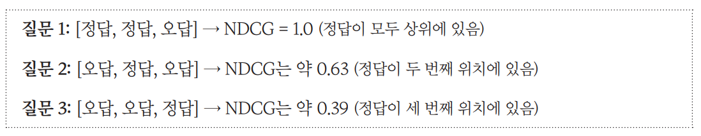  
  
이때 평균 NDCG@3 = (1.0 + 0.63 + 0.39) / 3 = 0.673이다.  
  
